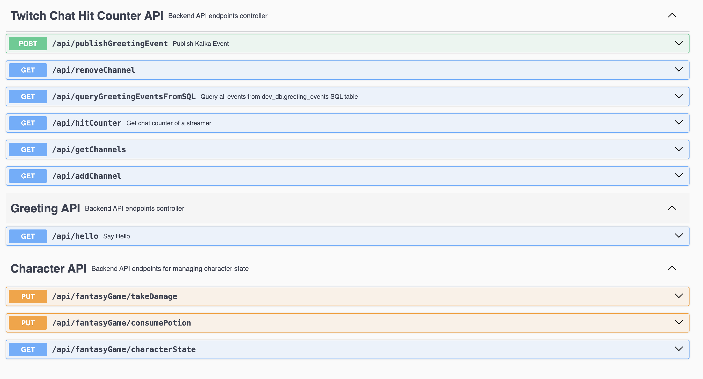

# Practical Backend Engineer
## Twitch Chat Hit Counter
## Module 1: HTTP/REST + Swagger

### Lesson
I'll keep things simple.

When thinking about how the internet works, how big tech systems work, they're all the same.

Move data from point A to point B.

Visiting a Google.com? My PC (server) sends a data request to Googles' servers, those servers accept the request and send data back to my PC. (Point A sends request to Point B, Point B sends response to Point A)
Upstream team is sending our team data? Upstream team collects the data (Point A) and dumps them off to some file storage or database, where our team reads from (Point B).
Downstream team depends on our team's data? We gather our data and write to FS/DB/send back through direct API call (Point A) and downstream team receives it (Point B).


This section provides a brief TL;DR on how the internet works. When you open your browser and navigate to Google.com, several processes occur behind the scenes:<br>
1. **DNS Resolution**:<br>
Google.com is a user-friendly, human-readable name that is easy to remember. This domain name corresponds to an actual IP address, which your machine resolves using a DNS server.
2. **Request to Server**:<br>
Once the IP address is resolved, your machine sends a request to that IP address to retrieve the data located at this address
3. **Response from Server**:<br>
Google's servers receive the incoming request from your machine and return a response with the "data" that you see as Google.com.<br>

This process is an over simplification for all communication across machines connected by the internet.<br>
You have 2 machines: one sender and one receiver; the sender knows where it wants to speak to, and sends a request operation to the receiver. Routers/networks (aka mailman) will understand where to route the data packets in order for the request to reach its destination. Once the receiver receives the request, it will do something. Based on the API request, this will let the server know what process to kick off.

There are many communication protocols, but the two most common protocols I’ve used ubiquitously in big tech are: HTTP and gRPC. We will focus only on HTTP in this course.

Swagger
Let’s start by setting up our Spring Boot service’s API endpoints that can be easily integrated using Swagger. Another popular tool I’ve used to locally test my service’s API endpoints is Postman (at Snap), but Swagger integrates nicely with Spring Boot, which is what we ubiquitously use for most Netflix microservices.


### Additional Learning Materials

HTTP:

REST:

Swagger:


## File Structure
For `Module 1`, the below file structure are all the relevant files needed.

[//]: # (```)
[//]: # (twitch-chat-hit-counter/src/)
[//]: # (├── main/)
[//]: # (│   └── java/)
[//]: # (│       └── com.sonahlab.twitch_chat_hit_counter/)
[//]: # (│           ├── model/)
[//]: # (│           │   └── GameCharacter.java)
[//]: # (│           ├── rest/)
[//]: # (│           │   ├── GameRestController.java)
[//]: # (│           │   └── GreetingRestController.java)
[//]: # (│           └── utils/)
[//]: # (│               └── Potion.java)
[//]: # (└── test/)
[//]: # (    └── java/)
[//]: # (        └── com.sonahlab.twitch_chat_hit_counter/)
[//]: # (            └── rest/)
[//]: # (                ├── GameRestControllerTest.java)
[//]: # (                └── GreetingRestControllerTest.java)
[//]: # (```)
 twitch-chat-hit-counter/<br>
&nbsp;&nbsp;&nbsp;&nbsp;&nbsp;
 src/<br>
&nbsp;&nbsp;&nbsp;&nbsp;&nbsp;&nbsp;&nbsp;&nbsp;&nbsp;&nbsp;
 main/<br>
&nbsp;&nbsp;&nbsp;&nbsp;&nbsp;&nbsp;&nbsp;&nbsp;&nbsp;&nbsp;&nbsp;&nbsp;&nbsp;&nbsp;&nbsp;
 java/<br>
&nbsp;&nbsp;&nbsp;&nbsp;&nbsp;&nbsp;&nbsp;&nbsp;&nbsp;&nbsp;&nbsp;&nbsp;&nbsp;&nbsp;&nbsp;&nbsp;&nbsp;&nbsp;&nbsp;&nbsp;
 com.sonahlab.twitch_chat_hit_counter/<br>
&nbsp;&nbsp;&nbsp;&nbsp;&nbsp;&nbsp;&nbsp;&nbsp;&nbsp;&nbsp;&nbsp;&nbsp;&nbsp;&nbsp;&nbsp;&nbsp;&nbsp;&nbsp;&nbsp;&nbsp;&nbsp;&nbsp;&nbsp;&nbsp;&nbsp;
 model/<br>
&nbsp;&nbsp;&nbsp;&nbsp;&nbsp;&nbsp;&nbsp;&nbsp;&nbsp;&nbsp;&nbsp;&nbsp;&nbsp;&nbsp;&nbsp;&nbsp;&nbsp;&nbsp;&nbsp;&nbsp;&nbsp;&nbsp;&nbsp;&nbsp;&nbsp;&nbsp;&nbsp;&nbsp;&nbsp;&nbsp;
 GameCharacter.java<br>
&nbsp;&nbsp;&nbsp;&nbsp;&nbsp;&nbsp;&nbsp;&nbsp;&nbsp;&nbsp;&nbsp;&nbsp;&nbsp;&nbsp;&nbsp;&nbsp;&nbsp;&nbsp;&nbsp;&nbsp;&nbsp;&nbsp;&nbsp;&nbsp;&nbsp;
 rest/<br>
&nbsp;&nbsp;&nbsp;&nbsp;&nbsp;&nbsp;&nbsp;&nbsp;&nbsp;&nbsp;&nbsp;&nbsp;&nbsp;&nbsp;&nbsp;&nbsp;&nbsp;&nbsp;&nbsp;&nbsp;&nbsp;&nbsp;&nbsp;&nbsp;&nbsp;&nbsp;&nbsp;&nbsp;&nbsp;&nbsp;
 GameRestController.java<br>
&nbsp;&nbsp;&nbsp;&nbsp;&nbsp;&nbsp;&nbsp;&nbsp;&nbsp;&nbsp;&nbsp;&nbsp;&nbsp;&nbsp;&nbsp;&nbsp;&nbsp;&nbsp;&nbsp;&nbsp;&nbsp;&nbsp;&nbsp;&nbsp;&nbsp;&nbsp;&nbsp;&nbsp;&nbsp;&nbsp;
 GreetingRestController.java<br>
&nbsp;&nbsp;&nbsp;&nbsp;&nbsp;&nbsp;&nbsp;&nbsp;&nbsp;&nbsp;&nbsp;&nbsp;&nbsp;&nbsp;&nbsp;&nbsp;&nbsp;&nbsp;&nbsp;&nbsp;&nbsp;&nbsp;&nbsp;&nbsp;&nbsp;
 utils/<br>
&nbsp;&nbsp;&nbsp;&nbsp;&nbsp;&nbsp;&nbsp;&nbsp;&nbsp;&nbsp;&nbsp;&nbsp;&nbsp;&nbsp;&nbsp;&nbsp;&nbsp;&nbsp;&nbsp;&nbsp;&nbsp;&nbsp;&nbsp;&nbsp;&nbsp;&nbsp;&nbsp;&nbsp;&nbsp;&nbsp;
 Potion.java<br>
&nbsp;&nbsp;&nbsp;&nbsp;&nbsp;&nbsp;&nbsp;&nbsp;&nbsp;&nbsp;&nbsp;&nbsp;&nbsp;&nbsp;&nbsp;&nbsp;&nbsp;&nbsp;&nbsp;&nbsp;&nbsp;&nbsp;&nbsp;&nbsp;&nbsp;&nbsp;&nbsp;&nbsp;&nbsp;&nbsp;
 Stat.java<br>
&nbsp;&nbsp;&nbsp;&nbsp;&nbsp;&nbsp;&nbsp;&nbsp;&nbsp;&nbsp;
 test/<br>
&nbsp;&nbsp;&nbsp;&nbsp;&nbsp;&nbsp;&nbsp;&nbsp;&nbsp;&nbsp;&nbsp;&nbsp;&nbsp;&nbsp;&nbsp;
 java/<br>
&nbsp;&nbsp;&nbsp;&nbsp;&nbsp;&nbsp;&nbsp;&nbsp;&nbsp;&nbsp;&nbsp;&nbsp;&nbsp;&nbsp;&nbsp;&nbsp;&nbsp;&nbsp;&nbsp;&nbsp;
 com.sonahlab.twitch_chat_hit_counter/<br>
&nbsp;&nbsp;&nbsp;&nbsp;&nbsp;&nbsp;&nbsp;&nbsp;&nbsp;&nbsp;&nbsp;&nbsp;&nbsp;&nbsp;&nbsp;&nbsp;&nbsp;&nbsp;&nbsp;&nbsp;&nbsp;&nbsp;&nbsp;&nbsp;&nbsp;
 model/<br>
&nbsp;&nbsp;&nbsp;&nbsp;&nbsp;&nbsp;&nbsp;&nbsp;&nbsp;&nbsp;&nbsp;&nbsp;&nbsp;&nbsp;&nbsp;&nbsp;&nbsp;&nbsp;&nbsp;&nbsp;&nbsp;&nbsp;&nbsp;&nbsp;&nbsp;&nbsp;&nbsp;&nbsp;&nbsp;&nbsp;
 GameCharacterTest.java<br>
&nbsp;&nbsp;&nbsp;&nbsp;&nbsp;&nbsp;&nbsp;&nbsp;&nbsp;&nbsp;&nbsp;&nbsp;&nbsp;&nbsp;&nbsp;&nbsp;&nbsp;&nbsp;&nbsp;&nbsp;&nbsp;&nbsp;&nbsp;&nbsp;&nbsp;
 rest/<br>
&nbsp;&nbsp;&nbsp;&nbsp;&nbsp;&nbsp;&nbsp;&nbsp;&nbsp;&nbsp;&nbsp;&nbsp;&nbsp;&nbsp;&nbsp;&nbsp;&nbsp;&nbsp;&nbsp;&nbsp;&nbsp;&nbsp;&nbsp;&nbsp;&nbsp;&nbsp;&nbsp;&nbsp;&nbsp;&nbsp;
 GameRestControllerTest.java<br>
&nbsp;&nbsp;&nbsp;&nbsp;&nbsp;&nbsp;&nbsp;&nbsp;&nbsp;&nbsp;&nbsp;&nbsp;&nbsp;&nbsp;&nbsp;&nbsp;&nbsp;&nbsp;&nbsp;&nbsp;&nbsp;&nbsp;&nbsp;&nbsp;&nbsp;&nbsp;&nbsp;&nbsp;&nbsp;&nbsp;
 GreetingRestControllerTest.java<br>


## Exercise 1: GreetingRestController
> [!NOTE]
>
> **Relevant Files**<br>
> `GreetingRestController.java` ─ REST controller to handle our service's simple greeting methods: `/api/sayHello`.

Implement the `sayHello()` method, which takes the incoming request parameter `name` and returns a simple greeting response.<br>
If no input `name` parameter is provided, greet a `Mysterious Individual`.

### Example 1:
> **Input**: <span style="color:#0000008c">name = "Alice"<br></span>
> **Output**: <span style="color:#0000008c">"Hello, Alice!"</span>

### Example 2:
> **Input**: <span style="color:#0000008c">name = ""<br></span>
> **Output**: <span style="color:#0000008c">"Hello, Mysterious Individual!"<br></span>
> **Explanation**: <span style="color:#0000008c">no `name` parameter is provided, so the default name should be "Mysterious Individual"</span>

### Testing
`GreetingRestControllerTest.java` ─ already implemented test cases for the above examples.
1. Remove `@Disabled` in `GreetingRestControllerTest.java`
2. Run: `./gradlew test --tests "*" -Djunit.jupiter.tags=Module1`

### Integration Testing
1. Run: `./gradlew bootRun`
2. Go to: [Swagger UI ](http://localhost:8080/swagger-ui/index.html)<br>
3. Play with the **Greeting API** endpoint(s)

<br>


## Exercise 2: GameRestController
> [!NOTE]
> 
> **Relevant Files**<br>
> `Potion.java` ─ enum class to define all Potion objects that exist in our game.<br>
> `Stat.java` ─ enum class to define all Stats that exist in our game.<br>
> `GameCharacter.java` ─ Data Model for a generic character in a game. Also handles state changes on the underlying metadata.<br>
> `GameRestController.java` ─ REST controller to handle:
> 1. `/api/fantasyGame/takeDamage`: deal damage to a character
> 2. `/api/fantasyGame/consumePotion`: consume potion to replenish character's HP/MP
> 3. `/api/fantasyGame/characterState`: get current snapshot information about a character<br>

### Task 1: Implement `GameCharacter.java`
Before we can implement our API endpoints in `GameRestController.java`, we need to create our Data Model object for a generic fantasy game character.  

> [!TIP]
> 
> If you aren't familiar with creating POJOs (Plain Old Java Objects), I suggest you read up on various ways to create Java Object Oriented Programming (OOP) objects:<br>
> - [_Java Constructor Pattern_ ](https://www.w3schools.com/java/java_encapsulation.asp)<br>
> - [_Java Builder Pattern_ ](https://www.baeldung.com/java-builder-pattern)<br>
> - [_Java Record Pattern_ ](https://docs.oracle.com/en/java/javase/17/language/records.html)<br>

**Requirements:**<br>
1. `GameCharacter` object should have 3 fields:
   1. **Stat.HP (int):** Character's health points (between `0` and `100`)
   2. **Stat.MP (int):** Character's mana points (between `0` and `100`)
   3. **Inventory (Map<Potion, Integer>):** Character's bag of `Potion` enum to quantity count
2. Default values on `GameCharacter` object init:
   1. Initial **HP** of 100
   2. Initial **MP** of 100
   3. Initial **inventory**:
       1. 5 `Potion.HP_POTION`
       2. 5 `Potion.MP_POTION`

### Example 1:
> **Input**:<br>
> ```java
> // Constructor should initialize: hp=100, mp=100, inventory={"HP_POTION": 5, "MP_POTION": 5}
> GameCharacter character = new GameCharacter();
>
> // Validate the default construction of the GameCharacter fields
> int output1 = character.getStat(Stat.HP);
> int output2 = character.getStat(Stat.MP);
> Map<Potion, Integer> output3 = character.getInventory();
> 
> // Validate the HP/MP setting logic (between 0 and 100)
> character.setHp(10000);
> int output4 = character.getStat(Stat.HP); // Expected: 100 (hp should be between 0 and 100
>                                           // we should ignore the previous 10000 set value)
> character.setHp(-10000);
> int output5 = character.getStat(Stat.HP); // Expected: 100 (hp should be between 0 and 100
>                                           // we should ignore the previous -10000 set value)
> 
> character.setMp(10000);
> int output6 = character.getStat(Stat.MP); // Expected: 100 (hp should be between 0 and 100
>                                           // we should ignore the previous 10000 set value)
> 
> character.setMp(-10000);
> int output7 = character.getStat(Stat.MP); // Expected: 100 (hp should be between 0 and 100
>                                           // so we should ignore the previous -10000 set value)
> ```
> 
> **Output1**: <span style="color:#0000008c">100<br></span>
> **Output2**: <span style="color:#0000008c">100<br></span>
> **Output3**: <span style="color:#0000008c">{ "HP_POTION": 5, "MP_POTION": 5 }<br></span>
> **Output4**: <span style="color:#0000008c">100<br></span>
> **Output5**: <span style="color:#0000008c">100<br></span>
> **Output6**: <span style="color:#0000008c">100<br></span>
> **Output7**: <span style="color:#0000008c">100<br></span>

### Testing
`GameCharacterTest.java` ─ already implemented
1. Remove `@Disabled` in `GameCharacterTest.java` for the test method: `initTest()`
2. Run: `./gradlew test --tests "*" -Djunit.jupiter.tags=Module1`

### 2.1
Create and implement method `public int takeDamage(int damage) {}`, where you will reduce the `character` object's HP by the `damage` amount.</br>
Return the updated character `HP` int.</br>

> [!TIP]
> 
> Remember: a `GameCharacter` HP has a minimum value of `0`

### Example 1:
> <br>
> **Input**: <span style="color:#0000008c">damage = 50 // Assume HP = 100<br></span>
> **Output**: <span style="color:#0000008c">50<br></span>

### Example 2:
> <br>
> **Input**: <span style="color:#0000008c">damage = 110 // Assume HP = 100<br></span>
> **Output**: <span style="color:#0000008c">0<br></span>
> **Explanation**: A character's HP should never be negative. (min capped at 0)</br>

### Testing
`GameCharacterTest.java` ─ already implemented
1. Remove `@Disabled` in `GameCharacterTest.java` for the test method: `takeDamageTest()`
2. Run: `./gradlew test --tests "*" -Djunit.jupiter.tags=Module1`

### 2.2
Create and implement method `public int consumePotion(Potion potion) {}`, where you will increment the `character` object's HP/MP depending on the potion.</br>
Return the updated character `HP`/`MP` int, or -1 for any errors.</br>

> [!TIP]
>
> Remember: a `GameCharacter` HP has a maximum value of `100`

**Rules:**</br>
1. The `GameCharacter` object must have the `Potion` currently in their inventory.
2. `Potion.HP_POTION` should increment the `character` HP by `50`.</br>
   `Potion.MP_POTION` should increment the `character` MP by `50`.
3. Decrement the quantity of the consumed `Potion` by 1 in the `GameCharacter.inventory`
4. Remove the `Potion` from the `character` inventory if the quantity hits `0`.

### Example 1:
> <br>
> **Input**: <span style="color:#0000008c">potion = Potion.HP_POTION // Assume HP = 25</br></span>
> **Output**: <span style="color:#0000008c">75<br></span>

### Example 2:
> <br>
> **Input**: <span style="color:#0000008c">potion = Potion.HP_POTION // Assume HP = 99</br></span>
> **Output**: <span style="color:#0000008c">100<br></span>
> **Explanation**: <span style="color:#0000008c">A character's HP should never be above 100. (max capped at 100)</br></span>

### Example 3:
> <br>
> **Input**: <span style="color:#0000008c">potion = Potion.MP_POTION // Assume MP = 25</br></span>
> **Output**: <span style="color:#0000008c">75<br></span>

### Example 4:
> <br>
> **Input**: <span style="color:#0000008c">potion = Potion.MP_POTION // Assume MP = 99<br></span>
> **Output**: <span style="color:#0000008c">100<br></span>
> **Explanation**: <span style="color:#0000008c">A character's MP should never be above 100. (max capped at 100)<br></span>

### Example 5:
> <br>
> **Input**: <span style="color:#0000008c">potion = Potion.HP_POTION // Assume HP = 25<br></span>
> **Output**: <span style="color:#0000008c">75<br></span>
> **Explanation**: <span style="color:#0000008c">The Inventory should no longer contain the HP_POTION now that the quantity of this item is 0.<br></span>

### Example 6:
> <br>
> **Input**: <span style="color:#0000008c">potion = Potion.HP_POTION // Assume HP = 50<br></span>
> **Output**: <span style="color:#0000008c">-1<br></span>
> **Explanation**: <span style="color:#0000008c">There are no HP_POTION in the inventory, so we can't consume this potion.<br></span>

### Testing
`GameCharacterTest.java` ─ already implemented
1. Remove `@Disabled` in `GameCharacterTest.java` for the test method: `consumePotionTest()`
2. Run: `./gradlew test --tests "*" -Djunit.jupiter.tags=Module1`

### 2.3
Create and implement method `public void getCharacterState() {}`.
Return a `Map<String, Object>` representing the character's current state (HP,MP, and INVENTORY).

### Example 1:
> <br>
> **Input**
> ```java
> // Assume the character starts with 100 HP and MP, and 5 of each HP/MP potions
> GameCharacter character = new GameCharacter();
> Map<String, Object> output = character.getCharacterState();
>```
> **Output**:
> ```json
> {
>     "HP": 100,
>     "MP": 100,
>     "INVENTORY": {
>         "HP_POTION": 5,
>         "MP_POTION": 5
>     }
> }
> ```

### Testing
`GameCharacterTest.java` ─ already implemented
1. Remove `@Disabled` in `GameCharacterTest.java` for the test method: `getCharacterStateTest()`
2. Run: `./gradlew test --tests "*" -Djunit.jupiter.tags=Module1`

### Task 3: Hookup our `GameRestController.java` to our `GameCharacter.java` application logic
Now we should have all the application logic in `GameCharacter.java` to handle the Game API endpoints, we simply need to call them.
<br>

In the constructor for `GameRestController.java`, initialize a default `GameCharacter` object.<br>
When our application runs, the character state changes will not be persisted on subsequent application runs. It should always be reset to managing a "new" GameCharacter object.

> Example:<br>
> → Run the application: `./gradlew bootRun`<br>
> → Call the `/takeDamage?damage=50` endpoint (the character object's HP falls to 50)<br>
> → Quit the application run (Control+C)<br>
> → Run the application (again): `./gradlew bootRun`<br>
> → Call the `/characterState` endpoint (the character object's HP will be 100 because a new object will be created for each run)<br>

For each of these API endpoints simply call the respective methods we previously implemented in `GameRestController.java`.<br>
Return the result output from each of these `GameRestController.java` function calls back through the HTTP Response.
```java
@PutMapping("/fantasyGame/takeDamage")
public int takeDamage(@RequestParam int damage) {
    ...
}

@PutMapping("/fantasyGame/consumePotion")
public int consumePotion(@RequestParam String potionName) {
    ...
}

@GetMapping("/fantasyGame/characterState")
public Map<String, Object> getCharacterState() {
    ...
}
```

### Testing
`GameRestControllerTest.java` ─ already implemented
1. Remove `@Disabled` in `GameRestControllerTest.java`
2. Run: `./gradlew test --tests "*" -Djunit.jupiter.tags=Module1`

### Integration Testing
1. Run: `./gradlew bootRun`
2. Go to: [Swagger UI ](http://localhost:8080/swagger-ui/index.html)<br>
3. Play with the **Character API** endpoint(s)

<br>
