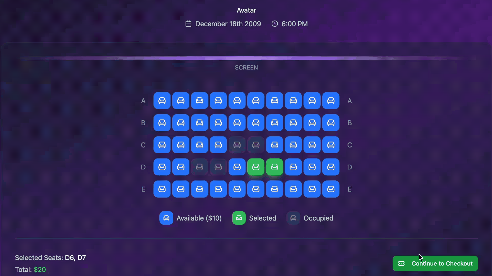
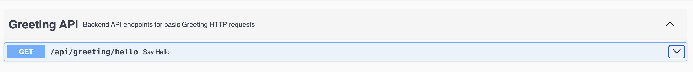
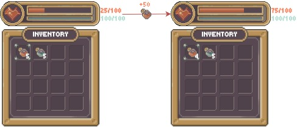
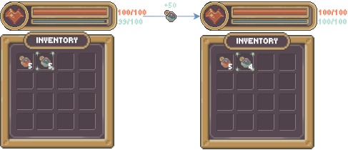
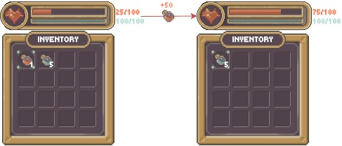
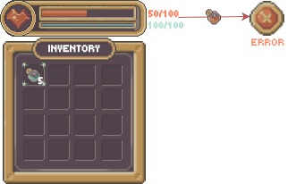
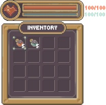
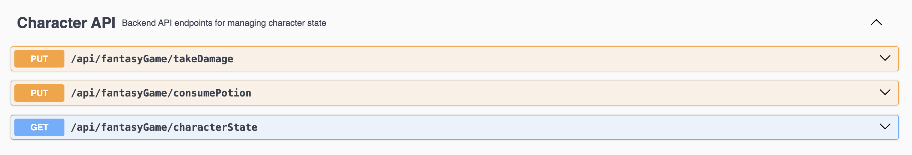

# Practical Backend Engineer
## Twitch Chat Hit Counter
## Module 1: HTTP/REST + Swagger

### Lesson
All network communication — whether the "internet", or between microservices — boils down to this fundamental idea:<br>

> _**One server sends a request to another server that does something in response.**_
> - **_Request → Response_**
> - **_Cause → Effect_**
> - **_Call → Action_**
> - **_Question → Answer_**

I'll give you simple examples that illustrate this point.

<br>

#

### Case Study #1: Web Browsing
You visit **Google.com** and see this:
<br>

**Question**: What's actually happening behind the scenes?

**TL;DR:**<br>
**→ DNS Resolution**<br>
`Google.com` is a human-readable domain name that makes it easy for humans to remember when we want to visit a web hosted page/application/service.<br>
Computers don't understand this domain, they need **IP addresses** (i.e.: 123.456.789.0)<br>
Your device sends a **request** to a nearby DNS server to find out what `Google.com` means.<br>
The DNS server **responds** with a valid mapping: `Google.com` → `XXX.XXX.XXX.X`.<br>

IP Addresses are the actual server address that has information about this request.

**ELI5:**<br>
In a group of friends - Alice, Bob, and Charlie, they want to meet up at each others' house to work on a school project.<br>
They all agree on **"Alice's house"**. Alice's _actual_ address is really i.e.: **123 Sesame Street**, but saying "Alice's House" in this context is the _alias_ understood by the entire friend group.

Networks work the same way, lots of these easily memorizable names are easier than typing in a website IP address.

**Fun Exercise**:<br>
Open up your terminal and run:
```shell
ping www.google.com
```

You should see an output similar to this:<br>
```
> PING google.com (142.250.72.174): 56 data bytes
```
If you open up a new browser and type `http://{GOOGLE_IP_ADDRESS}` it'll take you to the same **Google.com** page.

Nobody does this because:
1. Remembering IP addresses are hard
2. IP addresses change (If you `ping www.google.com` on another day you will notice that the original IP address I retrieved at the time I ran this command is different than the IP address you will see)

**Main Takeaway:**<br>
The DNS resolution process is simply a **request → response**.<br>
Device → **asks** what's the IP address for Google.com? → DNS server<br> 
DNS server → **answers** the IP address is `142.250.72.174` → Device<br>


**→ Google Server Request**<br>
Now that we know the current IP address for `Google.com`, our machine sends an **HTTP request** to Google's server at this address:<br>
"GET the data at location Google.com`/` (the homepage)".

This **request** travels through multiple **network routers** in the form of **bytes** until it reaches Google's servers.

**→ Google Server Response**<br>
Google's servers will be listening for incoming requests, and say they receive our request.
They will accept it, fetch the data for Google.com's homepage, and sends it back to the requester's location (passing back through the network routers).

**→ Browser Renders the Webpage**<br>
Our device receives the data response from Google's servers and renders the UI with the content.

**ELI5:**<br>
Imagine it's pre-internet days:<br>
Alice lives at `123 Sesame Street, Los Angeles CA, 12345`<br>
Bob lives at `666 Hell Street, New York NY, 98765`<br>

Alice sends a letter to `666 Hell Street` asking: "Hey Bob, will you be able to attend my birthday party?"
Bob receives it and mails a letter back to `123 Sesame Street`, responding with: "Yes."

Alice and Bob might not have a deep understanding of how their letter travels across the country, but it'll be processed/driven between multiple factories and multiple deliverers across the country.

This is very similar to how requests/responses are handled and how data is moved over the internet.

<br>

#

#### Case Study #2: Microservices
Say you're buying movie tickets online through AMC theatres. You select your seats and checkout to confirm your seats/tickets, and see the "Processing..." spinner in the UI. 
> <br>

Question: What happens behind the scenes?<br>
Let's simplify the backend system to 3 components:<br>
- Frontend Team: team in charge of all the UI interactions on a movie booking webpage
- Inventory Team: team in charge of storing all information about past/present/future showings and status on bookings
- Payments Team: team in charge of all payment related data for AMC theatres

**Frontend Team** sends the **Inventory Team** a booking event for your user. This temporarily "blocks" (i.e.: 2 minutes) other Users from trying to book the same seats at the same time to prevent race conditions of
two individuals from purchasing the same movie and the same seats.
- Movie: Avatar
- Theater Location: 1 Hollywood Blvd (assume this is one of the many theatres AMC runs/operates)
- Showing Date: December 19, 2009
- Showing Time: 6:00 PM
- Seat(s): [D6, D7]
- Amount: $20
- Ticket Owner: {YOUR NAME}
- User ID: User123
- Status: **RESERVED**
- Timestamp: December 18, 2009 5:00 PM
- Expiration: December 18, 2009 5:02 PM

**Inventory Team** can send the **Payments Team** an event to process the actual payment to charge your user Line of Credit with a partner 3P SaaS company like PayPal.

**PayPal** successfully charges your input Line of Credit for $20 and notifies the **Payment Team**.

**AMC Payment Team** notifies the **Inventory Team** of the successful transaction/charge.

The **Inventory Team** updates the event to officially "BOOK" the tentative seats chosen for:
- Movie: Avatar
- Theater Location: 1 Hollywood Blvd (assume this is one of the many theatres AMC runs/operates)
- Showing Date: December 19, 2009
- Showing Time: 6:00 PM
- Seat(s): [D6, D7]
- Amount: $20
- Ticket Owner: {YOUR NAME}
- User ID: User123
- Status: **BOOKED**
- Timestamp: December 18, 2009 5:00 PM

No other users will be able to book these seats unless you cancel your reservation or maybe there was an issue with the many backend processes within the different backend systems, thus lifting the temporary lock on seats: [D5, D6].

This is just an example of how one seemingly small action on the UI can trigger a chain reaction of processes in the backend to ensure that Users can book movie seats.<br>
BTS, there's many teams made of up multiple microservices all communicating with each other via request/responses to ensure the booking process is secure.

There's no single way of building products company to company or even team to team, this is just a brief example.

**Main Takeaway: Every process can be boiled down to a request/response built within a single microservice, further built between multiple services to create an ecosystem of communication.**<br>

There are many communication protocols, but the two most common protocols I’ve used ubiquitously in most backend systems in big tech are: **HTTP** and **gRPC**.

We will focus only on **HTTP** in this course. **gRPC** is mostly used within the microservice S2S architecture. In a company with say 20 teams, **TeamA** and **TeamB** work closely with each other.
They will usually have gRPC service contracts allowing for direct service calls, instead of sending over HTTP requests.

Swagger
Let’s start by setting up our Spring Boot service’s API endpoints that can be easily integrated using Swagger. Another popular tool I’ve used to locally test my service’s API endpoints is Postman (at Snap), but Swagger integrates nicely with Spring Boot, which is what we ubiquitously use for most Netflix microservices.


### Additional Learning Materials
HTTP: [What is HTTP? ](https://www.cloudflare.com/learning/ddos/glossary/hypertext-transfer-protocol-http/)

REST: [REST APIs ](https://www.ibm.com/think/topics/rest-apis)

Swagger: [What is Swagger? ](https://swagger.io/docs/specification/v2_0/what-is-swagger/)

> [!NOTE]
> 
> For this project we will use Swagger to setup our API, which is what we use at Netflix as it integrates seamlessly with the Spring Boot framework.<br>
> At Snapchat, we spun up our APIs with Jetty and then Postman to debug/test during development and interfacing with a friendly UI tool rather than curling requests
> in my terminal.
>
> There's no one silver-bullet way to solve a problem, every company differs from the tools they adopt. I'll just share my perspective based on my own experiences at the various companies I've been at.
> Both Netflix/Snapchat are very Java backend heavy, but even Snapchat is more rudimentary in it's microservice architecture whereas Netflix uses Spring Boot to unify all microservices.
> Yelp's backend is predominantly built using Python. So it just varies from company to company (and even team to team) between programming languages and tooling used,
> but the core principles of developing large distributed systems are pretty similar from one company to the next.


<br>

## File Structure
For `Module 1`, the below file structure are all the relevant files needed.

 twitch-chat-hit-counter/<br>
&nbsp;&nbsp;&nbsp;&nbsp;&nbsp;
 src/<br>
&nbsp;&nbsp;&nbsp;&nbsp;&nbsp;&nbsp;&nbsp;&nbsp;&nbsp;&nbsp;
 main/<br>
&nbsp;&nbsp;&nbsp;&nbsp;&nbsp;&nbsp;&nbsp;&nbsp;&nbsp;&nbsp;&nbsp;&nbsp;&nbsp;&nbsp;&nbsp;
 java/<br>
&nbsp;&nbsp;&nbsp;&nbsp;&nbsp;&nbsp;&nbsp;&nbsp;&nbsp;&nbsp;&nbsp;&nbsp;&nbsp;&nbsp;&nbsp;&nbsp;&nbsp;&nbsp;&nbsp;&nbsp;
 com.sonahlab.twitch_chat_hit_counter/<br>
&nbsp;&nbsp;&nbsp;&nbsp;&nbsp;&nbsp;&nbsp;&nbsp;&nbsp;&nbsp;&nbsp;&nbsp;&nbsp;&nbsp;&nbsp;&nbsp;&nbsp;&nbsp;&nbsp;&nbsp;&nbsp;&nbsp;&nbsp;&nbsp;&nbsp;
 model/<br>
&nbsp;&nbsp;&nbsp;&nbsp;&nbsp;&nbsp;&nbsp;&nbsp;&nbsp;&nbsp;&nbsp;&nbsp;&nbsp;&nbsp;&nbsp;&nbsp;&nbsp;&nbsp;&nbsp;&nbsp;&nbsp;&nbsp;&nbsp;&nbsp;&nbsp;&nbsp;&nbsp;&nbsp;&nbsp;&nbsp;
 GameCharacter.java<br>
&nbsp;&nbsp;&nbsp;&nbsp;&nbsp;&nbsp;&nbsp;&nbsp;&nbsp;&nbsp;&nbsp;&nbsp;&nbsp;&nbsp;&nbsp;&nbsp;&nbsp;&nbsp;&nbsp;&nbsp;&nbsp;&nbsp;&nbsp;&nbsp;&nbsp;
 rest/<br>
&nbsp;&nbsp;&nbsp;&nbsp;&nbsp;&nbsp;&nbsp;&nbsp;&nbsp;&nbsp;&nbsp;&nbsp;&nbsp;&nbsp;&nbsp;&nbsp;&nbsp;&nbsp;&nbsp;&nbsp;&nbsp;&nbsp;&nbsp;&nbsp;&nbsp;&nbsp;&nbsp;&nbsp;&nbsp;&nbsp;
 GameRestController.java<br>
&nbsp;&nbsp;&nbsp;&nbsp;&nbsp;&nbsp;&nbsp;&nbsp;&nbsp;&nbsp;&nbsp;&nbsp;&nbsp;&nbsp;&nbsp;&nbsp;&nbsp;&nbsp;&nbsp;&nbsp;&nbsp;&nbsp;&nbsp;&nbsp;&nbsp;&nbsp;&nbsp;&nbsp;&nbsp;&nbsp;
 GreetingRestController.java<br>
&nbsp;&nbsp;&nbsp;&nbsp;&nbsp;&nbsp;&nbsp;&nbsp;&nbsp;&nbsp;&nbsp;&nbsp;&nbsp;&nbsp;&nbsp;&nbsp;&nbsp;&nbsp;&nbsp;&nbsp;&nbsp;&nbsp;&nbsp;&nbsp;&nbsp;
 utils/<br>
&nbsp;&nbsp;&nbsp;&nbsp;&nbsp;&nbsp;&nbsp;&nbsp;&nbsp;&nbsp;&nbsp;&nbsp;&nbsp;&nbsp;&nbsp;&nbsp;&nbsp;&nbsp;&nbsp;&nbsp;&nbsp;&nbsp;&nbsp;&nbsp;&nbsp;&nbsp;&nbsp;&nbsp;&nbsp;&nbsp;
 Potion.java<br>
&nbsp;&nbsp;&nbsp;&nbsp;&nbsp;&nbsp;&nbsp;&nbsp;&nbsp;&nbsp;&nbsp;&nbsp;&nbsp;&nbsp;&nbsp;&nbsp;&nbsp;&nbsp;&nbsp;&nbsp;&nbsp;&nbsp;&nbsp;&nbsp;&nbsp;&nbsp;&nbsp;&nbsp;&nbsp;&nbsp;
 Stat.java<br>
&nbsp;&nbsp;&nbsp;&nbsp;&nbsp;&nbsp;&nbsp;&nbsp;&nbsp;&nbsp;
 test/<br>
&nbsp;&nbsp;&nbsp;&nbsp;&nbsp;&nbsp;&nbsp;&nbsp;&nbsp;&nbsp;&nbsp;&nbsp;&nbsp;&nbsp;&nbsp;
 java/<br>
&nbsp;&nbsp;&nbsp;&nbsp;&nbsp;&nbsp;&nbsp;&nbsp;&nbsp;&nbsp;&nbsp;&nbsp;&nbsp;&nbsp;&nbsp;&nbsp;&nbsp;&nbsp;&nbsp;&nbsp;
 com.sonahlab.twitch_chat_hit_counter/<br>
&nbsp;&nbsp;&nbsp;&nbsp;&nbsp;&nbsp;&nbsp;&nbsp;&nbsp;&nbsp;&nbsp;&nbsp;&nbsp;&nbsp;&nbsp;&nbsp;&nbsp;&nbsp;&nbsp;&nbsp;&nbsp;&nbsp;&nbsp;&nbsp;&nbsp;
 model/<br>
&nbsp;&nbsp;&nbsp;&nbsp;&nbsp;&nbsp;&nbsp;&nbsp;&nbsp;&nbsp;&nbsp;&nbsp;&nbsp;&nbsp;&nbsp;&nbsp;&nbsp;&nbsp;&nbsp;&nbsp;&nbsp;&nbsp;&nbsp;&nbsp;&nbsp;&nbsp;&nbsp;&nbsp;&nbsp;&nbsp;
 GameCharacterTest.java<br>
&nbsp;&nbsp;&nbsp;&nbsp;&nbsp;&nbsp;&nbsp;&nbsp;&nbsp;&nbsp;&nbsp;&nbsp;&nbsp;&nbsp;&nbsp;&nbsp;&nbsp;&nbsp;&nbsp;&nbsp;&nbsp;&nbsp;&nbsp;&nbsp;&nbsp;
 rest/<br>
&nbsp;&nbsp;&nbsp;&nbsp;&nbsp;&nbsp;&nbsp;&nbsp;&nbsp;&nbsp;&nbsp;&nbsp;&nbsp;&nbsp;&nbsp;&nbsp;&nbsp;&nbsp;&nbsp;&nbsp;&nbsp;&nbsp;&nbsp;&nbsp;&nbsp;&nbsp;&nbsp;&nbsp;&nbsp;&nbsp;
 GameRestControllerTest.java<br>
&nbsp;&nbsp;&nbsp;&nbsp;&nbsp;&nbsp;&nbsp;&nbsp;&nbsp;&nbsp;&nbsp;&nbsp;&nbsp;&nbsp;&nbsp;&nbsp;&nbsp;&nbsp;&nbsp;&nbsp;&nbsp;&nbsp;&nbsp;&nbsp;&nbsp;&nbsp;&nbsp;&nbsp;&nbsp;&nbsp;
 GreetingRestControllerTest.java<br>


<br>

## Exercise 1: Greeting API
<br>

> [!NOTE]
>
> **Relevant Files**<br>
> `GreetingRestController.java` ─ REST controller to handle our service's simple greeting methods: `/api/greeting/hello`.

In `GreetingRestController.java`, implement the `public String sayHello(@RequestParam(required = false) String name)` method. This method is the entry point for all incoming HTTP requests routed to `GET /api/greeting/hello`.

Return a simple greeting response String tailored to the input `name`.

**Requirements:**<br>
1. String response should always return a greeting using this template: `"Hello, {name}!"`.
2. When `name` parameter isn't provided, we should direct this greeting message to address a `Mysterious Individual`.

### Example 1:
> **Input**:<br>
> ```bash
> $ curl -X GET "http://localhost:8080/api/greeting/hello?name=Alice"
> ```
> 
> <br>
> 
> **Output**:
> ```java
> "Hello, Alice!"
> ```

#

### Example 2:
> **Input**:<br>
> ```java
> GreetingRestController controller = new GreetingRestController();
> String output = controller.sayHello("");
> ```
> **Output**:
> ```java
> "Hello, Mysterious Individual!"
> ```
> **Explanation**: no `name` parameter is provided (only whitespace), so the greeting response should address "Mysterious Individual"

#

### Testing
- [ ] Open `GreetingRestControllerTest.java` ─ already implemented test cases with the example(s) above.<br>
- [ ] Remove `@Disabled` in `GreetingRestControllerTest.java`<br>
- [ ] Test with:
    ```shell
    ./gradlew test --tests "*" -Djunit.jupiter.tags=Module1
    ```

#

### Integration Testing
- [ ] Run the application:
    ```shell
    ./gradlew bootRun
    ```
- [ ] Go to: [Swagger UI ](http://localhost:8080/swagger-ui/index.html)<br>
- [ ] Play around with the **Greeting API** endpoint(s)
<br>


<br>

## Exercise 2: Game API
> [!NOTE]
>
> **Relevant Files**<br>
> `Potion.java` ─ enum defining all potions.<br>
> `Stat.java` ─ enum defining character stats.<br>
> `GameCharacter.java` ─ Data Model for a generic game character in a game with state logic.<br>
> `GameRestController.java` ─ REST controller to handle game related actions on our `GameCharacter`

### Task 1: Implement `GameCharacter.java`
Before we can implement our API endpoints in `GameRestController.java`, we need to create our Data Model object for a generic fantasy game character.

In `GameCharacter.java`, implement the following:
- `public GameCharacter()` (_CONSTRUCTOR_)
- `public int getStat(Stat stat)` (_GETTER_)
- `public Map<Potion, Integer> getInventory()` (_GETTER_)
- `public void setHp(int hp)` (_SETTER_)
- `public void setMp(int mp)` (_SETTER_)
- `public int takeDamage(int damage)` (_STATE CHANGE_)
- `public int consumePotion(Potion potion)` (_STATE CHANGE_)
- `public Map<String, Object> getCharacterState()` (_GETTER_)

> [!TIP]
>
> If you aren't familiar with creating POJOs (Plain Old Java Objects), I suggest you read up on various ways to create Java Object Oriented Programming (OOP) objects:<br>
> - [_Java Constructor Pattern_ ](https://www.w3schools.com/java/java_encapsulation.asp)<br>
> - [_Java Builder Pattern_ ](https://www.baeldung.com/java-builder-pattern)<br>
> - [_Java Record Pattern_ ](https://docs.oracle.com/en/java/javase/17/language/records.html)<br>

> [!NOTE]
>
> The very basics of **OOP (Object Oriented Programming)** is that you have well-defined classes that encapsulates some stateful variables/methods that are common to the type of object you are attempting to model.
>
> **Example**:
> ```java
> class Car {
>     private String make;
>     private String model;
>     private int speed;
>
>     public Car(String make, String model) {
>         this.make = make;
>         this.model = model;
>         this.speed = 0;
>     }
>
>     public String getMake() {
>         return make;
>     }
>
>     public String getModel() {
>         return model;
>     }
>
>     public int getSpeed() {
>         return speed;
>     }
>
>     // Increases car speed by 10 MPH w/ a maximum speed of 100 MPH
>     public void accelerate() {
>         speed = Math.min(100, speed + 10);
>     }
>
>     // Decreases car speed by 10 MPH w/ a minimum speed of 0 MPH
>     public void decelerate() {
>         speed = Math.max(0, speed - 10);
>     }
> }
>
> public class Main {
>     public static void main(String[] args) {
>         Car car1 = new Car("Toyota", "Prius");
>         Car car2 = new Car("Honda", "Civic");
>
>         car1.getMake(); // "Toyota"
>         car1.getModel(); // "Prius"
>         car1.getSpeed(); // 0
>         car2.getMake(); // "Honda"
>         car2.getModel(); // "Civic"
>         car2.getSpeed(); // 0
>
>         car1.accelerate(); // speed → 10
>         car1.accelerate(); // speed → 20
>         car1.accelerate(); // speed → 30
>         car1.getSpeed(); // 30
>
>         car2.accelerate(); // speed → 10
>         car2.getSpeed(); // 10
>         car2.decelerate(); // speed → 0
>         car2.getSpeed(); // 0
>     }
> }
> ```
>
> `car1` and `car2` are both `Car` class objects, but they each have their own separate memory space in the program and each object maintains its own independent state:
> ```json
> car1 = {
>   "make": "Toyota",
>   "model": "Prius",
>   "speed": 30
> }
> 
> car2 = {
>   "make": "Honda",
>   "model": "Civic",
>   "speed": 0
> }
> ```
>
> This is the core idea of objects in OOP: 1 class → N objects (each with its own data).
>
> Think of the POJOs as an Object blueprint. You can use the same blueprint to build many Objects, but each Object is encapsulated with its own set of variables/state.
> What happens to another `car2` does not affect `car1`, and vice versa.

### Part 1: Constructor
In `GameCharacter.java`, implement `public GameCharacter()` constructor.

**Requirements:**<br>
1. `GameCharacter` object should have 3 fields:
    1. `Stat.HP` (int): Character's health points (between `0` and `100`)
    2. `Stat.MP` (int): Character's mana points (between `0` and `100`)
    3. `Inventory` (Map<Potion, Integer>): Character's bag of `Potion` enum to quantity count
2. Default values for a new `GameCharacter` instance:
    1. Initial `Stat.HP` of 100
    2. Initial `Stat.MP` of 100
    3. Initial `inventory` containing:
        1. 5 `Potion.HP_POTION`
        2. 5 `Potion.MP_POTION`

#

### Part 2: Get Stat
In `GameCharacter.java`, implement `public int getStat(Stat stat)`.

Return the current value for the input `Stat` enum.

**Requirements:**
1. If `stat == Stat.HP`: return the `GameCharacter` current **HP** int value
2. If `stat == Stat.MP`: return the `GameCharacter` current **MP** int value

#

### Part 3: Get Inventory
In `GameCharacter.java`, implement `public Map<Potion, Integer> getInventory()`.

Return the character's current `inventory` map.

#

### Part 4: Setters
In `GameCharacter.java`, implement:
- `public void setHp(int hp)`
- `public void setMp(int mp)`

**Requirements:**
1. HP/MP should be bounded by [0, 100]
2. Attempts to set the **HP/MP** with values outside the valid range should be ignored.

**Let's test what we have up to this point.**

#

### Example 1:
> **Input**:<br>
> ```java
> // Constructor should initialize: hp=100, mp=100, inventory={"HP_POTION": 5, "MP_POTION": 5}
> GameCharacter character = new GameCharacter();
>
> // Validate the default construction of the GameCharacter fields
> int output1 = character.getStat(Stat.HP);
> int output2 = character.getStat(Stat.MP);
> Map<Potion, Integer> output3 = character.getInventory();
> 
> // Validate the HP/MP setting logic (between 0 and 100)
> character.setHp(10000);
> int output4 = character.getStat(Stat.HP); // Expected: 100 (hp should be between 0 and 100
>                                           // we should ignore this method call)
> character.setHp(50);
> int output5 = character.getStat(Stat.HP); // Expected: 50 (hp is valid between 0 and 100)
> 
> character.setMp(-10000);
> int output6 = character.getStat(Stat.MP); // Expected: 100 (mp should be between 0 and 100
>                                           // we should ignore this method call)
> 
> character.setMp(0);
> int output7 = character.getStat(Stat.MP); // Expected: 0 (mp is valid between 0 and 100)
> ```
>
> **Output1**: `100`<br>
> **Output2**: `100`<br>
> **Output3**:<br>
> ```json
> {
>   Potion.HP_POTION: 5,
>   Potion.MP_POTION: 5
> }
> ```
> **Output4**: `100`<br>
> **Output5**: `50`<br>
> **Output6**: `100`<br>
> **Output7**: `0`<br>

#

### Testing
- [ ] Open `GameCharacterTest.java` ─ already implemented test cases with the example(s) above.
- [ ] Remove `@Disabled` in `GameCharacterTest.java` for the test method: `initTest()`
- [ ] Test with:
    ```shell
    ./gradlew test --tests "*" -Djunit.jupiter.tags=Module1
    ```

#

### Part 5: takeDamage
In `GameCharacter.java`, implement `public int takeDamage(int damage)`. You will reduce the `character` object's HP by the `damage` amount.

Return the updated character `HP` int.

> [!TIP]
>
> A `GameCharacter` HP/MP has a minimum value of `0`

### Example 1:
> <br>
> **Input**:
> ```java
> GameCharacter character = new GameCharacter();
> int output = character.takeDamage(50);
> ```
> **Output**: `50`

#

### Example 2:
> <br>
> **Input**:
> ```java
> GameCharacter character = new GameCharacter();
> int output = character.takeDamage(110);
> ```
> **Output**: `0`<br>
> **Explanation**: A character's HP should never be negative (min capped at 0).

#

### Testing
- [ ] Open `GameCharacterTest.java` ─ already implemented test cases with the example(s) above.
- [ ] Remove `@Disabled` in `GameCharacterTest.java` for the test method: `takeDamageTest()`
- [ ] Test with:
    ```shell
    ./gradlew test --tests "*" -Djunit.jupiter.tags=Module1
    ```

#

### Part 6: consumePotion
In `GameCharacter.java`, implement `public int consumePotion(Potion potion)`. You will increment the `character` object's HP/MP depending on the potion.

Return the updated character `HP`/`MP` int, or -1 for any errors.

> [!TIP]
>
> A `GameCharacter` HP/MP has a maximum value of `100`

> [!IMPORTANT]
> 
> Look at how I defined the `Potion.java` enum. Each potion has some helpful methods to tell you what `Stat` enum should be affected and the nominal amount.

**Rules:**</br>
1. A `GameCharacter` object must have the `Potion` currently in their inventory.
2. `Potion.HP_POTION` should increment the `character` HP by `50`.<br>
   `Potion.MP_POTION` should increment the `character` MP by `50`.
3. Decrement the quantity of the consumed `Potion` by 1 in the `GameCharacter.inventory`
4. Remove the `Potion` from the character's `inventory` if the quantity hits `0`.

### Example 1:
> <br>
> **Input**:<br>
> ```java
> GameCharacter character = new GameCharacter();
> character.setHp(25);
> int output = character.consumePotion(Potion.HP_POTION);
> ```
> **Output**: `75`<br>
> **Explanation**: HP=25 before we consume the `HP_Potion`, after consuming it we have 25 (current HP) + 50 (potion bonus) = 70HP.

#

### Example 2:
> <br>
> **Input**:<br>
> ```java
> GameCharacter character = new GameCharacter();
> character.setHp(75);
> int output = character.consumePotion(Potion.HP_POTION);
> ```
> **Output**: `100`<br>
> **Explanation**: HP=75 before we consume the `HP_Potion`, after consuming it we have 75 (current HP) + 50 (potion bonus) = 125HP, but we cap it at 100 (max).

#

### Example 3:
> <br>
> **Input**:<br>
> ```java
> GameCharacter character = new GameCharacter();
> character.setMp(25);
> int output = character.consumePotion(Potion.MP_POTION);
> ```
> **Output**: `75`<br>
> **Explanation**: MP=75 before we consume the `MP_Potion`, after consuming it we have 25 (current MP) + 50 (potion bonus) = 75MP.

#

### Example 4:
> <br>
> **Input**:<br>
> ```java
> GameCharacter character = new GameCharacter();
> character.setMp(99);
> int output = character.consumePotion(Potion.MP_POTION);
> ```
> **Output**: `100`<br>
> **Explanation**: MP=99 before we consume the `MP_Potion`, after consuming it we have 99 (current MP) + 50 (potion bonus) = 149MP, but we cap it at 100 (max).

#

### Example 5:
> <br>
> **Input**:<br>
> ```java
> GameCharacter character = new GameCharacter();
> character.consumePotion(Potion.HP_POTION);
> character.consumePotion(Potion.HP_POTION);
> character.consumePotion(Potion.HP_POTION);
> character.consumePotion(Potion.HP_POTION);
> character.setHp(25);
> 
> int output = character.consumePotion(Potion.HP_POTION);
> Map<Potion, Integer> output2 = character.getInventory();
> ```
> 
> #
> 
> **Output1**: `100`<br>
> **Explanation**: HP=25 before we consume the last `HP_Potion`, after consuming it we have 25 (current HP) + 50 (potion bonus) = 75.
>
> #
>
> **Output2**:<br>
> ```json
> {
>   Potion.MP_POTION: 5
> }
> ```
> **Explanation**: The Inventory should no longer contain the HP_POTION now that the quantity of this Potion reaches 0.

#

### Example 6:
> <br>
> **Input**: potion = `Potion.HP_POTION` (Assumption: HP = 50)<br>
> **Output**: `-1`<br>
> **Explanation**: There are no HP_POTION in the inventory, so we can't consume this potion.

#

### Testing
- [ ] Open `GameCharacterTest.java` ─ already implemented test cases with the example(s) above.
- [ ] Remove `@Disabled` in `GameCharacterTest.java` for the test method: `consumePotionTest()`
- [ ] Test with:
```shell
./gradlew test --tests "*" -Djunit.jupiter.tags=Module1
```

#

### Part 7: getCharacterState
In `GameCharacter.java`, implement `public void getCharacterState()`.

Return a `Map<String, Object>` representing the character's current state (**HP**, **MP**, and **INVENTORY**).

**Requirements:**
- `Stat.HP` should be stored as **"HP"** (key) and **HP** int (value).
- `Stat.MP` should be stored as **"MP"** (key) and **MP** int (value).
- `inventory` should be stored as **"INVENTORY"** (key) and **Map<Potion, Integer>** (value).

### Example 1:
> <br>
> **Input**
> ```java
> /**
> * Assumptions:
> *   - character HP = 100;
> *   - character MP = 100;
> *   - character Inventory = 5 of each HP/MP potions
> */
> GameCharacter character = new GameCharacter();
> Map<String, Object> output = character.getCharacterState();
>```
> **Output**:
> ```json
> {
>     "HP": 100,
>     "MP": 100,
>     "INVENTORY": {
>         "HP_POTION": 5,
>         "MP_POTION": 5
>     }
> }
> ```

#

### Testing
- [ ] Open `GameCharacterTest.java` ─ already implemented test cases with the example(s) above.
- [ ] Remove `@Disabled` in `GameCharacterTest.java` for the test method: `getCharacterStateTest()`
- [ ] Test with:
    ```shell
    ./gradlew test --tests "*" -Djunit.jupiter.tags=Module1
    ```

#

### Task 3: Hookup `GameRestController.java` to `GameCharacter.java`
<br>
Now we should have all the application logic in `GameCharacter.java` to handle the Game API endpoints, we simply need to call them.

In `GameRestController.java`, implement `public GameRestController.java` constructor by initialize our Main `GameCharacter` object.<br>

> [!IMPORTANT]
> 
> When our application runs, the character state changes in that specific run will not be persisted on subsequent application runs. The `GameRestController.java` will always create a "new" GameCharacter object.
> 
> Example:<br>
> → Run the application: `./gradlew bootRun`<br>
> → `GameRestController.java` should init a new `GameCharacter` object<br>
> → Call the `PUT /takeDamage?damage=50` endpoint (the character object's HP should be 50)<br>
> → Quit the application run (Control+C)<br>
> → Run the application (again): `./gradlew bootRun`<br>
> → Call the `GET /characterState` endpoint (the character object's HP will be 100 because `GameRestController` will init a new `GameCharacter` object)

For each of these API endpoints below, simply call the respective methods we previously implemented in `GameCharacter.java`.

Return the result from the `GameCharacter.java` function calls back through the HTTP Response.

```java
@PutMapping("/takeDamage")
public int takeDamage(@RequestParam int damage) {
    // Hook up to GameCharacter.takeDamage(...)
}

@PutMapping("/consumePotion")
public int consumePotion(@RequestParam String potionName) {
    // Hook up to GameCharacter.consumePotion(...)
}

@GetMapping("/characterState")
public Map<String, Object> getCharacterState() {
    // Hook up to GameCharacter.getCharacterState()
}
```

<br>

### Example 1:
> ```java
> WebClient webClient = WebClient.builder()
>         .baseUrl("http://localhost:8080/api")
>         .build();
> 
> // 1. Get main character state: {HP=100, MP=100, inventory={HP_POTION=5, MP_POTION=5}}
> Map<String, Object> output1 = webClient.get()
>         .uri("/fantasyGame/characterState")
>         .retrieve()
>         .bodyToMono(Map.class)
>         .block();
> 
> // 2. Main character takes 70 damage: 100 (current HP) - 70 (damage) = 30 HP
> int output2 = webClient.put()
>         .uri(uriBuilder -> uriBuilder
>                 .path("/fantasyGame/takeDamage")
>                 .queryParam("damage", 70)
>                 .build())
>         .retrieve()
>         .bodyToMono(Integer.class)
>         .block();
> 
> // 3. Main character drinks an HP potion: 30 (current HP) + 50 (HP potion) = 80 HP
> int output3 = webClient.put()
>         .uri(uriBuilder -> uriBuilder
>                 .path("/fantasyGame/consumePotion")
>                 .queryParam("potionName", "HP_POTION)
>                 .build())
>         .retrieve()
>         .bodyToMono(Integer.class)
>         .block();
> 
> // 4. Get updated main character state: {HP=80, MP=100, inventory={HP_POTION=4, MP_POTION=5}}
> int output4 = webClient.get()
>         .uri("/fantasyGame/characterState")
>         .retrieve()
>         .bodyToMono(Map.class)
>         .block();
> ```
> **Output1**: {"HP": 100, "MP": 100, "INVENTORY": {"HP_POTION": 5, "MP_POTION": 5}<br>
> **Output2**: 30<br>
> **Output3**: 80<br>
> **Output4**: {"HP": 80, "MP": 100, "INVENTORY": {"HP_POTION": 4, "MP_POTION": 5}

#

### Testing
- [ ] Open `GameRestControllerTest.java` ─ already implemented test cases with the example(s) above.
- [ ] Remove `@Disabled` in `GameRestControllerTest.java`
- [ ] Test with:
    ```shell
    ./gradlew test --tests "*" -Djunit.jupiter.tags=Module1
    ```

#

### Integration Testing
- [ ] Run the application:
    ```shell
    ./gradlew bootRun
    ```
- [ ] Go to: [Swagger UI ](http://localhost:8080/swagger-ui/index.html)<br>
- [ ] Play around with the **Character API** endpoint(s)
<br>
