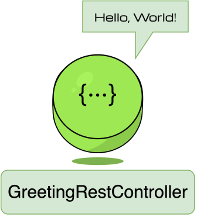
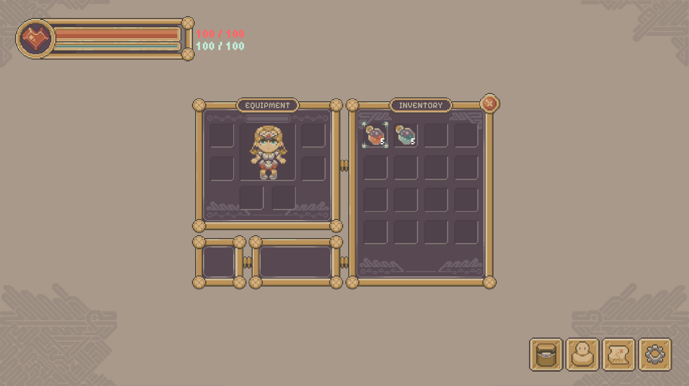

# The Practical Backend Engineer
## Twitch Chat Hit Counter
## Module 1: HTTP/REST + Swagger


### Additional Learning Materials
**Open Systems Interconnection (OSI):** [OSI Model ](https://www.imperva.com/learn/application-security/osi-model/)
> _"The Open Systems Interconnection (OSI) model describes seven layers that computer systems use to communicate over a network. The OSI model is divided into seven distinct layers, each with specific responsibilities, ranging from physical hardware connections to high-level application interactions"_
> - [System Design Primer ](https://github.com/donnemartin/system-design-primer?tab=readme-ov-file#communication)

**Hypertext Transfer Protocol (HTTP):** [What is HTTP? ](https://www.cloudflare.com/learning/ddos/glossary/hypertext-transfer-protocol-http/)
> _"A typical flow over HTTP involves a client machine making a request to a server, which then sends a response message."_
> - Layer 7 (Application) protocol

**Representational State Transfer (REST):** [REST APIs ](https://www.ibm.com/think/topics/rest-apis)
> _"REST APIs communicate through HTTP requests to perform standard database functions like creating, reading, updating and deleting records (also known as CRUD) within a resource."_
> - Architectural style, NOT a transfer protocol, for designing applications

**Swagger**: [What is Swagger? ](https://swagger.io/docs/specification/v2_0/what-is-swagger/)
> - Swagger/OpenAPI transforms an application's API into a clear, interactive contract for everyone to build against

> [!NOTE]
>
> Swagger integrates very easily with Spring Boot so that's why I chose it to build our API interface, but at Snapchat we used to use Postman to test APIs locally.
>
> **Netflix:** Java (Spring Boot), AWS, open source heavy (Kafka, Iceberg, etc)
> **Snapchat:** Raw Java, GCP
> **Yelp:** Python, AWS, open source heavy
>
> Takeaway: Based on my experience in big tech companies (Netflix, Snapchat, Amazon, Yelp), tech stacks vary widely, but the underlying principles of building large distributed systems don't change.


<br>
<br>
<br>
<br>


## Overview
All network communication — between two machines — boils down to this fundamental idea:<br>

> _**One server sends a request to some other server triggering a responsive action.**_
> - **_Request → Response_**
> - **_Cause → Effect_**
> - **_Call → Action_**
> - **_Question → Answer_**

Below is a simple example to illustrate this point.

<br>

### Case Study: Web Browsing
You visit **Google.com** and see this:
<br>

#### Question: What's actually happening behind the scenes?

**TL;DR:**<br>
**1. DNS Resolution**<br>

[//]: # (`Google.com` is a human-readable domain name that makes it easy for humans to remember when we want to visit a web hosted page/application/service.<br>)

[//]: # (Computers don't understand this domain, they require **IP addresses** &#40;i.e.: `123.456.789.0`&#41;<br>)

- **Request:** Client asks the DNS server, _"What is the IP address for `Google.com`"?_ <br>
- **Response:** DNS server answers back, _"The IP address is `142.250.72.174`"_. <br>


[//]: # (Your machine sends a **request** to a nearby DNS server to find out what `Google.com` means.<br>)

[//]: # (The DNS server searches for a valid mapping and **responds** with: `Google.com` → `XXX.XXX.XXX.X`.<br>)

[//]: # ()
[//]: # (IP Addresses are the actual server address that has information about this request.)

[//]: # ()
[//]: # (It's easier for mass adoption to remember domain names versus typing in ephemeral IP addresses.)

> [!TIP]
> 
> **ELI5:**<br>
> A group of friends — Alice, Bob, and Charlie — want to meet up at each other's house to work on a school project, and agree on **"Alice's house"**.<br>
> Alice's _**actual**_ address is really **123 Sesame Street**, but saying "Alice's House" in this context is the _alias_ understood by the entire friend group.
>
> Alice, Bob, Charlie can all act as DNS for each other's houses. If they recruit a new group member — David — he would most likely ask any of the friends where "Alice's House" is.


> [!Note]
>
> Open up your terminal and run:
> ```shell
> ping www.google.com
> ```
>
> You should see an output similar to this:<br>
> ```
> PING google.com (142.250.72.174): 56 data bytes
> ```
> If you open up a new browser and type `http://{GOOGLE_IP_ADDRESS}` it'll take you to the same **Google.com** page.
>
> Nobody does this because:
> 1. IP addresses change (If you `ping www.google.com` on another day you will notice that the original IP address I retrieved at the time I ran this command is different from the IP address you see)
> 2. Remembering IP addresses are hard

<br>


**2. Google Server Request**<br>
**Request:** Client sends an HTTP request to the server at the IP address `142.250.72.174`, _"Hey Google, send me data at the endpoint `Google.com/` (the homepage)"_.<br>
**Response:** Google's servers respond with the homepage data (HTML/CSS/JS), which is what you see rendered on the webpage.

> [!TIP]
> 
> **ELI5:**<br>
> Alice lives at `123 Sesame Street, New York NY, 12345`<br>
> Bob lives at `456 Hollywood Blvd, Los Angeles CA, 98765`<br>
>
> Alice sends a letter to Bob's address. Bob receives it and mails a letter back to Alice.<br>
> 
> The letter (data) is delivered through processing factories (routers) and by delivery men (network).

<br>

### Application Protocols
The two most common application protocols in backend systems that have been used for years are:
- **HTTP (HyperText Transfer Protocol)**: The standard protocol for client-to-server (C2S) communication. We will focus on HTTP.
- **gRPC (Google Remote Procedure Protocol)**: Used primarily for internal service-to-service (S2S) communication in microservice architecture.


<br>


## Objective
<br>

In **Module 1**, you will be implementing HTTP Rest Controllers to handle various **CRUD** (**C**reate **R**ead **U**pdate **D**elete) operations.

Goals:
- Implement a **Rest Controller** to handle a very simple static `GET` request (this will be our _"Hello World"_-equivalent tutorial)
- Implement a **Rest Controller** to handle multiple endpoints that will change the Game State of a generic **Game Character**.


<br>

## File Structure
For `Module 1`, the below file structure are all the relevant files needed.

 twitch-chat-hit-counter/<br>
&nbsp;&nbsp;&nbsp;&nbsp;&nbsp;
 src/<br>
&nbsp;&nbsp;&nbsp;&nbsp;&nbsp;&nbsp;&nbsp;&nbsp;&nbsp;&nbsp;
 main/<br>
&nbsp;&nbsp;&nbsp;&nbsp;&nbsp;&nbsp;&nbsp;&nbsp;&nbsp;&nbsp;&nbsp;&nbsp;&nbsp;&nbsp;&nbsp;
 java/<br>
&nbsp;&nbsp;&nbsp;&nbsp;&nbsp;&nbsp;&nbsp;&nbsp;&nbsp;&nbsp;&nbsp;&nbsp;&nbsp;&nbsp;&nbsp;&nbsp;&nbsp;&nbsp;&nbsp;&nbsp;
 com.sonahlab.twitch_chat_hit_counter/<br>
&nbsp;&nbsp;&nbsp;&nbsp;&nbsp;&nbsp;&nbsp;&nbsp;&nbsp;&nbsp;&nbsp;&nbsp;&nbsp;&nbsp;&nbsp;&nbsp;&nbsp;&nbsp;&nbsp;&nbsp;&nbsp;&nbsp;&nbsp;&nbsp;&nbsp;
 model/<br>
&nbsp;&nbsp;&nbsp;&nbsp;&nbsp;&nbsp;&nbsp;&nbsp;&nbsp;&nbsp;&nbsp;&nbsp;&nbsp;&nbsp;&nbsp;&nbsp;&nbsp;&nbsp;&nbsp;&nbsp;&nbsp;&nbsp;&nbsp;&nbsp;&nbsp;&nbsp;&nbsp;&nbsp;&nbsp;&nbsp;
 GameCharacter.java<br>
&nbsp;&nbsp;&nbsp;&nbsp;&nbsp;&nbsp;&nbsp;&nbsp;&nbsp;&nbsp;&nbsp;&nbsp;&nbsp;&nbsp;&nbsp;&nbsp;&nbsp;&nbsp;&nbsp;&nbsp;&nbsp;&nbsp;&nbsp;&nbsp;&nbsp;&nbsp;&nbsp;&nbsp;&nbsp;&nbsp;
 Potion.java<br>
&nbsp;&nbsp;&nbsp;&nbsp;&nbsp;&nbsp;&nbsp;&nbsp;&nbsp;&nbsp;&nbsp;&nbsp;&nbsp;&nbsp;&nbsp;&nbsp;&nbsp;&nbsp;&nbsp;&nbsp;&nbsp;&nbsp;&nbsp;&nbsp;&nbsp;&nbsp;&nbsp;&nbsp;&nbsp;&nbsp;
 Stat.java<br>
&nbsp;&nbsp;&nbsp;&nbsp;&nbsp;&nbsp;&nbsp;&nbsp;&nbsp;&nbsp;&nbsp;&nbsp;&nbsp;&nbsp;&nbsp;&nbsp;&nbsp;&nbsp;&nbsp;&nbsp;&nbsp;&nbsp;&nbsp;&nbsp;&nbsp;
 rest/<br>
&nbsp;&nbsp;&nbsp;&nbsp;&nbsp;&nbsp;&nbsp;&nbsp;&nbsp;&nbsp;&nbsp;&nbsp;&nbsp;&nbsp;&nbsp;&nbsp;&nbsp;&nbsp;&nbsp;&nbsp;&nbsp;&nbsp;&nbsp;&nbsp;&nbsp;&nbsp;&nbsp;&nbsp;&nbsp;&nbsp;
 GameRestController.java<br>
&nbsp;&nbsp;&nbsp;&nbsp;&nbsp;&nbsp;&nbsp;&nbsp;&nbsp;&nbsp;&nbsp;&nbsp;&nbsp;&nbsp;&nbsp;&nbsp;&nbsp;&nbsp;&nbsp;&nbsp;&nbsp;&nbsp;&nbsp;&nbsp;&nbsp;&nbsp;&nbsp;&nbsp;&nbsp;&nbsp;
 GreetingRestController.java<br>
&nbsp;&nbsp;&nbsp;&nbsp;&nbsp;&nbsp;&nbsp;&nbsp;&nbsp;&nbsp;
 test/<br>
&nbsp;&nbsp;&nbsp;&nbsp;&nbsp;&nbsp;&nbsp;&nbsp;&nbsp;&nbsp;&nbsp;&nbsp;&nbsp;&nbsp;&nbsp;
 java/<br>
&nbsp;&nbsp;&nbsp;&nbsp;&nbsp;&nbsp;&nbsp;&nbsp;&nbsp;&nbsp;&nbsp;&nbsp;&nbsp;&nbsp;&nbsp;&nbsp;&nbsp;&nbsp;&nbsp;&nbsp;
 com.sonahlab.twitch_chat_hit_counter/<br>
&nbsp;&nbsp;&nbsp;&nbsp;&nbsp;&nbsp;&nbsp;&nbsp;&nbsp;&nbsp;&nbsp;&nbsp;&nbsp;&nbsp;&nbsp;&nbsp;&nbsp;&nbsp;&nbsp;&nbsp;&nbsp;&nbsp;&nbsp;&nbsp;&nbsp;
 model/<br>
&nbsp;&nbsp;&nbsp;&nbsp;&nbsp;&nbsp;&nbsp;&nbsp;&nbsp;&nbsp;&nbsp;&nbsp;&nbsp;&nbsp;&nbsp;&nbsp;&nbsp;&nbsp;&nbsp;&nbsp;&nbsp;&nbsp;&nbsp;&nbsp;&nbsp;&nbsp;&nbsp;&nbsp;&nbsp;&nbsp;
 GameCharacterTest.java<br>
&nbsp;&nbsp;&nbsp;&nbsp;&nbsp;&nbsp;&nbsp;&nbsp;&nbsp;&nbsp;&nbsp;&nbsp;&nbsp;&nbsp;&nbsp;&nbsp;&nbsp;&nbsp;&nbsp;&nbsp;&nbsp;&nbsp;&nbsp;&nbsp;&nbsp;
 rest/<br>
&nbsp;&nbsp;&nbsp;&nbsp;&nbsp;&nbsp;&nbsp;&nbsp;&nbsp;&nbsp;&nbsp;&nbsp;&nbsp;&nbsp;&nbsp;&nbsp;&nbsp;&nbsp;&nbsp;&nbsp;&nbsp;&nbsp;&nbsp;&nbsp;&nbsp;&nbsp;&nbsp;&nbsp;&nbsp;&nbsp;
 GameRestControllerTest.java<br>
&nbsp;&nbsp;&nbsp;&nbsp;&nbsp;&nbsp;&nbsp;&nbsp;&nbsp;&nbsp;&nbsp;&nbsp;&nbsp;&nbsp;&nbsp;&nbsp;&nbsp;&nbsp;&nbsp;&nbsp;&nbsp;&nbsp;&nbsp;&nbsp;&nbsp;&nbsp;&nbsp;&nbsp;&nbsp;&nbsp;
 GreetingRestControllerTest.java<br>

> - `GreetingRestController.java` ─ REST controller to handle our service's greeting endpoints:
>   - `/api/greeting/hello`: responds with a simple greeting
> - `Potion.java` ─ enum defining a Game's potions
> - `Stat.java` ─ enum defining a Game's character stats
> - `GameCharacter.java` ─ Data Model class representing a generic game character
> - `GameRestController.java` ─ REST controller to handle game related endpoints on our application's main `GameCharacter.java`
>   - `/api/fantasyGame/takeDamage`: updates a `GameCharacter` to decrement their HP
>   - `/api/fantasyGame/consumePotion`: updates a `GameCharacter` to increase either HP/MP and reduce a `Potion` from their bag
>   - `/api/fantasyGame/characterState`: gets the `GameCharacter` current game state snapshot
> 
> 
> - `GreetingRestControllerTest.java` ─ Test class to validate logic after implementing `GreetingRestController.java`
> - `GameCharacterTest.java` ─ Test class to validate logic after implementing `GameCharacter.java`
> - `GameRestControllerTest.java` ─ Test class to validate logic after implementing `GameRestController.java`


> [!IMPORTANT]
> 
> `implementation 'org.springdoc:springdoc-openapi-starter-webmvc-ui:2.8.13'`
>
> I've already implemented the Swagger library required for this project.

<br>

## Exercise 1: Greeting API


[//]: # (![]&#40;assets/module1/images/greetings.svg&#41;<br>)
<br>

In `GreetingRestController.java`, implement `public String sayHello(@RequestParam(required = false) String name)`.<br>
This method is the entry point for all incoming HTTP requests routed to `GET /api/greeting/hello`.

Return a `String` to greet the `name` passed in.

**Requirements:**<br>
1. Greeting response template: `"Hello, {name}!"`.
2. If `name` parameter isn't provided, greet a `stranger`.

<br>

### Example 1:
> **Input**:
> ```bash
> $ curl -X GET "http://localhost:8080/api/greeting/hello?name=World"
> ```
> 
> **Output**: `Hello, World!`

#

### Example 2:
> **Input**:
> ```bash
> $ curl -X GET "http://localhost:8080/api/greeting/hello?name="
> ```
> 
> **Output**: `Hello, Stranger!`
> 
> **Explanation**: no `name` parameter is provided (only whitespace), so the greeting should address `"stranger"`

<br>

#

### Unit Tests
- [ ] Open `GreetingRestControllerTest.java` ─ already implemented test cases with the example(s) above.<br>
- [ ] Remove `@Disabled` in `GreetingRestControllerTest.java`<br>
- [ ] Test with:
    ```shell
    ./gradlew test --tests "*" -Djunit.jupiter.tags=Module1
    ```

<br>

#

### E2E Tests
- [ ] Run the application:
    ```shell
    ./gradlew bootRun
    ```
- [ ] Go to: [Swagger UI ](http://localhost:8080/swagger-ui/index.html)<br>
- [ ] Play around with the **Greeting API** endpoint(s)
<br>


<br>

<br>

<br>

## Lesson: OOP (Object Oriented Programming) Refresher
**TL;DR**: **OOP (Object Oriented Programming)** is about modelling well-defined classes that encapsulate stateful variables (characteristics) and methods (actions) that are common to the type of object you are attempting to model.

**Example**:
```java
public class Car {

    // Object variables
    private String make;
    private String model;
    private int speed;

    // Constructor
    public Car(String make, String model) {
        this.make = make;
        this.model = model;
        this.speed = 0;
    }

    // ============================ GETTERS ============================
    public String getMake() {
        return make;
    }

    public String getModel() {
        return model;
    }

    public int getSpeed() {
        return speed;
    }
    // =================================================================

    // ===================== STATE CHANGE ACTIONS ======================
    // Increases car speed by 10 MPH w/ a maximum speed of 100 MPH
    public void accelerate() {
        speed = Math.min(100, speed + 10);
    }

    // Decreases car speed by 10 MPH w/ a minimum speed of 0 MPH
    public void decelerate() {
        speed = Math.max(0, speed - 10);
    }
    // =================================================================
}


public class Main {
    public static void main(String[] args) {
        Car car1 = new Car("Toyota", "Prius");
        Car car2 = new Car("Honda", "Civic");

        // Get car1 variables
        car1.getMake(); // "Toyota"
        car1.getModel(); // "Prius"
        car1.getSpeed(); // 0

        // Get car2 variables
        car2.getMake(); // "Honda"
        car2.getModel(); // "Civic"
        car2.getSpeed(); // 0

        // Change car1's speed
        car1.accelerate(); // speed → 10
        car1.accelerate(); // speed → 20
        car1.accelerate(); // speed → 30
        car1.getSpeed(); // 30

        // Change car2's speed
        car2.accelerate(); // speed → 10
        car2.getSpeed(); // 10
        car2.decelerate(); // speed → 0
        car2.getSpeed(); // 0
    }
}
```
>
> `car1` and `car2` are both `Car` class objects with their own separate memory space in a program and each object maintains its own independent state:
> ```
> car1 = {
>   "make": "Toyota",
>   "model": "Prius",
>   "speed": 30
> }
> 
> car2 = {
>   "make": "Honda",
>   "model": "Civic",
>   "speed": 0
> }
> ```
>
> This is the core idea of objects in OOP: 1 class → N objects (each with its own data).
>
> OOP is about creating Object blueprints. You can use the same blueprint to build many copies of an Object, but each Object is encapsulated with its own set of variables/state.
> What happens to another `car2` does not affect `car1`, and vice versa.


<br>

<br>

<br>


## Exercise 2: Game API
<br>

<br>

#

### Task 1: `GameCharacter`
<br>

Before we can implement our API endpoints in `GameRestController.java`, we need to create our Data Model object for a generic fantasy game character.

In `GameCharacter.java`, implement the following:
- `GameCharacter()` (_CONSTRUCTOR_)
- `getStat(Stat stat)` (_GETTER_)
- `getInventory()` (_GETTER_)
- `setHp(int hp)` (_SETTER_)
- `setMp(int mp)` (_SETTER_)
- `takeDamage(int damage)` (_STATE CHANGE_)
- `consumePotion(Potion potion)` (_STATE CHANGE_)
- `getCharacterState()` (_GETTER_)

> [!TIP]
>
> If you aren't familiar with creating **POJOs** (Plain Old Java Objects), I suggest you read up on various ways to create Java Object Oriented Programming (OOP) objects:
> - [_Java Encapsulation Pattern_ ](https://www.w3schools.com/java/java_encapsulation.asp)<br>
> - [_Java Builder Pattern_ ](https://www.baeldung.com/java-builder-pattern)<br>
> - [_Java Record Pattern_ ](https://docs.oracle.com/en/java/javase/17/language/records.html)<br>

<br>

#

### Task 1 Part I: Constructor
In `GameCharacter.java`, implement the constructor: `GameCharacter()`.

> [!TIP]
> 
> `Potion.java` and `Stat.java` should help with this task.

**Requirements:**<br>
1. `GameCharacter` object should have 3 fields:
    1. `Stat.HP (int)`: Character's health points between `[0, 100]`
    2. `Stat.MP (int)`: Character's mana points between `[0, 100]`
    3. `Inventory (Map<Potion, Integer>)`: Character's bag of `Potion → countOfPotion`
2. Default values for a new `GameCharacter` instance:
    1. Initial `Stat.HP` of 100
    2. Initial `Stat.MP` of 100
    3. Initial `inventory` containing:
        1. 5 `Potion.HP_POTION`
        2. 5 `Potion.MP_POTION`

<br>

#

### Task 1 Part II: `GameCharacter::getStat`
In `GameCharacter.java`, implement `getStat(Stat stat)`.

Return an `int` of the character's current value for the input `Stat` enum.

**Requirements:**
1. If `stat == Stat.HP`: return the `GameCharacter` current **HP** int value
2. If `stat == Stat.MP`: return the `GameCharacter` current **MP** int value

<br>

#

### Task 1 Part III: `GameCharacter::getInventory`
In `GameCharacter.java`, implement `getInventory()`.

Return the `Map<Potion, Integer>` of the character's current potion map.

<br>

#

### Task 1 Part IV: `setHp`, `setMp`
In `GameCharacter.java`, implement `setHp(int hp)` and `setMp(int mp)`.

**Requirements:**
1. **HP/MP** should be bounded by `[0, 100]`
2. Attempts to set the **HP/MP** with values outside the valid range should be ignored.

<br>

#

### Example 1:
> **Input**:
> ```java
> // Constructor should initialize: hp=100, mp=100, inventory={"HP_POTION": 5, "MP_POTION": 5}
> GameCharacter character = new GameCharacter();
>
> // Validate the default construction of the GameCharacter fields
> int output1 = character.getStat(Stat.HP);
> int output2 = character.getStat(Stat.MP);
> Map<Potion, Integer> output3 = character.getInventory();
> 
> // Validate the HP/MP setting logic (between 0 and 100)
> character.setHp(10000);
> int output4 = character.getStat(Stat.HP); // Expected: 100 (hp should be between 0 and 100
>                                           // we should ignore this method call)
> character.setHp(50);
> int output5 = character.getStat(Stat.HP); // Expected: 50 (hp is valid between 0 and 100)
> 
> character.setMp(-10000);
> int output6 = character.getStat(Stat.MP); // Expected: 100 (mp should be between 0 and 100
>                                           // we should ignore this method call)
> 
> character.setMp(0);
> int output7 = character.getStat(Stat.MP); // Expected: 0 (mp is valid between 0 and 100)
> ```
>
> **Output1**: `100`<br>
> **Output2**: `100`<br>
> **Output3**:<br>
> ```
> {
>   Potion.HP_POTION: 5,
>   Potion.MP_POTION: 5
> }
> ```
> **Output4**: `100`<br>
> **Output5**: `50`<br>
> **Output6**: `100`<br>
> **Output7**: `0`<br>

<br>

#

### Unit Tests
- [ ] Open `GameCharacterTest.java` ─ already implemented test cases with the example(s) above.
- [ ] Remove `@Disabled` in `GameCharacterTest::initTest`
- [ ] Test with:
    ```shell
    ./gradlew test --tests "*" -Djunit.jupiter.tags=Module1
    ```

<br>

#

### Task 1 Part V: `GameCharacter::takeDamage`
In `GameCharacter.java`, implement `takeDamage(int damage)`. You will reduce the `character` object's HP by the `damage` amount.

Return an `int` of the updated character `HP` value after taking damage.

> [!TIP]
>
> A `GameCharacter` HP/MP has a minimum value of `0`

### Example 1:
> 
> 
> **Input**:
> ```java
> GameCharacter character = new GameCharacter();
> int output = character.takeDamage(50);
> ```
> 
> **Output**: `50`

<br>

#

### Example 2:
> 
> 
> **Input**:
> ```java
> GameCharacter character = new GameCharacter();
> int output = character.takeDamage(110);
> ```
> 
> **Output**: `0`<br>
> 
> **Explanation**: A character's HP should never be negative (min capped at 0).

<br>

#

### Unit Tests
- [ ] Open `GameCharacterTest.java` ─ already implemented test cases with the example(s) above.
- [ ] Remove `@Disabled` in `GameCharacterTest::takeDamageTest`
- [ ] Test with:
    ```shell
    ./gradlew test --tests "*" -Djunit.jupiter.tags=Module1
    ```

<br>

#

### Task 1 Part VI: `GameCharacter::consumePotion`
In `GameCharacter.java`, implement `consumePotion(Potion potion)`. You will increment the `character` object's HP/MP depending on the `Potion` stat bonus.

Return an `int` of the updated character `HP`/`MP` int after consuming a potion, or `-1` for any errors.

> [!TIP]
>
> A `GameCharacter` HP/MP has a maximum value of `100`

> [!IMPORTANT]
> 
> Look at how I defined the `Potion.java` enum. Each `Potion` enum has helper methods on (1) the `Stat` affected and (2) the nominal amount.

**Requirements:**
1. A `GameCharacter` must have the `Potion` currently in their inventory that they are attempting to consume.
2. `Potion.HP_POTION` increments HP by `+50`.<br>
   `Potion.MP_POTION` increments MP by `+50`.
3. `Potion` count decrements by `-1` from the `inventory` after consumption
4. `Potion` should be removed from the `inventory` if the count reaches `0`.

<br>

#

### Example 1:
> 
> 
> **Input**:
> ```java
> GameCharacter character = new GameCharacter();
> character.setHp(25);
> int output = character.consumePotion(Potion.HP_POTION);
> ```
> 
> **Output**: `75`
> 
> **Explanation**: HP=25 before consuming an `HP_Potion`. After consuming, they have:<br>
> `25 (current HP) + 50 (potion bonus) = 70HP`.

<br>

#

### Example 2:
> 
> 
> **Input**:
> ```java
> GameCharacter character = new GameCharacter();
> character.setHp(75);
> int output = character.consumePotion(Potion.HP_POTION);
> ```
> 
> **Output**: `100`
> 
> **Explanation**: HP=75 before consuming an `HP_Potion`. After consuming, they have:<br>
> `75 (current HP) + 50 (potion bonus) = 125HP (capped at 100)`.

<br>

#

### Example 3:
> 
> 
> **Input**:
> ```java
> GameCharacter character = new GameCharacter();
> character.setMp(25);
> int output = character.consumePotion(Potion.MP_POTION);
> ```
> 
> **Output**: `75`
> 
> **Explanation**: MP=75 before consuming an `MP_Potion`. After consuming, they have:<br>
> `25 (current MP) + 50 (potion bonus) = 75MP`.

<br>

#

### Example 4:
> 
> 
> **Input**:
> ```java
> GameCharacter character = new GameCharacter();
> character.setMp(99);
> int output = character.consumePotion(Potion.MP_POTION);
> ```
> 
> **Output**: `100`
> 
> **Explanation**: MP=99 before consuming an `MP_Potion`. After consuming, they have:<br>
> `99 (current MP) + 50 (potion bonus) = 149MP (capped at 100)`.

<br>

#

### Example 5:
> 
> 
> **Input**:
> ```java
> GameCharacter character = new GameCharacter();
> for (int index = 0; index < 4; index++) {
>     character.consumePotion(Potion.HP_POTION);
> }
> character.setHp(25);
> 
> int output = character.consumePotion(Potion.HP_POTION);
> Map<Potion, Integer> output2 = character.getInventory();
> ```
> **Output1**: `100`<br>
> **Explanation**: HP=25 before we consume the last `HP_Potion`, after consuming it we have 25 (current HP) + 50 (potion bonus) = 75.
>
> **Output2**:
> ```
> {
>   Potion.MP_POTION: 5
> }
> ```
> **Explanation**: The Inventory should no longer contain the HP_POTION now that the quantity of this Potion reaches 0.

<br>

#

### Example 6:
> 
>
> **Input**:
> ```java
> GameCharacter character = new GameCharacter();
> for (int index = 0; index < 5; index++) {
>     character.consumePotion(Potion.HP_POTION);
> }
> character.takeDamage(50);
> 
> int output = character.consumePotion(Potion.HP_POTION);
> ```
> 
> **Output**: `-1`
> 
> **Explanation**: There are no `HP_POTION` left in the inventory to consume, so we return `-1` to signal that there was an error.

<br>

#

### Unit Tests
- [ ] Open `GameCharacterTest.java` ─ already implemented test cases with the example(s) above.
- [ ] Remove `@Disabled` in `GameCharacterTest.java::consumePotionTest()`
- [ ] Test with:
    ```shell
    ./gradlew test --tests "*" -Djunit.jupiter.tags=Module1
    ```

<br>

#

### Task 1 Part VII: `GameCharacter::getCharacterState`
In `GameCharacter.java`, implement `getCharacterState()`.

Return a `Map<String, Object>` representing the entire character's current state of `Stat` and `inventory`.

**Requirements:**
- All the keys should be stored as `String` values: [`"HP"`, `"MP"`, `"INVENTORY"`]
- `Stat` values should be stored as the current `int` values for each stat.
- `inventory` value should be stored as a `Map<Potion, Integer>`.

<br>

#

### Example 1:
> 
> 
> **Input**:
> ```java
> // Assume the character starts with 100 HP and MP, and 5 of each HP/MP potions
> GameCharacter character = new GameCharacter();
> Map<String, Object> output = character.getCharacterState();
>```
> 
> **Output**:
> ```json
> {
>     "HP": 100,
>     "MP": 100,
>     "INVENTORY": {
>         "HP_POTION": 5,
>         "MP_POTION": 5
>     }
> }
> ```

<br>

#

### Unit Tests
- [ ] Open `GameCharacterTest.java` ─ already implemented test cases with the example(s) above.
- [ ] Remove `@Disabled` in `GameCharacterTest::getCharacterStateTest`
- [ ] Test with:
    ```shell
    ./gradlew test --tests "*" -Djunit.jupiter.tags=Module1
    ```

<br>

#

### Task 2: `GameRestController`


You should have implemented `GameCharacter.java`, which will be the handler for all the Game API endpoints.

### Task 2 Part I: Constructor
In `GameRestController.java`, implement the constructor: `GameRestController()`.

**Requirements:**
- Initialize the Main `GameCharacter` for our application

> [!IMPORTANT]
> 
> When your application runs, the `GameCharacter` object you initialize is **in-memory**, so any state changes aren't persisted once the JVM stops.
> 
> **Example:**<br>
> → Run the application: `./gradlew bootRun`<br>
> → `GameRestController.java` will init a new `GameCharacter`<br>
> → Call `PUT /takeDamage?damage=50`, the character's HP=50<br>
> → Quit the application: `Control + C` (JVM is killed)<br>
> → Run the application again: `./gradlew bootRun`<br>
> → Call `GET /characterState`, the character's HP=100

<br>

#

### Task 2 Part II: `/takeDamage`, `/consumePotion`, `/characterState`
In `GameRestController.java`, implement the Game API endpoints by simply calling the respective methods you implemented in `GameCharacter.java`.

Return the result from the `GameCharacter.java` function calls back through the HTTP Response.

```java
@PutMapping("/takeDamage")
public int takeDamage(@RequestParam int damage) {
    // Hook up to GameCharacter.takeDamage(...)
}

@PutMapping("/consumePotion")
public int consumePotion(@RequestParam String potionName) {
    // CAVEAT: 'String potionName' needs to be converted to a `Potion` enum
    // Hook up to GameCharacter.consumePotion(...)
}

@GetMapping("/characterState")
public Map<String, Object> getCharacterState() {
    // Hook up to GameCharacter.getCharacterState()
}
```

<br>

### Example 1:
> ```bash
> $ curl -X GET "http://localhost:8080/api/fantasyGame/characterState"
> # Output1
> {
>   "HP": 100,
>   "MP": 100,
>   "INVENTORY": {
>     "HP_POTION": 5,
>     "MP_POTION": 5,
>   }
> }
> 
> $ curl -X PUT "http://localhost:8080/api/fantasyGame/takeDamage?damage=70"
> # Output2
> 30
>
> $ curl -X POST "http://localhost:8080/api/fantasyGame/consumePotion?potionName=HP_POTION"
> # Output3
> 80
> 
> $ curl -X GET "http://localhost:8080/api/fantasyGame/characterState"
> # Output4
> {
>   "HP": 80,
>   "MP": 100,
>   "INVENTORY": {
>     "HP_POTION": 4,
>     "MP_POTION": 5,
>   }
> }
> ```
> 
> **Explanation:**
> 
> **Output1:** Get the default character state where the init values should have HP/MP = 100 and HP/MP potions = 5.<br>
> **Output2:** Character takes 70 damage. Their HP value should now be 100 - 70 = 30.<br>
> **Output3:** Character drinks a HP_POTION. Their HP value should now be 30 (current HP) + 50 (potion bonus) = 80.<br>
> **Output4:** Get the character state again. HP = 80 after `/takeDamage` + `/consumePotion`. MP = 100 (never changed). INVENTORY now has 4 HP_POTIONs after `/consumePotion` and 5 MP_POTIONs (never changed).

#

### Unit Tests
- [ ] Open `GameRestControllerTest.java` ─ already implemented test cases with the example(s) above.
- [ ] Remove `@Disabled` in `GameRestControllerTest.java`
- [ ] Test with:
    ```shell
    ./gradlew test --tests "*" -Djunit.jupiter.tags=Module1
    ```

#

### E2E Tests
- [ ] Run the application:
    ```shell
    ./gradlew bootRun
    ```
- [ ] Go to: [Swagger UI ](http://localhost:8080/swagger-ui/index.html)<br>
- [ ] Play around with the **Game API** endpoint(s)
  <br>
