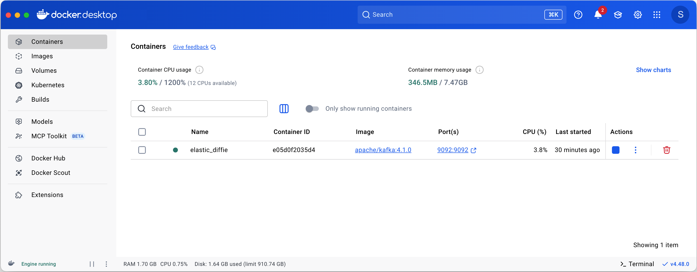
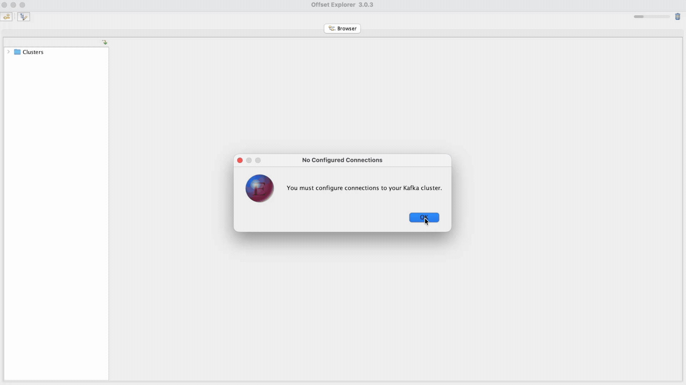
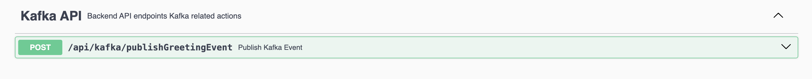

# Practical Backend Engineer
## Twitch Chat Hit Counter
## Module 2: Kafka
### Recommended Learning Materials
- **Kafka**: https://kafka.apache.org/intro
- **Cloud Karafka Kafka Overview**: https://www.cloudkarafka.com/blog/part1-kafka-for-beginners-what-is-apache-kafka.html
- **Confluent**: https://docs.confluent.io/kafka/introduction.html
- **Spring Boot Kafka**: https://spring.io/projects/spring-kafka
- **Baeldung Spring Kafka:** https://www.baeldung.com/spring-kafka
- Spring Boot Kafka Integration: https://www.geeksforgeeks.org/spring-boot-integration-with-kafka/

> [!TIP]
>
> Take the time to read through the Kafka links listed above.<br>

<br>

## Overview
I highly recommend reading through the Kafka Introduction above to learn what Kafka is, how it works, and why it’s used ubiquitously in large distributed systems.

Kafka is a distributed message log, where it temporarily holds incoming events.
Imagine we work at Netflix, and support streaming on several playback devices (i.e.: Web, Mobile (iOS/Android), and TV).</br>
For this case study, let's just divide responsibility of teams by device.
- iOS Team: collects all user events from all iOS devices.
- Android Team: collects all user events from all android devices.
- Web Team: collects all user events from all Web devices.
- TV Team: collects all user events from TV devices.
Imagine that we now own 3 products: Google Search, YouTube, and Google Photos.

We are the UserEventing Team, in charge of processing all events into UserEvents for all of our downstream teams to use as the Source of Truth for all user data.

Downstream we might have:
User Insights/Engagement Team: in charge of analyzing user engagement data to
User Identity Team: in charge of building the Day-over-day or Month-over-Month metrics to analyze DAU/MAU over time.
User Bonus Team: in charge of rewarding the power users of our product with bonuses in cash outs or special perks.

In a large scale organization where many teams and systems depend on each other, decoupling is essential to scalability, reliability. We can setup kafka topics as the intermediary link between teams where the producer will publish/write any events, and consumers will subscribe/read any new events as they come in.

A bad example is Team A sends data directly to Team B through some endpoint. What if either side fails in this handoff? What if Team B fails to process an event, will Team A know to re-process an old event?

Think of Kafka as a temporary message queue where events are stored with an expiration date of, usually <24 hours. The longer the TTL on the events, the more cost is incurred in storing and managing older events.

*** My rule of thumb: if you work at a big tech company and are in charge of a realtime event pipeline, and you don’t have mechanisms in place to catch/fix issues within 24 hours before old events are purged, this is a clear engineering diff, and there are big gaps in the system. Kafka isn’t meant for long-term storage, so you shouldn’t have super long TTL’s on the events, git gud and fix your system.


<br>


## File Structure
For `Module 2`, the below file structure are all the relevant files needed.

[//]: # (```)
[//]: # (twitch-chat-hit-counter/src/)
[//]: # (├── main/)
[//]: # (│   ├── java/)
[//]: # (│   │   └── com.sonahlab.twitch_chat_hit_counter/)
[//]: # (│   │       ├── config/)
[//]: # (│   │       │   └── KafkaConfig.java)
[//]: # (│   │       ├── kafka/)
[//]: # (│   │       │   ├── consumer/)
[//]: # (│   │       │   │   ├── GreetingEventBatchConsumer.java)
[//]: # (│   │       │   │   └── GreetingEventConsumer.java)
[//]: # (│   │       │   └── producer/)
[//]: # (│   │       │       └── GreetingEventProducer.java)
[//]: # (│   │       ├── model/)
[//]: # (│   │       │   └── GreetingEvent.java)
[//]: # (│   │       └── rest/)
[//]: # (│   │           └── ApplicationRestController.java)
[//]: # (│   └── resources/)
[//]: # (│       └── application.yml)
[//]: # (└── test/)
[//]: # (    └── java/)
[//]: # (        └── com.sonahlab.twitch_chat_hit_counter/)
[//]: # (            └── kafka/)
[//]: # (                ├── consumer/)
[//]: # (                │   ├── GreetingEventBatchConsumerTest.java)
[//]: # (                │   └── GreetingEventConsumerTest.java)
[//]: # (                └── producer/)
[//]: # (                    └── GreetingEventProducerTest.java)
[//]: # (```)
 twitch-chat-hit-counter/<br>
&nbsp;&nbsp;&nbsp;&nbsp;&nbsp;
 src/<br>
&nbsp;&nbsp;&nbsp;&nbsp;&nbsp;&nbsp;&nbsp;&nbsp;&nbsp;&nbsp;
 main/<br>
&nbsp;&nbsp;&nbsp;&nbsp;&nbsp;&nbsp;&nbsp;&nbsp;&nbsp;&nbsp;&nbsp;&nbsp;&nbsp;&nbsp;&nbsp;
 java/<br>
&nbsp;&nbsp;&nbsp;&nbsp;&nbsp;&nbsp;&nbsp;&nbsp;&nbsp;&nbsp;&nbsp;&nbsp;&nbsp;&nbsp;&nbsp;&nbsp;&nbsp;&nbsp;&nbsp;&nbsp;
 com.sonahlab.twitch_chat_hit_counter/<br>
&nbsp;&nbsp;&nbsp;&nbsp;&nbsp;&nbsp;&nbsp;&nbsp;&nbsp;&nbsp;&nbsp;&nbsp;&nbsp;&nbsp;&nbsp;&nbsp;&nbsp;&nbsp;&nbsp;&nbsp;&nbsp;&nbsp;&nbsp;&nbsp;&nbsp;
 config/<br>
&nbsp;&nbsp;&nbsp;&nbsp;&nbsp;&nbsp;&nbsp;&nbsp;&nbsp;&nbsp;&nbsp;&nbsp;&nbsp;&nbsp;&nbsp;&nbsp;&nbsp;&nbsp;&nbsp;&nbsp;&nbsp;&nbsp;&nbsp;&nbsp;&nbsp;&nbsp;&nbsp;&nbsp;&nbsp;&nbsp;
 KafkaConfig.java<br>
&nbsp;&nbsp;&nbsp;&nbsp;&nbsp;&nbsp;&nbsp;&nbsp;&nbsp;&nbsp;&nbsp;&nbsp;&nbsp;&nbsp;&nbsp;&nbsp;&nbsp;&nbsp;&nbsp;&nbsp;&nbsp;&nbsp;&nbsp;&nbsp;&nbsp;
 kafka/<br>
&nbsp;&nbsp;&nbsp;&nbsp;&nbsp;&nbsp;&nbsp;&nbsp;&nbsp;&nbsp;&nbsp;&nbsp;&nbsp;&nbsp;&nbsp;&nbsp;&nbsp;&nbsp;&nbsp;&nbsp;&nbsp;&nbsp;&nbsp;&nbsp;&nbsp;&nbsp;&nbsp;&nbsp;&nbsp;&nbsp;
 consumer/<br>
&nbsp;&nbsp;&nbsp;&nbsp;&nbsp;&nbsp;&nbsp;&nbsp;&nbsp;&nbsp;&nbsp;&nbsp;&nbsp;&nbsp;&nbsp;&nbsp;&nbsp;&nbsp;&nbsp;&nbsp;&nbsp;&nbsp;&nbsp;&nbsp;&nbsp;&nbsp;&nbsp;&nbsp;&nbsp;&nbsp;&nbsp;&nbsp;&nbsp;&nbsp;&nbsp;
 GreetingEventBatchConsumer.java<br>
&nbsp;&nbsp;&nbsp;&nbsp;&nbsp;&nbsp;&nbsp;&nbsp;&nbsp;&nbsp;&nbsp;&nbsp;&nbsp;&nbsp;&nbsp;&nbsp;&nbsp;&nbsp;&nbsp;&nbsp;&nbsp;&nbsp;&nbsp;&nbsp;&nbsp;&nbsp;&nbsp;&nbsp;&nbsp;&nbsp;&nbsp;&nbsp;&nbsp;&nbsp;&nbsp;
 GreetingEventConsumer.java<br>
&nbsp;&nbsp;&nbsp;&nbsp;&nbsp;&nbsp;&nbsp;&nbsp;&nbsp;&nbsp;&nbsp;&nbsp;&nbsp;&nbsp;&nbsp;&nbsp;&nbsp;&nbsp;&nbsp;&nbsp;&nbsp;&nbsp;&nbsp;&nbsp;&nbsp;&nbsp;&nbsp;&nbsp;&nbsp;&nbsp;
 producer/<br>
&nbsp;&nbsp;&nbsp;&nbsp;&nbsp;&nbsp;&nbsp;&nbsp;&nbsp;&nbsp;&nbsp;&nbsp;&nbsp;&nbsp;&nbsp;&nbsp;&nbsp;&nbsp;&nbsp;&nbsp;&nbsp;&nbsp;&nbsp;&nbsp;&nbsp;&nbsp;&nbsp;&nbsp;&nbsp;&nbsp;&nbsp;&nbsp;&nbsp;&nbsp;&nbsp;
 GreetingEventProducer.java<br>
&nbsp;&nbsp;&nbsp;&nbsp;&nbsp;&nbsp;&nbsp;&nbsp;&nbsp;&nbsp;&nbsp;&nbsp;&nbsp;&nbsp;&nbsp;&nbsp;&nbsp;&nbsp;&nbsp;&nbsp;&nbsp;&nbsp;&nbsp;&nbsp;&nbsp;
 model/<br>
&nbsp;&nbsp;&nbsp;&nbsp;&nbsp;&nbsp;&nbsp;&nbsp;&nbsp;&nbsp;&nbsp;&nbsp;&nbsp;&nbsp;&nbsp;&nbsp;&nbsp;&nbsp;&nbsp;&nbsp;&nbsp;&nbsp;&nbsp;&nbsp;&nbsp;&nbsp;&nbsp;&nbsp;&nbsp;&nbsp;
 GreetingEvent.java<br>
&nbsp;&nbsp;&nbsp;&nbsp;&nbsp;&nbsp;&nbsp;&nbsp;&nbsp;&nbsp;&nbsp;&nbsp;&nbsp;&nbsp;&nbsp;&nbsp;&nbsp;&nbsp;&nbsp;&nbsp;&nbsp;&nbsp;&nbsp;&nbsp;&nbsp;
 rest/<br>
&nbsp;&nbsp;&nbsp;&nbsp;&nbsp;&nbsp;&nbsp;&nbsp;&nbsp;&nbsp;&nbsp;&nbsp;&nbsp;&nbsp;&nbsp;&nbsp;&nbsp;&nbsp;&nbsp;&nbsp;&nbsp;&nbsp;&nbsp;&nbsp;&nbsp;&nbsp;&nbsp;&nbsp;&nbsp;&nbsp;
 ApplicationRestController.java<br>
&nbsp;&nbsp;&nbsp;&nbsp;&nbsp;&nbsp;&nbsp;&nbsp;&nbsp;&nbsp;&nbsp;&nbsp;&nbsp;&nbsp;&nbsp;
 resources/<br>
&nbsp;&nbsp;&nbsp;&nbsp;&nbsp;&nbsp;&nbsp;&nbsp;&nbsp;&nbsp;&nbsp;&nbsp;&nbsp;&nbsp;&nbsp;&nbsp;&nbsp;&nbsp;&nbsp;&nbsp;
 application.yml<br>
&nbsp;&nbsp;&nbsp;&nbsp;&nbsp;&nbsp;&nbsp;&nbsp;&nbsp;&nbsp;
 test/<br>
&nbsp;&nbsp;&nbsp;&nbsp;&nbsp;&nbsp;&nbsp;&nbsp;&nbsp;&nbsp;&nbsp;&nbsp;&nbsp;&nbsp;&nbsp;
 java/<br>
&nbsp;&nbsp;&nbsp;&nbsp;&nbsp;&nbsp;&nbsp;&nbsp;&nbsp;&nbsp;&nbsp;&nbsp;&nbsp;&nbsp;&nbsp;&nbsp;&nbsp;&nbsp;&nbsp;&nbsp;
 com.sonahlab.twitch_chat_hit_counter/<br>
&nbsp;&nbsp;&nbsp;&nbsp;&nbsp;&nbsp;&nbsp;&nbsp;&nbsp;&nbsp;&nbsp;&nbsp;&nbsp;&nbsp;&nbsp;&nbsp;&nbsp;&nbsp;&nbsp;&nbsp;&nbsp;&nbsp;&nbsp;&nbsp;&nbsp;
 kafka/<br>
&nbsp;&nbsp;&nbsp;&nbsp;&nbsp;&nbsp;&nbsp;&nbsp;&nbsp;&nbsp;&nbsp;&nbsp;&nbsp;&nbsp;&nbsp;&nbsp;&nbsp;&nbsp;&nbsp;&nbsp;&nbsp;&nbsp;&nbsp;&nbsp;&nbsp;&nbsp;&nbsp;&nbsp;&nbsp;&nbsp;
 consumer/<br>
&nbsp;&nbsp;&nbsp;&nbsp;&nbsp;&nbsp;&nbsp;&nbsp;&nbsp;&nbsp;&nbsp;&nbsp;&nbsp;&nbsp;&nbsp;&nbsp;&nbsp;&nbsp;&nbsp;&nbsp;&nbsp;&nbsp;&nbsp;&nbsp;&nbsp;&nbsp;&nbsp;&nbsp;&nbsp;&nbsp;&nbsp;&nbsp;&nbsp;&nbsp;&nbsp;
 GreetingEventBatchConsumerTest.java<br>
&nbsp;&nbsp;&nbsp;&nbsp;&nbsp;&nbsp;&nbsp;&nbsp;&nbsp;&nbsp;&nbsp;&nbsp;&nbsp;&nbsp;&nbsp;&nbsp;&nbsp;&nbsp;&nbsp;&nbsp;&nbsp;&nbsp;&nbsp;&nbsp;&nbsp;&nbsp;&nbsp;&nbsp;&nbsp;&nbsp;&nbsp;&nbsp;&nbsp;&nbsp;&nbsp;
 GreetingEventConsumerTest.java<br>
&nbsp;&nbsp;&nbsp;&nbsp;&nbsp;&nbsp;&nbsp;&nbsp;&nbsp;&nbsp;&nbsp;&nbsp;&nbsp;&nbsp;&nbsp;&nbsp;&nbsp;&nbsp;&nbsp;&nbsp;&nbsp;&nbsp;&nbsp;&nbsp;&nbsp;&nbsp;&nbsp;&nbsp;&nbsp;&nbsp;
 producer/<br>
&nbsp;&nbsp;&nbsp;&nbsp;&nbsp;&nbsp;&nbsp;&nbsp;&nbsp;&nbsp;&nbsp;&nbsp;&nbsp;&nbsp;&nbsp;&nbsp;&nbsp;&nbsp;&nbsp;&nbsp;&nbsp;&nbsp;&nbsp;&nbsp;&nbsp;&nbsp;&nbsp;&nbsp;&nbsp;&nbsp;&nbsp;&nbsp;&nbsp;&nbsp;&nbsp;
 GreetingEventProducerTest.java<br>

<br>

## Objective
<br>
**Module 2** is mostly about setting up an HTTP request endpoint that will take a User submitted GreetingEvent and pub/sub the event onto a kafka topic. 

<br>

## Setup Local Kafka Server
Start our local Kafka instance via Docker: [Kafka Quickstart ](https://kafka.apache.org/quickstart)<br>
1. Open and login to **Docker Desktop**
2. Get the Docker image:
```bash
docker pull apache/kafka:4.1.0
```
3. Start the Kafka Docker container:
```bash
docker run -p 9092:9092 apache/kafka:4.1.0
```

<br>

In **Docker**, you should now see the kafka container running locally.


<br>

In **Offset Explorer 3**, connect to our Kafka cluster running in Docker.
1. Input cluster configs:
   1. **Cluster name:** twitch-chat-hit-counter
   2. **Bootstrap servers:** localhost:9092
2. Click '**Test**' to verify that OE3 is able to connect to the Docker container
3. Double-click on the newly created cluster to connect to the instance

<br>

<br>

## Create your first kafka topic
1. Navigate to the _**Clusters/twitch-chat-hit-counter/Topics**_ folder
2. Click '+' to add a new kafka topic
3. Input kafka topic configs:
   1. **Topic name**: greeting-events<br>
   2. **Partition Count**: 3<br>
   3. **Replica Count**: 1
4. Select our kafka topic in **_Clusters/twitch-chat-hit-counter/Topics/greeting-events_**
5. Change the **Content Types** for the key and value from **'Byte Array'** → **'String'**, and save by clicking **Update**.

<br>

<br>

## Excercise 1: Configure Spring Kafka within our Application
> [!NOTE]
>
> **Relevant Files**<br>
> `application.yml` ─ our service's property file<br>

### Task 1: Configure application.yml
| Property                                   | Required?    | Role         | Supported/Example Values                                                                                                                                                                                                                                                                                                                                                                                                                                                                                                                                              | Description                                                                                                                                      |
|--------------------------------------------|--------------|--------------|-----------------------------------------------------------------------------------------------------------------------------------------------------------------------------------------------------------------------------------------------------------------------------------------------------------------------------------------------------------------------------------------------------------------------------------------------------------------------------------------------------------------------------------------------------------------------|--------------------------------------------------------------------------------------------------------------------------------------------------|
| `spring.kafka.bootstrap-servers`           | **Required** | **Both**     | i.e.: "host:port"                                                                                                                                                                                                                                                                                                                                                                                                                                                                                                                                                     | Specifies the Kafka broker(s) to connect to. No connection without it.                                                                           |
| `spring.kafka.consumer.group-id`           | **Required** | **Consumer** | i.e.: "applicationName-group-id-0"                                                                                                                                                                                                                                                                                                                                                                                                                                                                                                                                    | Defines the consumer group name. Kafka uses this to track message consumption. Multiple consumers with the same group ID share the message load. |
| `spring.kafka.consumer.auto-offset-reset`  | Optional     | **Consumer** | `latest` **(default)**<br>`earliest`<br> `none`                                                                                                                                                                                                                                                                                                                                                                                                                                                                                                                       | Controls where to start reading if no offset is committed. Default: `latest`.                                                                    |
| `spring.kafka.consumer.enable-auto-commit` | Optional     | **Consumer** | `true` **(default)**<br>`false`                                                                                                                                                                                                                                                                                                                                                                                                                                                                                                                                       | Whether to auto-commit offsets. Default: `true`. Use `false` for manual acks.                                                                    |
| `spring.kafka.consumer.key-deserializer`   | **Required** | **Consumer** | <ul><li>`org.apache.kafka.common.serialization.StringDeserializer`</li><li>`org.apache.kafka.common.serialization.IntegerDeserializer`</li><li>`org.apache.kafka.common.serialization.LongDeserializer`</li><li>`org.apache.kafka.common.serialization.DoubleDeserializer`</li><li>`org.apache.kafka.common.serialization.FloatDeserializer`</li><li>`org.apache.kafka.common.serialization.ByteArrayDeserializer`</li><li>`org.apache.kafka.common.serialization.UUIDDeserializer`</li><li>`org.springframework.kafka.support.serializer.JsonDeserializer`</li></ul> | Converts incoming kafka message key back to object (e.g., `String`). Must match key-serializer on producer.                                      |
| `spring.kafka.consumer.value-deserializer` | **Required** | **Consumer** | Same list as `key-deserializer` (most common: `StringDeserializer`, `JsonDeserializer`, `ByteArrayDeserializer`).<br> Converts incoming value bytes back to object. Must match serializer.                                                                                                                                                                                                                                                                                                                                                                            | Converts incoming kafka message value back to object (e.g., `String`). Must match value-serializer on producer.                                  |
| `spring.kafka.producer.key-serializer`     | **Required** | **Producer** | <ul><li>`org.apache.kafka.common.serialization.StringSerializer`</li><li>`org.apache.kafka.common.serialization.IntegerSerializer`</li><li>`org.apache.kafka.common.serialization.LongSerializer`</li><li>`org.apache.kafka.common.serialization.DoubleSerializer`</li><li>`org.apache.kafka.common.serialization.FloatSerializer`</li><li>`org.apache.kafka.common.serialization.ByteArraySerializer`</li><li>`org.apache.kafka.common.serialization.UUIDSerializer`</li><li>`org.springframework.kafka.support.serializer.JsonSerializer`</li></ul>                 | Converts produced kafka message key to object (e.g., `String`). Must match key-deserializer on consumer.                                         |
| `spring.kafka.producer.value-serializer`   | **Required** | **Producer** | Same list as `key-serializer` (most common: `StringSerializer`, `JsonSerializer`, `ByteArraySerializer`).<br>                                                                                                                                                                                                                                                                                                                                                                                                                                                         | Converts produced kafka message value to object (e.g., `String`). Must match value-deserializer on consumer.                                     |
- List of [Spring Kafka supported fields ](https://gist.github.com/geunho/77f3f9a112ea327457353aa407328771)<br>
  <br>

#### Requirements:
1. We want to connect to our local Docker Kafka server (bootstrap-servers)
2. We want the group-id to follow this format {application_name}-group-id-0 (group-id)
3. We want our consumers to start at the earliest kafka offset for that group-id (auto-offset-reset)
4. We want to control the way our consumers process and acknowledge each message (enable-auto-commit)
5. We want to write kafka messages as key/value pairs of String/ByteArray. This means the kafka message key will be stored as a String object, and the same message value will be stored as ByteArray. (key-deserializer/value-deserializer)
6. We want to read kafka messages as key/value pairs of String/ByteArray. This means the kafka message key will be read as a String object, and the same message value will be read as ByteArray (key-serializer/value-serializer)

#

### Task 2: Configure greeting-events topic name
We need to define the property for the `greeting-events` topic we just created in Offset Explorer 3.

The updated application.yml should look like this:
```yaml
spring:
  ...

twitch-chat-hit-counter:
  kafka:
    consumer:
      greeting-topic:
        greeting-events
    producer:
      greeting-topic:
        greeting-events
```

#

### Testing
- [ ] Open `ProfileApplicationTest.java` ─ already implemented, testing each property against the expected values we want for this course.
- [ ] Remove `@Disabled` in `ProfileApplicationTest.java` for the test method: `testDefaultProfile_kafkaConfigs()` and `testDefaultProfile_kafka_greetingTopicName()`
- [ ] Test with:
```shell
./gradlew test --tests "*" -Djunit.jupiter.tags=Module2
```

<br>

## Exercise 2: Implement a Kafka Message Producer
<br>

> [!NOTE]
>
> **Relevant Files**<br>
> `KafkaConfig.java` ─ Configuration class to store our Kafka related Beans</br>
> `GreetingEvent.java` ─ data model to encapsulate a simple greeting.</br> 
> `GreetingEventProducer.java` ─ the class that publishes `GreetingEvent` objects to our dedicated kafka topic `greeting_topic`


### Task 1: Create the Producer Beans
`KafkaConfig.java` - we need to create two `@Bean` objects for ProducerFactory and KafkaTemplate, which will be used to Auto-configure Spring Kafka at runtime.
`org.springframework.boot.autoconfigure.kafka.KafkaAutoConfiguration` is the class that autoconfigures our kafka beans. 

> [!IMPORTANT]
>
> Autoconfiguration is an important part of Spring Boot.<br>
> _"Spring Boot’s auto-configuration feature is one of its standout functionalities, allowing developers to build applications with minimal boilerplate code"_
>
> Links:
> - [How Spring Boot Auto-Configuration Works [Medium] ](https://medium.com/@AlexanderObregon/how-spring-boot-auto-configuration-works-68f631e03948)<br>
> - [Understanding Auto-Configured Beans [Spring Docs] ](https://docs.spring.io/spring-boot/reference/features/developing-auto-configuration.html#features.developing-auto-configuration.understanding-auto-configured-beans)<br>
> - [Spring Boot Auto-Configuration [GeeksForGeeks] ](https://www.geeksforgeeks.org/java/spring-boot-auto-configuration/)<br>

**Requirements:**
1. Create `ProducerFactory` @Bean by passing in the bootstrap-servers, key-serializer, value-serializer configs from the application.yml.
2. Create `KafkaTemplate` @Bean by Dependency Inject (DI) the `ProducerFactory`.

#

### Testing
- [ ] Open `KafkaConfigTest.java` ─ already implemented, testing each Bean is properly configured using the `application.yml` properties from earlier.
- [ ] Remove `@Disabled` in `KafkaConfigTest.java` for the test method(s): `testProducerFactoryConfig()` and `testKafkaTemplateConfig()`
- [ ] Test with:
```shell
./gradlew test --tests "*" -Djunit.jupiter.tags=Module2
```

#

### Task 2: Implement GreetingEventProducer.java
Implement the `public boolean publish(String messageId, GreetingEvent event) {}` method. The method expects a `messageId` and a `GreetingEvent`, and writes a new message into the kafka topic.

Return the boolean status of the kafka topic write operation.

> [!TIP]
>
> You will need to create a constructor for this `GreetingEventProducer` and Dependency Inject (DI) the KafkaTemplate @Bean in `KafkaConfig.java` to successfully write the event to our kafka topic.
> 
> Get familiar with the KafkaTemplate class source code ─ this class deals with the connection to a kafka topic and any IO operations to/from the topic. In the source code, you will find this helpful method: `kafkaTemplate.send(String topic, @Nullable V data)`.

### Example 1:
> **Input**:<br>
> ```java
> GreetingEventProducer producer = new GreetingEventProducer(...);
> String eventId = "UUID1";
> GreetingEvent event = new GreetingEvent(eventId, "Alice", "Bob", "Hi Bob, I'm Alice!");
> boolean output1 = producer.publish(eventId, event);
> 
> String eventId2 = "UUID2";
> GreetingEvent event2 = new GreetingEvent(eventId2, "Charlie", "David", "Yo.");
> boolean output2 = producer.publish(eventId2, event2);
> ```
> **Output1**: <span style="color:#0000008c">true<br></span>
> **Output2**: <span style="color:#0000008c">true<br></span>

#

### Testing
- [ ] Open `GreetingEventProducerTest.java` ─ already implemented test cases with the example(s) above.
- [ ] Remove `@Disabled` in `GreetingEventProducerTest.java`
- [ ] Test with:
```shell
./gradlew test --tests "*" -Djunit.jupiter.tags=Module2`
```

#

### Task 3: Implement KafkaRestController.java
Now we should have the ability to publish kafka messages in `GreetingEventProducer.java`. We need some sort of trigger to tell our application to trigger this logic to write to our kafka topic.

Implement `GET /api/kafka/publishGreetingEvent` endpoint to trigger `GreetingEventProducer.publish(...);`

Requirements:
1. Generate a UUID, which will act as the kafka messageId as well as the GreetingEvent's eventId.
2. Call GreetingEventProducer.publish() to handle actual publishing of the kafka message.

```java
@PostMapping("/publishGreetingEvent")
@Operation(summary = "Publish Kafka Event", description = "Publish a GreetingEvent")
public Boolean produceKafkaGreetingEvent(@RequestParam String sender, @RequestParam String receiver, @RequestParam String message) {
    // Hook up to GreetingEventProducer.publish(...)
}
```

### Example 1:
> ```java
> WebClient webClient = WebClient.builder()
>         .baseUrl("http://localhost:8080/api/")
>         .build();
>
> boolean output1 = webClient.post()
>         .uri(uriBuilder -> uriBuilder
>                 .path("/kafka/publishGreetingEvent")
>                 .queryParam("sender", "Alice")
>                 .queryParam("receiver", "Bob")
>                 .queryParam("message", "Hi Bob, I'm Alice!")
>                 .build())
>         .retrieve()
>         .bodyToMono(Boolean.class)
>         .block();
> 
> boolean output2 = webClient.post()
>         .uri(uriBuilder -> uriBuilder
>                 .path("/kafka/publishGreetingEvent")
>                 .queryParam("sender", "Charlie")
>                 .queryParam("receiver", "David")
>                 .queryParam("message", "Yo.")
>                 .build())
>         .retrieve()
>         .bodyToMono(Boolean.class)
>         .block();
> ```
> **Output1**: true<br>
> **Output2**: true

#

### Testing
- [ ] Open `KafkaRestControllerTest.java` ─ already implemented test cases with the example(s) above.
- [ ] Remove `@Disabled` in `KafkaRestControllerTest.java`
- [ ] Test with:
```shell
./gradlew test --tests "*" -Djunit.jupiter.tags=Module2
```

#

### Integration Testing
- [ ] Run the application:
```shell
./gradlew bootRun
```
- [ ] Go to: [Swagger UI ](http://localhost:8080/swagger-ui/index.html)<br>
- [ ] Play around with **Kafka API**: `/api/kafka/publishGreetingEvent`
- [ ] Check Offset Explorer 3 to see that your GreetingEvent is actually published to our kafka topic

<br>

#

### Exercise 3: Implement a Kafka Message Consumer
<br>

> [!NOTE]
>
> **Relevant Files**<br>
> `application.yml` ─ our service's property file<br>
> `KafkaConfig.java` ─ Configuration class to store our Kafka related Beans<br>
> `GreetingEvent.java` ─ data model to encapsulate a simple greeting.<br>
> `GreetingEventConsumer.java` ─ the class that subscribes to our `greeting_event` kafka topics to read `GreetingEvent` objects

### Task 1: Implement KafkaConfig.java
We need to now create some Beans for the Kafka consumers, `ConsumerFactory` and `ConcurrentKafkaListenerContainerFactory`.

You should've already added the consumer related Kafka spring properties in `application.yml`, so no changes needed there.

**Requirements:**
1. Create `ConsumerFactory` @Bean by passing in the bootstrap-servers, group-id, auto-offset-reset, enable-auto-commit, key-deserializer, value-deserializer configs from the application.yml.
2. Create `ConcurrentKafkaListenerContainerFactory` @Bean by Dependency Inject (DI) the `ConsumerFactory`.
   1. On the `ConcurrentKafkaListenerContainerFactory`, set AckMode to `ContainerProperties.AckMode.MANUAL`

#

### Testing
- [ ] Open `KafkaConfigTest.java` ─ already implemented, testing each Bean is properly configured using the `application.yml` properties from earlier.
- [ ] Remove `@Disabled` in `KafkaConfigTest.java` for the test method(s): `testConsumerFactoryConfig()` and `testConcurrentKafkaListenerContainerFactoryConfig()`
- [ ] Test with:
```shell
./gradlew test --tests "*" -Djunit.jupiter.tags=Module2
```

#

### Task 2: Implement GreetingEventConsumer.java
Implement the `public void processMessage(ConsumerRecord<String, byte[]> record, Acknowledgment ack)` method.

Log/print the kafka message that was read from the kafka topic.

> [!IMPORTANT]
>
> You will need to add the [@KafkaListener ](https://docs.spring.io/spring-kafka/reference/kafka/receiving-messages/listener-annotation.html)<br> annotation above the `processMessage(...)` method.
> 
> Add in these properties: `topics`, `containerFactory`

### Example 1:
> **Input**:<br>
> ```java
> GreetingEventConsumer consumer = new GreetingEventConsumer(...);
> // Assume kafka has these 3 events:
> // 1. new GreetingEvent("id1", "Alice", "Bob", "Hello, Bob!")
> // 2. new GreetingEvent("id2", "Bob", "Charlie", "Good morning, Charlie!")
> // 3. new GreetingEvent("id3", "Eve", "Frank", "Hi Frank, how are you?")
> consumer.processMessage(...); // processes 1st GreetingEvent
> consumer.processMessage(...); // processes 2nd GreetingEvent
> consumer.processMessage(...); // processes 3rd GreetingEvent
> ```
> **Output1**: <span style="color:#0000008c">None<br></span>
> **Output2**: <span style="color:#0000008c">None<br></span>
> **Output3**: <span style="color:#0000008c">None<br></span>

#

### Testing
- [ ] Open `GreetingEventConsumerTest.java` ─ already implemented test cases with the example(s) above.
- [ ] Remove `@Disabled` in `GreetingEventConsumerTest.java`
- [ ] Test with:
```shell
./gradlew test --tests "*" -Djunit.jupiter.tags=Module2`
```

#

### Integration Testing
- [ ] Run the application:
```shell
./gradlew bootRun
```
- [ ] Go to: [Swagger UI ](http://localhost:8080/swagger-ui/index.html)<br>
- [ ] Play around with **Kafka API**: `/api/kafka/publishGreetingEvent`
- [ ] Check Offset Explorer 3 to see that your GreetingEvent is actually published to our kafka topic
- [ ] Verify application **stdout** logs are actually receiving the newly written kafka records

#

### Lesson: Input/Output (IO) Operations
<br>
_Quick overview on what happens when our application calls read/write IOs to a server.<br>_

Write IO:
> → Microservice (**client**) tells Data Center (**server**) to store data to persistent storage.<br>
> → Data Center stores data in server and responds to the client who made the request with a success/fail response.

Read IO:
> → Microservice (**client**) asks Data Center (**server**) to fetch some data.<br>
> → Data Center reads data from persistent storage and responds to the client with the data.

#### Case Study
Let's assume all client machines are running in California and all server machines are running in New York.<br>
Meaning each request/response must travel round-trip across the US network for a single call. (CA→NY→CA).<br>

**Team A** is in charge of streaming data for **Team B** to use downstream. So **Team A** writes data to the server running in NY.<br>
**Team B** will read data from the server in NY.

Now, say we need to support high QPS traffic and that **Team B** only has 1 available machine.<br>
Instead of having the machine read 1 event at a time (travelling from CA→NY→CA per call), we should optimize the **# of IO calls** we dispatch from Client→Server.<br>
Each call in this case study will incur a high latency because the requester is in CA and the server is in NY. The distance the data packets need to travel doesn't happen instantaneously.<br>
Therefore, in general, we should always try to limit our IO calls when possible. 

_**Instead of Team B's machine reading 1 event at a time (Option 1), what would happen if Team B's machine read 500 events at a time (Option 2)?**_

How many read IOs would need to be issued to read 1M kafka events?<br>
- Option 1: 1,000,000 events / 1 event(s) per read IO = 1,000,000 read IOs
- Option 2: 1,000,000 events / 500 event(s) per read IO = 2,000 read IOs

In other words, instead of travelling between CA/NY **1,000,000x**, we only need to make the trip **2,000x**.

This simple extreme example shows the benefit of introducing batch operations in your application on read/writes.<br>

**This brings us to the next exercise, creating a Batch Consumer.**

#

### Exercise 4: Implement BATCH Kafka Message Consumer
<br>

### Task 1: Configure application.yml
| Property                                 | Required? | Role         | Supported/Example Values | Description                                                    |
|------------------------------------------|-----------|--------------|--------------------------|----------------------------------------------------------------|
| `spring.kafka.consumer.max-poll-records` | Optional  | **Consumer** | i.e.: 500                | Maximum number of records returned in a single call to poll(). |
- List of [Spring Kafka supported fields ](https://gist.github.com/geunho/77f3f9a112ea327457353aa407328771)<br>

**Requirements:**
1. `max-poll-record`: controls the maximum kafka records that are processed in a single poll.
2. `group-id-batch`: our `GreetingEventConsumer` class is already using the earlier defined `group-id` property.
Our Batch consumer will need to define a new group-id so that none of the commits (acks) on the kafka partitions interfere with each other.
Otherwise, there can be race conditions where each consumer are picking up subsets of the kafka topic.

> [!IMPORTANT]
>
> This blog is a MUST read for understanding group ids
> [Configuring Kafka Consumer Group Ids ](https://www.confluent.io/blog/configuring-apache-kafka-consumer-group-ids/)

#

### Testing

#

### Task 2: Implement KafkaConfig.java TODO
We need to now create some Beans for the Kafka consumers, `ConsumerFactory` and `ConcurrentKafkaListenerContainerFactory`.

You should've already added the consumer related Kafka spring properties in `application.yml`, so no changes needed there.

**Requirements:**
1. Create `ConsumerFactory` @Bean by passing in the bootstrap-servers, group-id, auto-offset-reset, enable-auto-commit, key-deserializer, value-deserializer configs from the application.yml.
2. Create `ConcurrentKafkaListenerContainerFactory` @Bean by Dependency Inject (DI) the `ConsumerFactory`.
    1. On the `ConcurrentKafkaListenerContainerFactory`, set AckMode to `ContainerProperties.AckMode.MANUAL`

#

### Testing
- [ ] Open `KafkaConfigTest.java` ─ already implemented, testing each Bean is properly configured using the `application.yml` properties from earlier.
- [ ] Remove `@Disabled` in `KafkaConfigTest.java` for the test method(s): `testConsumerFactoryConfig()` and `testConcurrentKafkaListenerContainerFactoryConfig()`
- [ ] Test with:
```shell
./gradlew test --tests "*" -Djunit.jupiter.tags=Module2
```

#

### Task 3: Implement GreetingEventBatchConsumer
Implement the `public void processMessage(List<ConsumerRecord<String, byte[]>> records, Acknowledgment ack)` method.

Log/print the kafka message(s) that were read from the kafka topic.

> [!IMPORTANT]
>
> You will need to add the [@KafkaListener ](https://docs.spring.io/spring-kafka/reference/kafka/receiving-messages/listener-annotation.html)<br> annotation above the `processMessage(...)` method.
>
> Add in these properties: `topics`, `containerFactory`, `batch`


### Example 1:
> **Input**:<br>
> ```java
> GreetingEventConsumer consumer = new GreetingEventConsumer(...);
> // Assume kafka has these 3 events:
> // 1. new GreetingEvent("id1", "Alice", "Bob", "Hello, Bob!")
> // 2. new GreetingEvent("id2", "Bob", "Charlie", "Good morning, Charlie!")
> // 3. new GreetingEvent("id3", "Eve", "Frank", "Hi Frank, how are you?")
> consumer.processMessage(List.of(kafkaRecord1, kafkaRecord2, kafkaRecord3)); // processes the 3 kafka records at once
> ```
> **Output1**: <span style="color:#0000008c">None<br></span>
> **Output2**: <span style="color:#0000008c">None<br></span>
> **Output3**: <span style="color:#0000008c">None<br></span>

#

### Testing
- [ ] Open `GreetingEventBatchConsumerTest.java` ─ already implemented test cases with the example(s) above.
- [ ] Remove `@Disabled` in `GreetingEventBatchConsumerTest.java`
- [ ] Test with:
```shell
./gradlew test --tests "*" -Djunit.jupiter.tags=Module2`
```

#

### Integration Testing
- [ ] Run the application:
```shell
./gradlew bootRun
```
- [ ] Go to: [Swagger UI ](http://localhost:8080/swagger-ui/index.html)<br>
- [ ] Play around with **Kafka API**: `/api/kafka/publishGreetingEvent`
- [ ] Check Offset Explorer 3 to see that your GreetingEvent is actually published to our kafka topic
- [ ] Verify application **stdout** logs are actually receiving the newly written kafka records

#
