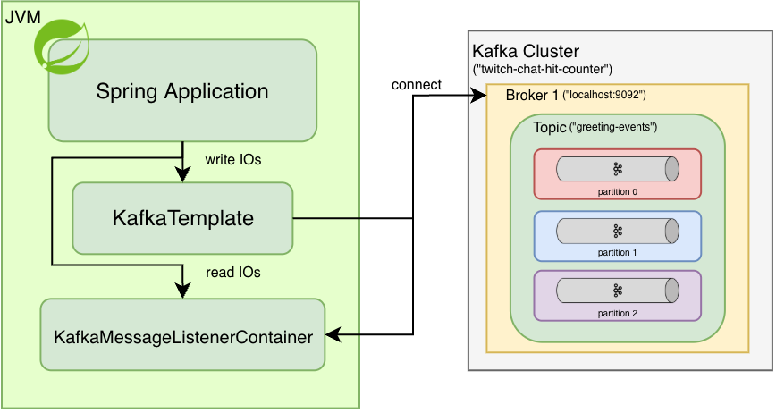
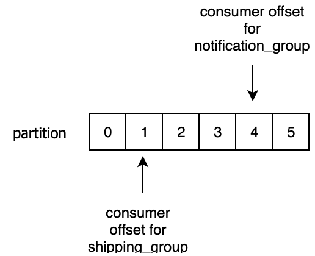

# Practical Backend Engineer
## Twitch Chat Hit Counter
## Module 2: Kafka
### Recommended Learning Materials
- [Official Apache Kafka Docs ](https://kafka.apache.org/intro)
- [Cloud Karafka's Kafka Overview ](https://www.cloudkarafka.com/blog/part1-kafka-for-beginners-what-is-apache-kafka.html)
- [Confluent's Kafka Overview ](https://docs.confluent.io/kafka/introduction.html)
- [Official Spring Boot Kafka Docs ](https://spring.io/projects/spring-kafka)
- [Baeldung's Spring Kafka Guide ](https://www.baeldung.com/spring-kafka)
- [GeeksForGeek's Spring Boot Kafka Guide ](https://www.geeksforgeeks.org/spring-boot-integration-with-kafka/)

<br>

## Overview
I highly recommend reading through the various **Kafka Overviews** + **Spring Kafka Integration Guides** above to learn: what Kafka is, how it works, and how to set it up in our Spring Boot project. 

Kafka, or some other sort of message/task queue, is used ubiquitously in large distributed systems in all tech companies dealing with large amounts of real-time/streaming/always-on data. Netflix, Youtube, TikTok, Uber, Facebook, or {INSERT_YOUR_FAVORITE_TECH_COMPANY_HERE} is expected to be **always on**, **always up**, **always working**, and **always available**, logging user impressions that powers all parts of a company's core business. Data is at the foundation of every company and as companies scale for 100s of millions of users, the goal is to collect/distribute the data to your consumers as fast as possible.<br>

### Some anecdotal examples:
#### Netflix
We use Apache Kafka as the go to real-time streaming message queue.

We have client teams recording Playback events to Kafka for all downstream teams to use. This records different events for all Netflix Users' watching activity within the application.
Many teams depend on this stream of data for core daily business functions.


#### Snapchat
At Snapchat, we had a partnership w/ Google Cloud Platform (GCP), so we used **Google PubSub**. It's not necessarily the same as Kafka but achieved roughly the same thing as a task queue.

On the **Ads Reporting Team** there, we did essentially the same thing that Netflix is doing to build our Realtime Reporting dashboards that powered the internal Ad Manager tool where managers can login to see how their ad campaigns were performing in real-time. 

I built the E2E Reach Insights Reporting Pipeline, streaming a daily 600+ billion events to aggregate unique reach stats up to different time-series (Minutely/Hourly/Daily/Lifetime) for all different dimensions (Age/Gender/DMA/region/etc). Some other pipelines have even more data, so your pipelines better scale and they better be fast/durable/fault-tolerant/stable/acurrate/all of the above.

#### Yelp
As an intern here, Apache Kafka was a core part of the company's real-time streaming pipelines. It's been years since I worked there, so I don't remember exactly the use cases but I know it was at the core of the data pipelines.

**TL;DR:** Read any Tech blogs from major tech companies and you'll see just how prevalent message log/queues are for streaming a large amount of events.

#

<ins>Kafka</ins> is a distributed, stateful message log, temporarily storing events for decoupled event processing.<br>
<ins>Kafka producers</ins> don't need to wait for any consumers to ack that they've received the data, producers simply write data to kafka topics, which durably store events for a configured period of time.<br>
<ins>Kafka consumers</ins> don't need to interact with the producers at all, they can just poll kafka topics to check if there's new data. Kafka is able to statefully track consumer group ids (offsets), so that consumers can read data while checkpointing where they are in the log of events so events.

Kafka has the ability to let you go back in time and to replay/backfill data by allowing consumers to start reading earlier offsets.

Kafka is not generally known to be used as a DB, think of it more as an **ephemeral holding area** where producers/consumers come and go as they please to write/read packages. Also, the higher the TTL, the more costly it becomes on your server maintenance costs to store events for 24 hours vs 365 days.

I normally see TTLs closer to 24 hours during normal operations, and extended up to 1-7 day(s) during operational issues to give teams a bit of buffer to deal with real production issues (time to **root cause**, **debug**, **deploy fixes**, and potentially **backfill** data).


#### Case Study
Imagine we work at Netflix, and support streaming on several playback devices (i.e.: Web, Mobile (iOS/Android), and TV).</br>
For this case study, let's just divide responsibility of teams by device.
- **iOS Team**: collects all user events from all iOS devices.
- **Android Team**: collects all user events from all android devices.
- **Web Team**: collects all user events from all Web devices.
- **TV Team**: collects all user events from TV devices.

Let's call ourselves the **UserEventing Team**, in charge of processing all events from the upstream client teams into **UserEvents** for all of our downstream teams to use as the **SoT** for all user data.

#### Downstream stakeholder(s):
- **Content Recommendation Team**: Analyzes user engagement data to see what a particular User likes to watch so we can better recommend shows/movies in their Top 10 list that are more tailored to their taste (i.e.: Rom Com, Horror, Thriller, Comedy).
- **User Growth Team**: Analyzes user growth with DAU/MAUs, maybe driving new initiatives like push notifications about new releases to encourage stale users to get back on the platform.
- **Ads Team**: Analyzes ad performance to show advertisers improved ROAS on their campaigns, driving increased ad spend to Netflix vs other streaming platforms.

This a just a hypothetical example of how teams power each other with data to help drive business growth by, first, gathering and making sense of the data, and then using the findings to drive new products or initiatives.

**TL;DR:**
In a large scale organization where many teams and systems are interconnected, decoupling as much as possible is essential to scalability. We can set up kafka topics as the intermediary link between teams where the producer will publish/write events to, and consumers will subscribe/read events from as they come in. Zero **direct** dependency between any two teams. **TeamA** doesn't need to wait on **TeamB** to confirm they received the data, and vice versa.

<br>

## File Structure
For `Module 2`, the below file structure are all the relevant files needed.

 twitch-chat-hit-counter/<br>
&nbsp;&nbsp;&nbsp;&nbsp;&nbsp;
 src/<br>
&nbsp;&nbsp;&nbsp;&nbsp;&nbsp;&nbsp;&nbsp;&nbsp;&nbsp;&nbsp;
 main/<br>
&nbsp;&nbsp;&nbsp;&nbsp;&nbsp;&nbsp;&nbsp;&nbsp;&nbsp;&nbsp;&nbsp;&nbsp;&nbsp;&nbsp;&nbsp;
 java/<br>
&nbsp;&nbsp;&nbsp;&nbsp;&nbsp;&nbsp;&nbsp;&nbsp;&nbsp;&nbsp;&nbsp;&nbsp;&nbsp;&nbsp;&nbsp;&nbsp;&nbsp;&nbsp;&nbsp;&nbsp;
 com.sonahlab.twitch_chat_hit_counter/<br>
&nbsp;&nbsp;&nbsp;&nbsp;&nbsp;&nbsp;&nbsp;&nbsp;&nbsp;&nbsp;&nbsp;&nbsp;&nbsp;&nbsp;&nbsp;&nbsp;&nbsp;&nbsp;&nbsp;&nbsp;&nbsp;&nbsp;&nbsp;&nbsp;&nbsp;
 config/<br>
&nbsp;&nbsp;&nbsp;&nbsp;&nbsp;&nbsp;&nbsp;&nbsp;&nbsp;&nbsp;&nbsp;&nbsp;&nbsp;&nbsp;&nbsp;&nbsp;&nbsp;&nbsp;&nbsp;&nbsp;&nbsp;&nbsp;&nbsp;&nbsp;&nbsp;&nbsp;&nbsp;&nbsp;&nbsp;&nbsp;
 KafkaConfig.java<br>
&nbsp;&nbsp;&nbsp;&nbsp;&nbsp;&nbsp;&nbsp;&nbsp;&nbsp;&nbsp;&nbsp;&nbsp;&nbsp;&nbsp;&nbsp;&nbsp;&nbsp;&nbsp;&nbsp;&nbsp;&nbsp;&nbsp;&nbsp;&nbsp;&nbsp;
 kafka/<br>
&nbsp;&nbsp;&nbsp;&nbsp;&nbsp;&nbsp;&nbsp;&nbsp;&nbsp;&nbsp;&nbsp;&nbsp;&nbsp;&nbsp;&nbsp;&nbsp;&nbsp;&nbsp;&nbsp;&nbsp;&nbsp;&nbsp;&nbsp;&nbsp;&nbsp;&nbsp;&nbsp;&nbsp;&nbsp;&nbsp;
 consumer/<br>
&nbsp;&nbsp;&nbsp;&nbsp;&nbsp;&nbsp;&nbsp;&nbsp;&nbsp;&nbsp;&nbsp;&nbsp;&nbsp;&nbsp;&nbsp;&nbsp;&nbsp;&nbsp;&nbsp;&nbsp;&nbsp;&nbsp;&nbsp;&nbsp;&nbsp;&nbsp;&nbsp;&nbsp;&nbsp;&nbsp;&nbsp;&nbsp;&nbsp;&nbsp;&nbsp;
 AbstractEventConsumer.java<br>
&nbsp;&nbsp;&nbsp;&nbsp;&nbsp;&nbsp;&nbsp;&nbsp;&nbsp;&nbsp;&nbsp;&nbsp;&nbsp;&nbsp;&nbsp;&nbsp;&nbsp;&nbsp;&nbsp;&nbsp;&nbsp;&nbsp;&nbsp;&nbsp;&nbsp;&nbsp;&nbsp;&nbsp;&nbsp;&nbsp;&nbsp;&nbsp;&nbsp;&nbsp;&nbsp;
 GreetingEventBatchConsumer.java<br>
&nbsp;&nbsp;&nbsp;&nbsp;&nbsp;&nbsp;&nbsp;&nbsp;&nbsp;&nbsp;&nbsp;&nbsp;&nbsp;&nbsp;&nbsp;&nbsp;&nbsp;&nbsp;&nbsp;&nbsp;&nbsp;&nbsp;&nbsp;&nbsp;&nbsp;&nbsp;&nbsp;&nbsp;&nbsp;&nbsp;&nbsp;&nbsp;&nbsp;&nbsp;&nbsp;
 GreetingEventConsumer.java<br>
&nbsp;&nbsp;&nbsp;&nbsp;&nbsp;&nbsp;&nbsp;&nbsp;&nbsp;&nbsp;&nbsp;&nbsp;&nbsp;&nbsp;&nbsp;&nbsp;&nbsp;&nbsp;&nbsp;&nbsp;&nbsp;&nbsp;&nbsp;&nbsp;&nbsp;&nbsp;&nbsp;&nbsp;&nbsp;&nbsp;
 producer/<br>
&nbsp;&nbsp;&nbsp;&nbsp;&nbsp;&nbsp;&nbsp;&nbsp;&nbsp;&nbsp;&nbsp;&nbsp;&nbsp;&nbsp;&nbsp;&nbsp;&nbsp;&nbsp;&nbsp;&nbsp;&nbsp;&nbsp;&nbsp;&nbsp;&nbsp;&nbsp;&nbsp;&nbsp;&nbsp;&nbsp;&nbsp;&nbsp;&nbsp;&nbsp;&nbsp;
 AbstractEventProducer.java<br>
&nbsp;&nbsp;&nbsp;&nbsp;&nbsp;&nbsp;&nbsp;&nbsp;&nbsp;&nbsp;&nbsp;&nbsp;&nbsp;&nbsp;&nbsp;&nbsp;&nbsp;&nbsp;&nbsp;&nbsp;&nbsp;&nbsp;&nbsp;&nbsp;&nbsp;&nbsp;&nbsp;&nbsp;&nbsp;&nbsp;&nbsp;&nbsp;&nbsp;&nbsp;&nbsp;
 GreetingEventProducer.java<br>
&nbsp;&nbsp;&nbsp;&nbsp;&nbsp;&nbsp;&nbsp;&nbsp;&nbsp;&nbsp;&nbsp;&nbsp;&nbsp;&nbsp;&nbsp;&nbsp;&nbsp;&nbsp;&nbsp;&nbsp;&nbsp;&nbsp;&nbsp;&nbsp;&nbsp;
 model/<br>
&nbsp;&nbsp;&nbsp;&nbsp;&nbsp;&nbsp;&nbsp;&nbsp;&nbsp;&nbsp;&nbsp;&nbsp;&nbsp;&nbsp;&nbsp;&nbsp;&nbsp;&nbsp;&nbsp;&nbsp;&nbsp;&nbsp;&nbsp;&nbsp;&nbsp;&nbsp;&nbsp;&nbsp;&nbsp;&nbsp;
 GreetingEvent.java<br>
&nbsp;&nbsp;&nbsp;&nbsp;&nbsp;&nbsp;&nbsp;&nbsp;&nbsp;&nbsp;&nbsp;&nbsp;&nbsp;&nbsp;&nbsp;&nbsp;&nbsp;&nbsp;&nbsp;&nbsp;&nbsp;&nbsp;&nbsp;&nbsp;&nbsp;
 rest/<br>
&nbsp;&nbsp;&nbsp;&nbsp;&nbsp;&nbsp;&nbsp;&nbsp;&nbsp;&nbsp;&nbsp;&nbsp;&nbsp;&nbsp;&nbsp;&nbsp;&nbsp;&nbsp;&nbsp;&nbsp;&nbsp;&nbsp;&nbsp;&nbsp;&nbsp;&nbsp;&nbsp;&nbsp;&nbsp;&nbsp;
 KafkaRestController.java<br>
&nbsp;&nbsp;&nbsp;&nbsp;&nbsp;&nbsp;&nbsp;&nbsp;&nbsp;&nbsp;&nbsp;&nbsp;&nbsp;&nbsp;&nbsp;
 resources/<br>
&nbsp;&nbsp;&nbsp;&nbsp;&nbsp;&nbsp;&nbsp;&nbsp;&nbsp;&nbsp;&nbsp;&nbsp;&nbsp;&nbsp;&nbsp;&nbsp;&nbsp;&nbsp;&nbsp;&nbsp;
 application.yml<br>
&nbsp;&nbsp;&nbsp;&nbsp;&nbsp;&nbsp;&nbsp;&nbsp;&nbsp;&nbsp;
 test/<br>
&nbsp;&nbsp;&nbsp;&nbsp;&nbsp;&nbsp;&nbsp;&nbsp;&nbsp;&nbsp;&nbsp;&nbsp;&nbsp;&nbsp;&nbsp;
 java/<br>
&nbsp;&nbsp;&nbsp;&nbsp;&nbsp;&nbsp;&nbsp;&nbsp;&nbsp;&nbsp;&nbsp;&nbsp;&nbsp;&nbsp;&nbsp;&nbsp;&nbsp;&nbsp;&nbsp;&nbsp;
 com.sonahlab.twitch_chat_hit_counter/<br>
&nbsp;&nbsp;&nbsp;&nbsp;&nbsp;&nbsp;&nbsp;&nbsp;&nbsp;&nbsp;&nbsp;&nbsp;&nbsp;&nbsp;&nbsp;&nbsp;&nbsp;&nbsp;&nbsp;&nbsp;&nbsp;&nbsp;&nbsp;&nbsp;&nbsp;
 config/<br>
&nbsp;&nbsp;&nbsp;&nbsp;&nbsp;&nbsp;&nbsp;&nbsp;&nbsp;&nbsp;&nbsp;&nbsp;&nbsp;&nbsp;&nbsp;&nbsp;&nbsp;&nbsp;&nbsp;&nbsp;&nbsp;&nbsp;&nbsp;&nbsp;&nbsp;&nbsp;&nbsp;&nbsp;&nbsp;&nbsp;
 KafkaConfigTest.java<br>
&nbsp;&nbsp;&nbsp;&nbsp;&nbsp;&nbsp;&nbsp;&nbsp;&nbsp;&nbsp;&nbsp;&nbsp;&nbsp;&nbsp;&nbsp;&nbsp;&nbsp;&nbsp;&nbsp;&nbsp;&nbsp;&nbsp;&nbsp;&nbsp;&nbsp;
 kafka/<br>
&nbsp;&nbsp;&nbsp;&nbsp;&nbsp;&nbsp;&nbsp;&nbsp;&nbsp;&nbsp;&nbsp;&nbsp;&nbsp;&nbsp;&nbsp;&nbsp;&nbsp;&nbsp;&nbsp;&nbsp;&nbsp;&nbsp;&nbsp;&nbsp;&nbsp;&nbsp;&nbsp;&nbsp;&nbsp;&nbsp;
 consumer/<br>
&nbsp;&nbsp;&nbsp;&nbsp;&nbsp;&nbsp;&nbsp;&nbsp;&nbsp;&nbsp;&nbsp;&nbsp;&nbsp;&nbsp;&nbsp;&nbsp;&nbsp;&nbsp;&nbsp;&nbsp;&nbsp;&nbsp;&nbsp;&nbsp;&nbsp;&nbsp;&nbsp;&nbsp;&nbsp;&nbsp;&nbsp;&nbsp;&nbsp;&nbsp;&nbsp;
 GreetingEventBatchConsumerTest.java<br>
&nbsp;&nbsp;&nbsp;&nbsp;&nbsp;&nbsp;&nbsp;&nbsp;&nbsp;&nbsp;&nbsp;&nbsp;&nbsp;&nbsp;&nbsp;&nbsp;&nbsp;&nbsp;&nbsp;&nbsp;&nbsp;&nbsp;&nbsp;&nbsp;&nbsp;&nbsp;&nbsp;&nbsp;&nbsp;&nbsp;&nbsp;&nbsp;&nbsp;&nbsp;&nbsp;
 GreetingEventConsumerTest.java<br>
&nbsp;&nbsp;&nbsp;&nbsp;&nbsp;&nbsp;&nbsp;&nbsp;&nbsp;&nbsp;&nbsp;&nbsp;&nbsp;&nbsp;&nbsp;&nbsp;&nbsp;&nbsp;&nbsp;&nbsp;&nbsp;&nbsp;&nbsp;&nbsp;&nbsp;&nbsp;&nbsp;&nbsp;&nbsp;&nbsp;
 producer/<br>
&nbsp;&nbsp;&nbsp;&nbsp;&nbsp;&nbsp;&nbsp;&nbsp;&nbsp;&nbsp;&nbsp;&nbsp;&nbsp;&nbsp;&nbsp;&nbsp;&nbsp;&nbsp;&nbsp;&nbsp;&nbsp;&nbsp;&nbsp;&nbsp;&nbsp;&nbsp;&nbsp;&nbsp;&nbsp;&nbsp;&nbsp;&nbsp;&nbsp;&nbsp;&nbsp;
 GreetingEventProducerTest.java<br>
&nbsp;&nbsp;&nbsp;&nbsp;&nbsp;&nbsp;&nbsp;&nbsp;&nbsp;&nbsp;&nbsp;&nbsp;&nbsp;&nbsp;&nbsp;&nbsp;&nbsp;&nbsp;&nbsp;&nbsp;&nbsp;&nbsp;&nbsp;&nbsp;&nbsp;&nbsp;&nbsp;&nbsp;&nbsp;&nbsp;
 rest/<br>
&nbsp;&nbsp;&nbsp;&nbsp;&nbsp;&nbsp;&nbsp;&nbsp;&nbsp;&nbsp;&nbsp;&nbsp;&nbsp;&nbsp;&nbsp;&nbsp;&nbsp;&nbsp;&nbsp;&nbsp;&nbsp;&nbsp;&nbsp;&nbsp;&nbsp;&nbsp;&nbsp;&nbsp;&nbsp;&nbsp;&nbsp;&nbsp;&nbsp;&nbsp;&nbsp;
 KafkaRestControllerTest.java<br>
&nbsp;&nbsp;&nbsp;&nbsp;&nbsp;&nbsp;&nbsp;&nbsp;&nbsp;&nbsp;&nbsp;&nbsp;&nbsp;&nbsp;&nbsp;&nbsp;&nbsp;&nbsp;&nbsp;&nbsp;&nbsp;&nbsp;&nbsp;&nbsp;&nbsp;
 PropertiesApplicationTest.java<br>

<br>

## Objective
<br>
**Module 2** is mostly about:
1. Setting up an HTTP request endpoint that will take a User submitted greeting
2. Convert the input fields into a `GreetingEvent`
3. PubSub the event through a kafka topic
4. Log the event to stdout for us to verify the event was read from kafka

<br>

## Setup Local Kafka Server
Start our local Kafka instance via Docker: [Kafka Quickstart ](https://kafka.apache.org/quickstart)<br>
1. Open and login to **Docker Desktop**
2. Get the Docker image:
    ```bash
    docker pull apache/kafka:4.1.0
    ```
3. Start the Kafka Docker container:
    ```bash
    docker run -p 9092:9092 apache/kafka:4.1.0
    ```

<br>

In **Docker**, you should now see the kafka container running locally.


<br>

In **Offset Explorer 3**, connect to our Kafka cluster running in Docker.
1. Input cluster configs:
   1. **Cluster name:** twitch-chat-hit-counter
   2. **Bootstrap servers:** localhost:9092
2. Click '**Test**' to verify that OE3 is able to connect to the Docker container
3. Double-click on the newly created cluster to connect to the instance

<br>

<br>

## Create Kafka Topic: `greeting-events`
1. Navigate to the _**Clusters/twitch-chat-hit-counter/Topics**_ folder
2. Click '+' to add a new kafka topic
3. Input kafka topic configs:
   1. **Topic name**: `greeting-events`<br>
   2. **Partition Count**: `3`<br>
   3. **Replica Count**: `1`
4. Select our kafka topic in **_Clusters/twitch-chat-hit-counter/Topics/greeting-events_**
5. Change the **Content Types** for the key and value from **'Byte Array'** → **'String'**, and save by clicking **Update**.

<br>

<br>

## Excercise 1: Configure Spring Kafka within our Application
<br>

> [!NOTE]
>
> **Relevant Files**<br>
> `application.yml` ─ our service's property file<br>

### Lesson: Autoconfiguration
> [!IMPORTANT]
>
> Autoconfiguration is a core aspect of Spring Boot.<br>
> _"Spring Boot’s auto-configuration feature is one of its standout functionalities, allowing developers to build applications with minimal boilerplate code"_
>
> Links:
> - [How Spring Boot Auto-Configuration Works [Medium] ](https://medium.com/@AlexanderObregon/how-spring-boot-auto-configuration-works-68f631e03948)<br>
> - [Understanding Auto-Configured Beans [Spring Docs] ](https://docs.spring.io/spring-boot/reference/features/developing-auto-configuration.html#features.developing-auto-configuration.understanding-auto-configured-beans)<br>
> - [Spring Boot Auto-Configuration [GeeksForGeeks] ](https://www.geeksforgeeks.org/java/spring-boot-auto-configuration/)<br>

Case Study:
Imagine I created a new revolutionary open source Database called **SonahDB**.

In order to connect to a generic SonahDB **cluster** you need:
1. server-location
2. username
3. password

Imagine I created a public open source Java Library that for all developers around the world to import into their project to use.<br>
Now say Alice is spins up her own **SonahDB**, and wants to connect to it so that she can store data on it.<br>
In Alice's application she would normally need to manually create some client to use in her project:
```java
@Bean
public SonahDbClient() {
    SonahDbClient client = new SonahDbClient(
            "localhost:1234",
            "aliceUsername",
            "aliceSecretPassword"
    );
}
```

This is where Spring Boot autoconfiguration becomes so powerful. Let's assume that for the open source Java Library I tell developers,
if you import my library into your project and if you provide me `spring.sonahDB.server-location`, `spring.sonahDB.username`, and `spring.sonahDB.password`
my library will create this `SonahDbClient` object on your behalf at runtime when you run your Spring Boot application.
And in the case where Alice neither creates the `SonahDbClient` herself or provide the 3 fields required, I will still build her the `SonahDbClient` object
but using some default values.

Alice's code never explicitly needs to create the `SonahDbClient`, she just defines the fields from a library's guidance and
can safely assume it works out of the box.

This is what Spring Boot's Autoconfiguration boils down to. For any library you pull in, you should read the documentation of a library to see if it supports autoconfiguration and also what fields you need to set,
meaning you just define some properties in your `application.yml` property file and when you run `./gradlew bootRun` you trust that
the libraries you depend on will build all the relevant Beans on your behalf. Less code and manual setup, for increased development velocity.

[KafkaAutoConfiguration.java ](https://docs.spring.io/spring-boot/api/java/org/springframework/boot/autoconfigure/kafka/KafkaAutoConfiguration.html) is the class that autoconfigures Kafka behind the scenes.
Spring Kafka library will build all the relevant Beans on our behalf, unless we:
1. Explicitly override the Beans ourselves
2. Disable a library from Autoconfiguration

Spring Kafka Autoconfiguration Lifecycle:


### Lesson: Spring Kafka Properties
This is a small list of properties I'm requiring you to set for this course.

| Property                                                                                                                                                                                                                                                             | Required?    | Role         | Supported/Example Values                                                                                     | Description                                                                                                                                    |
|----------------------------------------------------------------------------------------------------------------------------------------------------------------------------------------------------------------------------------------------------------------------|--------------|--------------|--------------------------------------------------------------------------------------------------------------|------------------------------------------------------------------------------------------------------------------------------------------------|
| `spring.kafka.bootstrap-servers`                                                                                                                                                                                                                                     | **Required** | **Both**     | i.e.: "host:port"                                                                                            | Specifies the Kafka broker(s) to connect to. No connection without it.                                                                         |
| `spring.kafka.consumer.group-id`                                                                                                                                                                                                                                     | **Required** | **Consumer** | i.e.: "applicationName-group-id-0"                                                                           | Defines the consumer group name. Kafka uses this to track message consumption. Multiple consumers with the same group ID share the message load. |
| `spring.kafka.consumer.`[auto-offset-reset ](https://docs.confluent.io/platform/current/installation/configuration/consumer-configs.html#auto-offset-reset)   | Optional     | **Consumer** | `latest` **(default)**<br>`earliest`<br> `none`                                                              | Controls where to start reading if no offset is committed. Default: `latest`.                                                                  |
| `spring.kafka.consumer.`[enable-auto-commit ](https://docs.confluent.io/platform/current/installation/configuration/consumer-configs.html#enable-auto-commit) | Optional     | **Consumer** | `true` **(default)**<br>`false`                                                                              | Whether to auto-commit offsets.<br>Default: `true`. Use `false` for manual acks.                                                               |
| `spring.kafka.consumer.`[key-deserializer ](https://docs.confluent.io/platform/current/installation/configuration/consumer-configs.html#key-deserializer)     | **Required** | **Consumer** | https://kafka.apache.org/21/javadoc/org/apache/kafka/common/serialization/Deserializer.html                  | Converts incoming kafka message key back to object (e.g., `String`).<br>Must match key-serializer on producer.                                 |
| `spring.kafka.consumer.`[value-deserializer ](https://docs.confluent.io/platform/current/installation/configuration/consumer-configs.html#value-deserializer) | **Required** | **Consumer** | https://kafka.apache.org/21/javadoc/org/apache/kafka/common/serialization/Deserializer.html                  | Converts incoming kafka message value back to object (e.g., `String`).<br>Must match value-serializer on producer.                                |
| `spring.kafka.listener.`[ack-mode ](https://docs.spring.io/spring-kafka/api/org/springframework/kafka/listener/ContainerProperties.AckMode.html)              | Optional     | **Consumer** | `BATCH` **(default)**<br>`COUNT`<br>`COUNT_TIME`<br>`MANUAL`<br>`MANUAL_IMMEDIATE`<br>`RECORD`<br>`TIME`<br> | The offset commit behavior enumeration.                                                                                                        |
| `spring.kafka.producer.`[key-serializer ](https://docs.confluent.io/platform/current/installation/configuration/producer-configs.html#key-serializer)         | **Required** | **Producer** | https://kafka.apache.org/0102/javadoc/org/apache/kafka/common/serialization/Serializer.html                  | Converts produced kafka message key to object (e.g., `String`).<br>Must match key-deserializer on consumer.                                       |
| `spring.kafka.producer.`[value-serializer ](https://docs.confluent.io/platform/current/installation/configuration/producer-configs.html#value-serializer)     | **Required** | **Producer** | https://kafka.apache.org/0102/javadoc/org/apache/kafka/common/serialization/Serializer.html                  | Converts produced kafka message value to object (e.g., `String`).<br>Must match value-deserializer on consumer.                                   |
- List of [Spring Kafka supported fields ](https://gist.github.com/geunho/77f3f9a112ea327457353aa407328771)<br>

### Lesson 1: Bootstrap Servers (a.k.a Brokers' address)
> [!IMPORTANT]
>
> Couple of good reads on Kafka Consumer Groups:
> - [Kafka Broker ](https://www.cloudkarafka.com/blog/part1-kafka-for-beginners-what-is-apache-kafka.html)
> - [What is a consumer group in Kafka ](https://codingharbour.com/apache-kafka/what-is-a-consumer-group-in-kafka/)
> - [Configuring Kafka Consumer Group Ids ](https://www.confluent.io/blog/configuring-apache-kafka-consumer-group-ids/)

<br>
`spring.kafka.bootstrap-servers` is basically a list of addresses of the actual Kafka cluster brokers for applications to connect to.

Example:
```yaml
spring:
  kafka:
    bootstrap-servers:
      b-1.clustername1.y15j9n.c2.kafka.us-west-1.amazonaws.com:9098, b-2.clustername1.y15j9n.c2.kafka.us-west-1.amazonaws.com:9098
```

These are sample bootstrap servers if I had used **Amazon's MSK** (Managed Streaming for Apache Kafka) to spin up a fully manager Kafka cluster hosted by AWS.
As long as my application has an AWS IAM role with permissions to connect to my AWS MSK cluster, my application should be able to connect with the brokers at these addresses.


### Lesson 2: Consumer Group Id
<br>
<br>


The easiest way to think about group-id is with **Super Mario World**.<br>
When you play **Super Mario World**, pass a checkpoint, and die, you would respawn at the latest checkpoint.
This group-id is managed by Kafka's brokers to manage, for each partition, where a certain group-id is currently at within the partition's log.<br>
The consumer must read events in order of the queue and **ACK** messages, telling the Kafka brokers, _"Hey I have finished processing messages X to Y, update my group-id checkpoint"_.

### Example 1:
Say we have 100 messages spread across 2 partitions.
```
Partition 1: [0, 1, 2, ..., 50]
Partition 2: [0, 1, 2, ..., 50]
```

Say downstream **Team A** has a **group-id=teamA-group-id**, and their application has 2 consumers (1 consumer per partition).<br>
Say downstream **Team B** has a **group-id=teamB-group-id**, and their application has 2 consumers (1 consumer per partition).<br>

Assume **Team A** is able to read all 100 messages from a kafka topic.<br>
```
Partition 1: [0, 1, 2, ..., 50]
                             └─ teamA-group-id
Partition 2: [0, 1, 2, ..., 50]
                             └─ teamA-group-id
```

Assume **Team B** is able to read 30 events from Partition 1, and 20 events from Partition 2.
```
Partition 1: [0, 1, 2, ................, 30, 31, ..., 50]
                                          └─ teamB-group-id
Partition 2: [0, 1, 2, ..., 20, 21, ..., 30, 31, ..., 50]
                             └─ teamB-group-id
```

Assume **Team B** servers batch read the next set of events:
- 20 events left in Partition 1
- 30 events left in Partition 2

Say **Team B's** servers have picked up the messages from Kafka, done some application logic processing, wrote records to some DB, and right before they **ACK** the messages back to Kafka's brokers that they are done, their server's crash.<br>
Because the consumers never ACK'ed the messages, Kafka's brokers will not know to commit/checkpoint/update the group-id to the latest message offset. When **Team B's** service spins up again, they basically start back from the latest commited checkpoints.<br> 

The final state for both consumer groups at the point in which **Team A** is fully caught up and **Team B** has just crashed would be:
```
Partition 1: [0, 1, 2, ................, 30, 31, ..., 50]
                                          │            └─ teamA-group-id
                                          └─ teamB-group-id
Partition 2: [0, 1, 2, ..., 20, 21, ..., 30, 31, ..., 50]
                             │                         └─ teamA-group-id
                             └─ teamB-group-id
```

Group Ids should be unique per Consumer group. The fact that **Team A** is fully caught up has 0 impact on **Team B's** ability to catch up. The fact that **Team B's** service crashed has 0 impact on **Team A's** ability to read.<br>
When Team B is able to get their service back up and running they will need to pick up where Kafka's brokers have last recorded a successful commit.<br>

There's a lot of Kafka properties to configure consumers how as needed, but Spring Kafka also has default settings.<br>
- `spring.kafka.consumer.group-id` — is the unique group-id "checkpoint" for a Consumer.
- `spring.kafka.consumer.auto-offset-reset` — is the behavior on **WHERE** consumers start reading from a Kafka log if no group-id commit exists.<br>
    > ```
    > partition0: [0, 1, 2, ..., 99] (Assume no prior commit for our group-id)
    >              │              └─ latest
    >              └─ earliest
    > ```
    > If there's 100 messages in a partition and our consumer has never read from the topic before, these are how reading events is behaved:
    > - `latest` (default): consumer starts reading from latest kafka message (100th message)
    > - `earliest`: consumer starts reading from the earliest kafka message (1st message)
    > - `none`: throw exception to the consumer if no previous offset is found for the consumer’s group
- `spring.kafka.consumer.enable-auto-commit` — If true the consumer’s offset will be periodically committed in the background. False gives more control to developers.
- `spring.kafka.listener.ack-mode` — offset commit behavior. MANUAL gives Listener (Consumer) responsibility for ACK'ing


### Lesson 3: Serializers/Deserializers
<br>

- `spring.kafka.producer.key-serializer`/`spring.kafka.producer.value-serializer`
- `spring.kafka.consumer.key-deserializer`/`spring.kafka.consumer.value-deserializer`


### Task 1: Spring Kafka Producer/Consumer properties
In `application.yml`, set the **Spring Kafka** properties according to the requirements below.

There are many more configs to control your Kafka application logic, but you don't need all of them if you don't have a specific use-case in mind. I've added the properties that I think are important for any application.

#### Requirements:
1. **bootstrap-server**: Set it to the default bootstrap-server [`localhost:9092` ](https://github.com/spring-projects/spring-boot/blob/2e52c3c35e0bd44ec35dceaeaed1737905a00196/module/spring-boot-kafka/src/main/java/org/springframework/boot/kafka/autoconfigure/KafkaProperties.java#L71)
2. **group-id**: Set it to follow this format `{application_name}-group-id-{number}`
3. **auto-offset-reset**: Set it to `earliest`
4. **enable-auto-commit**: Set it to `true` so we have full control in processing/ack'ing each message
5. **key-serializer/value-serializer**: Set the correct class path to write kafka messages as **<K (String), V (ByteArray)>** pairs
6. **key-deserializer/value-deserializer**: Set the correct class path to read kafka messages as **<K (String), V (ByteArray)>** pairs
7. **ack-mode**: Set it `MANUAL` so we have full control over acking the messages in our Listener consumer functions.

#

### Testing
- [ ] Open `PropertiesApplicationTest.java` ─ already implemented, testing each property against the expected values we want for this course.
- [ ] Remove `@Disabled` in `PropertiesApplicationTest.java` for the test method: `springKafkaConfigsTest()`
- [ ] Open `KafkaConfigTest.java` ─ already implemented, testing the autoconfigured Beans that Spring Kafka injects for us.
- [ ] Remove `@Disabled` in `KafkaConfigTest.java` for the test method: `testKafkaTemplateConfig()` and `kafkaListenerContainerFactory_beanTest()`
- [ ] Test with:
    ```shell
    ./gradlew test --tests "*" -Djunit.jupiter.tags=Module2
    ```

<br>

#

### Task 2: Set topic name property: `greeting-events`
In `application.yml`, set the property for the `greeting-events` topic we just created in **Offset Explorer 3**.

The updated `application.yml` should look like this:
```yaml
spring:
  ...

twitch-chat-hit-counter:
  kafka:
    greeting-topic:
      greeting-events
```

#

### Testing
- [ ] Open `PropertiesApplicationTest.java` ─ already implemented, testing each property against the expected values we want for this course.
- [ ] Remove `@Disabled` in `PropertiesApplicationTest.java` for the test method: `kafkaGreetingTopicNameTest()`
- [ ] Test with:
    ```shell
    ./gradlew test --tests "*" -Djunit.jupiter.tags=Module2
    ```

<br>

## Exercise 2: Kafka Producer
<br>

> [!NOTE]
>
> **Relevant Files**:<br>
> `GreetingEvent.java` ─ data model to encapsulate a simple greeting.</br> 
> `GreetingEventProducer.java` ─ the class that publishes `GreetingEvent` objects to our dedicated kafka topic `greeting_topic`

<br>

### Task 1: AbstractEventProducer
Our `AbstractEventProducer.java` is the parent class for writing any type of Event object into a kafka topic.
Core principle of good programming: D.R.Y (Don't Repeat Yourself). All child classes that `extend AbstractEventProducer`,
don't need to worry about the kafka topic write logic once it's defined in the parent.

In `AbstractEventProducer.java`, implement:
- the constructor: `public AbstractEventProducer()`
- `public boolean publish(String key, T event)`. The method expects a `String key` and a generic `T event`, and writes a new message into the kafka topic.<br>
Return the boolean status of the kafka topic write operation.

> [!TIP]
>
> Get familiar with the [KafkaTemplate ](https://docs.spring.io/spring-kafka/api/org/springframework/kafka/core/KafkaTemplate.html)
> class' source code ─ this class handles all IO operations to/from kafka topics.<br>
> In the source code, you will find this helpful method: `kafkaTemplate.send(String topic, @Nullable V data)`.

**Requirements:**
1. Inject the autoconfigured `KafkaTemplate` Bean into the constructor of `AbstractEventProducer.java`.
2. Write the topic message to the `topicName()` Kafka topic. (Assume this method is already implemented)
3. Write the topic message key as a String (should be a NO-OP since our `key` is already a String)
4. Write the topic message value as a ByteArray (you're given a generic POJO event but need to convert it to ByteArray)

<br>

#

### Task 2: GreetingEventProducer
In `GreetingEventProducer.java`, implement:
- the constructor: `public GreetingEventProducer.java`
- `protected String topicName()`

**Requirements**:
1. Inject the same `KafkaTemplate` Bean into the constructors of all subclass of `AbstractEventProducer.java`. (`GreetingEventProducer.java`, `TwitchChatEventProducer.java`)
2. Inject the `greeting-events` topic name property defined in `application.yml` into the constructor of `GreetingEventProducer.java`, and overwrite the `protected String topicName()` to return that injected topic name.

<br>

### Example 1:
> **Input**:<br>
> ```java
> GreetingEventProducer producer = new GreetingEventProducer(...);
> String eventId = "UUID1";
> GreetingEvent event = new GreetingEvent(eventId, "Alice", "Bob", "Hi Bob, I'm Alice!");
> boolean output1 = producer.publish(eventId, event);
> 
> String eventId2 = "UUID2";
> GreetingEvent event2 = new GreetingEvent(eventId2, "Charlie", "David", "Yo.");
> boolean output2 = producer.publish(eventId2, event2);
> ```
> **Output1**: <span style="color:#0000008c">true<br></span>
> **Output2**: <span style="color:#0000008c">true<br></span>

#

### Testing
- [ ] Open `GreetingEventProducerTest.java` ─ already implemented test cases with the example(s) above.
- [ ] Remove `@Disabled` in `GreetingEventProducerTest.java`
- [ ] Test with:
    ```shell
    ./gradlew test --tests "*" -Djunit.jupiter.tags=Module2`
    ```

<br>

#

### Task 3: Kafka API
<br>

> [!NOTE]
>
> **Relevant Files**<br>
> `KafkaRestController.java` ─ REST controller to handle `POST /api/kafka/publishGreetingEvent`.

In `KafkaRestController.java`, implement:
- the constructor: `public KafkaRestController()`
- `public Boolean produceKafkaGreetingEvent(@RequestParam String sender, @RequestParam String receiver, @RequestParam String message)` endpoint to trigger `GreetingEventProducer.publish(...);`

**Requirements:**
1. Inject the `GreetingEventProducer` into the constructor
2. Generate a unique `eventId` ([UUID ](https://www.baeldung.com/java-uuid)) per greeting request
3. Create a `GreetingEvent` using the: generated `eventId` and the user input parameters
4. Call `GreetingEventProducer.publish()` to handle actual publishing of the kafka message

<br>

### Example 1:
```bash
$ curl -X POST "http://localhost:8080/api/kafka/publishGreetingEvent?sender=Alice&receiver=Bob&message=Hi%20Bob%2C%20I%27m%20Alice%21"
true

$ curl -X POST "http://localhost:8080/api/kafka/publishGreetingEvent?sender=Charlie&receiver=David&message=Yo."
true
````

#

### Testing
- [ ] Open `KafkaRestControllerTest.java` ─ already implemented test cases with the example(s) above.
- [ ] Remove `@Disabled` in `KafkaRestControllerTest.java`
- [ ] Test with:
    ```shell
    ./gradlew test --tests "*" -Djunit.jupiter.tags=Module2
    ```

#

### Integration Testing
- [ ] Run the application:
    ```shell
    ./gradlew bootRun
    ```
- [ ] Go to: [Swagger UI ](http://localhost:8080/swagger-ui/index.html)<br>
- [ ] Play around with **Kafka API**: `POST /api/kafka/publishGreetingEvent`
- [ ] Check **Offset Explorer 3** to see that your GreetingEvent is actually published to your kafka topic
<br>

<br>

#

### Exercise 3: Single Message Kafka Consumer
<br>

> [!NOTE]
>
> **Relevant Files**<br>
> `application.yml` ─ our service's property file<br>
> `GreetingEvent.java` ─ data model to encapsulate a simple greeting.<br>
> `AbstractEventConsumer.java` ─ the abstract class that defines the way all event consumers should act.<br>
> `GreetingEventConsumer.java` ─ the class that subscribes to our `greeting_event` kafka topics to read `GreetingEvent` objects

#

### Task 1: AbstractEventConsumer
Our `AbstractEventConsumer.java` is the parent class for reading any type of Event object from a kafka topic.
Core principle of good programming: D.R.Y (Don't Repeat Yourself). All child classes that `extend AbstractEventConsumer`,
don't need to worry about the kafka topic read logic once it's defined in the parent. They will only focus on the core logic that may differ between different consumers.

In `AbstractEventConsumer.java`, implement:
- the constructor: `public AbstractEventConsumer()`
- `protected T convertRecordToEvent(ConsumerRecord<String, byte[]> record)`: this method will convert a generic `ConsumerRecord<String, byte[]> record` value from a `byte[]` → a generic class `T` event.
- `public void processMessage(ConsumerRecord<String, byte[]> record, Acknowledgment ack)`: The method will be called once our container picks up a new kafka record.
  - Convert the raw record back to a generic `T event`

**Requirements:**


<br>

#

### Task 2: GreetingEventConsumer
In `GreetingEventConsumer.java`, implement `public void processMessage(ConsumerRecord<String, byte[]> record, Acknowledgment ack)`.

The main goal for now is to simply **log or print** the kafka message that was read from the kafka topic to **stdout** (our application logs).

> [!IMPORTANT]
>
> You will need to add the [@KafkaListener ](https://docs.spring.io/spring-kafka/reference/kafka/receiving-messages/listener-annotation.html) annotation above the `processMessage(...)` method.
> 
> Properties required: `topics`<br>

### Example 1:
> **Input**:<br>
> ```java
> GreetingEventConsumer consumer = new GreetingEventConsumer(...);
> // Assume kafka has these 3 events:
> // 1. new GreetingEvent("id1", "Alice", "Bob", "Hello, Bob!")
> // 2. new GreetingEvent("id2", "Bob", "Charlie", "Good morning, Charlie!")
> // 3. new GreetingEvent("id3", "Eve", "Frank", "Hi Frank, how are you?")
> consumer.processMessage(...); // processes 1st GreetingEvent
> consumer.processMessage(...); // processes 2nd GreetingEvent
> consumer.processMessage(...); // processes 3rd GreetingEvent
> ```
> **stdout**:<br>
> ```
> INFO GreetingEventConsumer: Received event=GreetingEvent[eventId=UUID1, sender=Alice, receiver=Bob, message=Hello, Bob!]
> INFO GreetingEventConsumer: Received event=GreetingEvent[eventId=UUID2, sender=Bob, receiver=Charlie, message=Good morning, Charlie!]
> INFO GreetingEventConsumer: Received event=GreetingEvent[eventId=UUID3, sender=Eve, receiver=Frank, message=Hi Frank, how are you?]
> ```

#

### Testing
- [ ] Open `GreetingEventConsumerTest.java` ─ already implemented test cases with the example(s) above.
- [ ] Remove `@Disabled` in `GreetingEventConsumerTest.java`
- [ ] Test with:
    ```shell
    ./gradlew test --tests "*" -Djunit.jupiter.tags=Module2`
    ```

#

### Integration Testing
- [ ] Run the application:
    ```shell
    ./gradlew bootRun
    ```
- [ ] Go to: [Swagger UI ](http://localhost:8080/swagger-ui/index.html)<br>
- [ ] Play around with **Kafka API**: `POST /api/kafka/publishGreetingEvent`
- [ ] In **Offset Explorer 3**, validate your `GreetingEvent` is actually published to the kafka topic
- [ ] Verify application **stdout** logs are actually receiving the newly written kafka records

#

### Lesson: Input/Output (IO) Operations
<br>
_Quick overview on what happens when our application calls read/write IOs to a server.<br>_

Write IO:
> → Microservice (**client**) tells Data Center (**server**) to store data to persistent storage.<br>
> → Data Center stores data in server and responds to the client who made the request with a success/fail response.

Read IO:
> → Microservice (**client**) asks Data Center (**server**) to fetch some data.<br>
> → Data Center reads data from persistent storage and responds to the client with the data.

#### Case Study
Let's assume all client machines are running in California and all server machines are running in New York.<br>
Meaning each request/response must travel round-trip across the US network for a single call. (CA→NY→CA).<br>

**Team A** is in charge of streaming data for **Team B** to use downstream. So **Team A** writes data to the server running in NY.<br>
**Team B** will read data from the server in NY.

Now, say we need to support high QPS traffic and that **Team B** only has 1 available machine.<br>
Instead of having the machine read 1 event at a time (travelling from CA→NY→CA per call), we should optimize the **# of IO calls** we dispatch from Client→Server.<br>
Each call in this case study will incur a high latency because the requester is in CA and the server is in NY. The distance the data packets need to travel doesn't happen instantaneously.<br>
Therefore, in general, we should always try to limit our IO calls when possible. 

_**Instead of Team B's machine reading 1 event at a time (Option 1), what would happen if Team B's machine read 500 events at a time (Option 2)?**_

How many read IOs would need to be issued to read 1M kafka events?<br>
- Option 1: 1,000,000 events / 1 event(s) per read IO = 1,000,000 read IOs
- Option 2: 1,000,000 events / 500 event(s) per read IO = 2,000 read IOs

In other words, instead of travelling between CA/NY **1,000,000x**, we only need to make the trip **2,000x**.

This simple extreme example shows the benefit of introducing batch operations in your application on read/writes.<br>

**This brings us to the next exercise, creating a Batch Consumer.**

#

### Exercise 4: BATCH Message Kafka Consumer
<br>

Spring Kafka autoconfigures `KafkaTemplate` and `ConcurrentKafkaListenerContainerFactory` for us. If Spring sees that the developer doesn't set a field, it usually uses _some_ default value.
If we take a look at the default
[Listener ](https://github.com/spring-projects/spring-boot/blob/2e52c3c35e0bd44ec35dceaeaed1737905a00196/module/spring-boot-kafka/src/main/java/org/springframework/boot/kafka/autoconfigure/KafkaProperties.java#L971)
object, you can see that the default is set to `SINGLE`, meaning the default `ConcurrentKafkaListenerContainerFactory` will process one event at a time.
We want to create a consumer that will poll and batch multiple records at once.

Spring Kafka autconfiguration is helpful for setting up some default/quick setup, but as an application's use cases evolve and expand,
it's up to developers to tailor Beans further than what autoconfigurations usually allow for. So we will need to setup our own `ConcurrentKafkaListenerContainerFactory` explicitly for the batch consumer.

### Task 1: Configure application.yml
What properties differ between the autconfigured `ConcurrentKafkaListenerContainerFactory kafkaListenerContainerFactory` we have vs. a new `ConcurrentKafkaListenerContainerFactory batchKafkaListenerContainerFactory` we'd need to handle the batch consumer?
```yaml
# kafkaListenerContainerFactory
spring:
  kafka:
    bootstrap-servers: localhost:9092
    consumer:
      group-id: twitch-chat-hit-counter-group-id-X
      auto-offset-reset: earliest
      enable-auto-commit: false
      key-deserializer: org.apache.kafka.common.serialization.StringDeserializer
      value-deserializer: org.apache.kafka.common.serialization.ByteArrayDeserializer
    producer:
      key-serializer: org.apache.kafka.common.serialization.StringSerializer
      value-serializer: org.apache.kafka.common.serialization.ByteArraySerializer
    listener:
      type: SINGLE # property is not set in our application.yml because it's the default setting used by Spring Kafka
      ack-mode: MANUAL

# batchKafkaListenerContainerFactory
spring:
  kafka:
    bootstrap-servers: localhost:9092
    consumer:
      group-id: twitch-chat-hit-counter-group-id-batch-X # This field should be different from the single consumer group-id
      auto-offset-reset: earliest
      enable-auto-commit: false
      key-deserializer: org.apache.kafka.common.serialization.StringDeserializer
      value-deserializer: org.apache.kafka.common.serialization.ByteArrayDeserializer
    producer:
      key-serializer: org.apache.kafka.common.serialization.StringSerializer
      value-serializer: org.apache.kafka.common.serialization.ByteArraySerializer
    listener:
      type: BATCH # This field should be different from the single consumer listener.type default to enable the batch listener
      ack-mode: MANUAL
```

The fields that should differ between these Beans are the `spring.kafka.consumer.group-id` and `spring.kafka.listener.type`.
If we overwrite any of these fields, it'll affect the autconfigured single consumer so we will define these differing properties in some other properties.

**Requirements:**
1. `twitch-chat-hit-counter.kafka.batch-consumer.group-id`: {application_name}-group-id-batch-{num}
2. `twitch-chat-hit-counter.kafka.batch-consumer.listener.type`: BATCH

#

### Testing
- [ ] Open `PropertiesApplicationTest.java` ─ already implemented, testing that the two requirements above are met.
- [ ] Remove `@Disabled` in `PropertiesApplicationTest.java` for the test method(s): `kafkaBatchConfigsTest()`
- [ ] Test with:
    ```shell
    ./gradlew test --tests "*" -Djunit.jupiter.tags=Module2
    ```

#

### Task 2: Kafka BATCH Consumer Bean
Because of Spring Kafka's autoconfiguration we were able to (with no manual set up) use the:
- `KafkaTemplate kafkaTemplate` used by the EventProducer class
- `ConcurrentKafkaListenerContainerFactory kafkaListenerContainerFactory` used by the Single EventConsumer class

Now we need to create a new `@Bean ConcurrentKafkaListenerContainerFactory` named **batchKafkaListenerContainerFactory** for our Batch EventConsumer class.

In `KafkaConfigs.java`, implement `public ConcurrentKafkaListenerContainerFactory<String, byte[]> batchKafkaListenerContainerFactory()` to be exactly the same as the autconfigured `kafkaListenerContainerFactory`,
with the two changes being that the batchKafkaListenerContainerFactory's `group-id` and `listener.type` are what's defined in the `application.yml`.

**Requirements:**
- Inject the autconfigured `ConsumerFactory consumerFactory` into the method signature
- Inject the `group-id` property defined in the previous task into the method signature
- Inject the `listener.type` property defined in the previous task into the method signature
- Copy over the consumerFactory's properties to a new map and replace the `group-id` using the group-id defined for the Batch Consumer
- Create a new instance of a `ConsumerFactory` and use the new property map as the base
- Create a new instance of a `ConcurrentKafkaListenerContainerFactory` and .setConsumerFactory() using the newly created ConsumerFactory
- Set the `factory.setListener(true/false)` depending on the value of the listenerType
- Set the `factory.getContainerProperties().setAckMode()` to MANUAL (as this property is not copied over in the ConsumerFactory properties)

#

### Testing
- [ ] Open `KafkaConfigTest.java` ─ already implemented, testing a new @Bean named `batchKafkaListenerContainerFactory` is properly configured with different `group-id` and `listener.type`
- [ ] Remove `@Disabled` in `KafkaConfigTest.java` for the test method(s): `batchKafkaListenerContainerFactory_beanTest()`
- [ ] Test with:
    ```shell
    ./gradlew test --tests "*" -Djunit.jupiter.tags=Module2
    ```

#

### Task 3: AbstractEventConsumer
In `AbstractEventConsumer.java`, implement `public void processMessages(List<ConsumerRecord<String, byte[]>> records, Acknowledgment ack)`
which accepts a `List<ConsumerRecord<String, byte[]>> records` to process. This will be invoked for any Batch consumers we want to define.

**Requirements:**
1. Process all the raw kafka records and convert them back to a generic `T event` using the already implemented `convertRecordToEvent()`
2. Aggregate the `T event` into a list
3. Log the events to _stdout_

<br>

#

### Task 4: BatchGreetingEventConsumer
In `GreetingEventBatchConsumer.java`, implement:
- `protected EventType eventType()`
- `protected Class<GreetingEvent> eventClass()`
- `public void processMessages(List<ConsumerRecord<String, byte[]>> records, Acknowledgment ack)`: KafkaListener + super() invocation

This task will be nearly identical with the previous `GreetingEventConsumer.java`.

### Example 1:
> **Input**:<br>
> ```java
> GreetingEventConsumer consumer = new GreetingEventConsumer(...);
> // Assume kafka has these 3 events:
> // 1. new GreetingEvent("id1", "Alice", "Bob", "Hello, Bob!")
> // 2. new GreetingEvent("id2", "Bob", "Charlie", "Good morning, Charlie!")
> // 3. new GreetingEvent("id3", "Eve", "Frank", "Hi Frank, how are you?")
> consumer.processMessage(List.of(kafkaRecord1, kafkaRecord2, kafkaRecord3)); // processes the 3 kafka records at once
> ```
> **std**:<br>
> ```
> INFO GreetingEventBatchConsumer: Received 3 events in the batch, events=[
>     GreetingEvent[eventId=UUID1, sender=Alice, receiver=Bob, message=Hello, Bob!],
>     GreetingEvent[eventId=UUID2, sender=Bob, receiver=Charlie, message=Good morning, Charlie!],
>     GreetingEvent[eventId=UUID3, sender=Eve, receiver=Frank, message=Hi Frank, how are you?]
> ]
> ```

#

### Testing
- [ ] Open `GreetingEventBatchConsumerTest.java` ─ already implemented test cases with the example(s) above.
- [ ] Remove `@Disabled` in `GreetingEventBatchConsumerTest.java`
- [ ] Test with:
    ```shell
    ./gradlew test --tests "*" -Djunit.jupiter.tags=Module2`
    ```

#

### Integration Testing
- [ ] Try to have multiple kafka events already stored in your kafka topic
- [ ] Run the application:
    ```shell
    ./gradlew bootRun
    ```
[//]: # (- [ ] Go to: [Swagger UI ]&#40;http://localhost:8080/swagger-ui/index.html&#41;<br>)
[//]: # (- [ ] Play around with **Kafka API**: `POST /api/kafka/publishGreetingEvent`)
[//]: # (- [ ] Check **Offset Explorer 3** to see that your GreetingEvent is actually published to our kafka topic)
- [ ] Verify application **stdout** logs to see the consumer is actually processing multiple events in a single `processMessages()` call

#
