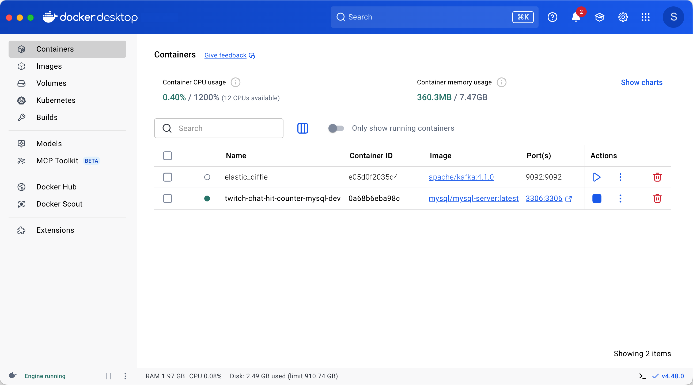
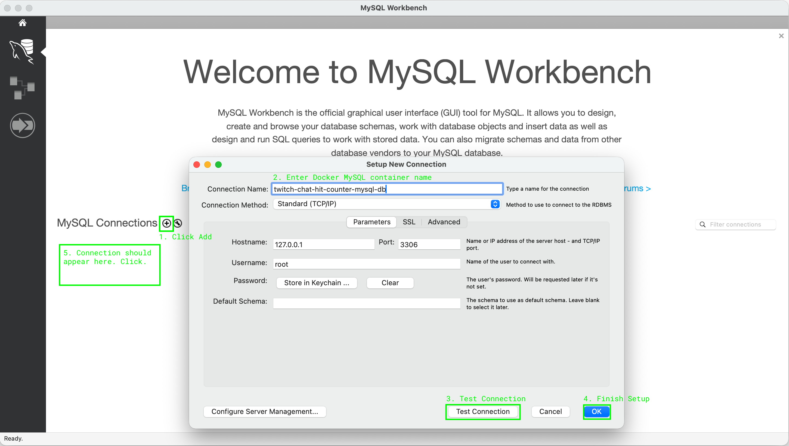
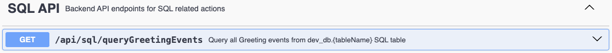

# Practical Backend Engineer
## Twitch Chat Hit Counter

## Module 3: SQL

[//]: # (TODO)
#### Recommended Learning Materials
- https://dev.mysql.com/downloads/workbench/

## Overview
[//]: # (TODO)
Now we’re foraying into the land of databases.

SQL Databases, a.k.a. Relational DataBase Management System (RDBMS), a.k.a. the OG database.
SQL DBs will always be used no matter where you go, even with the rise of popularity in NoSQL databases. The foundation of SQL is so well established, many query engines are heavily incentivized to support SQL to query data.

The amount of SQL queries I run on a daily basis is very, very high.
At Snapchat, I would run SQL queries via:
- MySQLWorkbench on top of our Google Cloud SQL tables
- Google BigQuery on top of our Google Bigtables (NoSQL)

At Netflix, I run SQL queries via:
- SparkSQL on top of our Apache Iceberg tables
- CQL (looks pretty much like SQL) on top of our Apache Cassandra tables

This course won’t dive too deeply into SQL queries, we will instead be focusing on setting up and populating our own SQL db.

<br>

## File Structure
For `Module 3`, the below file structure are all the relevant files needed.

 twitch-chat-hit-counter/<br>
&nbsp;&nbsp;&nbsp;&nbsp;&nbsp;
 src/<br>
&nbsp;&nbsp;&nbsp;&nbsp;&nbsp;&nbsp;&nbsp;&nbsp;&nbsp;&nbsp;
 main/<br>
&nbsp;&nbsp;&nbsp;&nbsp;&nbsp;&nbsp;&nbsp;&nbsp;&nbsp;&nbsp;&nbsp;&nbsp;&nbsp;&nbsp;&nbsp;
 java/<br>
&nbsp;&nbsp;&nbsp;&nbsp;&nbsp;&nbsp;&nbsp;&nbsp;&nbsp;&nbsp;&nbsp;&nbsp;&nbsp;&nbsp;&nbsp;&nbsp;&nbsp;&nbsp;&nbsp;&nbsp;
 com.sonahlab.twitch_chat_hit_counter/<br>
&nbsp;&nbsp;&nbsp;&nbsp;&nbsp;&nbsp;&nbsp;&nbsp;&nbsp;&nbsp;&nbsp;&nbsp;&nbsp;&nbsp;&nbsp;&nbsp;&nbsp;&nbsp;&nbsp;&nbsp;&nbsp;&nbsp;&nbsp;&nbsp;&nbsp;
 config/<br>
&nbsp;&nbsp;&nbsp;&nbsp;&nbsp;&nbsp;&nbsp;&nbsp;&nbsp;&nbsp;&nbsp;&nbsp;&nbsp;&nbsp;&nbsp;&nbsp;&nbsp;&nbsp;&nbsp;&nbsp;&nbsp;&nbsp;&nbsp;&nbsp;&nbsp;&nbsp;&nbsp;&nbsp;&nbsp;&nbsp;&nbsp;&nbsp;&nbsp;&nbsp;&nbsp;
 SqlConfig.java<br>
&nbsp;&nbsp;&nbsp;&nbsp;&nbsp;&nbsp;&nbsp;&nbsp;&nbsp;&nbsp;&nbsp;&nbsp;&nbsp;&nbsp;&nbsp;&nbsp;&nbsp;&nbsp;&nbsp;&nbsp;&nbsp;&nbsp;&nbsp;&nbsp;&nbsp;
 kafka/<br>
&nbsp;&nbsp;&nbsp;&nbsp;&nbsp;&nbsp;&nbsp;&nbsp;&nbsp;&nbsp;&nbsp;&nbsp;&nbsp;&nbsp;&nbsp;&nbsp;&nbsp;&nbsp;&nbsp;&nbsp;&nbsp;&nbsp;&nbsp;&nbsp;&nbsp;&nbsp;&nbsp;&nbsp;&nbsp;&nbsp;
 consumer/<br>
&nbsp;&nbsp;&nbsp;&nbsp;&nbsp;&nbsp;&nbsp;&nbsp;&nbsp;&nbsp;&nbsp;&nbsp;&nbsp;&nbsp;&nbsp;&nbsp;&nbsp;&nbsp;&nbsp;&nbsp;&nbsp;&nbsp;&nbsp;&nbsp;&nbsp;&nbsp;&nbsp;&nbsp;&nbsp;&nbsp;&nbsp;&nbsp;&nbsp;&nbsp;&nbsp;
 GreetingEventBatchConsumer.java<br>
&nbsp;&nbsp;&nbsp;&nbsp;&nbsp;&nbsp;&nbsp;&nbsp;&nbsp;&nbsp;&nbsp;&nbsp;&nbsp;&nbsp;&nbsp;&nbsp;&nbsp;&nbsp;&nbsp;&nbsp;&nbsp;&nbsp;&nbsp;&nbsp;&nbsp;&nbsp;&nbsp;&nbsp;&nbsp;&nbsp;&nbsp;&nbsp;&nbsp;&nbsp;&nbsp;
 GreetingEventConsumer.java<br>
&nbsp;&nbsp;&nbsp;&nbsp;&nbsp;&nbsp;&nbsp;&nbsp;&nbsp;&nbsp;&nbsp;&nbsp;&nbsp;&nbsp;&nbsp;&nbsp;&nbsp;&nbsp;&nbsp;&nbsp;&nbsp;&nbsp;&nbsp;&nbsp;&nbsp;
 model/<br>
&nbsp;&nbsp;&nbsp;&nbsp;&nbsp;&nbsp;&nbsp;&nbsp;&nbsp;&nbsp;&nbsp;&nbsp;&nbsp;&nbsp;&nbsp;&nbsp;&nbsp;&nbsp;&nbsp;&nbsp;&nbsp;&nbsp;&nbsp;&nbsp;&nbsp;&nbsp;&nbsp;&nbsp;&nbsp;&nbsp;
 GreetingEvent.java<br>
&nbsp;&nbsp;&nbsp;&nbsp;&nbsp;&nbsp;&nbsp;&nbsp;&nbsp;&nbsp;&nbsp;&nbsp;&nbsp;&nbsp;&nbsp;&nbsp;&nbsp;&nbsp;&nbsp;&nbsp;&nbsp;&nbsp;&nbsp;&nbsp;&nbsp;
 rest/<br>
&nbsp;&nbsp;&nbsp;&nbsp;&nbsp;&nbsp;&nbsp;&nbsp;&nbsp;&nbsp;&nbsp;&nbsp;&nbsp;&nbsp;&nbsp;&nbsp;&nbsp;&nbsp;&nbsp;&nbsp;&nbsp;&nbsp;&nbsp;&nbsp;&nbsp;&nbsp;&nbsp;&nbsp;&nbsp;&nbsp;
 SqlRestController.java<br>
&nbsp;&nbsp;&nbsp;&nbsp;&nbsp;&nbsp;&nbsp;&nbsp;&nbsp;&nbsp;&nbsp;&nbsp;&nbsp;&nbsp;&nbsp;&nbsp;&nbsp;&nbsp;&nbsp;&nbsp;&nbsp;&nbsp;&nbsp;&nbsp;&nbsp;
 sql/<br>
&nbsp;&nbsp;&nbsp;&nbsp;&nbsp;&nbsp;&nbsp;&nbsp;&nbsp;&nbsp;&nbsp;&nbsp;&nbsp;&nbsp;&nbsp;&nbsp;&nbsp;&nbsp;&nbsp;&nbsp;&nbsp;&nbsp;&nbsp;&nbsp;&nbsp;&nbsp;&nbsp;&nbsp;&nbsp;&nbsp;
 AbstractSqlService.java<br>
&nbsp;&nbsp;&nbsp;&nbsp;&nbsp;&nbsp;&nbsp;&nbsp;&nbsp;&nbsp;&nbsp;&nbsp;&nbsp;&nbsp;&nbsp;&nbsp;&nbsp;&nbsp;&nbsp;&nbsp;&nbsp;&nbsp;&nbsp;&nbsp;&nbsp;&nbsp;&nbsp;&nbsp;&nbsp;&nbsp;
 GreetingSqlService.java<br>
&nbsp;&nbsp;&nbsp;&nbsp;&nbsp;&nbsp;&nbsp;&nbsp;&nbsp;&nbsp;&nbsp;&nbsp;&nbsp;&nbsp;&nbsp;
 resources/<br>
&nbsp;&nbsp;&nbsp;&nbsp;&nbsp;&nbsp;&nbsp;&nbsp;&nbsp;&nbsp;&nbsp;&nbsp;&nbsp;&nbsp;&nbsp;&nbsp;&nbsp;&nbsp;&nbsp;&nbsp;
 application.yml<br>
&nbsp;&nbsp;&nbsp;&nbsp;&nbsp;&nbsp;&nbsp;&nbsp;&nbsp;&nbsp;
 test/<br>
&nbsp;&nbsp;&nbsp;&nbsp;&nbsp;&nbsp;&nbsp;&nbsp;&nbsp;&nbsp;&nbsp;&nbsp;&nbsp;&nbsp;&nbsp;
 java/<br>
&nbsp;&nbsp;&nbsp;&nbsp;&nbsp;&nbsp;&nbsp;&nbsp;&nbsp;&nbsp;&nbsp;&nbsp;&nbsp;&nbsp;&nbsp;&nbsp;&nbsp;&nbsp;&nbsp;&nbsp;
 com.sonahlab.twitch_chat_hit_counter/<br>
&nbsp;&nbsp;&nbsp;&nbsp;&nbsp;&nbsp;&nbsp;&nbsp;&nbsp;&nbsp;&nbsp;&nbsp;&nbsp;&nbsp;&nbsp;&nbsp;&nbsp;&nbsp;&nbsp;&nbsp;&nbsp;&nbsp;&nbsp;&nbsp;&nbsp;
 config/<br>
&nbsp;&nbsp;&nbsp;&nbsp;&nbsp;&nbsp;&nbsp;&nbsp;&nbsp;&nbsp;&nbsp;&nbsp;&nbsp;&nbsp;&nbsp;&nbsp;&nbsp;&nbsp;&nbsp;&nbsp;&nbsp;&nbsp;&nbsp;&nbsp;&nbsp;&nbsp;&nbsp;&nbsp;&nbsp;&nbsp;
 SqlConfigTest.java<br>
&nbsp;&nbsp;&nbsp;&nbsp;&nbsp;&nbsp;&nbsp;&nbsp;&nbsp;&nbsp;&nbsp;&nbsp;&nbsp;&nbsp;&nbsp;&nbsp;&nbsp;&nbsp;&nbsp;&nbsp;&nbsp;&nbsp;&nbsp;&nbsp;&nbsp;
 rest/<br>
&nbsp;&nbsp;&nbsp;&nbsp;&nbsp;&nbsp;&nbsp;&nbsp;&nbsp;&nbsp;&nbsp;&nbsp;&nbsp;&nbsp;&nbsp;&nbsp;&nbsp;&nbsp;&nbsp;&nbsp;&nbsp;&nbsp;&nbsp;&nbsp;&nbsp;&nbsp;&nbsp;&nbsp;&nbsp;&nbsp;
 SqlRestControllerTest.java<br>
&nbsp;&nbsp;&nbsp;&nbsp;&nbsp;&nbsp;&nbsp;&nbsp;&nbsp;&nbsp;&nbsp;&nbsp;&nbsp;&nbsp;&nbsp;&nbsp;&nbsp;&nbsp;&nbsp;&nbsp;&nbsp;&nbsp;&nbsp;&nbsp;&nbsp;
 sql/<br>
&nbsp;&nbsp;&nbsp;&nbsp;&nbsp;&nbsp;&nbsp;&nbsp;&nbsp;&nbsp;&nbsp;&nbsp;&nbsp;&nbsp;&nbsp;&nbsp;&nbsp;&nbsp;&nbsp;&nbsp;&nbsp;&nbsp;&nbsp;&nbsp;&nbsp;&nbsp;&nbsp;&nbsp;&nbsp;&nbsp;
 GreetingSqlServiceTest.java<br>


<br>

## Objective
<br>
In **Module 2**, we set up an E2E producer/consumer on our first `greeting-events` Kafka topic. The `GreetingEventConsumer.java` processes kafka messages but only logs the event to _stdout_.<br>

In **Module 3**, we will go one step further and **persist/store** these `GreetingEvent` in a SQL DB.

<br>

## Setup Local MySQL Server
Start our local MySQL Server via Docker:
1. Open and login to **Docker Desktop**
2. Start the MySQL Docker container:
```shell
docker run \
    --name twitch-chat-hit-counter-mysql-dev \
    -e MYSQL_ALLOW_EMPTY_PASSWORD=yes \
    -e MYSQL_DATABASE=dev_db \
    -p 3306:3306 \
    -d mysql:latest
```

<br>

In **Docker**, you should now see the MySQL container running locally. We now have both a Kafka server and a MySQL server.


<br>

Open **MySQLWorkbench** and connect to the MySQL instance running in Docker.
1. Click Add Connection (circle with a '+' sign)<br>
2. Input **twitch-chat-hit-counter-mysql-dev** as the connection name<br>
3. Click '**Test Connection**' to verify that MySQLWorkbench is able to connect to the SQL server
4. Click '**OK**' to finish setting up the connection
5. Connect to the SQL instance

<br>

<br>

## Create your first SQL table
1. Click on **Schemas** tab
2. Navigate to **dev_db** → **Tables**
3. In the **SQL Editor**, run:
```
CREATE TABLE dev_db.greeting_events (
    event_id VARCHAR(255) PRIMARY KEY,
    sender VARCHAR(255),
    receiver VARCHAR(255),
    message TEXT
)
```
<br>

<br>

## Spring JDBC Autoconfiguration
In `build.gradle`, I've already imported Spring Boot JDBC:
```groovy
implementation 'org.springframework.boot:spring-boot-starter-jdbc'
implementation 'mysql:mysql-connector-java:8.0.33'
```
In `application.yml`, I've already setup the expected configurations for connecting to the MySQL docker instance:
```yaml
  datasource:
    url: jdbc:mysql://localhost:3306/dev_db
    username: root
    password: ""
```

<br>

The main @Bean that this Spring library autoconfigures for us is the:
[JdbcTemplate ](https://github.com/spring-projects/spring-boot/blob/2e52c3c35e0bd44ec35dceaeaed1737905a00196/module/spring-boot-jdbc/src/main/java/org/springframework/boot/jdbc/autoconfigure/JdbcTemplateAutoConfiguration.java).<br>
- https://github.com/spring-projects/spring-boot/blob/2e52c3c35e0bd44ec35dceaeaed1737905a00196/module/spring-boot-jdbc/src/main/java/org/springframework/boot/jdbc/autoconfigure/JdbcProperties.java
- https://github.com/spring-projects/spring-boot/blob/2e52c3c35e0bd44ec35dceaeaed1737905a00196/module/spring-boot-jdbc/src/main/java/org/springframework/boot/jdbc/autoconfigure/DataSourceProperties.java

<br>


### Lesson: SQL Queries
> [!TIP]
>
> Spend time learning about different SQL queries.
> - [W3School's MySQL Playground ](https://www.w3schools.com/mysql/mysql_editor.asp): play around with static, public, online datasets through an online editor.
> - [MySQL Replace function ](https://dev.mysql.com/doc/refman/8.0/en/replace.html): this will be the main function we want to use (MySQL 8.x) to write data to SQL tables and handle de-duplication for us.
>
> ```
> REPLACE INTO {TABLE_NAME} (field₁, ..., fieldₙ)
> VALUES (?, ..., ?)
> ```

In **MySQLWorkbench**, create a playground `employees` SQL table.
```
CREATE TABLE dev_db.employees (
    employee_id INT PRIMARY KEY,
    first_name VARCHAR(255),
    last_name VARCHAR(255),
    birthday VARCHAR(255),
    photo VARCHAR(255),
    notes VARCHAR(255)
)
```

#

### Task 1: SQL Query Writes
We've just hired **Alice** and **Bob** to our new startup so let's make sure they're stored in our SQL table.

Write a SQL query that will upload these 2 employees' information into SQL:
- **Alice** employee record: `employee_id=1, first_name="Alice", last_name="Apple", birthday="1800-12-25", photo="EmpId1.pic", notes="Software Engineer"`
- **Bob** employee record: `employee_id=2, first_name="Bob", last_name="Banana", birthday="2026-01-01", photo="EmpId2.pic", notes="Very young employee"`

Verify the data is actually being written into the table as intended:
`SELECT * FROM employees;`


[//]: # (Solution:)
[//]: # (REPLACE INTO employees &#40;employee_id, first_name, last_name, birthday, photo, notes&#41;)
[//]: # (VALUES)
[//]: # (  &#40;1, "Alice", "Apple", "1800-12-25", "EmpId1.pic", "Software Engineer"&#41;)
[//]: # (  &#40;2, "Bob", "Banana", "2026-01-01", "EmpId2.pic", "Very young employee"&#41;;)

#

### Task 2: SQL Query Overwrites
We accidentally uploaded Alice's birthday incorrectly, instead of `1800-12-25` it should be set to `2000-12-25`.

Write a SQL query that will overwrite Alice's entire employee record but fixing the birthday. If we use `INSERT INTO ...` and try to overwrite an already existing row with the same **PK (Primary Key)**, SQL will throw an exception.

[//]: # (Solution:)
[//]: # (REPLACE INTO employees &#40;employee_id, first_name, last_name, birthday, photo, notes&#41;)
[//]: # (VALUES)
[//]: # (  &#40;1, "Alice", "Apple", "2000-12-25", "EmpId1.pic", "Software Engineer"&#41;;)

> [!NOTE]
>
> **TL;DR**: we've used SQL queries to insert multiple records + overwrite/process duplicate records.
> This is important in a real world situation where maybe an upstream team has passed our team bad data.
> Assume the upstream team fixes the data in Prod. When we reprocess/backfill the data we have ways to:
> 1. Deduplicate, but more accurately overwrite, previously written bad data with fresh data
> 2. Handle backfills by re-processing bad data with new fresh data

<br>

#

## Exercise 1: Single Record SQL Writer
<br>

<br>

### Task 1: Set SQL table name Spring property
Add our SQL table name to our `application.yml` properties
```yaml
twitch-chat-hit-counter:
  sql:
    greeting-table: greeting_events
```

#

### Testing
- [ ] Open `PropertiesApplicationTest.java` ─ already implemented to test the property above.
- [ ] Remove `@Disabled` in `PropertiesApplicationTest.java` for the test method(s): `sqlGreetingTableNameTest()`
- [ ] Test with:
    ```shell
    ./gradlew test --tests "*" -Djunit.jupiter.tags=Module3
    ```

#

### Task 2: AbstractSqlService
Our `AbstractSqlService.java` is the parent class for generically writing Events into SQL tables.
Core principle of good programming: D.R.Y (Don't Repeat Yourself). All child classes that `extend AbstractSqlService`,
don't need to worry about the SQL write logic once it's defined in the parent.

**Implement:**
- constructor `public AbstractSqlService()`
  - Inject the `JdbcTemplate` autoconfigured bean
- `public int insert(List<T> events)`: flexible method to handle writing a single event or multiple events into SQL. Return the number of successful event(s) written in the table (should be 0 or 1).

<br>

#

### Task 3: GreetingEventSqlService

In `GreetingEventSqlService.java`, implement:
- constructor `public GreetingSqlService()`:
  - Inject the autoconfigured `JdbcTemplate`
  - Add/set a parameter for the SQL table name
- `protected String sqlTableName()`: return the sql table name
- `protected List<String> columns()`: return the `greeting_events` column schema
- `protected void bind(PreparedStatement ps, GreetingEvent event)`: patch 

**Requirements:**
1. Constructor should:
   1. DI the JDBC bean and to the parent class
   2. `greeting_events` SQL table name that was loaded from `application.yml`
2. `sqlTableName()` should return the same `greeting_events` table name. It will be used in our SQL query as: {TABLE_NAME}.
3. `columns()` should return a list of all the fields of our sql table. It will be used in our SQL query as: (field₁, ..., fieldₙ)
4. `primaryKey()` should return the primary key field for our sql table. It will be used in our SQL query as: {SOME_FILTER}
5. `bind()` should actually have logic to bind our `PreparedStatement` with the real fields of our current event. It will be used in our SQL query as: (?, ..., ?)

### Example 1:
> **Input:**<br>
> ```java
> GreetingSqlService greetingSqlService = new GreetingSqlService(...);
> 
> GreetingEvent event1 = new GreetingEvent("id1", "Alice", "Bob", "Hi Bob, I'm Alice!");
> GreetingEvent event2 = new GreetingEvent("id2", "Charlie", "David", "Yo.");
> GreetingEvent event3 = new GreetingEvent("id1", "Echo", "Frank", "Hello there.");
>
> int output1 = greetingSqlService.insert(List.of(event1));
> int output2 = greetingSqlService.insert(List.of(event2));
> int output3 = greetingSqlService.insert(List.of(event3));
> ```
> **Output1**: 1<br>
>
> **Output2**: 1<br>
>
> **Output3**: 0<br>
> **Explanation**: event3.eventId() == "id1" already exists in the table<br>

#

### Testing
- [ ] Open `GreetingSqlServiceTest.java` ─ already implemented to test the example(s) above.
- [ ] Remove `@Disabled` in `GreetingSqlServiceTest.java` for the test method(s): `insertTest()`
- [ ] Test with:
    ```shell
    ./gradlew test --tests "*" -Djunit.jupiter.tags=Module3
    ```

<br>

#

### Task 4: Create GreetingSqlService @Bean
In `SqlConfig.java`, implement `@Bean public GreetingSqlService singleGreetingSqlService()`. This bean should be dedicated to handling read/writes for `dev_db.greeting_events` SQL table.

### Testing
- [ ] Open `SqlConfigTest.java` ─ already implemented to test the `tableName()` and `columns()` return expected values
- [ ] Remove `@Disabled` in `SqlConfigTest.java` for the test method(s): `singleGreetingSqlService_beanTest()`
- [ ] Test with:
    ```shell
    ./gradlew test --tests "*" -Djunit.jupiter.tags=Module3
    ```

<br>

#

### Task 5: Hook up the Kafka Consumer to use the SQL writer
In `GreetingEventConsumer.java` (**Module 2**), integrate with `singleGreetingSqlService`.<br>
Everytime an event is read from Kafka, we will need to call `singleGreetingSqlService.insert(List.of(event))` to persist that event into the SQL DB.

You will need to inject the correct `GreetingSqlService` bean into the `GreetingEventConsumer` constructor.

### Testing
- [ ] TODO (do i need to update the test file for the consumer?)

#

### Integration Testing
- [ ] Run the application:
    ```shell
    ./gradlew bootRun
    ```
- [ ] Go to: [Swagger UI ](http://localhost:8080/swagger-ui/index.html)<br>
- [ ] Play around with **Kafka API**: `/api/kafka/publishGreetingEvent`
- [ ] In **MySQLWorkbench**, verify that the `GreetingEvent` triggered via **Swagger** is written into SQL by querying:
    ```
    SELECT *
    FROM greeting_events
    ```

<br>

### Exercise 2: Implement Batch Writes
<br>

### Task 1: Create new SQL table
In **MySQLWorkbench**, create a new SQL table `batch_greeting_events` with the same schema as the first sql table:
```
CREATE TABLE dev_db.batch_greeting_events (
    event_id VARCHAR(255) PRIMARY KEY,
    sender VARCHAR(255),
    receiver VARCHAR(255),
    message TEXT
)
```

#

### Task 2: Configure application.yml
```yaml
twitch-chat-hit-counter:
  sql:
    greeting-table-batch: batch_greeting_events
```

### Testing
- [ ] Open `PropertiesApplicationTest.java` ─ already implemented to test the property above.
- [ ] Remove `@Disabled` in `PropertiesApplicationTest.java` for the test method(s): `sqlBatchGreetingTableNameTest()`
- [ ] Test with:
    ```shell
    ./gradlew test --tests "*" -Djunit.jupiter.tags=Module3
    ```

#

**Similar to the 'Lesson: Input/Output (IO) Operations' section in Module 2, we will optimize the # of IO calls to our SQL server by reducing write IOs.
Instead of sending `.insert()` calls for (i.e: 1M events) into our SQL DB by issuing 1M write calls, we will write events in batches to make less round trips to the SQL server.**

### Task 2: Task 2: SQL GreetingEvent Writer
In `GreetingSqlService.java`, implement `public int insertBatch(List<GreetingEvent> events)`. This method should write a batch of `GreetingEvent` into the Batch SQL table we've set up.

Return the number of successful event(s) written in the table.

This method will look very similar to `.insert()`, the only differences are:
1. The Batch SQL insert statement will pack more events than did the previous method.
2. The `.insertBatch()` method should write to `batch_greeting_events` SQL table and not the `greeting_events` table that is used by the `insert()` method.

> [!TIP]
>
> Here's a brief overview of how to implement batch insert statements with [JdbcTemplate Batch Operations ](https://docs.spring.io/spring-framework/reference/data-access/jdbc/advanced.html) in Spring Boot.

### Example 1:
> **Input**:<br>
> ```java
> GreetingSqlService greetingSqlService = new GreetingSqlService(...);
> 
> GreetingEvent event1 = new GreetingEvent("id1", "Alice", "Bob", "Hi Bob, I'm Alice!");
> GreetingEvent event2 = new GreetingEvent("id2", "Charlie", "David", "Yo.");
> GreetingEvent event3 = new GreetingEvent("id1", "Echo", "Frank", "Hello there.");
> 
> int output = greetingSqlService.insertBatch(List.of(event1, event2, event3));
> ```
>
> **Output**: <span style="color:#0000008c">2<br></span>
> **Explanation**: <span style="color:#0000008c">Our batch insert SQL statement should write event1 and event2, but event3 has the same "id1" primary key as event1 which should have already been written to in the same batch, so we won't write in event3. 2 successful writes out of 3 batched events.<br></span>

#

### Testing
- [ ] Open `GreetingSqlServiceTest.java` ─ already implemented
- [ ] Remove `@Disabled` in `GreetingSqlServiceTest.java` for the test method: `insertBatchTest()`
- [ ] Test with:
    ```shell
    ./gradlew test --tests "*" -Djunit.jupiter.tags=Module3
    ```

#

### Task 3: Create GreetingSqlService @Bean
In `SqlConfig.java`, implement `@Bean public GreetingSqlService batchGreetingSqlService()`. This bean should be dedicated to handling read/writes for `dev_db.batch_greeting_events` SQL table.

### Testing
- [ ] Open `SqlConfigTest.java` ─ already implemented to test the `tableName()` and `columns()` return expected values
- [ ] Remove `@Disabled` in `SqlConfigTest.java` for the test method(s): `batchGreetingSqlService_beanTest()`
- [ ] Test with:
    ```shell
    ./gradlew test --tests "*" -Djunit.jupiter.tags=Module3
    ```

<br>

#

### Task 4: Hook up the Batch Kafka Consumer to use the Batch SQL writer
In `GreetingEventBatchConsumer.java` (**Module 2**), integrate with `batchGreetingSqlService`.<br>
Everytime a batch of events are read from Kafka, we will need to call `batchGreetingSqlService.insert(events)` to persist those event into the SQL DB.

You will need to inject the correct `GreetingSqlService` bean into the `GreetingEventBatchConsumer` constructor.

### Testing
- [ ] TODO (do i need to update the test file for the consumer?)

#

### Integration Testing
- [ ] Run the application:
    ```shell
    ./gradlew bootRun
    ```
- [ ] Go to: [Swagger UI ](http://localhost:8080/swagger-ui/index.html)<br>
- [ ] Play around with **Kafka API**: `/api/kafka/publishGreetingEvent`
- [ ] In **MySQLWorkbench**, verify that the `GreetingEvent` triggered via **Swagger** is written into SQL by querying:
    ```
    SELECT *
    FROM batch_greeting_events
    ```

<br>

### Testing?

#

### Integration Testing
- [ ] Run the application:
    ```shell
    ./gradlew bootRun
    ```
- [ ] Go to: [Swagger UI ](http://localhost:8080/swagger-ui/index.html)<br>
- [ ] Play around with **Kafka API**: `/api/kafka/publishGreetingEvent`
- [ ] In **MySQLWorkbench**, verify that the Greeting you triggered via **Swagger** is written into the SQL table by running:
    ```
    SELECT *
    FROM batch_greeting_events
    ```

## Exercise 3: SQL API
<br>

### Task 1: Implement GreetingSqlService.queryAllEvents()
In `AbstractSqlService.java`, implement `public List<GreetingEvent> queryAllEvents(String tableName)`.

Return a `List<GreetingEvent>` of all the events in our SQL table.

Here's all you need to know about [SQL Query ](https://www.w3schools.com/sql/sql_syntax.asp) to implement this task. See what [JdbcTemplate ](https://www.baeldung.com/spring-jdbc-jdbctemplate) library method to use to execute this SQL query.

#### Example 1:
> **Input**:<br>
> ```java
> GreetingSqlService greetingSqlService = new GreetingSqlService(...);
>
> GreetingEvent event1 = new GreetingEvent("id1", "Alice", "Bob", "Hi Bob, I'm Alice!");
> GreetingEvent event2 = new GreetingEvent("id2", "Charlie", "David", "Yo.");
> GreetingEvent event3 = new GreetingEvent("id1", "Echo", "Frank", "Hello there.");
>
> greetingSqlService.insert(List.of(event1));
> List<GreetingEvent> output1 = greetingSqlService.queryAllEvents();
>
> greetingSqlService.insert(List.of(event2));
> List<GreetingEvent> output2 = greetingSqlService.queryAllEvents();
> 
> greetingSqlService.insert(List.of(event3));
> List<GreetingEvent> output3 = greetingSqlService.queryAllEvents();
> ```
>
> **Output1**:<br>
> ```json
> [
>     {
>         "eventId": "id1",
>         "sender": "Alice",
>         "receiver": "Bob",
>         "message": "Hi Bob, I'm Alice!"
>     }
> ]
> ```
> **Explanation**: **event1** is written into SQL so 1 event(s) are read.<br><br>
>
> **Output2**:<br>
> ```json
> [
>   {
>     "eventId": "id1",
>     "sender": "Alice",
>     "receiver": "Bob",
>     "message": "Hi Bob, I'm Alice!"
>     },
>   {
>     "eventId": "id2",
>     "sender": "Charlie",
>     "receiver": "David",
>     "message": "Yo."
>   }
> ]
> ```
> **Explanation**: **event1** and **event2** are written into SQL so 2 event(s) are read.<br><br>
>
> **Output3**:<br>
> ```json
> [
>   {
>     "eventId": "id1",
>     "sender": "Alice",
>     "receiver": "Bob",
>     "message": "Hi Bob, I'm Alice!"
>     },
>   {
>     "eventId": "id2",
>     "sender": "Charlie",
>     "receiver": "David",
>     "message": "Yo."
>   }
> ]
> ```
> **Explanation**: **event3** is **NOT** written into SQL because it is considered a duplicate event (due to PK clash) so 2 event(s) are read.

#

### Testing
- [ ] Open `GreetingSqlServiceTest.java` ─ already implemented with the example(s) above.
- [ ] Remove `@Disabled` in `GreetingSqlServiceTest.java` for the test method(s): `queryTest()`
- [ ] Test with:
    ```shell
    ./gradlew test --tests "*" -Djunit.jupiter.tags=Module3
    ```

#

### Integration Testing
- [ ] Run the application:
    ```shell
    ./gradlew bootRun
    ```
- [ ] Go to: [Swagger UI ](http://localhost:8080/swagger-ui/index.html)<br>
- [ ] Execute **SQL API**: `GET /api/sql/queryAllEvents`

#

### Task 2: Hook up the `SqlRestController` to the `GreetingSqlService`
In `SqlRestController.java`, implement `public List<GreetingEvent> getSqlGreetingEvents(String tableName)`.

You will need to inject the `GreetingSqlService` Beans into the constructor and query the GreetingSqlService depending on the tableName input.

#### Testing
- [ ] Open `SqlRestControllerTest.java` ─ already implemented
- [ ] Remove `@Disabled` in `SqlRestControllerTest.java`
- [ ] Test with:
    ```shell
    ./gradlew test --tests "*" -Djunit.jupiter.tags=Module3
    ```

### Integration Testing
- [ ] Run the application:
    ```shell
    ./gradlew bootRun
    ```
- [ ] Go to: [Swagger UI ](http://localhost:8080/swagger-ui/index.html)<br>
- [ ] Execute **SQL API**: `GET /api/sql/queryAllEvents`
  
