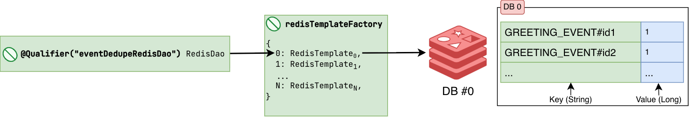
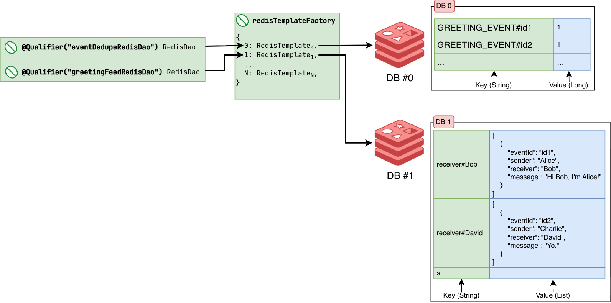

# The Practical Backend Engineer
## Twitch Chat Hit Counter
## Module 4: Redis
### Additional Learning Materials

## Overview
Redis is an in-memory Datastore that can be used as a database or cache. I just think of it as a distributed HashMap (in Java) or Dictionary (Python).

It stores data primarily in RAM (cache) and also persists data in disk (database), depending on your application's use case.

Key-Value stores is just a subset of a NoSQL DB, Redis being one such example. Redis can support all types of Data Structure from primitive and basic `String`, `Long`, and `List` to more complex data structures like HLL++ sketches (for reach calculations). It even has support for Redis Streams which can be used almost like Kafka. 

I've used at least some flavor of a KV store at every company I've worked at either as a cache/database.

**Netflix:**
- Netflix has our internal KV store called [KVDal ](https://netflixtechblog.medium.com/how-and-why-netflix-built-a-real-time-distributed-graph-part-2-building-a-scalable-storage-layer-ff4a8dbd3d1f) (Backed by Apache Cassandra)

**Snapchat:**
- Some teams used **Redis**
- My team used **Memcached**
- My team also used Google Guava library as our L1 Local Cache (hot cache), and on cache misses, pulled directly from "disk" by pulling documents from Google Datastore (NoSQL Document DB).

<br>

## Objective
<br>

In **Module 3**, you should have:
- an API endpoint to trigger a simple greeting event (**Module 2**)
- Producer to create a `GreetingEvent` DTO to be published to a Kafka topic (**Module 2**)
- Consumers (single/batch) to read `GreetingEvent` DTOs from a Kafka topic (**Module 2**)
- an API endpoint to trigger read on SQL tables (**Module 3**)
- SQL service to read/write `GreetingEvent` DTOs from/to SQL tables (**Module 3**)

**_NOTE_**: Moving forward, we will be dropping the **"Batch" Event Pipeline** and just continue to work with the **"Single" Event Pipeline**. By batch event pipeline I mean we won't be maintaining `GreetingEventBatchConsumer.java`,
as it was mainly a tool and lesson in helping you think about how to optimize network calls in everything you build when dealing with external databases.

In **Module 4**, we will be adding two Redis DBs:<br>
- Redis **db0** will be reserved for **Event Deduplication**.<br>
- Redis **db1** will be reserved for our **Greetings News Feed**.<br>

**Goals:**<br>
- Implement an **Event Deduper** backed by `db0` to deduplicate events so we ensure **always-once** processing and never process any event more than once, ever.
- Implement a **Greeting News Feed** backed by `db1` to build a Twitter or Facebook-like feed based on greeting events from some `sender` → `receiver`

> [!NOTE]
>
> Redis DB are namespaced by index (not by names) starting at 0, 1, ..., N.

<br>

## Lab Setup
### Setup Local Redis Server
Start our local Redis instance via Docker: [Redis Stack ](https://redis.io/docs/latest/operate/oss_and_stack/install/archive/install-stack/docker/)<br>
1. Open and login to **Docker Desktop**
2. Start the Redis Docker container:
```bash
docker run -d --name redis-stack -p 6379:6379 -p 8001:8001 redis/redis-stack:latest
```

In **Docker**, you should now see the Redis container running locally.<br>
We should have containers for: Kafka, MySQL, and now Redis.
<br>

### Bookmark Redis Insight
1. Go to `http://localhost:8001/` and bookmark this link

The docker run command above also exposes [Redis Insight ](https://redis.io/insight/) on port 8001. You can use Redis Insight by pointing your browser to localhost:8001.
The `redis/redis-stack` docker image contains both **Redis Stack server** and **Redis Insight**. A two-for-one combo to use Redis and have the Redis UI tool in one container.

In a production environment, the most likely basic setup would be:
- 3 instance(s) for the Leader nodes (M1, M2, M3)
- 3 instance(s) for the Follower nodes (R1, R2, R3)
- 1 instance(s) for the Redis Insight node (RI1)

It wouldn't be advised to have each server run both the Redis Stack Server + Redis Insight as this adds a lot of overhead on each cloud machine.

<br>

## File Structure
For `Module 4`, the below file structure are all the relevant files needed.

 twitch-chat-hit-counter/<br>
&nbsp;&nbsp;&nbsp;&nbsp;&nbsp;
 src/<br>
&nbsp;&nbsp;&nbsp;&nbsp;&nbsp;&nbsp;&nbsp;&nbsp;&nbsp;&nbsp;
 main/<br>
&nbsp;&nbsp;&nbsp;&nbsp;&nbsp;&nbsp;&nbsp;&nbsp;&nbsp;&nbsp;&nbsp;&nbsp;&nbsp;&nbsp;&nbsp;
 java/<br>
&nbsp;&nbsp;&nbsp;&nbsp;&nbsp;&nbsp;&nbsp;&nbsp;&nbsp;&nbsp;&nbsp;&nbsp;&nbsp;&nbsp;&nbsp;&nbsp;&nbsp;&nbsp;&nbsp;&nbsp;
 com.sonahlab.twitch_chat_hit_counter/<br>
&nbsp;&nbsp;&nbsp;&nbsp;&nbsp;&nbsp;&nbsp;&nbsp;&nbsp;&nbsp;&nbsp;&nbsp;&nbsp;&nbsp;&nbsp;&nbsp;&nbsp;&nbsp;&nbsp;&nbsp;&nbsp;&nbsp;&nbsp;&nbsp;&nbsp;
 config/<br>
&nbsp;&nbsp;&nbsp;&nbsp;&nbsp;&nbsp;&nbsp;&nbsp;&nbsp;&nbsp;&nbsp;&nbsp;&nbsp;&nbsp;&nbsp;&nbsp;&nbsp;&nbsp;&nbsp;&nbsp;&nbsp;&nbsp;&nbsp;&nbsp;&nbsp;&nbsp;&nbsp;&nbsp;&nbsp;&nbsp;
 RedisConfig.java<br>
&nbsp;&nbsp;&nbsp;&nbsp;&nbsp;&nbsp;&nbsp;&nbsp;&nbsp;&nbsp;&nbsp;&nbsp;&nbsp;&nbsp;&nbsp;&nbsp;&nbsp;&nbsp;&nbsp;&nbsp;&nbsp;&nbsp;&nbsp;&nbsp;&nbsp;
 kafka/<br>
&nbsp;&nbsp;&nbsp;&nbsp;&nbsp;&nbsp;&nbsp;&nbsp;&nbsp;&nbsp;&nbsp;&nbsp;&nbsp;&nbsp;&nbsp;&nbsp;&nbsp;&nbsp;&nbsp;&nbsp;&nbsp;&nbsp;&nbsp;&nbsp;&nbsp;&nbsp;&nbsp;&nbsp;&nbsp;&nbsp;
 consumer/<br>
&nbsp;&nbsp;&nbsp;&nbsp;&nbsp;&nbsp;&nbsp;&nbsp;&nbsp;&nbsp;&nbsp;&nbsp;&nbsp;&nbsp;&nbsp;&nbsp;&nbsp;&nbsp;&nbsp;&nbsp;&nbsp;&nbsp;&nbsp;&nbsp;&nbsp;&nbsp;&nbsp;&nbsp;&nbsp;&nbsp;&nbsp;&nbsp;&nbsp;&nbsp;&nbsp;
 GreetingEventConsumer.java<br>
&nbsp;&nbsp;&nbsp;&nbsp;&nbsp;&nbsp;&nbsp;&nbsp;&nbsp;&nbsp;&nbsp;&nbsp;&nbsp;&nbsp;&nbsp;&nbsp;&nbsp;&nbsp;&nbsp;&nbsp;&nbsp;&nbsp;&nbsp;&nbsp;&nbsp;
 model/<br>
&nbsp;&nbsp;&nbsp;&nbsp;&nbsp;&nbsp;&nbsp;&nbsp;&nbsp;&nbsp;&nbsp;&nbsp;&nbsp;&nbsp;&nbsp;&nbsp;&nbsp;&nbsp;&nbsp;&nbsp;&nbsp;&nbsp;&nbsp;&nbsp;&nbsp;&nbsp;&nbsp;&nbsp;&nbsp;&nbsp;
 EventType.java<br>
&nbsp;&nbsp;&nbsp;&nbsp;&nbsp;&nbsp;&nbsp;&nbsp;&nbsp;&nbsp;&nbsp;&nbsp;&nbsp;&nbsp;&nbsp;&nbsp;&nbsp;&nbsp;&nbsp;&nbsp;&nbsp;&nbsp;&nbsp;&nbsp;&nbsp;&nbsp;&nbsp;&nbsp;&nbsp;&nbsp;
 GreetingEvent.java<br>
&nbsp;&nbsp;&nbsp;&nbsp;&nbsp;&nbsp;&nbsp;&nbsp;&nbsp;&nbsp;&nbsp;&nbsp;&nbsp;&nbsp;&nbsp;&nbsp;&nbsp;&nbsp;&nbsp;&nbsp;&nbsp;&nbsp;&nbsp;&nbsp;&nbsp;
 redis/<br>
&nbsp;&nbsp;&nbsp;&nbsp;&nbsp;&nbsp;&nbsp;&nbsp;&nbsp;&nbsp;&nbsp;&nbsp;&nbsp;&nbsp;&nbsp;&nbsp;&nbsp;&nbsp;&nbsp;&nbsp;&nbsp;&nbsp;&nbsp;&nbsp;&nbsp;&nbsp;&nbsp;&nbsp;&nbsp;&nbsp;
 dao/<br>
&nbsp;&nbsp;&nbsp;&nbsp;&nbsp;&nbsp;&nbsp;&nbsp;&nbsp;&nbsp;&nbsp;&nbsp;&nbsp;&nbsp;&nbsp;&nbsp;&nbsp;&nbsp;&nbsp;&nbsp;&nbsp;&nbsp;&nbsp;&nbsp;&nbsp;&nbsp;&nbsp;&nbsp;&nbsp;&nbsp;&nbsp;&nbsp;&nbsp;&nbsp;&nbsp;
 RedisDao.java<br>
&nbsp;&nbsp;&nbsp;&nbsp;&nbsp;&nbsp;&nbsp;&nbsp;&nbsp;&nbsp;&nbsp;&nbsp;&nbsp;&nbsp;&nbsp;&nbsp;&nbsp;&nbsp;&nbsp;&nbsp;&nbsp;&nbsp;&nbsp;&nbsp;&nbsp;&nbsp;&nbsp;&nbsp;&nbsp;&nbsp;
 EventDeduperRedisService.java<br>
&nbsp;&nbsp;&nbsp;&nbsp;&nbsp;&nbsp;&nbsp;&nbsp;&nbsp;&nbsp;&nbsp;&nbsp;&nbsp;&nbsp;&nbsp;&nbsp;&nbsp;&nbsp;&nbsp;&nbsp;&nbsp;&nbsp;&nbsp;&nbsp;&nbsp;&nbsp;&nbsp;&nbsp;&nbsp;&nbsp;
 GreetingRedisService.java<br>
&nbsp;&nbsp;&nbsp;&nbsp;&nbsp;&nbsp;&nbsp;&nbsp;&nbsp;&nbsp;&nbsp;&nbsp;&nbsp;&nbsp;&nbsp;&nbsp;&nbsp;&nbsp;&nbsp;&nbsp;&nbsp;&nbsp;&nbsp;&nbsp;&nbsp;
 rest/<br>
&nbsp;&nbsp;&nbsp;&nbsp;&nbsp;&nbsp;&nbsp;&nbsp;&nbsp;&nbsp;&nbsp;&nbsp;&nbsp;&nbsp;&nbsp;&nbsp;&nbsp;&nbsp;&nbsp;&nbsp;&nbsp;&nbsp;&nbsp;&nbsp;&nbsp;&nbsp;&nbsp;&nbsp;&nbsp;&nbsp;
 RedisRestController.java<br>
&nbsp;&nbsp;&nbsp;&nbsp;&nbsp;&nbsp;&nbsp;&nbsp;&nbsp;&nbsp;&nbsp;&nbsp;&nbsp;&nbsp;&nbsp;
 resources/<br>
&nbsp;&nbsp;&nbsp;&nbsp;&nbsp;&nbsp;&nbsp;&nbsp;&nbsp;&nbsp;&nbsp;&nbsp;&nbsp;&nbsp;&nbsp;&nbsp;&nbsp;&nbsp;&nbsp;&nbsp;
 application.yml<br>
&nbsp;&nbsp;&nbsp;&nbsp;&nbsp;&nbsp;&nbsp;&nbsp;&nbsp;&nbsp;
 test/<br>
&nbsp;&nbsp;&nbsp;&nbsp;&nbsp;&nbsp;&nbsp;&nbsp;&nbsp;&nbsp;&nbsp;&nbsp;&nbsp;&nbsp;&nbsp;
 java/<br>
&nbsp;&nbsp;&nbsp;&nbsp;&nbsp;&nbsp;&nbsp;&nbsp;&nbsp;&nbsp;&nbsp;&nbsp;&nbsp;&nbsp;&nbsp;&nbsp;&nbsp;&nbsp;&nbsp;&nbsp;
 com.sonahlab.twitch_chat_hit_counter/<br>
&nbsp;&nbsp;&nbsp;&nbsp;&nbsp;&nbsp;&nbsp;&nbsp;&nbsp;&nbsp;&nbsp;&nbsp;&nbsp;&nbsp;&nbsp;&nbsp;&nbsp;&nbsp;&nbsp;&nbsp;&nbsp;&nbsp;&nbsp;&nbsp;&nbsp;
 config/<br>
&nbsp;&nbsp;&nbsp;&nbsp;&nbsp;&nbsp;&nbsp;&nbsp;&nbsp;&nbsp;&nbsp;&nbsp;&nbsp;&nbsp;&nbsp;&nbsp;&nbsp;&nbsp;&nbsp;&nbsp;&nbsp;&nbsp;&nbsp;&nbsp;&nbsp;&nbsp;&nbsp;&nbsp;&nbsp;&nbsp;
 RedisConfigTest.java<br>
&nbsp;&nbsp;&nbsp;&nbsp;&nbsp;&nbsp;&nbsp;&nbsp;&nbsp;&nbsp;&nbsp;&nbsp;&nbsp;&nbsp;&nbsp;&nbsp;&nbsp;&nbsp;&nbsp;&nbsp;&nbsp;&nbsp;&nbsp;&nbsp;&nbsp;
 redis/<br>
&nbsp;&nbsp;&nbsp;&nbsp;&nbsp;&nbsp;&nbsp;&nbsp;&nbsp;&nbsp;&nbsp;&nbsp;&nbsp;&nbsp;&nbsp;&nbsp;&nbsp;&nbsp;&nbsp;&nbsp;&nbsp;&nbsp;&nbsp;&nbsp;&nbsp;&nbsp;&nbsp;&nbsp;&nbsp;&nbsp;
 dao/<br>
&nbsp;&nbsp;&nbsp;&nbsp;&nbsp;&nbsp;&nbsp;&nbsp;&nbsp;&nbsp;&nbsp;&nbsp;&nbsp;&nbsp;&nbsp;&nbsp;&nbsp;&nbsp;&nbsp;&nbsp;&nbsp;&nbsp;&nbsp;&nbsp;&nbsp;&nbsp;&nbsp;&nbsp;&nbsp;&nbsp;&nbsp;&nbsp;&nbsp;&nbsp;&nbsp;
 RedisDaoTest.java<br>
&nbsp;&nbsp;&nbsp;&nbsp;&nbsp;&nbsp;&nbsp;&nbsp;&nbsp;&nbsp;&nbsp;&nbsp;&nbsp;&nbsp;&nbsp;&nbsp;&nbsp;&nbsp;&nbsp;&nbsp;&nbsp;&nbsp;&nbsp;&nbsp;&nbsp;&nbsp;&nbsp;&nbsp;&nbsp;&nbsp;
 EventDeduperRedisServiceTest.java<br>
&nbsp;&nbsp;&nbsp;&nbsp;&nbsp;&nbsp;&nbsp;&nbsp;&nbsp;&nbsp;&nbsp;&nbsp;&nbsp;&nbsp;&nbsp;&nbsp;&nbsp;&nbsp;&nbsp;&nbsp;&nbsp;&nbsp;&nbsp;&nbsp;&nbsp;&nbsp;&nbsp;&nbsp;&nbsp;&nbsp;
 GreetingRedisServiceTest.java<br>
&nbsp;&nbsp;&nbsp;&nbsp;&nbsp;&nbsp;&nbsp;&nbsp;&nbsp;&nbsp;&nbsp;&nbsp;&nbsp;&nbsp;&nbsp;&nbsp;&nbsp;&nbsp;&nbsp;&nbsp;&nbsp;&nbsp;&nbsp;&nbsp;&nbsp;
 rest/<br>
&nbsp;&nbsp;&nbsp;&nbsp;&nbsp;&nbsp;&nbsp;&nbsp;&nbsp;&nbsp;&nbsp;&nbsp;&nbsp;&nbsp;&nbsp;&nbsp;&nbsp;&nbsp;&nbsp;&nbsp;&nbsp;&nbsp;&nbsp;&nbsp;&nbsp;&nbsp;&nbsp;&nbsp;&nbsp;&nbsp;
 RedisRestControllerTest.java<br>
&nbsp;&nbsp;&nbsp;&nbsp;&nbsp;&nbsp;&nbsp;&nbsp;&nbsp;&nbsp;&nbsp;&nbsp;&nbsp;&nbsp;&nbsp;&nbsp;&nbsp;&nbsp;&nbsp;&nbsp;&nbsp;&nbsp;&nbsp;&nbsp;&nbsp;
 PropertiesApplicationTest.java<br>

> - `application.yml` — Spring Boot application properties<br>
> - `RedisConfig.java` — Configuration class to define all of our Redis related configs<br>
> - `GreetingEventConsumer.java` — Kafka consumer on `greeting-events` topic reading 1 event at a time<br>
> - `EventType.java` — Enum to define all event types in our application<br>
> - `GreetingEvent.java` — DTO to model a greeting event<br>
> - `RedisDao.java` — DAO class to act as an interface layer between our application logic and network calls to Redis<br>
> - `EventDeduperRedisService.java` — Class to interact with `db0` to deduplicate events if previously processed<br>
> - `GreetingRedisService.java` — Class to interact with `db1` to aggregate **Greeting News Feed** similar to Facebook's News Feed<br>
> - `RedisRestController.java` — REST controller to handle our service's Redis query endpoints:<br>
>   - `/api/redis/queryGreetingFeed`: queries a User in `db1` to retrieve that user's **Greeting News Feed**<br><br>
>
> - `RedisConfigTest.java` — Test class to validate logic after implementing `RedisConfig.java`<br>
> - `RedisDaoTest.java` — Test class to validate logic after implementing `RedisDao.java`<br>
> - `EventDeduperRedisServiceTest.java` — Test class to validate logic after implementing `EventDeduperRedisService.java`<br>
> - `GreetingRedisServiceTest.java` — Test class to validate logic after implementing `GreetingRedisService.java`<br>
> - `RedisRestControllerTest.java` — Test class to validate logic after implementing `RedisRestController.java`<br>
> - `PropertiesApplicationTest.java` — Test class to validate logic after implementing `application.yml`<br>


<br>

## Exercise 1: Redis Data Access Object (DAO)
> [!TIP]
>
> [Data Access Object (DAO) Pattern ](https://www.geeksforgeeks.org/system-design/data-access-object-pattern/)

Redis is Key-Value DB with a lot of capabilities and can store lots of different [Data Types ](https://redis.io/docs/latest/develop/data-types/)<br>

Peek at the [RedisTemplate.java ](https://docs.spring.io/spring-data/redis/docs/current/api/org/springframework/data/redis/core/RedisTemplate.html) API source code.
We will be creating a [DAO ](https://www.baeldung.com/java-dao-pattern) class to handle a very small subset of API calls on the RedisTemplate, more specifically the
[ValueOperations ](https://docs.spring.io/spring-data/redis/docs/current/api/org/springframework/data/redis/core/ValueOperations.html),
[ListOperations ](https://docs.spring.io/spring-data/redis/docs/current/api/org/springframework/data/redis/core/ListOperations.html),
and [SetOperations ](https://docs.spring.io/spring-data/redis/docs/current/api/org/springframework/data/redis/core/SetOperations.html) needed for our application.

<br>


<br>

### Task 1: Value Operations
### Implement [INCR ](https://redis.io/docs/latest/commands/incr/) (Increment)
In `RedisDao.java`, implement `increment(String key)`.<br>

Return a `Long` of the updated value after the key is incremented.

**Description**: Increments the number stored at key by one.<br>
**Library API Call**: RedisTemplate.opsForValues().[increment(key) ](https://docs.spring.io/spring-data/redis/docs/current/api/org/springframework/data/redis/core/ValueOperations.html#increment(K))

### Example 1:
> **Input**:<br>
> ```java
> RedisDao redisDao; // Assume initialized
> redisDao.set("key1", 5L);
>
> long output1 = redisDao.increment("key1");
> long output2 = redisDao.increment("key2");
> ```
> **Output1**: `6`<br>
> **Explanation**: "key1" is incremented by +1, but the "key1" already exists in redis with a value of 5. So the +1 increment gets added to the already existing value.
>
> **Output2**: `1`<br>
> **Explanation**: "key2" doesn't exist in redis so the initial value is treated as 0. The increment method only adds +1 value and essentially acts equivalent to calling .set("key2", 1L).

#

### Integration Tests
- [ ] Open `RedisDaoTest.java` ─ already implemented to test the example(s) above.
- [ ] Remove `@Disabled` in `RedisDaoTest::incrementTest`
- [ ] Test with:
    ```shell
    ./gradlew test --tests "*" -Djunit.jupiter.tags=Module4
    ```

<br>

### Implement [INCRBY ](https://redis.io/docs/latest/commands/incrby/) (Increment By)
In `RedisDao.java`, implement `incrementBy(String key, long delta)`.<br>

Return a `Long` of the updated value after the key is incremented.

**Description**: Increments the number stored at key by `increment`.<br>
**Library API Call**: RedisTemplate.opsForValues().[increment(key, delta) ](https://docs.spring.io/spring-data/redis/docs/current/api/org/springframework/data/redis/core/ValueOperations.html#increment(K,long))

### Example 1:
> **Input**:<br>
> ```java
> RedisDao redisDao; // Assume initialized
> redisDao.set("key1", 5);
>
> long output1 = redisDao.incrementBy("key1", 10);
> long output2 = redisDao.incrementBy("key2", 60);
> ```
> **Output1**: `15`<br>
> **Explanation**: "key1" is incremented by +10, but the "key1" already exists in redis with a value of 5. So the +10 increment gets added to the already existing value.
>
> **Output2**: `60`<br>
> **Explanation**: "key2" doesn't exist in redis so the initial value is treated as 0. The increment value of 60 essentially acts equivalent to calling .set("key2", 60L).

#

### Integration Tests
- [ ] Open `RedisDaoTest.java` ─ already implemented to test the example(s) above.
- [ ] Remove `@Disabled` in `RedisDaoTest::incrementByTest`
- [ ] Test with:
    ```shell
    ./gradlew test --tests "*" -Djunit.jupiter.tags=Module4
    ```

<br>

#

### Implement [SET ](https://redis.io/docs/latest/commands/set/)
In `RedisDao.java`, implement `set(String key, V value)`.<br>
Sets the KV pair by adding (if key is new) or overriding any previously set value.<br>

**Description**: Set key to hold the string value. If key already holds a value, it is overwritten, regardless of its type. Any previous time to live associated with the key is discarded on successful SET operation.<br>
**Library API Call**: RedisTemplate.opsForValues().[set(key, value) ](https://docs.spring.io/spring-data/redis/docs/current/api/org/springframework/data/redis/core/ValueOperations.html#set(K,V))

### Example 1:
> **Input**:<br>
> ```java
> RedisDao redisDao; // Assume initialized
> redisDao.set("key1", 10L);
> redisDao.set("key2", "Hello World!");
> redisDao.set("key3", 3.14);
> redisDao.set("key4", Map.of("firstName", "Jane", "lastName", "Doe"));
> ```
> **Output**: `null`<br>
> **Explanation**: The underlying redis library api method for `.set()` has no return value, so after calling the underlying Redis API set method, as long as no exception is thrown we can assume the operation succeeded.

<br>

#

### Implement [GET ](https://redis.io/docs/latest/commands/get/)
In `RedisDao.java`, implement `get(String key)`.<br>

Return the `String` representation of the stored value. The value stored in Redis doesn't strictly need to be a String, but Redis will store the data type represented as a String.

**Description**: Get the value of key. If the key does not exist the special value nil is returned. An error is returned if the value stored at key is not a string, because GET only handles string values.<br>
**Library API Call**: RedisTemplate.opsForValues().[get(key) ](https://docs.spring.io/spring-data/redis/docs/current/api/org/springframework/data/redis/core/ValueOperations.html#get(java.lang.Object))

### Example 1:
> **Input**:<br>
> ```java
> RedisDao redisDao; // Assume initialized
> 
> redisDao.set("key1", 10L);
> redisDao.set("key2", "Hello World!");
> redisDao.set("key3", 3.14);
> redisDao.set("key4", Map.of("firstName", "Jane", "lastName", "Doe"));
> 
> long output1 = redisDao.get("key1");
> long output2 = redisDao.get("key2");
> long output3 = redisDao.get("key3");
> long output4 = redisDao.get("key4");
> long output5 = redisDao.get("nonexistentKey");
> ```
> **Output1**: `"10"`<br>
> **Output2**: `"Hello World!"`<br>
> **Output3**: `"3.14"`<br>
> **Output4**: `"{\"firstName\": \"Jane\", \"lastName\": \"Doe\"}"`<br>
> **Output5**: `null`<br>

> [!NOTE]
>
> Notice that all outputs from our `redisDao.get(key)` method are all Strings.<br>
> If you look at the Redis API method: `RedisTemplate.opsForValue().get(key)`, this library will always return a String representation of the value that is stored in that key.

#

### Integration Tests
- [ ] Open `RedisDaoTest.java` ─ already implemented to test the example(s) above.
- [ ] Remove `@Disabled` in `RedisDaoTest::setAndGetTest()`
- [ ] Test with:
    ```shell
    ./gradlew test --tests "*" -Djunit.jupiter.tags=Module4
    ```

<br>

#

### Task 2: List Operations
### Implement [RPUSH ](https://redis.io/docs/latest/commands/rpush/) (Right Push)
In `RedisDao.java`, implement `listAdd(String key, String value)`.<br>

Return a `Long` of the length of the list **after** the value is appended.

**Description**: Insert all the specified values at the head of the list stored at key. If key does not exist, it is created as empty list before performing the push operations. When key holds a value that is not a list, an error is returned.<br>
**Library API Call**: RedisTemplate.opsForList().[rightPush(key, value) ](https://docs.spring.io/spring-data/redis/docs/current/api/org/springframework/data/redis/core/ListOperations.html#rightPush(K,V))

### Example 1:
> **Input**:<br>
> ```java
> RedisDao redisDao; // Assume initialized
> 
> long output1 = redisDao.listAdd("key1", "Hello");
> long output2 = redisDao.listAdd("key1", "World");
> 
> redisDao.incr("nonListKey");
> long output3 = redisDao.listAdd("nonListKey", "item1");
> ```
> **Output1**: `1`<br>
> **Explanation**: {"key1": ["Hello"]}
> 
> **Output2**: `2`<br>
> **Explanation**: {"key1": ["Hello", "World"]}
> 
> **Output3**: `Exception is thrown`<br>
> **Explanation**:<br>
> The Redis mapping is `{"nonListKey": "1"}`. Adding "item1" to a Long is invalid, so an error is thrown.

#

### Integration Tests
- [ ] Open `RedisDaoTest.java` ─ already implemented to test the example(s) above.
- [ ] Remove `@Disabled` in `RedisDaoTest::listAddTest`
- [ ] Test with:
    ```shell
    ./gradlew test --tests "*" -Djunit.jupiter.tags=Module4
    ```

<br>

#

### Implement [LRANGE ](https://redis.io/docs/latest/commands/lrange/) (Range)
In `RedisDao.java`, implement `listGet(String key)`.<br>

Return the `List<String>` stored at the key.

**Description**: Returns the specified elements of the list stored at key. The offsets start and stop are zero-based indexes, with 0 being the first element of the list (the head of the list), 1 being the next element and so on.<br>
These offsets can also be negative numbers indicating offsets starting at the end of the list. For example, -1 is the last element of the list, -2 the penultimate, and so on.<br>
**Library API Call**: RedisTemplate.opsForList().[range(key, start, end) ](https://docs.spring.io/spring-data/redis/docs/current/api/org/springframework/data/redis/core/ListOperations.html#range(K,long,long))

### Example 1:
> **Input**:<br>
> ```java
> RedisDao redisDao; // Assume initialized
> 
> redisDao.listAdd("key1", "Hello");
> redisDao.listAdd("key1", "World");
> redisDao.incr("nonListKey");
> 
> List<String> output1 = redisDao.listGet("key1");
> List<String> output2 = redisDao.listGet("nonexistentKey");
> List<String> output3 = redisDao.listGet("nonListKey");
> ```
> **Output1**: `["Hello", "World"]`<br>
> **Explanation**: `{"key1": ["Hello", "World"]}`
> 
> **Output2**: `[]`<br>
> **Explanation**: `"nonexistentKey"` doesn't exist in Redis DB so Redis returns an empty list
> 
> **Output3**: `Exception is thrown`<br>
> **Explanation**:<br>
> The Redis mapping is `{"nonListKey": "1"}`. Getting a List from a Long value is invalid, so an error is thrown.

#

### Integration Tests
- [ ] Open `RedisDaoTest.java` ─ already implemented to test the example(s) above.
- [ ] Remove `@Disabled` in `RedisDaoTest::listGetTest`
- [ ] Test with:
    ```shell
    ./gradlew test --tests "*" -Djunit.jupiter.tags=Module4
    ```

<br>

#

### Task 3: Set Operations

### Implement [SADD ](https://redis.io/docs/latest/commands/sadd/) (Set Add)
In `RedisDao.java`, implement `setAdd(String key, String... values)`.<br>

Return a `Long` for the length of the set **after** the value(s) are added.

**Description**: Add the specified members to the set stored at key. Specified members that are already a member of this set are ignored. If key does not exist, a new set is created before adding the specified members.<br>
An error is returned when the value stored at key is not a set.<br>
**Library API Call**: RedisTemplate.opsForSet().[add(key, values) ](https://docs.spring.io/spring-data/redis/docs/current/api/org/springframework/data/redis/core/SetOperations.html#add(K,V...))

### Example 1:
> **Input**:<br>
> ```java
> RedisDao redisDao; // Assume initialized
> 
> long output1 = redisDao.setAdd("key1", "Alice", "Bob");
> long output2 = redisDao.setAdd("key1", "Alice");
> ```
> **Output1**: `2`<br>
> **Explanation**: `{"key1": []}` → `{"key1": ["Alice", "Bob"]}`. "Alice" and "Bob" were successfully added to the initially empty "key1"
> 
> **Output2**: `0`<br>
> **Explanation**: "Alice" was already added to the set previously so attempting to add this value to the set again has no effect, and the set size remains 2.

#

### Integration Tests
- [ ] Open `RedisDaoTest.java` ─ already implemented to test the example(s) above.
- [ ] Remove `@Disabled` in `RedisDaoTest::setAddTest`
- [ ] Test with:
    ```shell
    ./gradlew test --tests "*" -Djunit.jupiter.tags=Module4
    ```

<br>

#

### Implement [SREM ](https://redis.io/docs/latest/commands/srem/) (Set Remove)
In `RedisDao.java`, implement `setRemove(String key, String... value)`.<br>

Return a `Long` for the number of removed elements from a set stored at `key`.

**Description**: Remove the specified members from the set stored at key. Specified members that are not a member of this set are ignored. If key does not exist, it is treated as an empty set and this command returns 0.<br>
An error is returned when the value stored at key is not a set.<br>
**Library API Call**: RedisTemplate.opsForSet().[remove(key, values) ](https://docs.spring.io/spring-data/redis/docs/current/api/org/springframework/data/redis/core/SetOperations.html#remove(K,java.lang.Object...))

### Example 1:
> **Input**:<br>
> ```java
> RedisDao redisDao; // Assume initialized
> 
> redisDao.setAdd("key1", "Alice");
> redisDao.setAdd("key1", "Bob");
> redisDao.increment("key2");
> 
> long output1 = redisDao.setRemove("key1", "Bob", "Charlie");
> long output2 = redisDao.setRemove("nonexistentKey", "Charlie");
> long output3 = redisDao.setRemove("key2", "Charlie");
> ```
> **Output1**: `1`<br>
> **Explanation**:<br>
> `["Alice", "Bob"] → ["Alice"]` w/ 1 value(s) removed.<br>
> "Bob" is successfully removed from the Set.<br>
> "Charlie" was never in the Set so there is nothing to remove.
> 
> **Output2**: `0`<br>
> **Explanation**: "nonexistentKey" doesn't exist in Redis DB so the Redis library treats the key as am empty set, nothing is removed.
> 
> **Output4**: `Exception is thrown`<br>
> **Explanation**:<br>
> {"key2": "1"}, the value at "key2" is a Long type so attempting to remove a value from a Long type is invalid. Redis library will throw an error.

#

### Integration Tests
- [ ] Open `RedisDaoTest.java` ─ already implemented to test the example(s) above.
- [ ] Remove `@Disabled` in `RedisDaoTest::setRemoveTest`
- [ ] Test with:
    ```shell
    ./gradlew test --tests "*" -Djunit.jupiter.tags=Module4
    ```

<br>

#

### Implement [SMEM ](https://redis.io/docs/latest/commands/smem/) (Set Members)
In `RedisDao.java`, implement `getSetMembers(String key)`.<br>

Return the `Set<String>` stored at the `key`.

**Description**: Returns all the members of the set value stored at key.<br>
**Library API Call**: RedisTemplate.opsForSet().[members(key) ](https://docs.spring.io/spring-data/redis/docs/current/api/org/springframework/data/redis/core/SetOperations.html#members(K))

### Example 1:
> **Input**:<br>
> ```java
> RedisDao redisDao; // Assume initialized
> redisDao.setAdd("key1", "Alice");
> redisDao.setAdd("key1", "Bob");
> 
> Set<String> output1 = redisDao.getSetMembers("key1");
> Set<String> output2 = redisDao.getSetMembers("nonexistentKey");
> 
> redisDao.incr("key2");
> Set<String> output3 = redisDao.getSetMembers("key2");
> ```
> **Output1**: `["Alice", "Bob"]`<br>
> **Explanation**: key="key1" has a set of ["Alice", "Bob"].
> 
> **Output2**: `[]`<br>
> **Explanation**: key="nonexistentKey" is not in the DB, Redis will treat this as an empty Set,
> 
> **Output3**: `Exception is thrown`<br>
> **Explanation**: key="key2" has a value of 1, so attempting to get the Set from a value that isn't a set will throw an exception.

#

### Integration Tests
- [ ] Open `RedisDaoTest.java` ─ already implemented to test the example(s) above.
- [ ] Remove `@Disabled` in `RedisDaoTest::getSetMembersTest`
- [ ] Test with:
    ```shell
    ./gradlew test --tests "*" -Djunit.jupiter.tags=Module4
    ```

<br>

## Exercise 2: Event Deduper
<br>

Zooming in on the diagram from the **[Objective ](https://github.com/SonahLab/twitch-chat-hit-counter/blob/main/course-material/MODULE_3.md#objective)** section, we want to optimize our `GreetingEventConsumer` by adding some deduplication logic.
When reading events from the Kafka topic, we should only process the event if we've never processed it before to achieve **always-once** event processing.

This is where KV Stores like Redis/Memcached come into play. Being able to quickly read/write from an in-memory cache acting as a Deduper is common across all systems in Big Tech.

Think of Redis as a distributed **HashMap (Java) or Dictionary (Python)** that can handle large amounts reads/writes.

Let's dive in.

<br>

#

### Task 1: Spring Data Redis Properties
> [!IMPORTANT]
>
> Read through [Spring Data Redis ](https://redis.io/learn/develop/java/redis-and-spring-course/lesson_2).
> We will be following this integration guide.

> ## Lesson: Redis Autoconfiguration
> <br>
>
> Useful source code on important aspects from **Spring Data Redis** library:
> - [DataRedisProperties.java ](https://github.com/spring-projects/spring-boot/blob/main/module/spring-boot-data-redis/src/main/java/org/springframework/boot/data/redis/autoconfigure/DataRedisProperties.java#L40-L71)
> - [DataRedisAutoConfiguration.java ](https://github.com/spring-projects/spring-boot/blob/91ca270281e59c215e64e697fa1d1c71eeefcffd/module/spring-boot-data-redis/src/main/java/org/springframework/boot/data/redis/autoconfigure/DataRedisAutoConfiguration.java#L61-L68)
> - [LettuceConnectionConfiguration.java ](https://github.com/spring-projects/spring-boot/blob/main/module/spring-boot-data-redis/src/main/java/org/springframework/boot/data/redis/autoconfigure/LettuceConnectionConfiguration.java#L72)
>
> **Spring Data Redis** autoconfigures the RedisTemplate for us, but if you follow the trail of how [DataRedisProperties.java ](https://github.com/spring-projects/spring-boot/blob/main/module/spring-boot-data-redis/src/main/java/org/springframework/boot/data/redis/autoconfigure/DataRedisProperties.java#L40-L71) is created the library uses these default values:
> - `spring.data.redis.database`: 0
> - `spring.data.redis.host`: localhost
> - `spring.data.redis.port`: 6379

In `application.yml`, set the `host/port` properties to autoconfigure our application to connect to our Redis server.
```yaml
spring:
  redis:
    host: localhost
    port: 6379
```

Set an application property for `db0` which is our dedicated Redis DB for deduping events. Because we plan on using multiple Redis databases (not just the default `db0` that is autoconfigured by the **Spring Redis** library), later, you will need to manually create your own @Beans in `RedisConfig.java`.
Our use case of interacting with multiple Redis DBs is outside the scope of what Spring Boot Autoconfigurations handle for us, similar to what you experienced in **Module 2** when creating the `batchKafkaListenerContainerFactory` bean in `KafkaConfig.java`.
```yaml
twitch-chat-hit-counter:
  redis:
    event-dedupe-database: 0
```

#

### Unit Tests
- [ ] Open `PropertiesApplicationTest.java` ─ already implemented
- [ ] Remove `@Disabled` in `PropertiesApplicationTest::springRedisConfigsTest` and `PropertiesApplicationTest::redisDeduperDatabaseTest`
- [ ] Test with:
    ```shell
    ./gradlew test --tests "*" -Djunit.jupiter.tags=Module4
    ```

<br>

#

### Task 2: `RedisConfig::eventDedupeRedisDao`
<br>


> [!TIP]
>
> Read through [Multiple Redis Connections in Spring Boot ](https://medium.com/@raphael3213/multiple-redis-connections-in-spring-boot-37f632e8e64f)

Because Spring Boot Redis only configures one `RedisTemplate` (limiting aspect of autoconfiguration), you will need to manually configure most of the beans yourself.

### Part 1
In `RedisConfig.java`, implement `redisTemplateFactory()`.

This factory @Bean will set up a mapping between our intended `database index → RedisTemplate` configured to handle network calls on a specific Redis DB.

Return a `Map<Integer, RedisTemplate<String, String>>` containing all the database indexes tracked in `application.yml` to a manually configured `RedisTemplate` object.

Example:
```
{
    0: RedisTemplate (IOs ONLY on DB₀),
    1: RedisTemplate (IOs ONLY on DB₁),
    ...,
    N: RedisTemplate (IOs ONLY on DBₙ)
}
```

**Requirements:**
1. DI the properties from `application.yml`: `host/port` and `event-dedupe-database`
2. Create the factory map `Map<Integer, RedisTemplate<String, String>>` object
3. For each index (should just be a manually created `List<Integer>` containing our only database index `0`):
   1. Create a new `RedisStandaloneConfigure` object using the `host/port` and don't forget to **set the database index**
   2. Create a new `LettuceConnectionFactory` object using the `RedisStandaloneConfigure`
      1. Call `lettuceConnectionFactory.afterPropertiesSet()`
      2. Call `lettuceConnectionFactory.start()`
   3. Create a new `RedisTemplate<String, String>`:
      1. Set `.setConnectionFactory(lettuceConnectionFactory)`
      2. Set `.setKeySerializer(new StringRedisSerializer())`
      3. Set `.setValueSerializer(new StringRedisSerializer())`
      4. Manually configure `.afterPropertiesSet()`
   4. Add the mapping for the `{databaseIndex: RedisTemplate}` to factory map from **Step 2**

### Part 2
In `RedisConfig.java`, implement
```java
@Bean
@Qualifier("eventDedupeRedisDao")
public RedisDao eventDedupeRedisDao() {}
```

This RedisDao will be _**dedicated**_ to handling operations on `DB0`.

**Requirements:**
1. DI the `redisTemplateFactory`
2. DI the `event-dedupe-database` property index from `application.yml`
3. Create a new `RedisDao` with the correct `RedisTemplate` from the factory `Map<Integer, RedisTemplate<String, String>>`

### Unit Tests
- [ ] Open `RedisConfigTest.java` ─ already implemented
- [ ] Remove `@Disabled` in `RedisConfigTest::eventDedupeRedisDaoTest`
- [ ] Test with:
    ```shell
    ./gradlew test --tests "*" -Djunit.jupiter.tags=Module4
    ```

<br>

#

### Task 3: `EventDeduperRedisService::processEvent`
In `EventDeduperRedisService.java`, implement `processEvent(EventType eventType, String eventId)`.

Generate a Redis Key from the input `EventType eventType` and `String eventId` parameters, and increment the key's value.

**Requirements:**
1. `db0` Redis key template: `"{EventType}#{eventId}"`
2. `db0` Redis value: `Long` value incremented by `1`.
3. Log a `warning` log if the event is a duplicate and drop/skip the event.
4. Log an `info` log if the event is not a duplicate and continue normal consumer processing logic.

### Example 1:
> **Input**:<br>
> ```java
> RedisDao redisDao; // Assume initialized
> EventDeduperRedisService eventDeduper = new EventDeduperRedisService(redisDao);
> 
> eventDeduper.processEvent(EventType.GREETING_EVENT, "id1");
> String output = redisDao.get("GREETING_EVENT#id1");
> ```
> **Output**: `"1"`<br>
> **Explanation**: After .processEvent(...) is called, our Redis DB should now be
> ```json
> {
>   "GREETING_EVENT#id1": "1"
> }
> ```

#

### Integration Tests
- [ ] Open `EventDeduperRedisServiceTest.java` ─ already implemented with the example(s) above
- [ ] Remove `@Disabled` in `EventDeduperRedisServiceTest::processEventTest`
- [ ] Test with:
    ```shell
    ./gradlew test --tests "*" -Djunit.jupiter.tags=Module4
    ```

<br>

#

### Task 4: `EventDeduperRedisService::isDupeEvent`
In `EventDeduperRedisService.java`, implement `isDupeEvent(EventType eventType, String eventId)`.<br>

Return a `boolean` on if the Redis key already exists in `db0`.<br>
- **True:** if the Redis Key **does** exists, then the event we're processing **IS** a duplicate.<br>
- **False:** if the Redis Key **does not** exist, then the event we're processing **IS NOT** a duplicate.<br>

**Requirements:**
1. `db0` Redis key template: `"{EventType}#{eventId}"`
2. `db0` Redis value should always be `1` if the key is a dupe (**always-once** processing)

### Example 1:
> **Input**:<br>
> ```java
> RedisDao redisDao; // Assume initialized
> EventDeduperRedisService eventDeduper = new EventDeduperRedisService(redisDao);
> 
> // Set some initial keys
> redisDao.incr("GREETING_EVENT#id2");
> 
> boolean output1 = eventDeduper.isDupeEvent(EventType.GREETING_EVENT, "id1");
> boolean output2 = eventDeduper.isDupeEvent(EventType.GREETING_EVENT, "id2");
> ```
> **Output1**: `false`<br>
> **Explanation**: no key="GREETING_EVENT#id1" exists, so the incoming eventId **IS NOT** a duplicate.<br>
>
> **Output2**: `true`<br>
> **Explanation**: key="GREETING_EVENT#id2" exists, so the incoming eventId **IS** a duplicate.<br>

#

### Integration Tests
- [ ] Open `EventDeduperRedisServiceTest.java` ─ already implemented with the example(s) above
- [ ] Remove `@Disabled` in `EventDeduperRedisServiceTest::isDupeEventTest`
- [ ] Test with:
    ```shell
    ./gradlew test --tests "*" -Djunit.jupiter.tags=Module4
    ```

<br>

#

### Task 5: `GreetingEventConsumer`
In `GreetingEventConsumer.java`, DI `EventDeduperRedisService.java` class into the constructor.

In `GreetingEventConsumer.processMessage(..)`, before we store a `GreetingEvent` into our SQL table, we will only process events that are not in our deduper Redis database (`db0`).

**Consumer Process Flow:**
1. Check Redis to see if the kafka message key is a duplicate
2. `if (isDupeEvent == true)`:
    1. Do nothing (skip processing the event)
3. `if (isDupeEvent == false)`:
    1. Write the event to SQL
    2. Update the Redis DB to add the event's key, so that we can skip this event from being processed if we ever see an event with the same key again.

#

### E2E Tests
- [ ] Run the application:
    ```shell
    ./gradlew bootRun
    ```
- [ ] Go to: [Swagger UI ](http://localhost:8080/swagger-ui/index.html)<br>
- [ ] Play around with **Kafka API**: `/api/kafka/publishGreetingEvent`
- [ ] In **Redis UI**, verify that the `GreetingEvent` key is written into the Redis DB
- [ ] Kill the application
- [ ] Set a new `spring.kafka.bootstrap-servers.consumer.group-id` to re-process all the Kafka events.
- [ ] Run the application
- [ ] Validate from the logs that the old events are now being dropped

<br>

## Exercise 3: Greetings News Feed
<br>
`GreetingEventConsumer` will now only process `GreetingEvent` that have not been processed before.<br>

Let's build a Twitter-like news feed for all greetings. On a Twitter newsfeed, each user has the relevant tweets on their timeline based on everyone they follow and all tagged posts.

Our **Greetings News Feed** will create a similar feed for each `receiver`, aggregating a List\<GreetingEvent> for all Greetings directed towards them.

At **time0**, Alice greets Bob, "Hi Bob, I'm Alice".<br>
At **time1**, Charlie greets Bob, "Hey Bob, it's been a while.".<br>

```
      Bob
    ↗     ↖
Alice     Charlie
```

**Bob's feed** will have this `List<GreetingEvent>`:
```json
{
  "receiver#Bob": [
    {
      "eventId": "id1",
      "sender": "Alice",
      "receiver": "Bob",
      "message": "Hi Bob, I'm Alice!"
    },
    {
      "eventId": "id2",
      "sender": "Charlie",
      "receiver": "Bob",
      "message": "Hey Bob, it's been a while."
    }
  ]
}
```
<br>

#

### Task 1: Spring Redis Properties
In `application.yml`, we will need to designate `db1` for purposes of aggregating the Greetings for each `receiver`.
```yaml
twitch-chat-hit-counter:
  redis:
    greeting-feed-database: 1
```

#

### Unit Tests
- [ ] Open `PropertiesApplicationTest.java` ─ already implemented with the property test above.
- [ ] Remove `@Disabled` in `PropertiesApplicationTest::redisGreetingFeedDatabaseTest`
- [ ] Test with:
    ```shell
    ./gradlew test --tests "*" -Djunit.jupiter.tags=Module4
    ```

<br>

#

### Task 2: `RedisConfig::greetingFeedRedisDao`
<br>


> [!TIP]
>
> Read through [Multiple Redis Connections in Spring Boot ](https://medium.com/@raphael3213/multiple-redis-connections-in-spring-boot-37f632e8e64f)

This is very similar to our initial setup for `db0` in `RedisConfig.java`. After implementing the support needed for `db1`, you should the benefits of why I've set up the `redisTemplateFactory` the way I did.
It becomes very easy to add and remove database indexes without requiring a lot of the duplicated code as the original Medium article above shows. 

### Part 1
In `RedisConfig.java`, update `redisTemplateFactory()` with a mapping for `db1`.

**Example:**
```
{
    0: RedisTemplate (IOs ONLY on DB₀),
    1: RedisTemplate (IOs ONLY on DB₁),
    ...,
    N: RedisTemplate (IOs ONLY on DBₙ)
}
```

**Requirements:**
1. DI the properties from `application.yml`: `greeting-feed-database`
2. Update the list of indexes to include `1` (should be `List.of(0, 1)`)

### Part 2
In `RedisConfig.java`, implement
```java
@Bean
@Qualifier("greetingFeedRedisDao")
public RedisDao greetingFeedRedisDao() {}
```

This RedisDao will be **dedicated** to handling operations on `DB1`.

**Requirements:**
1. DI the `redisTemplateFactory`
2. DI the `greeting-feed-database` property index from `application.yml`
3. Create a new `RedisDao` with the correct `RedisTemplate` from the factory `Map<Integer, RedisTemplate<String, String>>`

### Unit Tests
- [ ] Open `RedisConfigTest.java` ─ already implemented
- [ ] Remove `@Disabled` in `RedisConfigTest::greetingFeedRedisDaoTest`
- [ ] Test with:
    ```shell
    ./gradlew test --tests "*" -Djunit.jupiter.tags=Module4
    ```


<br>

#

### Task 3: `GreetingRedisService::addGreetingToFeed`
In `GreetingRedisService`, implement `addGreetingToFeed(GreetingEvent event)`.<br>

Return a `Long` that represents the length of the List after the `GreetingEvent` is appended to the list stored at the key for the `GreetingEvent.receiver()`.

**Requirements:**
1. `db1` Redis key template: `"receiver#{receiver}"`
2. `db1` Redis value: `List<String>` adding the `GreetingEvent` represented as a JSON String

### Example 1:
> **Input**:<br>
> ```java
> RedisDao redisDao; // Assume initialized
> GreetingRedisService greetingRedisService = new GreetingRedisService(redisDao);
> 
> GreetingEvent event1 = new GreetingEvent("id1", "Alice", "Bob", "Hi Bob, I'm Alice");
> GreetingEvent event2 = new GreetingEvent("id2", "Charlie", "Bob", "Hey Bob, it's been a while.");
> GreetingEvent event3 = new GreetingEvent("id3", "Charlie", "David", "Yo.");
> 
> Long output1 = greetingRedisService.addGreetingToFeed(event1);
> Long output2 = greetingRedisService.addGreetingToFeed(event2);
> Long output3 = greetingRedisService.addGreetingToFeed(event3);
> ```
> **Output1**: `1`<br>
> **Explanation**: **receiver#Bob** has a feed of length 1, greeting(s) from "Alice"
>
> **Output2**: `2`<br>
> **Explanation**: **receiver#Bob** has a feed of length 2, greeting(s) from "Alice" and "Charlie"
>
> **Output3**: `1`<br>
> **Explanation**: **receiver#David** has a feed of length 1, greeting(s) from "Charlie"

#

### Integration Tests
- [ ] Open `GreetingRedisServiceTest.java` ─ already implemented with the example(s) above.
- [ ] Remove `@Disabled` in `GreetingRedisServiceTest::addGreetingToFeedTest`
- [ ] Test with:
    ```shell
    ./gradlew test --tests "*" -Djunit.jupiter.tags=Module4
    ```

<br>

#

### Task 4: `GreetingEventConsumer`
In `GreetingEventConsumer.java` (**Module 2**), DI the `GreetingRedisService.java`.

In `GreetingEventConsumer.processMessage(..)`, after the deduper logic, we want to update the greeting feed (List) for the `GreetingEvent.receiver()`

**Requirements:**
- DI the correct `GreetingSqlService` bean into the `GreetingEventConsumer` constructor.<br>

**Consumer Process Flow:**
1. Check Redis to see if the kafka message key is a duplicate
2. `if (isDupeEvent == true)`:
    1. Do nothing (skip processing the event)
3. `if (isDupeEvent == false)`:
    1. Write the event to SQL
    2. **(NEW)** Write the greeting event to the `event.receiver()` feed in Redis in `db1`
    3. Update `db0` to add the event's key, so that we can skip this event from being processed if we ever see an event with the same key again.

<br>

#

### E2E Tests
- [ ] Run the application:
    ```shell
    ./gradlew bootRun
    ```
- [ ] Go to: [Swagger UI ](http://localhost:8080/swagger-ui/index.html)<br>
- [ ] Play around with **Kafka API**: `/api/kafka/publishGreetingEvent`
- [ ] In **Redis UI**, go to `db1` and verify that the Greeting News Feed is the being appended correctly


<br>

#

### Exercise 4: Redis API
<br>

<br>

### Task 1: Query News Feed from Redis
In `GreetingRedisService`, implement `getGreetingFeed(String name)`.<br>

Return the `List<GreetingEvent>` from `db1` stored at the key generated from the input `name`.

**Requirements:**
1. `db1` Redis key template: `"receiver#{name}"`
2. `db1` Redis value: `List<String>`, but we want to output a `List<GreetingEvent>` so you will need to deserialize each JSON String back to a `GreetingEvent` object

### Example 1:
> **Input**:<br>
> ```java
> RedisDao redisDao; // Assume initialized
> GreetingRedisService greetingRedisService = new GreetingRedisService(redisDao);
> 
> GreetingEvent event1 = new GreetingEvent("id1", "Alice", "Bob", "Hi Bob, I'm Alice");
> GreetingEvent event2 = new GreetingEvent("id2", "Charlie", "Bob", "Hey Bob, it's been a while.");
> GreetingEvent event3 = new GreetingEvent("id3", "Charlie", "David", "Yo.");
> 
> greetingRedisService.addGreetingToFeed(event1);
> greetingRedisService.addGreetingToFeed(event2);
> greetingRedisService.addGreetingToFeed(event3);
>
> List<GreetingEvent> output1 = greetingRedisService.getGreetingFeed("Bob");
> List<GreetingEvent> output2 = greetingRedisService.getGreetingFeed("David");
> List<GreetingEvent> output3 = greetingRedisService.getGreetingFeed("Alice");
> ```
> 
> #
> 
> **Output1**:<br>
> ```json
> [
>   {
>     "eventId": "id1",
>     "sender": "Alice",
>     "receiver": "Bob",
>     "message": "Hi Bob, I'm Alice!"
>   },
>   {
>     "eventId": "id2",
>     "sender": "Charlie",
>     "receiver": "Bob",
>     "message": "Hey Bob, it's been a while."
>   }
> ]
> ```
> **Explanation**: **receiver#Bob** has a feed of length 2, holding greeting(s) from "Alice" and "Charlie"
>
> #
> 
> **Output2**:<br>
> ```json
> [
>   {
>     "eventId": "id3",
>     "sender": "Charlie",
>     "receiver": "David",
>     "message": "Yo."
>   }
> ]
> ```
> **Explanation**: **receiver#David** has a feed of length 1, holding greeting(s) from "Charlie"
>
> #
> 
> **Output3**: `[]`<br>
> **Explanation**: **receiver#Alice** has a feed of length 0, no one has greeted her

#

### Integration Tests
- [ ] Open `GreetingRedisServiceTest.java` ─ already implemented with the example(s) above.
- [ ] Remove `@Disabled` in `GreetingRedisServiceTest::getGreetingFeedTest`
- [ ] Test with:
    ```shell
    ./gradlew test --tests "*" -Djunit.jupiter.tags=Module4
    ```

<br>

#

### Task 2: `RedisRestController`
In `RedisRestController.java`, implement `public List<GreetingEvent> getRedisGreetingFeed(String name)`.<br>

Return the `List<GreetingEvent>` from calling `GreetingRedisService.getGreetingFeed(name)` you implemented in the previous task.

### Example 1:
> ```java
> 
> RedisDao redisDao; // Assume initialized
> GreetingRedisService greetingRedisService = new GreetingRedisService(redisDao);
> 
> GreetingEvent event1 = new GreetingEvent("id1", "Alice", "Bob", "Hi Bob, I'm Alice");
> GreetingEvent event2 = new GreetingEvent("id2", "Charlie", "Bob", "Hey Bob, it's been a while.");
> GreetingEvent event3 = new GreetingEvent("id3", "Charlie", "David", "Yo.");
> 
> greetingRedisService.addGreetingToFeed(event1);
> greetingRedisService.addGreetingToFeed(event2);
> greetingRedisService.addGreetingToFeed(event3);
> ```
> ```bash
> curl -X GET "http://localhost:8080/api/redis/queryGreetingFeed?name=Bob"
> [
>   {
>     "eventId": "id1",
>     "sender": "Alice",
>     "receiver": "Bob",
>     "message": "Hi Bob, I'm Alice!"
>   },
>   {
>     "eventId": "id2",
>     "sender": "Charlie",
>     "receiver": "Bob",
>     "message": "Hey Bob, it's been a while."
>   }
> ]
> 
> curl -X GET "http://localhost:8080/api/redis/queryGreetingFeed?name=Alice"
> []
> ```

#

### Integration Tests
- [ ] Open `RedisRestControllerTest.java` ─ already implemented with the example(s) above.
- [ ] Remove `@Disabled` in `RedisRestControllerTest.java`
- [ ] Test with:
    ```shell
    ./gradlew test --tests "*" -Djunit.jupiter.tags=Module4
    ```

#

### E2E Tests
- [ ] Run the application:
    ```shell
    ./gradlew bootRun
    ```
- [ ] Go to: [Swagger UI ](http://localhost:8080/swagger-ui/index.html)<br>
- [ ] **Redis API**: `GET /api/kafka/queryGreetingFeed`
- [ ] In **Redis UI**, verify that the HTTP Response output greeting feed is the same as the feed saved in Redis `db1`
