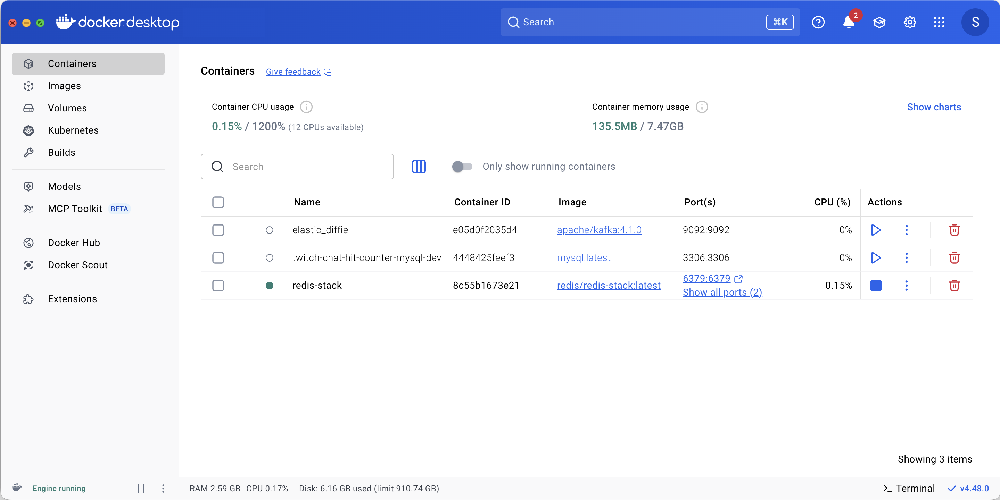

# Practical Backend Engineer
## Twitch Chat Hit Counter
## Module 4: Redis

### Lesson

### Additional Learning Materials


<br>

## File Structure
For `Module 4`, the below file structure are all the relevant files needed.

[//]: # (```)
[//]: # (twitch-chat-hit-counter/src/)
[//]: # (├── main/)
[//]: # (│   ├── java/)
[//]: # (│   │   └── com.sonahlab.twitch_chat_hit_counter/)
[//]: # (│   │       ├── config/)
[//]: # (│   │       │   └── RedisConfig.java)
[//]: # (│   │       ├── kafka/)
[//]: # (│   │       │   └── consumer/)
[//]: # (│   │       │       └── GreetingEventConsumer.java)
[//]: # (│   │       ├── model/)
[//]: # (│   │       │   └── GreetingEvent.java)
[//]: # (│   │       ├── redis/)
[//]: # (│   │       │   ├── dao/)
[//]: # (│   │       │   │   └── RedisDao.java)
[//]: # (│   │       │   ├── EventDeduperRedisService.java)
[//]: # (│   │       │   └── GreetingRedisService.java)
[//]: # (│   │       ├── rest/)
[//]: # (│   │       │   └── ApplicationRestController.java)
[//]: # (│   │       └── utils/)
[//]: # (│   │           └── EventType.java)
[//]: # (│   └── resources/)
[//]: # (│       └── application.yml)
[//]: # (└── test/)
[//]: # (    └── java/)
[//]: # (        └── java/com.sonahlab.twitch_chat_hit_counter/)
[//]: # (            ├── config/)
[//]: # (            │   └── RedisConfigTest.java)
[//]: # (            ├── redis/)
[//]: # (            │   ├── dao/)
[//]: # (            │   │   └── RedisDaoTest.java)
[//]: # (            │   ├── EventDeduperRedisServiceTest.java)
[//]: # (            │   └── GreetingRedisServiceTest.java)
[//]: # (            └── rest/)
[//]: # (                └── ApplicationRestControllerTest.java)
[//]: # (```)
 twitch-chat-hit-counter/<br>
&nbsp;&nbsp;&nbsp;&nbsp;&nbsp;
 src/<br>
&nbsp;&nbsp;&nbsp;&nbsp;&nbsp;&nbsp;&nbsp;&nbsp;&nbsp;&nbsp;
 main/<br>
&nbsp;&nbsp;&nbsp;&nbsp;&nbsp;&nbsp;&nbsp;&nbsp;&nbsp;&nbsp;&nbsp;&nbsp;&nbsp;&nbsp;&nbsp;
 java/<br>
&nbsp;&nbsp;&nbsp;&nbsp;&nbsp;&nbsp;&nbsp;&nbsp;&nbsp;&nbsp;&nbsp;&nbsp;&nbsp;&nbsp;&nbsp;&nbsp;&nbsp;&nbsp;&nbsp;&nbsp;
 com.sonahlab.twitch_chat_hit_counter/<br>
&nbsp;&nbsp;&nbsp;&nbsp;&nbsp;&nbsp;&nbsp;&nbsp;&nbsp;&nbsp;&nbsp;&nbsp;&nbsp;&nbsp;&nbsp;&nbsp;&nbsp;&nbsp;&nbsp;&nbsp;&nbsp;&nbsp;&nbsp;&nbsp;&nbsp;
 config/<br>
&nbsp;&nbsp;&nbsp;&nbsp;&nbsp;&nbsp;&nbsp;&nbsp;&nbsp;&nbsp;&nbsp;&nbsp;&nbsp;&nbsp;&nbsp;&nbsp;&nbsp;&nbsp;&nbsp;&nbsp;&nbsp;&nbsp;&nbsp;&nbsp;&nbsp;&nbsp;&nbsp;&nbsp;&nbsp;&nbsp;
 RedisConfig.java<br>
&nbsp;&nbsp;&nbsp;&nbsp;&nbsp;&nbsp;&nbsp;&nbsp;&nbsp;&nbsp;&nbsp;&nbsp;&nbsp;&nbsp;&nbsp;&nbsp;&nbsp;&nbsp;&nbsp;&nbsp;&nbsp;&nbsp;&nbsp;&nbsp;&nbsp;
 kafka/<br>
&nbsp;&nbsp;&nbsp;&nbsp;&nbsp;&nbsp;&nbsp;&nbsp;&nbsp;&nbsp;&nbsp;&nbsp;&nbsp;&nbsp;&nbsp;&nbsp;&nbsp;&nbsp;&nbsp;&nbsp;&nbsp;&nbsp;&nbsp;&nbsp;&nbsp;&nbsp;&nbsp;&nbsp;&nbsp;&nbsp;
 consumer/<br>
&nbsp;&nbsp;&nbsp;&nbsp;&nbsp;&nbsp;&nbsp;&nbsp;&nbsp;&nbsp;&nbsp;&nbsp;&nbsp;&nbsp;&nbsp;&nbsp;&nbsp;&nbsp;&nbsp;&nbsp;&nbsp;&nbsp;&nbsp;&nbsp;&nbsp;&nbsp;&nbsp;&nbsp;&nbsp;&nbsp;&nbsp;&nbsp;&nbsp;&nbsp;&nbsp;
 GreetingEventConsumer.java<br>
&nbsp;&nbsp;&nbsp;&nbsp;&nbsp;&nbsp;&nbsp;&nbsp;&nbsp;&nbsp;&nbsp;&nbsp;&nbsp;&nbsp;&nbsp;&nbsp;&nbsp;&nbsp;&nbsp;&nbsp;&nbsp;&nbsp;&nbsp;&nbsp;&nbsp;
 model/<br>
&nbsp;&nbsp;&nbsp;&nbsp;&nbsp;&nbsp;&nbsp;&nbsp;&nbsp;&nbsp;&nbsp;&nbsp;&nbsp;&nbsp;&nbsp;&nbsp;&nbsp;&nbsp;&nbsp;&nbsp;&nbsp;&nbsp;&nbsp;&nbsp;&nbsp;&nbsp;&nbsp;&nbsp;&nbsp;&nbsp;
 GreetingEvent.java<br>
&nbsp;&nbsp;&nbsp;&nbsp;&nbsp;&nbsp;&nbsp;&nbsp;&nbsp;&nbsp;&nbsp;&nbsp;&nbsp;&nbsp;&nbsp;&nbsp;&nbsp;&nbsp;&nbsp;&nbsp;&nbsp;&nbsp;&nbsp;&nbsp;&nbsp;
 redis/<br>
&nbsp;&nbsp;&nbsp;&nbsp;&nbsp;&nbsp;&nbsp;&nbsp;&nbsp;&nbsp;&nbsp;&nbsp;&nbsp;&nbsp;&nbsp;&nbsp;&nbsp;&nbsp;&nbsp;&nbsp;&nbsp;&nbsp;&nbsp;&nbsp;&nbsp;&nbsp;&nbsp;&nbsp;&nbsp;&nbsp;
 dao/<br>
&nbsp;&nbsp;&nbsp;&nbsp;&nbsp;&nbsp;&nbsp;&nbsp;&nbsp;&nbsp;&nbsp;&nbsp;&nbsp;&nbsp;&nbsp;&nbsp;&nbsp;&nbsp;&nbsp;&nbsp;&nbsp;&nbsp;&nbsp;&nbsp;&nbsp;&nbsp;&nbsp;&nbsp;&nbsp;&nbsp;&nbsp;&nbsp;&nbsp;&nbsp;&nbsp;
 RedisDao.java<br>
&nbsp;&nbsp;&nbsp;&nbsp;&nbsp;&nbsp;&nbsp;&nbsp;&nbsp;&nbsp;&nbsp;&nbsp;&nbsp;&nbsp;&nbsp;&nbsp;&nbsp;&nbsp;&nbsp;&nbsp;&nbsp;&nbsp;&nbsp;&nbsp;&nbsp;&nbsp;&nbsp;&nbsp;&nbsp;&nbsp;
 EventDeduperRedisService.java<br>
&nbsp;&nbsp;&nbsp;&nbsp;&nbsp;&nbsp;&nbsp;&nbsp;&nbsp;&nbsp;&nbsp;&nbsp;&nbsp;&nbsp;&nbsp;&nbsp;&nbsp;&nbsp;&nbsp;&nbsp;&nbsp;&nbsp;&nbsp;&nbsp;&nbsp;&nbsp;&nbsp;&nbsp;&nbsp;&nbsp;
 GreetingRedisService.java<br>
&nbsp;&nbsp;&nbsp;&nbsp;&nbsp;&nbsp;&nbsp;&nbsp;&nbsp;&nbsp;&nbsp;&nbsp;&nbsp;&nbsp;&nbsp;&nbsp;&nbsp;&nbsp;&nbsp;&nbsp;&nbsp;&nbsp;&nbsp;&nbsp;&nbsp;
 rest/<br>
&nbsp;&nbsp;&nbsp;&nbsp;&nbsp;&nbsp;&nbsp;&nbsp;&nbsp;&nbsp;&nbsp;&nbsp;&nbsp;&nbsp;&nbsp;&nbsp;&nbsp;&nbsp;&nbsp;&nbsp;&nbsp;&nbsp;&nbsp;&nbsp;&nbsp;&nbsp;&nbsp;&nbsp;&nbsp;&nbsp;
 ApplicationRestController.java<br>
&nbsp;&nbsp;&nbsp;&nbsp;&nbsp;&nbsp;&nbsp;&nbsp;&nbsp;&nbsp;&nbsp;&nbsp;&nbsp;&nbsp;&nbsp;&nbsp;&nbsp;&nbsp;&nbsp;&nbsp;&nbsp;&nbsp;&nbsp;&nbsp;&nbsp;
 utils/<br>
&nbsp;&nbsp;&nbsp;&nbsp;&nbsp;&nbsp;&nbsp;&nbsp;&nbsp;&nbsp;&nbsp;&nbsp;&nbsp;&nbsp;&nbsp;&nbsp;&nbsp;&nbsp;&nbsp;&nbsp;&nbsp;&nbsp;&nbsp;&nbsp;&nbsp;&nbsp;&nbsp;&nbsp;&nbsp;&nbsp;
 EventType.java<br>
&nbsp;&nbsp;&nbsp;&nbsp;&nbsp;&nbsp;&nbsp;&nbsp;&nbsp;&nbsp;&nbsp;&nbsp;&nbsp;&nbsp;&nbsp;
 resources/<br>
&nbsp;&nbsp;&nbsp;&nbsp;&nbsp;&nbsp;&nbsp;&nbsp;&nbsp;&nbsp;&nbsp;&nbsp;&nbsp;&nbsp;&nbsp;&nbsp;&nbsp;&nbsp;&nbsp;&nbsp;
 application.yml<br>
&nbsp;&nbsp;&nbsp;&nbsp;&nbsp;&nbsp;&nbsp;&nbsp;&nbsp;&nbsp;
 test/<br>
&nbsp;&nbsp;&nbsp;&nbsp;&nbsp;&nbsp;&nbsp;&nbsp;&nbsp;&nbsp;&nbsp;&nbsp;&nbsp;&nbsp;&nbsp;
 java/<br>
&nbsp;&nbsp;&nbsp;&nbsp;&nbsp;&nbsp;&nbsp;&nbsp;&nbsp;&nbsp;&nbsp;&nbsp;&nbsp;&nbsp;&nbsp;&nbsp;&nbsp;&nbsp;&nbsp;&nbsp;
 com.sonahlab.twitch_chat_hit_counter/<br>
&nbsp;&nbsp;&nbsp;&nbsp;&nbsp;&nbsp;&nbsp;&nbsp;&nbsp;&nbsp;&nbsp;&nbsp;&nbsp;&nbsp;&nbsp;&nbsp;&nbsp;&nbsp;&nbsp;&nbsp;&nbsp;&nbsp;&nbsp;&nbsp;&nbsp;
 config/<br>
&nbsp;&nbsp;&nbsp;&nbsp;&nbsp;&nbsp;&nbsp;&nbsp;&nbsp;&nbsp;&nbsp;&nbsp;&nbsp;&nbsp;&nbsp;&nbsp;&nbsp;&nbsp;&nbsp;&nbsp;&nbsp;&nbsp;&nbsp;&nbsp;&nbsp;&nbsp;&nbsp;&nbsp;&nbsp;&nbsp;
 RedisConfigTest.java<br>
&nbsp;&nbsp;&nbsp;&nbsp;&nbsp;&nbsp;&nbsp;&nbsp;&nbsp;&nbsp;&nbsp;&nbsp;&nbsp;&nbsp;&nbsp;&nbsp;&nbsp;&nbsp;&nbsp;&nbsp;&nbsp;&nbsp;&nbsp;&nbsp;&nbsp;
 redis/<br>
&nbsp;&nbsp;&nbsp;&nbsp;&nbsp;&nbsp;&nbsp;&nbsp;&nbsp;&nbsp;&nbsp;&nbsp;&nbsp;&nbsp;&nbsp;&nbsp;&nbsp;&nbsp;&nbsp;&nbsp;&nbsp;&nbsp;&nbsp;&nbsp;&nbsp;&nbsp;&nbsp;&nbsp;&nbsp;&nbsp;
 dao/<br>
&nbsp;&nbsp;&nbsp;&nbsp;&nbsp;&nbsp;&nbsp;&nbsp;&nbsp;&nbsp;&nbsp;&nbsp;&nbsp;&nbsp;&nbsp;&nbsp;&nbsp;&nbsp;&nbsp;&nbsp;&nbsp;&nbsp;&nbsp;&nbsp;&nbsp;&nbsp;&nbsp;&nbsp;&nbsp;&nbsp;&nbsp;&nbsp;&nbsp;&nbsp;&nbsp;
 RedisDaoTest.java<br>
&nbsp;&nbsp;&nbsp;&nbsp;&nbsp;&nbsp;&nbsp;&nbsp;&nbsp;&nbsp;&nbsp;&nbsp;&nbsp;&nbsp;&nbsp;&nbsp;&nbsp;&nbsp;&nbsp;&nbsp;&nbsp;&nbsp;&nbsp;&nbsp;&nbsp;&nbsp;&nbsp;&nbsp;&nbsp;&nbsp;
 EventDeduperRedisServiceTest.java<br>
&nbsp;&nbsp;&nbsp;&nbsp;&nbsp;&nbsp;&nbsp;&nbsp;&nbsp;&nbsp;&nbsp;&nbsp;&nbsp;&nbsp;&nbsp;&nbsp;&nbsp;&nbsp;&nbsp;&nbsp;&nbsp;&nbsp;&nbsp;&nbsp;&nbsp;&nbsp;&nbsp;&nbsp;&nbsp;&nbsp;
 GreetingRedisServiceTest.java<br>
&nbsp;&nbsp;&nbsp;&nbsp;&nbsp;&nbsp;&nbsp;&nbsp;&nbsp;&nbsp;&nbsp;&nbsp;&nbsp;&nbsp;&nbsp;&nbsp;&nbsp;&nbsp;&nbsp;&nbsp;&nbsp;&nbsp;&nbsp;&nbsp;&nbsp;
 rest/<br>
&nbsp;&nbsp;&nbsp;&nbsp;&nbsp;&nbsp;&nbsp;&nbsp;&nbsp;&nbsp;&nbsp;&nbsp;&nbsp;&nbsp;&nbsp;&nbsp;&nbsp;&nbsp;&nbsp;&nbsp;&nbsp;&nbsp;&nbsp;&nbsp;&nbsp;&nbsp;&nbsp;&nbsp;&nbsp;&nbsp;
 RedisRestControllerTest.java<br>

<br>

## Overview
<br>

> [!NOTE]
>
> Redis DB are namespaced by index, meaning it starts at db 0, 1, ..., N.

In **Module 4**, we will be adding two Redis DBs.<br>
Redis DB0 will be reserved for **Event Deduplication**.<br>
Redis DB1 will be reserved for our **Greetings News Feed**.<br>

<br>

## Setup Local Redis Server
Start our local Redis instance via Docker: [Redis Stack ](https://redis.io/docs/latest/operate/oss_and_stack/install/archive/install-stack/docker/)<br>
1. Open and login to **Docker Desktop**
2. Start the Redis Docker container:
```bash
docker run -d --name redis-stack -p 6379:6379 -p 8001:8001 redis/redis-stack:latest
```

In **Docker**, you should now see the Redis container running locally.<br>
We should have containers for: Kafka, MySQL, and now Redis.
<br>

<br>

## Exercise 1: Implement Data Access Object (DAO)
Redis is Key-Value DB with a lot of capabilities and can store lots of different [Data Types ](https://redis.io/docs/latest/develop/data-types/)<br>

Peek at the [RedisTemplate.java ](https://docs.spring.io/spring-data/redis/docs/current/api/org/springframework/data/redis/core/RedisTemplate.html) API source code.
We will be creating a [DAO ](https://www.baeldung.com/java-dao-pattern) class to handle a very small subset of API calls on the RedisTemplate, more specifically the
[ValueOperations ](https://docs.spring.io/spring-data/redis/docs/current/api/org/springframework/data/redis/core/ValueOperations.html),
[ListOperations ](https://docs.spring.io/spring-data/redis/docs/current/api/org/springframework/data/redis/core/ListOperations.html),
and [SetOperations ](https://docs.spring.io/spring-data/redis/docs/current/api/org/springframework/data/redis/core/SetOperations.html) needed for our application.

<br>

### Task 1: Value Operations
### Implement [INCR ](https://redis.io/docs/latest/commands/incr/) (Increment)
In `RedisDao.java`, implement `public void increment(String key)`.<br>
Return a Long of the updated value after the key is incremented.

**Description**: Increments the number stored at key by one.<br>
**Underlying API Call**: RedisTemplate.opsForValues().[increment(key) ](https://docs.spring.io/spring-data/redis/docs/current/api/org/springframework/data/redis/core/ValueOperations.html#increment(K))

### Example 1:
> **Input**:<br>
> ```java
> RedisDao redisDao = new RedisDao(...);
> redisDao.set("key1", 5L);
>
> long output1 = redisDao.incr("key1");
> long output2 = redisDao.incr("key2");
> ```
> **Output1**: 6L<br>
> **Explanation**: "key1" is incremented by +1, but the "key1" already exists in redis with a value of 5. So the +1 increment gets added to the already existing value.
>
> **Output2**: 1L<br>
> **Explanation**: "key2" doesn't exist in redis so the initial value is treated as 0. The increment method only adds +1 value and essentially acts equivalent to calling .set("key2", 1L).

<br>

### Implement [INCRBY ](https://redis.io/docs/latest/commands/incrby/) (Increment By)
In `RedisDao.java`, implement `public void incrementBy(String key, long delta)`.<br>
Return a Long of the updated value after the key is incremented.

**Description**: Increments the number stored at key by `increment`.<br>
**Underlying API Call**: RedisTemplate.opsForValues().[increment(key, delta) ](https://docs.spring.io/spring-data/redis/docs/current/api/org/springframework/data/redis/core/ValueOperations.html#increment(K,long))

### Example 1:
> **Input**:<br>
> ```java
> RedisDao redisDao = new RedisDao(...);
> redisDao.set("key1", 5L);
>
> long output1 = redisDao.incrBy("key1", 10L);
> long output2 = redisDao.incrBy("key2", 60L);
> ```
> **Output1**: 20L<br>
> **Explanation**: "key1" is incremented by +10, but the "key1" already exists in redis with a value of 5. So the +10 increment gets added to the already existing value.
>
> **Output2**: 60L<br>
> **Explanation**: "key2" doesn't exist in redis so the initial value is treated as 0. The increment value of 60 essentially acts equivalent to calling .set("key2", 60L).

<br>

#

### Implement [SET ](https://redis.io/docs/latest/commands/set/)
In `RedisDao.java`, implement `public String set(String key, V value)`.<br>
No return is expected from this method.<br>

**Description**: Set key to hold the string value. If key already holds a value, it is overwritten, regardless of its type. Any previous time to live associated with the key is discarded on successful SET operation.<br>
**Underlying API Call**: RedisTemplate.opsForValues().[set(key, value) ](https://docs.spring.io/spring-data/redis/docs/current/api/org/springframework/data/redis/core/ValueOperations.html#set(K,V))

### Example 1:
> **Input**:<br>
> ```java
> RedisDao redisDao = new RedisDao(...);
> redisDao.set("key1", 10L);
> redisDao.set("key2", "Hello World!");
> redisDao.set("key3", 3.14);
> redisDao.set("key4", Map.of("firstName", "Jane", "lastName", "Doe"));
> ```
> **Output**: None
> **Explanation**: The underlying redis library api method for `.set()` has no return value, so after calling the underlying Redis API set method, as long as no exception is thrown we will assume the set operation occurred successfully.

<br>

#

### Implement [GET ](https://redis.io/docs/latest/commands/get/)
In `RedisDao.java`, implement `public String get(String key)`.<br>
Return the String representation of the stored value of generic type.

**Description**: Get the value of key. If the key does not exist the special value nil is returned. An error is returned if the value stored at key is not a string, because GET only handles string values.<br>
**Underlying API Call**: RedisTemplate.opsForValues().[get(key) ](https://docs.spring.io/spring-data/redis/docs/current/api/org/springframework/data/redis/core/ValueOperations.html#get(java.lang.Object))

### Example 1:
> **Input**:<br>
> ```java
> RedisDao redisDao = new RedisDao(...);
> redisDao.set("key1", 10L);
> redisDao.set("key2", "Hello World!");
> redisDao.set("key3", 3.14);
> redisDao.set("key4", Map.of("firstName", "Jane", "lastName", "Doe"));
> long output1 = redisDao.get("key1");
> long output2 = redisDao.get("key2");
> long output3 = redisDao.get("key3");
> long output4 = redisDao.get("key4");
> long output5 = redisDao.get("nonexistentKey");
> ```
> **Output1**: "10"<br>
> **Output2**: "Hello World!"<br>
> **Output3**: "3.14"<br>
> **Output4**: "{\"firstName\": \"Jane\", \"lastName\": \"Doe\"}"<br>
> **Output5**: null<br>

> [!NOTE]
>
> Notice that all outputs from our `redisDao.get(key)` method are all Strings.<br>
> If you look at the Redis API method: `RedisTemplate.opsForValue().get(key)`, this library will always return a String representation of the value that is stored in that key.

<br>

#

### Task 2: List Operations
### Implement [RPUSH ](https://redis.io/docs/latest/commands/rpush/) (Right Push)
In `RedisDao.java`, implement `public Long listAdd(String key, String value)`.<br>
Return a Long of the length of the list **after** the value is appended.

**Description**: Insert all the specified values at the head of the list stored at key. If key does not exist, it is created as empty list before performing the push operations. When key holds a value that is not a list, an error is returned.<br>
**Underlying API Call**: RedisTemplate.opsForList().[rightPush(key, value) ](https://docs.spring.io/spring-data/redis/docs/current/api/org/springframework/data/redis/core/ListOperations.html#rightPush(K,V))

### Example 1:
> **Input**:<br>
> ```java
> RedisDao redisDao = new RedisDao(...);
> long output1 = redisDao.listAdd("key1", "Hello");
> long output2 = redisDao.listAdd("key1", "World");
> ```
> **Output1**: 1<br>
> **Output1**: 2<br>

<br>

#

### Implement [LRANGE ](https://redis.io/docs/latest/commands/lrange/) (Range)
In `RedisDao.java`, implement `public Long listGet(String key)`.<br>
Return a Long of the length of the list **after** the value is appended.

**Description**: Returns the specified elements of the list stored at key. The offsets start and stop are zero-based indexes, with 0 being the first element of the list (the head of the list), 1 being the next element and so on.<br>
These offsets can also be negative numbers indicating offsets starting at the end of the list. For example, -1 is the last element of the list, -2 the penultimate, and so on.<br>
**Underlying API Call**: RedisTemplate.opsForList().[range(key, start, end) ](https://docs.spring.io/spring-data/redis/docs/current/api/org/springframework/data/redis/core/ListOperations.html#range(K,long,long))

### Example 1:
> **Input**:<br>
> ```java
> RedisDao redisDao = new RedisDao(...);
> redisDao.listAdd("key1", "Hello");
> redisDao.listAdd("key1", "World");
> 
> List<String> output1 = redisDao.listGet("key1");
> List<String> output2 = redisDao.listGet("nonexistentKey");
> ```
> **Output1**: ["Hello", "World"]<br>
> **Output2**: []<br>

<br>

#

### Task 3: Set Operations

### Implement [SADD ](https://redis.io/docs/latest/commands/sadd/) (Set Add)
In `RedisDao.java`, implement `public Long setAdd(String key)`.<br>
Return a Long of the length of the set **after** the value is added.

**Description**: Add the specified members to the set stored at key. Specified members that are already a member of this set are ignored. If key does not exist, a new set is created before adding the specified members.<br>
An error is returned when the value stored at key is not a set.<br>
**Underlying API Call**: RedisTemplate.opsForSet().[add(key, values) ](https://docs.spring.io/spring-data/redis/docs/current/api/org/springframework/data/redis/core/SetOperations.html#add(K,V...))

### Example 1:
> **Input**:<br>
> ```java
> RedisDao redisDao = new RedisDao(...);
> long output1 = redisDao.setAdd("key1", "Alice");
> long output2 = redisDao.setAdd("key1", "Bob");
> long output3 = redisDao.setAdd("key1", "Alice");
> ```
> **Output1**: 1<br>
> **Output2**: 2<br>
> **Output3**: 2<br>

<br>

#

### Implement [SREM ](https://redis.io/docs/latest/commands/srem/) (Set Remove)
In `RedisDao.java`, implement `public Long setRemove(String key, String value)`.<br>
Return a Long for the number of removed elements.

**Description**: Remove the specified members from the set stored at key. Specified members that are not a member of this set are ignored. If key does not exist, it is treated as an empty set and this command returns 0.<br>
An error is returned when the value stored at key is not a set.<br>
**Underlying API Call**: RedisTemplate.opsForSet().[remove(key, values) ](https://docs.spring.io/spring-data/redis/docs/current/api/org/springframework/data/redis/core/SetOperations.html#remove(K,java.lang.Object...))

### Example 1:
> **Input**:<br>
> ```java
> RedisDao redisDao = new RedisDao(...);
> redisDao.setAdd("key1", "Alice");
> redisDao.setAdd("key1", "Bob");
> redisDao.increment("key2");
> 
> long output1 = redisDao.setRemove("key1", "Bob");
> long output2 = redisDao.setRemove("key1", "Charlie");
> long output3 = redisDao.setRemove("nonexistentKey", "Charlie");
> long output4 = redisDao.setRemove("key2", "Charlie");
> ```
> **Output1**: 1<br>
> **Output2**: 0<br>
> **Output3**: 0<br>
> **Output4**: -1?<br>

<br>

#

### Implement [SMEM ](https://redis.io/docs/latest/commands/smem/) (Set Members)
In `RedisDao.java`, implement `public Set<String> setMembers(String key)`.<br>
Return a Set\<String> stored at the key.

**Description**: Returns all the members of the set value stored at key.<br>
**Underlying API Call**: RedisTemplate.opsForSet().[members(key) ](https://docs.spring.io/spring-data/redis/docs/current/api/org/springframework/data/redis/core/SetOperations.html#members(K))

### Example 1:
> **Input**:<br>
> ```java
> RedisDao redisDao = new RedisDao(...);
> redisDao.setAdd("key1", "Alice");
> redisDao.setAdd("key1", "Bob");
> 
> Set<String> output1 = redisDao.setMembers("key1");
> Set<String> output2 = redisDao.setMembers("nonexistentKey");
> 
> redisDao.incr("key2");
> Set<String> output3 = redisDao.setMembers("key2");
> ```
> **Output1**: 1<br>
> **Output2**: 0<br>
> **Output3**: null?<br>

<br>

#

### Task 4: Keys/Scan Operations
### Implement [KEYS ](https://redis.io/docs/latest/commands/keys/)
In `RedisDao.java`, implement `public Map<String, String> keys(String prefix)`.<br>
Return a Map\<String, String> for a given key prefix.

**Description**: Returns all keys matching pattern.<br>
**Underlying API Call**: RedisTemplate.[keys(pattern) ](https://docs.spring.io/spring-data/redis/docs/current/api/org/springframework/data/redis/core/RedisTemplate.html#keys(K))

### Example 1:
> **Input**:<br>
> ```java
> RedisDao redisDao = new RedisDao(...);
> redisDao.set("student#Alice#name", "Alice A.");
> redisDao.set("student#Alice#GPA", 4.00);
> redisDao.set("student#Alice#unitsTaken", 100);
> redisDao.set("teacher#Bob#name", "Bob B.");
> redisDao.set("teacher#Bob#department", "Computer Science");
> 
> Map<String, String> output1 = redisDao.keys("student");
> Map<String, String> output2 = redisDao.keys("teacher");
> Map<String, String> output3 = redisDao.keys("");
> Map<String, String> output4 = redisDao.keys("nonexistentPrefix");
> ```
> **Output1**:<br>
> ```json
> {
>   "student#Alice#name": "Alice A.",
>   "student#Alice#GPA": "4.00",
>   "student#Alice#unitsTaken": "100"
> }
> ```
> **Output2**:<br>
> ```json
> {
>   "teacher#Bob#name": "Bob B.",
>   "teacher#Bob#department": "Computer Science"
> }
> ```
> **Output3**:<br>
> ```json
> {
>   "student#Alice#name": "Alice A.",
>   "student#Alice#GPA": "4.00",
>   "student#Alice#unitsTaken": "100",
>   "teacher#Bob#name": "Bob B.",
>   "teacher#Bob#department": "Computer Science"
> }
> ```
> **Output4**:<br>
> ```json
> {}
> ```

#

### Testing
- [ ] Open `RedisDaoTest.java` ─ already implemented
- [ ] Remove `@Disabled` in `RedisDaoTest.java`
- [ ] Test with:
```shell
./gradlew test --tests "*" -Djunit.jupiter.tags=Module4
```

<br>

## Exercise 2: Event Deduper
<br>
Zooming in on the diagram from the **[Objective ](https://github.com/SonahLab/twitch-chat-hit-counter/blob/main/course-material/MODULE_3.md#objective)** section, we want our `GreetingEventConsumer` to be "smart" by adding some deduplication logic.
Anytime we see an event from the Kafka topic, we should only process the event if we've never processed it before.

This is where KV Stores like Redis/Memcache come into play. Being able to quickly read/write from an in-memory cache acting as a Deduper is common across all systems in Big Tech (and just one of many many of KV stores' usecases).

Think of Redis as a distributed HashMap that can handle large amounts reads/writes.

Let's dive in.

#

### Task 1: Connect to Redis
> [!IMPORTANT]
>
> Read through [Spring Data Redis ](https://redis.io/learn/develop/java/redis-and-spring-course/lesson_2).
> We will be following this integration guide.

In `application.yml` we will need to set 2 properties to auto-configure our application to connect to our Redis server.
```yaml
spring:
  redis:
    host: localhost
    port: 6379
```

We will also designate `db0` for purposes of deduping all events in our application.
```yaml
twitch-chat-hit-counter:
  redis:
    event-dedupe-database: 0
```

#

### Testing
- [ ] Open `ProfileApplicationTest.java` ─ already implemented
- [ ] Remove `@Disabled` in `ProfileApplicationTest.java` for method(s): `testDefaultProfile_redisConfigs()` and `testDefaultProfile_redis_deduperDB`
- [ ] Test with:
```shell
./gradlew test --tests "*" -Djunit.jupiter.tags=Module4
```

#

### Task 2: Implement processEvent()
In `EventDeduperRedisService.java`, implement `public void processEvent(EventType eventType, String eventId)`.<br>


**Requirements:**
1. The Redis key for `db0` should be generated using this template: `"{EventType}#{eventId}"`
2. The Redis value for `db0` should be incremented by `1`.

### Example 1:
> **Input**:<br>
> ```java
> RedisDao redisDao = new RedisDao(...);
> EventDeduperRedisService eventDeduper = new EventDeduperRedisService(redisDao);
> 
> eventDeduper.processEvent(EventType.GREETING_EVENT, "id1");
> String output = redisDao.get("GREETING_EVENT#id1");
> ```
> **Output**: "1"<br>
> **Explanation**: After .processEvent(...) is called, our Redis DB should have:
> ```json
> {
>   "GREETING_EVENT#id1": "1"
> }
> ```

#

### Testing
- [ ] Open `EventDeduperRedisServiceTest.java` ─ already implemented with the example(s) above
- [ ] Remove `@Disabled` in `EventDeduperRedisServiceTest.java` for method(s): `processEventTest()`
- [ ] Test with:
```shell
./gradlew test --tests "*" -Djunit.jupiter.tags=Module4
```

#

### Task 3: Implement isDupeEvent()
In `EventDeduperRedisService.java`, implement `public boolean isDupeEvent(EventType eventType, String eventId)`.<br>

Return a boolean whether the incoming parameters (which will be used to construct a the Redis key) is not yet in our Redis DB.<br>
**True:** if the Redis Key already exists in `db0`, meaning the eventId **is** a duplicate.<br>
**False:** if the Redis Key does not exist in `db0`, meaning the eventId **is not** a duplicate.<br>

**Requirements:**
1. The Redis key is generated using this template: `"{EventType}#{eventId}"`
2. The Redis value at the key is expected to be `1`:

### Example 1:
> **Input**:<br>
> ```java
> RedisDao redisDao = new RedisDao(...);
> EventDeduperRedisService eventDeduper = new EventDeduperRedisService(redisDao);
> 
> // Set some initial keys
> redisDao.incr("GREETING_EVENT#id2");
> 
> boolean output1 = eventDeduper.isDupeEvent(EventType.GREETING_EVENT, "id1");
> boolean output2 = eventDeduper.isDupeEvent(EventType.GREETING_EVENT, "id2");
> ```
> **Output1**: false<br>
> **Explanation**: Redis DB0 has no key "GREETING_EVENT#id1" so the incoming eventId **IS NOT** a duplicate.<br>
>
> **Output2**: true<br>
> **Explanation**: Redis DB0 already has key "GREETING_EVENT#id2" so the incoming eventId **IS** a duplicate.<br>
> ```

#

### Testing
- [ ] Open `EventDeduperRedisServiceTest.java` ─ already implemented with the example(s) above
- [ ] Remove `@Disabled` in `EventDeduperRedisServiceTest.java` for method(s): `isDupeEventTest()`
- [ ] Test with:
```shell
./gradlew test --tests "*" -Djunit.jupiter.tags=Module4
```

#

### Task 4: Hook up `GreetingEventConsumer` to the `EventDeduperRedisService`
In `GreetingEventConsumer.java`, pass in the `EventDeduperRedisService.java` class into the constructor.

In `GreetingEventConsumer.processMessage(..)`, before we store a `GreetingEvent` into our SQL table, we will only process events that are not in our deduper Redis database (`db0`).

**Application Flow:**
1. Check Redis to see if the kafka message is a duplicate
2. If **isDupeEvent == True**:
    1. Do nothing (skip the event)
3. If **isDupeEvent == False**:
    1. Write the event to SQL
    2. Update the Redis DB to add the event's key, so that we can skip this event from being processed if we ever see an event with the same eventId again.

#

### Testing
- [ ] TODO

#

### Integration Testing
- [ ] Run the application:
```shell
./gradlew bootRun
```
- [ ] Go to: [Swagger UI ](http://localhost:8080/swagger-ui/index.html)<br>
- [ ] Play around with **Kafka API**: `/api/kafka/publishGreetingEvent`
- [ ] Play around with **Kafka API**: `/api/kafka/publishGreetingEvent` for a duplicate event
- [ ] In **Redis UI**, verify that the `GreetingEvent` key is written into the Redis DB.

#

## Exercise 3: Greetings News Feed
<br>
`GreetingEventConsumer` will now only process `GreetingEvent` that have not been processed before.<br>

Let's build a Twitter-like news feed for all greetings. On a Twitter newsfeed, each user has the relevant tweets on their timeline based on everyone they follow and all tagged posts.

Our **Greetings News Feed** will create a similar feed for each `receiver` aggregating a List\<GreetingEvent> for all Greetings directed towards them.

At **time0**, Alice says to Bob, "Hi Bob, I'm Alice".<br>
At **time1**, Charlie says to Bob, "Hey Bob, it's been a while.".<br>
**Bob's feed** will have this List of greetings:
```json
{
  "receiver#Bob": [
    {
      "eventId": "id1",
      "sender": "Alice",
      "receiver": "Bob",
      "message": "Hi Bob, I'm Alice!"
    },
    {
      "eventId": "id2",
      "sender": "Charlie",
      "receiver": "Bob",
      "message": "Hey Bob, it's been a while."
    }
  ]
}
```

#

### Task 1: Configure `application.yml`
In `application.yml`, we will need to designate `db1` for purposes of aggregating the Greetings for each `receiver`.
```yaml
twitch-chat-hit-counter:
  redis:
    greeting-feed-database: 1
```

#

### Testing
- [ ] Open `ProfileApplicationTest.java` ─ already implemented with the property test above.
- [ ] Remove `@Disabled` in `ProfileApplicationTest.java` for method(s): `testDefaultProfile_redis_greetingFeedDB()`
- [ ] Test with:
```shell
./gradlew test --tests "*" -Djunit.jupiter.tags=Module4
```

#

### Task 2: Setup Beans

#

### Task 3: Implement GreetingRedisService

### Implement
In `GreetingRedisService`, implement `public Long addGreetingToFeed(GreetingEvent event)`.<br>
Return a Long that represents the length of the List after the append.

**Requirements:**
1. The Redis key for `db1` should be generated using this template: `"receiver#{name}"`
2. The Redis value for `db1` should be adding the `GreetingEvent`, as a String, to a Redis List data type.

### Example 1:
> **Input**:<br>
> ```java
> RedisDao redisDao = new RedisDao(...);
> GreetingRedisService greetingRedisService = new GreetingRedisService(redisDao);
> 
> GreetingEvent event1 = new GreetingEvent("id1", "Alice", "Bob", "Hi Bob, I'm Alice");
> GreetingEvent event2 = new GreetingEvent("id2", "Charlie", "Bob", "Hey Bob, it's been a while.");
> GreetingEvent event3 = new GreetingEvent("id3", "Charlie", "David", "Yo.");
> 
> Long output1 = greetingRedisService.addGreetingToFeed(event1);
> Long output2 = greetingRedisService.addGreetingToFeed(event2);
> Long output3 = greetingRedisService.addGreetingToFeed(event3);
> ```
> **Output1**: 1<br>
> **Explanation**: **receiver#Bob** has a feed of length 1
>
> **Output2**: 2<br>
> **Explanation**: **receiver#Bob** has a feed of length 2
>
> **Output3**: 1<br>
> **Explanation**: **receiver#David** has a feed of length 1

#

### Testing
- [ ] Open `GreetingRedisServiceTest.java` ─ already implemented with the example(s) above.
- [ ] Remove `@Disabled` in `GreetingRedisServiceTest.java` for method(s): `addGreetingToFeedTest()`
- [ ] Test with:
```shell
./gradlew test --tests "*" -Djunit.jupiter.tags=Module4
```

#

### Exercise 4: Redis API
<br>

### Task 1: Query News Feed from Redis
In `GreetingRedisService`, implement `public List<GreetingEvent> getGreetingFeed(String name)`.<br>
Return the List\<GreetingEvent> stored in `db1` using the input `name`.

**Requirements:**
1. The Redis key for `db1` should be generated using this template: `"receiver#{name}"`
2. Redis value is stored as a List\<String>, but we want to output a List\<GreetingEvent> so you will need to deserialize each String back to a `GreetingEvent` object

### Example 1:
> **Input**:<br>
> ```java
> RedisDao redisDao = new RedisDao(...);
> GreetingRedisService greetingRedisService = new GreetingRedisService(redisDao);
> 
> GreetingEvent event1 = new GreetingEvent("id1", "Alice", "Bob", "Hi Bob, I'm Alice");
> GreetingEvent event2 = new GreetingEvent("id2", "Charlie", "Bob", "Hey Bob, it's been a while.");
> GreetingEvent event3 = new GreetingEvent("id3", "Charlie", "David", "Yo.");
> 
> greetingRedisService.addGreetingToFeed(event1);
> greetingRedisService.addGreetingToFeed(event2);
> greetingRedisService.addGreetingToFeed(event3);
>
> List<GreetingEvent> output1 = greetingRedisService.getGreetingFeed("Bob");
> List<GreetingEvent> output2 = greetingRedisService.getGreetingFeed("David");
> List<GreetingEvent> output3 = greetingRedisService.getGreetingFeed("Alice");
> ```
> **Output1**:<br>
> ```json
> [
>   {
>     "eventId": "id1",
>     "sender": "Alice",
>     "receiver": "Bob",
>     "message": "Hi Bob, I'm Alice!"
>   },
>   {
>     "eventId": "id2",
>     "sender": "Charlie",
>     "receiver": "Bob",
>     "message": "Hey Bob, it's been a while."
>   }
> ]
> ```
>
> **Output2**:<br>
> ```json
> [
>   {
>     "eventId": "id3",
>     "sender": "Charlie",
>     "receiver": "David",
>     "message": "Yo."
>   }
> ]
> ```
>
> **Output3**: `[]`<br>

#

### Testing
- [ ] Open `GreetingRedisServiceTest.java` ─ already implemented with the example(s) above.
- [ ] Remove `@Disabled` in `GreetingRedisServiceTest.java` for method(s): `getGreetingFeedTest()`
- [ ] Test with:
```shell
./gradlew test --tests "*" -Djunit.jupiter.tags=Module4
```

#

### Task 2: Hook up `RedisRestController` to `GreetingRedisService`
In `RedisRestController.java`, implement `public List<GreetingEvent> getRedisGreetingFeed(String name)`.<br>

Return the List\<GreetingEvent> from the `getGreetingFeed(name)` you implemented in the previous task.

### Example 1:
> ```java
> 
> RedisDao redisDao = new RedisDao(...);
> GreetingRedisService greetingRedisService = new GreetingRedisService(redisDao);
> 
> GreetingEvent event1 = new GreetingEvent("id1", "Alice", "Bob", "Hi Bob, I'm Alice");
> GreetingEvent event2 = new GreetingEvent("id2", "Charlie", "Bob", "Hey Bob, it's been a while.");
> GreetingEvent event3 = new GreetingEvent("id3", "Charlie", "David", "Yo.");
> 
> greetingRedisService.addGreetingToFeed(event1);
> greetingRedisService.addGreetingToFeed(event2);
> greetingRedisService.addGreetingToFeed(event3);
>
> WebClient webClient = WebClient.builder()
>         .baseUrl("http://localhost:8080/api/")
>         .build();
>
> boolean output1 = webClient.post()
>         .uri(uriBuilder -> uriBuilder
>                 .path("/redis/queryGreetingFeed")
>                 .queryParam("name", "Bob")
>                 .build())
>         .retrieve()
>         .bodyToMono(List.class)
>         .block();
> 
> boolean output2 = webClient.post()
>         .uri(uriBuilder -> uriBuilder
>                 .path("/redis/queryGreetingFeed")
>                 .queryParam("name", "Alice")
>                 .build())
>         .retrieve()
>         .bodyToMono(List.class)
>         .block();
> ```
> **Output1**:<br>
> ```json
> [
>   {
>     "eventId": "id1",
>     "sender": "Alice",
>     "receiver": "Bob",
>     "message": "Hi Bob, I'm Alice!"
>   },
>   {
>     "eventId": "id2",
>     "sender": "Charlie",
>     "receiver": "Bob",
>     "message": "Hey Bob, it's been a while."
>   }
> ]
> ```
> **Output2**:<br>
> ```json
> []
> ```

#

### Testing
- [ ] Open `RedisRestControllerTest.java` ─ already implemented with the example(s) above.
- [ ] Remove `@Disabled` in `RedisRestControllerTest.java`
- [ ] Test with:
```shell
./gradlew test --tests "*" -Djunit.jupiter.tags=Module4
```

#

### Integration Testing
- [ ] Run the application:
```shell
./gradlew bootRun
```
- [ ] Go to: [Swagger UI ](http://localhost:8080/swagger-ui/index.html)<br>
- [ ] **Redis API**: `GET /api/kafka/queryGreetingFeed`
- [ ] In **Redis UI**, verify that the HTTP Response output greeding feed is the same as the feed saved in Redis `db1`
