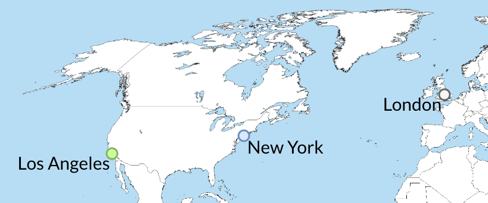
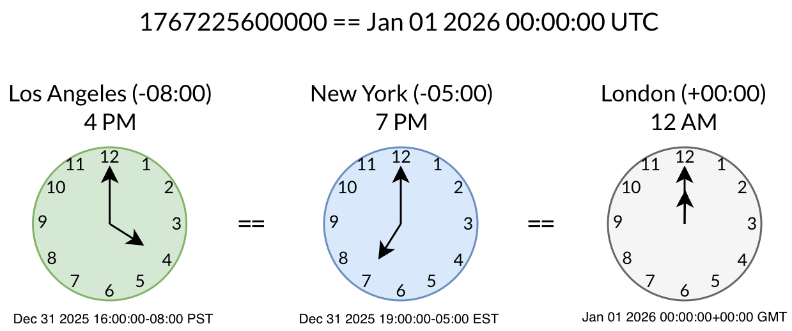

# The Practical Backend Engineer
## Twitch Chat Hit Counter
## Module 5: Twitch API
### Additional Learning Materials

## Overview

<br>

## Objective
<br>

In **Module 5**, we will now be integrating with the public Twitch API. Instead of triggering the pipeline through HTTP requests, we will setup a pipeline to stream realtime chat messages from Twitch Chat.
We will use everything we've learned up to this point to accomplish this.

<br>

## Lab Setup
### Create Kafka Topic: `twitch-chat-events`
1. Navigate to the _**Clusters/twitch-chat-hit-counter/Topics**_ folder
2. Click '+' to add a new kafka topic
3. Input kafka topic configs:
    1. **Topic name**: twitch-chat-events<br>
    2. **Partition Count**: 3<br>
    3. **Replica Count**: 1
4. Select our kafka topic in **_Clusters/twitch-chat-hit-counter/Topics/twitch-chat-events_**
5. Change the **Content Types** for the key and value from **'Byte Array'** → **'String'**, and save by clicking **Update**.

<br>

<br>

### Create SQL Table: `dev_db.twitch_chat_events`
1. Click on **Schemas** tab
2. Navigate to **dev_db** → **Tables**
3. In the **SQL Editor**, run:
```
CREATE TABLE dev_db.twitch_chat_events (
    event_id VARCHAR(255) PRIMARY KEY,
    event_ts BIGINT,
    channel_id VARCHAR(255),
    channel_name VARCHAR(255),
    user_id VARCHAR(255),
    username VARCHAR(255),
    subscription_months INT,
    subscription_tier INT,
    message TEXT
)
```
<br>

<br>

### [Getting Started with the Twitch API ](https://dev.twitch.tv/docs/api/get-started/)
1. Create a [Twitch.tv ](https://www.twitch.tv/) account
2. Login to [Twitch Developers Console ](https://dev.twitch.tv/console)
3. Under **Applications**, click on [Register Your Application ](https://dev.twitch.tv/console/apps/create).
    - **Name**: `Chat Hit Counter`
    - **OAuth Redirect URLs**: `http://localhost:8080/oauth2/callback`
    - **Category**: `Chat Bot`
    - **Client Type**: `Confidential`

<br>

4. You should now see your application created. Click **Manage**.

5. Create a **New Secret**. Copy both of the **Client ID** and the **Client Secret**. This will be needed to access the Twitch API in our application.

<br>

<br>

## File Structure
For `Module 5`, the below file structure are all the relevant files needed.

 twitch-chat-hit-counter/<br>
&nbsp;&nbsp;&nbsp;&nbsp;&nbsp;
 src/<br>
&nbsp;&nbsp;&nbsp;&nbsp;&nbsp;&nbsp;&nbsp;&nbsp;&nbsp;&nbsp;
 main/<br>
&nbsp;&nbsp;&nbsp;&nbsp;&nbsp;&nbsp;&nbsp;&nbsp;&nbsp;&nbsp;&nbsp;&nbsp;&nbsp;&nbsp;&nbsp;
 java/<br>
&nbsp;&nbsp;&nbsp;&nbsp;&nbsp;&nbsp;&nbsp;&nbsp;&nbsp;&nbsp;&nbsp;&nbsp;&nbsp;&nbsp;&nbsp;&nbsp;&nbsp;&nbsp;&nbsp;&nbsp;
 com.sonahlab.twitch_chat_hit_counter/<br>
&nbsp;&nbsp;&nbsp;&nbsp;&nbsp;&nbsp;&nbsp;&nbsp;&nbsp;&nbsp;&nbsp;&nbsp;&nbsp;&nbsp;&nbsp;&nbsp;&nbsp;&nbsp;&nbsp;&nbsp;&nbsp;&nbsp;&nbsp;&nbsp;&nbsp;
 config/<br>
&nbsp;&nbsp;&nbsp;&nbsp;&nbsp;&nbsp;&nbsp;&nbsp;&nbsp;&nbsp;&nbsp;&nbsp;&nbsp;&nbsp;&nbsp;&nbsp;&nbsp;&nbsp;&nbsp;&nbsp;&nbsp;&nbsp;&nbsp;&nbsp;&nbsp;&nbsp;&nbsp;&nbsp;&nbsp;&nbsp;
 RedisConfig.java<br>
&nbsp;&nbsp;&nbsp;&nbsp;&nbsp;&nbsp;&nbsp;&nbsp;&nbsp;&nbsp;&nbsp;&nbsp;&nbsp;&nbsp;&nbsp;&nbsp;&nbsp;&nbsp;&nbsp;&nbsp;&nbsp;&nbsp;&nbsp;&nbsp;&nbsp;&nbsp;&nbsp;&nbsp;&nbsp;&nbsp;
 TwitchConfig.java<br>
&nbsp;&nbsp;&nbsp;&nbsp;&nbsp;&nbsp;&nbsp;&nbsp;&nbsp;&nbsp;&nbsp;&nbsp;&nbsp;&nbsp;&nbsp;&nbsp;&nbsp;&nbsp;&nbsp;&nbsp;&nbsp;&nbsp;&nbsp;&nbsp;&nbsp;
 kafka/<br>
&nbsp;&nbsp;&nbsp;&nbsp;&nbsp;&nbsp;&nbsp;&nbsp;&nbsp;&nbsp;&nbsp;&nbsp;&nbsp;&nbsp;&nbsp;&nbsp;&nbsp;&nbsp;&nbsp;&nbsp;&nbsp;&nbsp;&nbsp;&nbsp;&nbsp;&nbsp;&nbsp;&nbsp;&nbsp;&nbsp;
 consumer/<br>
&nbsp;&nbsp;&nbsp;&nbsp;&nbsp;&nbsp;&nbsp;&nbsp;&nbsp;&nbsp;&nbsp;&nbsp;&nbsp;&nbsp;&nbsp;&nbsp;&nbsp;&nbsp;&nbsp;&nbsp;&nbsp;&nbsp;&nbsp;&nbsp;&nbsp;&nbsp;&nbsp;&nbsp;&nbsp;&nbsp;&nbsp;&nbsp;&nbsp;&nbsp;&nbsp;
 TwitchChatEventConsumer.java<br>
&nbsp;&nbsp;&nbsp;&nbsp;&nbsp;&nbsp;&nbsp;&nbsp;&nbsp;&nbsp;&nbsp;&nbsp;&nbsp;&nbsp;&nbsp;&nbsp;&nbsp;&nbsp;&nbsp;&nbsp;&nbsp;&nbsp;&nbsp;&nbsp;&nbsp;&nbsp;&nbsp;&nbsp;&nbsp;&nbsp;
 producer/<br>
&nbsp;&nbsp;&nbsp;&nbsp;&nbsp;&nbsp;&nbsp;&nbsp;&nbsp;&nbsp;&nbsp;&nbsp;&nbsp;&nbsp;&nbsp;&nbsp;&nbsp;&nbsp;&nbsp;&nbsp;&nbsp;&nbsp;&nbsp;&nbsp;&nbsp;&nbsp;&nbsp;&nbsp;&nbsp;&nbsp;&nbsp;&nbsp;&nbsp;&nbsp;&nbsp;
 TwitchChatEventProducer.java<br>
&nbsp;&nbsp;&nbsp;&nbsp;&nbsp;&nbsp;&nbsp;&nbsp;&nbsp;&nbsp;&nbsp;&nbsp;&nbsp;&nbsp;&nbsp;&nbsp;&nbsp;&nbsp;&nbsp;&nbsp;&nbsp;&nbsp;&nbsp;&nbsp;&nbsp;
 model/<br>
&nbsp;&nbsp;&nbsp;&nbsp;&nbsp;&nbsp;&nbsp;&nbsp;&nbsp;&nbsp;&nbsp;&nbsp;&nbsp;&nbsp;&nbsp;&nbsp;&nbsp;&nbsp;&nbsp;&nbsp;&nbsp;&nbsp;&nbsp;&nbsp;&nbsp;&nbsp;&nbsp;&nbsp;&nbsp;&nbsp;
 EventType.java<br>
&nbsp;&nbsp;&nbsp;&nbsp;&nbsp;&nbsp;&nbsp;&nbsp;&nbsp;&nbsp;&nbsp;&nbsp;&nbsp;&nbsp;&nbsp;&nbsp;&nbsp;&nbsp;&nbsp;&nbsp;&nbsp;&nbsp;&nbsp;&nbsp;&nbsp;&nbsp;&nbsp;&nbsp;&nbsp;&nbsp;
 Granularity.java<br>
&nbsp;&nbsp;&nbsp;&nbsp;&nbsp;&nbsp;&nbsp;&nbsp;&nbsp;&nbsp;&nbsp;&nbsp;&nbsp;&nbsp;&nbsp;&nbsp;&nbsp;&nbsp;&nbsp;&nbsp;&nbsp;&nbsp;&nbsp;&nbsp;&nbsp;&nbsp;&nbsp;&nbsp;&nbsp;&nbsp;
 TwitchChatEvent.java<br>
&nbsp;&nbsp;&nbsp;&nbsp;&nbsp;&nbsp;&nbsp;&nbsp;&nbsp;&nbsp;&nbsp;&nbsp;&nbsp;&nbsp;&nbsp;&nbsp;&nbsp;&nbsp;&nbsp;&nbsp;&nbsp;&nbsp;&nbsp;&nbsp;&nbsp;
 redis/<br>
&nbsp;&nbsp;&nbsp;&nbsp;&nbsp;&nbsp;&nbsp;&nbsp;&nbsp;&nbsp;&nbsp;&nbsp;&nbsp;&nbsp;&nbsp;&nbsp;&nbsp;&nbsp;&nbsp;&nbsp;&nbsp;&nbsp;&nbsp;&nbsp;&nbsp;&nbsp;&nbsp;&nbsp;&nbsp;&nbsp;
 dao/<br>
&nbsp;&nbsp;&nbsp;&nbsp;&nbsp;&nbsp;&nbsp;&nbsp;&nbsp;&nbsp;&nbsp;&nbsp;&nbsp;&nbsp;&nbsp;&nbsp;&nbsp;&nbsp;&nbsp;&nbsp;&nbsp;&nbsp;&nbsp;&nbsp;&nbsp;&nbsp;&nbsp;&nbsp;&nbsp;&nbsp;&nbsp;&nbsp;&nbsp;&nbsp;&nbsp;
 RedisDao.java<br>
&nbsp;&nbsp;&nbsp;&nbsp;&nbsp;&nbsp;&nbsp;&nbsp;&nbsp;&nbsp;&nbsp;&nbsp;&nbsp;&nbsp;&nbsp;&nbsp;&nbsp;&nbsp;&nbsp;&nbsp;&nbsp;&nbsp;&nbsp;&nbsp;&nbsp;&nbsp;&nbsp;&nbsp;&nbsp;&nbsp;
 EventDeduperRedisService.java<br>
&nbsp;&nbsp;&nbsp;&nbsp;&nbsp;&nbsp;&nbsp;&nbsp;&nbsp;&nbsp;&nbsp;&nbsp;&nbsp;&nbsp;&nbsp;&nbsp;&nbsp;&nbsp;&nbsp;&nbsp;&nbsp;&nbsp;&nbsp;&nbsp;&nbsp;&nbsp;&nbsp;&nbsp;&nbsp;&nbsp;
 TwitchChatAggregationRedisService.java<br>
&nbsp;&nbsp;&nbsp;&nbsp;&nbsp;&nbsp;&nbsp;&nbsp;&nbsp;&nbsp;&nbsp;&nbsp;&nbsp;&nbsp;&nbsp;&nbsp;&nbsp;&nbsp;&nbsp;&nbsp;&nbsp;&nbsp;&nbsp;&nbsp;&nbsp;
 rest/<br>
&nbsp;&nbsp;&nbsp;&nbsp;&nbsp;&nbsp;&nbsp;&nbsp;&nbsp;&nbsp;&nbsp;&nbsp;&nbsp;&nbsp;&nbsp;&nbsp;&nbsp;&nbsp;&nbsp;&nbsp;&nbsp;&nbsp;&nbsp;&nbsp;&nbsp;&nbsp;&nbsp;&nbsp;&nbsp;&nbsp;
 TwitchRestController.java<br>
&nbsp;&nbsp;&nbsp;&nbsp;&nbsp;&nbsp;&nbsp;&nbsp;&nbsp;&nbsp;&nbsp;&nbsp;&nbsp;&nbsp;&nbsp;&nbsp;&nbsp;&nbsp;&nbsp;&nbsp;&nbsp;&nbsp;&nbsp;&nbsp;&nbsp;
 sql/<br>
&nbsp;&nbsp;&nbsp;&nbsp;&nbsp;&nbsp;&nbsp;&nbsp;&nbsp;&nbsp;&nbsp;&nbsp;&nbsp;&nbsp;&nbsp;&nbsp;&nbsp;&nbsp;&nbsp;&nbsp;&nbsp;&nbsp;&nbsp;&nbsp;&nbsp;&nbsp;&nbsp;&nbsp;&nbsp;&nbsp;
 TwitchChatSqlService.java<br>
&nbsp;&nbsp;&nbsp;&nbsp;&nbsp;&nbsp;&nbsp;&nbsp;&nbsp;&nbsp;&nbsp;&nbsp;&nbsp;&nbsp;&nbsp;&nbsp;&nbsp;&nbsp;&nbsp;&nbsp;&nbsp;&nbsp;&nbsp;&nbsp;&nbsp;
 twitch/<br>
&nbsp;&nbsp;&nbsp;&nbsp;&nbsp;&nbsp;&nbsp;&nbsp;&nbsp;&nbsp;&nbsp;&nbsp;&nbsp;&nbsp;&nbsp;&nbsp;&nbsp;&nbsp;&nbsp;&nbsp;&nbsp;&nbsp;&nbsp;&nbsp;&nbsp;&nbsp;&nbsp;&nbsp;&nbsp;&nbsp;
 TwitchChatBotManager.java<br>
&nbsp;&nbsp;&nbsp;&nbsp;&nbsp;&nbsp;&nbsp;&nbsp;&nbsp;&nbsp;&nbsp;&nbsp;&nbsp;&nbsp;&nbsp;&nbsp;&nbsp;&nbsp;&nbsp;&nbsp;&nbsp;&nbsp;&nbsp;&nbsp;&nbsp;
 utils/<br>
&nbsp;&nbsp;&nbsp;&nbsp;&nbsp;&nbsp;&nbsp;&nbsp;&nbsp;&nbsp;&nbsp;&nbsp;&nbsp;&nbsp;&nbsp;&nbsp;&nbsp;&nbsp;&nbsp;&nbsp;&nbsp;&nbsp;&nbsp;&nbsp;&nbsp;&nbsp;&nbsp;&nbsp;&nbsp;&nbsp;
 TwitchApiUtils.java<br>
&nbsp;&nbsp;&nbsp;&nbsp;&nbsp;&nbsp;&nbsp;&nbsp;&nbsp;&nbsp;&nbsp;&nbsp;&nbsp;&nbsp;&nbsp;
 resources/<br>
&nbsp;&nbsp;&nbsp;&nbsp;&nbsp;&nbsp;&nbsp;&nbsp;&nbsp;&nbsp;&nbsp;&nbsp;&nbsp;&nbsp;&nbsp;&nbsp;&nbsp;&nbsp;&nbsp;&nbsp;
 application.yml<br>
&nbsp;&nbsp;&nbsp;&nbsp;&nbsp;&nbsp;&nbsp;&nbsp;&nbsp;&nbsp;&nbsp;&nbsp;&nbsp;&nbsp;&nbsp;&nbsp;&nbsp;&nbsp;&nbsp;&nbsp;
 twitch-key.properties<br>
&nbsp;&nbsp;&nbsp;&nbsp;&nbsp;&nbsp;&nbsp;&nbsp;&nbsp;&nbsp;
 test/<br>
&nbsp;&nbsp;&nbsp;&nbsp;&nbsp;&nbsp;&nbsp;&nbsp;&nbsp;&nbsp;&nbsp;&nbsp;&nbsp;&nbsp;&nbsp;
 java/<br>
&nbsp;&nbsp;&nbsp;&nbsp;&nbsp;&nbsp;&nbsp;&nbsp;&nbsp;&nbsp;&nbsp;&nbsp;&nbsp;&nbsp;&nbsp;&nbsp;&nbsp;&nbsp;&nbsp;&nbsp;
 com.sonahlab.twitch_chat_hit_counter/<br>
&nbsp;&nbsp;&nbsp;&nbsp;&nbsp;&nbsp;&nbsp;&nbsp;&nbsp;&nbsp;&nbsp;&nbsp;&nbsp;&nbsp;&nbsp;&nbsp;&nbsp;&nbsp;&nbsp;&nbsp;&nbsp;&nbsp;&nbsp;&nbsp;&nbsp;
 config/<br>
&nbsp;&nbsp;&nbsp;&nbsp;&nbsp;&nbsp;&nbsp;&nbsp;&nbsp;&nbsp;&nbsp;&nbsp;&nbsp;&nbsp;&nbsp;&nbsp;&nbsp;&nbsp;&nbsp;&nbsp;&nbsp;&nbsp;&nbsp;&nbsp;&nbsp;&nbsp;&nbsp;&nbsp;&nbsp;&nbsp;
 RedisConfigTest.java<br>
&nbsp;&nbsp;&nbsp;&nbsp;&nbsp;&nbsp;&nbsp;&nbsp;&nbsp;&nbsp;&nbsp;&nbsp;&nbsp;&nbsp;&nbsp;&nbsp;&nbsp;&nbsp;&nbsp;&nbsp;&nbsp;&nbsp;&nbsp;&nbsp;&nbsp;&nbsp;&nbsp;&nbsp;&nbsp;&nbsp;
 TwitchConfigTest.java<br>
&nbsp;&nbsp;&nbsp;&nbsp;&nbsp;&nbsp;&nbsp;&nbsp;&nbsp;&nbsp;&nbsp;&nbsp;&nbsp;&nbsp;&nbsp;&nbsp;&nbsp;&nbsp;&nbsp;&nbsp;&nbsp;&nbsp;&nbsp;&nbsp;&nbsp;
 kafka/<br>
&nbsp;&nbsp;&nbsp;&nbsp;&nbsp;&nbsp;&nbsp;&nbsp;&nbsp;&nbsp;&nbsp;&nbsp;&nbsp;&nbsp;&nbsp;&nbsp;&nbsp;&nbsp;&nbsp;&nbsp;&nbsp;&nbsp;&nbsp;&nbsp;&nbsp;&nbsp;&nbsp;&nbsp;&nbsp;&nbsp;
 consumer/<br>
&nbsp;&nbsp;&nbsp;&nbsp;&nbsp;&nbsp;&nbsp;&nbsp;&nbsp;&nbsp;&nbsp;&nbsp;&nbsp;&nbsp;&nbsp;&nbsp;&nbsp;&nbsp;&nbsp;&nbsp;&nbsp;&nbsp;&nbsp;&nbsp;&nbsp;&nbsp;&nbsp;&nbsp;&nbsp;&nbsp;&nbsp;&nbsp;&nbsp;&nbsp;&nbsp;
 TwitchChatEventConsumerTest.java<br>
&nbsp;&nbsp;&nbsp;&nbsp;&nbsp;&nbsp;&nbsp;&nbsp;&nbsp;&nbsp;&nbsp;&nbsp;&nbsp;&nbsp;&nbsp;&nbsp;&nbsp;&nbsp;&nbsp;&nbsp;&nbsp;&nbsp;&nbsp;&nbsp;&nbsp;&nbsp;&nbsp;&nbsp;&nbsp;&nbsp;
 producer/<br>
&nbsp;&nbsp;&nbsp;&nbsp;&nbsp;&nbsp;&nbsp;&nbsp;&nbsp;&nbsp;&nbsp;&nbsp;&nbsp;&nbsp;&nbsp;&nbsp;&nbsp;&nbsp;&nbsp;&nbsp;&nbsp;&nbsp;&nbsp;&nbsp;&nbsp;&nbsp;&nbsp;&nbsp;&nbsp;&nbsp;&nbsp;&nbsp;&nbsp;&nbsp;&nbsp;
 TwitchChatEventProducerTest.java<br>
&nbsp;&nbsp;&nbsp;&nbsp;&nbsp;&nbsp;&nbsp;&nbsp;&nbsp;&nbsp;&nbsp;&nbsp;&nbsp;&nbsp;&nbsp;&nbsp;&nbsp;&nbsp;&nbsp;&nbsp;&nbsp;&nbsp;&nbsp;&nbsp;&nbsp;
 redis/<br>
&nbsp;&nbsp;&nbsp;&nbsp;&nbsp;&nbsp;&nbsp;&nbsp;&nbsp;&nbsp;&nbsp;&nbsp;&nbsp;&nbsp;&nbsp;&nbsp;&nbsp;&nbsp;&nbsp;&nbsp;&nbsp;&nbsp;&nbsp;&nbsp;&nbsp;&nbsp;&nbsp;&nbsp;&nbsp;&nbsp;
 TwitchChatAggregationRedisServiceTest.java<br>
&nbsp;&nbsp;&nbsp;&nbsp;&nbsp;&nbsp;&nbsp;&nbsp;&nbsp;&nbsp;&nbsp;&nbsp;&nbsp;&nbsp;&nbsp;&nbsp;&nbsp;&nbsp;&nbsp;&nbsp;&nbsp;&nbsp;&nbsp;&nbsp;&nbsp;
 sql/<br>
&nbsp;&nbsp;&nbsp;&nbsp;&nbsp;&nbsp;&nbsp;&nbsp;&nbsp;&nbsp;&nbsp;&nbsp;&nbsp;&nbsp;&nbsp;&nbsp;&nbsp;&nbsp;&nbsp;&nbsp;&nbsp;&nbsp;&nbsp;&nbsp;&nbsp;&nbsp;&nbsp;&nbsp;&nbsp;&nbsp;
 TwitchChatSqlService.java<br>
&nbsp;&nbsp;&nbsp;&nbsp;&nbsp;&nbsp;&nbsp;&nbsp;&nbsp;&nbsp;&nbsp;&nbsp;&nbsp;&nbsp;&nbsp;&nbsp;&nbsp;&nbsp;&nbsp;&nbsp;&nbsp;&nbsp;&nbsp;&nbsp;&nbsp;
 twitch/<br>
&nbsp;&nbsp;&nbsp;&nbsp;&nbsp;&nbsp;&nbsp;&nbsp;&nbsp;&nbsp;&nbsp;&nbsp;&nbsp;&nbsp;&nbsp;&nbsp;&nbsp;&nbsp;&nbsp;&nbsp;&nbsp;&nbsp;&nbsp;&nbsp;&nbsp;&nbsp;&nbsp;&nbsp;&nbsp;&nbsp;
 TwitchChatBotManagerTest.java<br>
&nbsp;&nbsp;&nbsp;&nbsp;&nbsp;&nbsp;&nbsp;&nbsp;&nbsp;&nbsp;&nbsp;&nbsp;&nbsp;&nbsp;&nbsp;&nbsp;&nbsp;&nbsp;&nbsp;&nbsp;&nbsp;&nbsp;&nbsp;&nbsp;&nbsp;
 PropertiesApplicationTest.java<br>

<br>

## Exercise 1: Configure Twitch API keys
1. In `twitchApiKey.yml`, set the following fields from setting up a new application from the **Twitch Developer Console**:
   1. **twitch-api.client-id**
   2. **twitch-api.client-secret**
2. In `TwitchConfig.java`, implement:
   1. `getTwitchApiClientId()`
   2. `getTwitchApiClientSecret()`

This yaml file is already added in **.gitignore**, so your keys _**will not and should not**_ be published to Github.

### Testing
- [ ] Open `TwitchConfigTest.java` ─ already implemented and tests that the loaded TwitchConfig matches the values in `twitch-key.properties`.
- [ ] Remove `@Disabled` in `TwitchConfigTest::testTwitchClientKeys`
- [ ] Test with:
    ```shell
    ./gradlew test --tests "*" -Djunit.jupiter.tags=Module5
    ```

<br>

#


## Exercise 2: `TwitchConfig::twitchClient`
In `TwitchConfig.java`, implement `twitchClient()`.

Return Twitch4J's [Twitch4J ](https://twitch4j.github.io/), which will be our client proxy to call into Twitch's API.

Twitch4J is an open source Java library that abstracts away a lot of the details when integrating with the Twitch API.

**Requirements:**
1. Initialize the `TwitchClient` object with your Twitch API ClientId, Client Secret.
2. Helix should be enabled
3. Chat should be enabled

```java
TwitchClient twitchClient = TwitchClientBuilder.builder()
            .withEnableHelix(true)
            .build();
```

> [!IMPORTANT]
>
> When integrating with 3P APIs there is _always_ a bit of discovery work involved. Whether it's a publicly exposed API or a private API (direct B2B integration),
> I always spend a large amount of time understanding how to integrate with the API and what data/endpoints are available.
> Best advice is to keep learning by doing and spending time struggling through blocks.


<br>

#

## Exercise 3: Twitch Chat Connection
<br>

Since we're building a hit counter on different streamers' Twitch chats, we will need to learn how to integrate our application with the Twitch Chat as a [ChatBot ](https://dev.twitch.tv/docs/chat/send-receive-messages/).<br>

We will focus mainly on receiving Twitch Chat message. The API docs details on different way of connecting to Chats using Webhooks and Websockets, but that is outside the scope of this project.
Spend time reading through the Twitch Chat section.


### Task 1: `TwitchChatBotManager`
Our `TwitchChatBotManager.java` will be a very simple Chat Bot in charge of:
- joining/leaving twitch channels
- retrieving all the channels it's connected to
- ingesting in real-time the incoming twitch chat event message for the channels our application is connected to

> [!TIP]
> 
> R.T.F.M for [TwitchClient ](https://twitch4j.github.io/javadoc/com/github/twitch4j/TwitchClient.html)
> to see which methods you should be calling in the various methods you need to implement.

<br>

#


### Task 1 Part I: Constructor
In `TwitchChatBotManager.java`, implement the constructor: `TwitchChatBotManager()`.

**Requirements**:
- DI the `TwitchClient` from `TwitchConfig`

### Testing
- [ ] Open `TwitchChatBotManagerTest.java` ─ already implemented.
- [ ] Uncomment this line: `//twitchChatBotManager = new TwitchChatBotManager(mockTwitchClient);`
    We will be able to compile and test this class in the future parts

#


### Task 1 Part II: `TwitchChatBotManager::joinChannel`
In `TwitchChatBotManager.java`, implement `joinChannel(String channelName)`. This method will connect your Chat Bot to the Twitch streamer's channel by `channelName`.

`TwitchClient` has an API for [TwitchChat ](https://twitch4j.github.io/javadoc/com/github/twitch4j/chat/TwitchChat.html)
you should use.

### Testing
- [ ] Open `TwitchChatBotManagerTest.java` ─ already implemented and tests that the correct `TwitchClient` method is called.
- [ ] Uncomment this line: `//twitchChatBotManager = new TwitchChatBotManager(mockTwitchClient);`
- [ ] Remove `@Disabled` in `TwitchChatBotManagerTest::joinChannelTest`
- [ ] Test with:
    ```shell
    ./gradlew test --tests "*" -Djunit.jupiter.tags=Module5
    ```

#

### Task 1 Part III: `TwitchChatBotManager::leaveChannel`
In `TwitchChatBotManager.java`, implement `leaveChannel(String channelName)`. This method will disconnect your Chat Bot from the Twitch streamer's channel by `channelName`.

Return a `boolean` on whether your Chat Bot successfully disconnected from the Twitch streamer's channel.

`TwitchClient` has an API for [TwitchChat ](https://twitch4j.github.io/javadoc/com/github/twitch4j/chat/TwitchChat.html)
you should use.

### Testing
- [ ] Open `TwitchChatBotManagerTest.java` ─ already implemented and tests that the correct `TwitchClient` method is called.
- [ ] Remove `@Disabled` in `TwitchChatBotManagerTest::leaveChannelTest`
- [ ] Test with:
    ```shell
    ./gradlew test --tests "*" -Djunit.jupiter.tags=Module5
    ```

#


### Task 1 Part IV: `TwitchChatEvent`
In `TwitchChatEvent.java`, implement the DTO definition.

Twitch4J library has its own event — [`ChannelMessageEvent` ](https://twitch4j.github.io/javadoc/com/github/twitch4j/chat/events/channel/ChannelMessageEvent.html) — but this class has a lot of additional metadata fields that we won't need for our project.<br>
We will define our own DTO — `TwitchChatEvent.java` — which will be a simplified version of Twitch4J's `ChannelMessageEvent` object.

**Requirements:**
1. `eventId (String)`: eventId for the ChannelMessageEvent
2. `eventTs (long)`: timestamp millis of when the chat message was sent
3. `channelId (String)`: channel id on Twitch
4. `channelName (String)`: channel name on Twitch
5. `userId (String)`: user id on Twitch of the sender of the message
6. `username (String)`: channel name on Twitch
7. `subscriptionMonths (int)`: months the user who is chatting has been subscribed to the channel for
8. `subscriptionTier (int)`: tier level of the user who is chatting has subscribed to (1, 2, 3)
9. `message (String)`: message content that the user sent to the chat

### Example 1:
> **Input**:
> ```
> ChannelMessageEvent(
>   super=AbstractChannelMessageEvent(
>     messageEvent=IRCMessageEvent(
>       escapedTags={
>         client-nonce=2cd308dd-0203-4523-92a2-94b29efe742a,
>         user-type=,
>         tmi-sent-ts=1766215158535,
>         reply-thread-parent-msg-id=bd270b9a-ccc0-469b-8b37-a077bbd045f8,
>         mod=0,
>         color=#1E90FF,
>         reply-parent-display-name=red_tomato,
>         turbo=0,
>         flags=,
>         reply-parent-user-id=1372621742,
>         reply-thread-parent-display-name=alice1338,
>         reply-thread-parent-user-login=alice1338,
>         reply-parent-user-login=red_tomato,
>         id=0068ae70-0263-4d49-84c2-c87fe824aa1a, // eventId
>         reply-parent-msg-id=5e28c374-a135-4933-b4a9-865a01e3f8d6,
>         returning-chatter=0,
>         subscriber=0,
>         reply-thread-parent-user-id=1105331229,
>         user-id=1105331229,
>         badges=,
>         reply-parent-msg-body=@alice1338\ssame\slol,
>         room-id=267160288,
>         display-name=alice1338,
>         emotes=,
>         first-msg=0,
>         badge-info=
>       },
>       badges={},
>       badgeInfo={},
>       clientName=Optional[alice1338],
>       commandType=PRIVMSG,
>       channelId=267160288,
>       channelName=Optional[s0mcs],
>       message=Optional[@red_tomato No I almost beat it though],
>       payload=Optional[:@red_tomato No I almost beat it though],
>       clientPermissions=[EVERYONE],
>       flags=[],
>       rawMessage=@badge-info=;badges=;client-nonce=2cd308dd-0203-4523-92a2-94b29efe742a;color=#1E90FF;display-name=alice1338;emotes=;first-msg=0;flags=;id=0068ae70-0263-4d49-84c2-c87fe824aa1a;mod=0;reply-parent-display-name=red_tomato;reply-parent-msg-body=@alice1338\ssame\slol;reply-parent-msg-id=5e28c374-a135-4933-b4a9-865a01e3f8d6;reply-parent-user-id=1372621742;reply-parent-user-login=red_tomato;reply-thread-parent-display-name=alice1338;reply-thread-parent-msg-id=bd270b9a-ccc0-469b-8b37-a077bbd045f8;reply-thread-parent-user-id=1105331229;reply-thread-parent-user-login=alice1338;returning-chatter=0;room-id=267160288;subscriber=0;tmi-sent-ts=1766215158535;turbo=0;user-id=1105331229;user-type= :alice1338!alice1338@alice1338.tmi.twitch.tv PRIVMSG #s0mcs :@red_tomato No I almost beat it though,
>       botOwnerIds=[]
>     ),
>     user=EventUser(
>       id=1105331229,
>       name=alice1338
>     ),
>     message=@red_tomato No I almost beat it though,
>     subscriberMonths=0,
>     subscriptionTier=0,
>     nonce=2cd308dd-0203-4523-92a2-94b29efe742a
>   ),
>   replyInfo=ChatReply(
>     messageId=5e28c374-a135-4933-b4a9-865a01e3f8d6,
>     messageBody=@alice1338 same lol,
>     userId=1372621742,
>     userLogin=red_tomato,
>     displayName=red_tomato,
>     threadMessageId=bd270b9a-ccc0-469b-8b37-a077bbd045f8,
>     threadUserLogin=alice1338,
>     threadUserName=alice1338
>   ),
>   chantInfo=null
> )
> ```
> 
> **Output:**
> ```
> TwitchChatEvent[
>   eventId=0068ae70-0263-4d49-84c2-c87fe824aa1a,
>   message=@red_tomato No I almost beat it though,
>   eventTs=1766215158119,
>   userId=1105331229,
>   username=alice1338,
>   channelId=267160288,
>   channelName=s0mcs,
>   subscriptionMonths=0,
>   subscriptionTier=0
> ]
> ```

#

### Task 1 Part V: `TwitchChatBotManager::handleChatMessage`
In `TwitchChatBotManager.java`, implement `handleChatMessage(ChannelMessageEvent event)`. This method will be the main event handler for each incoming, real-time chat message for all the channels that our ChatBot is connected to.

**Requirements**:
1. Convert the incoming `ChannelMessageEvent` → `TwitchChatEvent`
2. Log `TwitchChatEvent` to _**stdout**_

### Example 1:
> **Input**:<br>
> ```java
> TwitchChatBotManager service; // Assume initialized
> ChannelMessageEvent event = new ChannelMessageEvent(
>     new EventChannel("channelId123", "s0mcs"),
>     new IRCMessageEvent(...), // other metadata fields
>     new EventUser("userId123", "Alice"),
>     "Hi s0m, it's Alice"
> );
> service.handleMessage(channelMessageEvent);
> ```
> **stdout**:<br>
> ```
> TwitchChatEvent[
>     eventId="eventId1",
>     eventTs=1764184492277,
>     channelId="channelId123",
>     channelName="s0mcs",
>     userId="userId123",
>     username="Alice",
>     subscriptionMonths=27,
>     subscriptionTier=1
>     message="Hi s0m, it's Alice",
> ]
> ```


### Task 1 Part VI: `TwitchChatBotManager::getJoinedChannels`
In `TwitchChatBotManager.java`, implement `getJoinedChannels(String username)`. This method takes in a `username`, which should just be **your** Twitch Account's Username when being called in a later task.

Return a `Set<String>` for your Chat Bot's currently joined channels.

> [!IMPORTANT]
>
> For Module 5 we will keep it very simple and hardcode some channels.<br>
> Module 6 will build on this, and you will implement the actual intended logic.

**Requirements**:
- Pick a couple of currently Live Twitch Streamers, with active chats, and hardcode their channel names into a `Set<String>`


### Task 1 Part VII: `TwitchChatBotManager::initChannelsToJoin`
In `TwitchChatBotManager.java`, implement `initChannelsToJoin()`. This method is intended to be called on application start up during the initialization process for `TwitchChatBotManager`.

**Requirements**:
- Get the joined channels (should be hardcoded at this point)
- Connect your `TwitchClient` to join channels on startup


### Task 1 Part VIII: `TwitchChatBotManager::init`
In `TwitchChatBotManager.java`, implement the PostConstructor: `init()`. This PostConstructor will run after the constructor.

**Requirements**:
- Connect your `TwitchClient` to handle the incoming messages
    - Hint: https://twitch4j.github.io/events/channel-message-event
- Invoke `initChannelsToJoin()`

### E2E Tests
- [ ] Run the application:
    ```shell
    ./gradlew bootRun
    ```
- [ ] Open up the Twitch Stream for any of the hardcoded channel names defined in `getChannelsJoined()`
- [ ] Your ChatBot should connect/listen to all the hardcoded channel names defined in `getChannelsJoined()`
- [ ] Verify that incoming Twitch stream chat messages matches the logged output in stdout from `handleChatMessage()`
- [ ] TODO: INPUT screenshots

<br>

## Exercise 4: Kafka
<br>

Now that we have a simple working ChatBot, you need to build a Kafka producer/consumer to publish these `TwitchChatEvent` to a new separate kafka topic.

This will be very similar to **Module 2** with the Producer/Consumer on the `greeting-events` kafka topic.<br>
This exercise will be kept short, and it's up to you to make your application achieve the end state in the diagram above.

**Goals:**
1. Publish `TwitchChatEvent` to `twitch-chat-events` topic
2. Consume `TwitchChatEvent` from `twitch-chat-events` topic and log them to **stdout**

> [!NOTE]
> 
> The main differences from **Module 2** is the producer trigger logic. In **Module 2**, we needed to manually trigger an HTTP request (`POST /api/kafka/publishGreetingEvent`) via Swagger to invoke our Producer to publish event(s). 
> The event handler — `TwitchChatBotManager.handleMessage()` — is now the automated trigger for the `TwitchChatEventProducer.java`. Once we join a channel and attach the event listener,
> the TwitchClient will stream, in real-time, the incoming chat messages that we need to publish to `twitch-chat-events` topics. No more manual trigger, fully automated.

### Task 1: add new kafka topic name to `application.yml`
```yaml
twitch-chat-hit-counter:
  kafka:
    twitch-chat-topic:
      twitch-chat-events
```

### Testing
- [ ] Open `PropertiesApplicationTest.java` ─ already implemented to test the properties above.
- [ ] Remove `@Disabled` in `PropertiesApplicationTest::kafkaTwitchChatTopicNameTest`
- [ ] Test with:
    ```shell
    ./gradlew test --tests "*" -Djunit.jupiter.tags=Module5
    ```

### Task 2: Kafka Producer

### Task 2 Part I: `TwitchChatEventProducer`
In `TwitchChatEventProducer.java`, implement:
- the constructor: `TwitchChatEventProducer()`
- `topicName()`

You'll notice that our initial implementation of `AbstractEventProducer.publish()` from **Module 2** takes care of writing events to a generic topic.
This is where our abstract class, `AbstractEventProducer.java`, pays dividends. We don't need to repeat code and can leverage implementing the main logic in one parent class, and all it's children will benefit.

**Requirements:**
1. DI the `twitch-chat-topic` name from `application.yml`
2. `topicName()` should return the same DI'ed `twitch-chat-topic`

### Example 1:
> **Input**:<br>
> ```java
> TwitchChatEventProducer producer; // Assume initialized
> String eventId = "UUID1";
> TwitchChatEvent event = new TwitchChatEvent(eventId, 1767254400000L, "channelId123", "s0mcs", "userId123", "Alice", 12, 1, "Hi s0m, it's alice");
> boolean output1 = producer.publish(eventId, event);
> 
> String eventId2 = "UUID2";
> TwitchChatEvent event2 = new TwitchChatEvent(eventId2, 1767254400000L, "channelId123", "s0mcs", "userId456", "Bob", null, null, "chat gift me a sub");
> boolean output2 = producer.publish(eventId2, event2);
> ```
> 
> **Output1**: `true`<br>
> **Output2**: `true`

#

### Integration Tests
- [ ] Open `TwitchChatEventProducerTest.java` ─ already implemented test cases with the example(s) above.
- [ ] Uncomment the entire file (Did this to avoid compile time errors)
- [ ] Test with:
    ```shell
    ./gradlew test --tests "*" -Djunit.jupiter.tags=Module5
    ```

<br>

#

### Task 2 Part II: `TwitchChatBotManager`
In `TwitchChatBotManager.java`, update `handleChatMessage(ChannelMessageEvent event)`. Your ChatBot should write to the new `twitch-chat-events` kafka topic.

**Requirements:**
1. DI the `TwitchChatEventProducer` into the constructor
2. In the event handler, publish the `TwitchChatEvent` to the topic.

### E2E Tests
- [ ] Run the application:
    ```shell
    ./gradlew bootRun
    ```
- [ ] Your ChatBot should connect/listen to all the hardcoded channel names defined in `getChannelsJoined()`
- [ ] Your ChatBot should be publishing messages to `twitch-chat-events` topic
- [ ] Check **Offset Explorer 3** to see that your `TwitchChatEvent` is actually published to your kafka topic


<br>

#

### Task 3: Kafka Consumer
In `TwitchChatEventConsumer.java`, implement the entire class:
- `TwitchChatEventConsumer()`
- `eventType()`
- `eventClass()`
- `eventKey(TwitchChatEvent event)`
- `coreLogic(List<TwitchChatEvent> events)`
- `processMessage(ConsumerRecord<String, byte[]> record, Acknowledgment ack)`

This class will look very similar to `GreetingEventConsumer.java`, so look there if you get stuck. The only sparse method for now will be `coreLogic()`, we will build on this logic in future parts.

### Example 1:
> **Input**:<br>
> ```java
> TwitchChatEventConsumer consumer; // Assume initialized
> 
> consumer.processMessage(
>     // ConsumerRecord(String topic, int partition, long offset, K key, V value)
>     new ConsumerRecord(
>         "twitch-chat-events",
>         0,
>         0,
>         "id1",
>         new TwitchChatEvent("id1", 0L, "channelId1", "s0mcs", "userId1", "Alice", 12, 1, "Hi s0m!").getBytes()));
> 
> consumer.processMessage(
>     // ConsumerRecord(String topic, int partition, long offset, K key, V value)
>     new ConsumerRecord(
>         "twitch-chat-events",
>         0,
>         0,
>         "id2",
>         new TwitchChatEvent("id2", 1L, "channelId2", "shroud", "userId2", "Bob", null, null, "Hey shroud").getBytes()));
>
> consumer.processMessage(
>     // ConsumerRecord(String topic, int partition, long offset, K key, V value)
>     new ConsumerRecord(
>         "twitch-chat-events",
>         0,
>         0,
>         "id3",
>         new TwitchChatEvent("id3", 2L, "channelId3", "k3soju", "userId3", "Charlie", null, null, "Hey KEJUICY").getBytes()));
> ```
> **stdout**:
> ```
> INFO TwitchChatEventConsumer: Received event=TwitchChatEvent[eventId=id1, eventTs=0, channelId=channelId1, channelName=s0mcs, userId=userId1, username=Alice, subscriptionMonths=12, subscriptionTier=1, message=Hi s0m!]
> INFO TwitchChatEventConsumer: Received event=TwitchChatEvent[eventId=id2, eventTs=1, channelId=channelId2, channelName=shroud, userId=userId2, username=Bob, subscriptionMonths=null, subscriptionTier=null, message=Hey shroud]
> INFO TwitchChatEventConsumer: Received event=TwitchChatEvent[eventId=id3, eventTs=2, channelId=channelId3, channelName=k3soju, userId=userId3, username=Charlie, subscriptionMonths=null, subscriptionTier=null, message=Hey KEJUICY]
> ```

<br>

### Task 3 Part I: Constructor
In `TwitchChatEventConsumer.java`, implement the constructor: `TwitchChatEventConsumer()`.

Currently the parent, `AbstractEventConsumer.java`, requires that all children subclasses pass in the `EventDeduperRedisService`.

**Requirements:**
1. DI the `EventDeduperRedisService` and instantiate the parent by calling `super(...)` (Should already be done)

<br>

#

### Task 3 Part II: `TwitchChatEventConsumer::eventType`
In `TwitchChatEventConsumer.java`, implement `eventType()`.

Return the `EventType` for this new type of event we're working with.

**Requirements:**
1. Define a new `EventType` enum named `TWITCH_CHAT_EVENT` in `EventType.java` [1]
2. Return that new enum for this method

> [!NOTE]
> 
> [1] Remember that in Module 4, we implemented the `EventDeduperRedisService` into the `AbstractEventConsumer`, so now all child subclasses that `... extends AbstractEventConsumer` gets this deduper already baked in.<br>
>
> By separating out EventType enums, our Redis DB0 will be cleanly separated by event type:<br>
> 
> Example:
> 
> | Key                        | Value (Long) |
> |----------------------------|--------------|
> | GREETING_EVENT#eventId1    | 1            |
> | ...                        | ...          |
> | GREETING_EVENT#eventIdN    | 1            |
> | TWITCH_CHAT_EVENT#eventId1 | 1            |
> | ...                        | ...          |
> | TWITCH_CHAT_EVENT#eventIdN | 1            |

<br>

#

### Task 3 Part III: `TwitchChatEventConsumer::eventClass`
In `TwitchChatEventConsumer.java`, implement `eventClass()`.

Return the `Class<TwitchChatEvent>` for this `TwitchChatEvent`.

**Requirements**:
1. Return the `TwitchChatEvent` class type itself

<br>

#

### Task 3 Part IV: `TwitchChatEventConsumer::eventKey`
In `TwitchChatEventConsumer.java`, implement `eventKey(TwitchChatEvent event)`.

Return the `String` eventId field from the `TwitchChatEvent` input.

**Requirements**:
1. The `TwitchChatEvent.eventId()` will be the unique primary key for this type of event


<br>

#

### Task 3 Part V: `TwitchChatEventConsumer::coreLogic`
In `TwitchChatEventConsumer.java`, implement `coreLogic(List<TwitchChatEvent> events)`.

**Requirements**:
1. Log the `TwitchChatEvent` to **stdout**


<br>

#

### Task 3 Part VI: `TwitchChatEventConsumer::processMessage`
In `TwitchChatEventConsumer.java`, implement `processMessage(ConsumerRecord<String, byte[]> record, Acknowledgment ack)`.

**Requirements**:
1. Add the `@KafkaListener` annotation and set the `topics="..."` field to make sure this class method will consume the new topic (`twitch-chat-events`) you created
2. Invoke the parent class's `processMessage()` method via `super`


<br>

#

### Unit Tests
- [ ] Open `TwitchChatEventConsumerTest.java` ─ already implemented test cases with the example(s) above.
- [ ] Uncomment the entire file (Did this to avoid compile time errors)
- [ ] Test with:
    ```shell
    ./gradlew test --tests "*" -Djunit.jupiter.tags=Module5
    ```


### E2E Tests
- [ ] Run the application:
    ```shell
    ./gradlew bootRun
    ```
- [ ] Your ChatBot should be streaming incoming events and the producer should be writing them to kafka
- [ ] Verify application **stdout** logs and that your `TwitchChatEventConsumer` is actually receiving the newly written kafka records


<br>

## Exercise 5: SQL
<br>

Now that we are able to stream Twitch chat events and pub/sub events through our new kafka topic, we need to write the `TwitchChatEvent` to a new separate SQL table.

This will be very similar to **Module 3**.<br>
This exercise will be kept short, and it's up to you to make your application achieve the end state in the diagram above.

**Goals:**
1. Implement `TwitchChatSqlService.java` — look at `GreetingSqlService.java` if you get stuck
2. Update `TwitchChatEventConsumer.java` to write the `TwitchChatEvent` to the new SQL table

### Example 1:
> ```java
> TwitchChatSqlService service; // Assume initialized
> 
> TwitchChat event1 = new TwitchChatEvent("id1", 0L, "channelId1", "s0mcs", "userId1", "Alice", 12, 1, "Hi s0m!");
> TwitchChat event2 = new TwitchChatEvent("id2", 1L, "channelId2", "shroud", "userId2", "Bob", null, null, "Hey shroud");
> TwitchChat event2 = new TwitchChatEvent("id1", 2L, "channelId3", "k3soju", "userId3", "Charlie", null, null, "Hey KEJUICY");
>
> int output1 = service.insert(List.of(event1));
> int output2 = service.insert(List.of(event2));
> int output3 = service.insert(List.of(event3));
> ```
> **Output1**: 1<br>
> **Output2**: 1<br>
> **Output3**: 0<br>
> **Explanation**: event3.eventId() == "id1" already exists in the table<br>

### Task 1: Spring Application Property
In `application.yml`, add the new sql table name property:

```yaml
twitch-chat-hit-counter:
  sql:
    twitch-chat-table:
      twitch_chat_events
```

### Testing
- [ ] Open `PropertiesApplicationTest.java` ─ already implemented to test the properties above.
- [ ] Remove `@Disabled` in `PropertiesApplicationTest::sqlTwitchChatTableNameTest`
- [ ] Test with:
    ```shell
    ./gradlew test --tests "*" -Djunit.jupiter.tags=Module5
    ```

### Task 2: `TwitchChatSqlService`
In `TwitchChatSqlService.java`, implement the entire class.

This class will look very similar to `GreetingSqlService.java`, so look there if you get stuck.

<br>

#

### Task 2 Part I: Constructor
In `TwitchChatSqlService.java`, implement the constructor: `TwitchChatSqlService()`.

**Requirements:**
1. DI the autoconfigured `JdbcTemplate`. (Should already have been done)
   1. If you remember **Module 3**, `AbstractSqlService.java` expects the autoconfigured `JdbcTemplate` needed to connect/communicate with our MySQL instance.
2. DI the newly configured `twitch-chat-table` SQL table name from your `application.yml`

<br>

#

### Task 2 Part II: `TwitchChatSqlService::sqlTableName`
In `TwitchChatSqlService.java`, implement `sqlTableName()`.

**Requirements:**
1. Simply return the same injected property passed into the constructor

<br>

#

### Task 2 Part III: `TwitchChatSqlService::columns`
In `TwitchChatSqlService.java`, implement `columns()`.

**Requirements:**
1. Return a list of the fields for the `twitch_chat_events` SQL table schema (ORDER MATTERS)

<br>

#

### Task 2 Part IV: `TwitchChatSqlService::values`
In `TwitchChatSqlService.java`, implement `values(TwitchChatEvent event)`.

**Requirements:**
1. Return an Object[] of all the `TwitchChatEvent` in the same order of the schema

<br>

#

### Task 2 Part V: `TwitchChatSqlService::parseEventFromResultSet`
In `TwitchChatSqlService.java`, implement `parseEventFromResultSet(ResultSet rs)`.

**Requirements:**
1. From the raw `ResultSet rs` object, translate that back into a `TwitchChatEvent` object

<br>

#

### Testing
- [ ] Open `TwitchChatSqlServiceTest.java` ─ already implemented to the example(s) above.
- [ ] Uncomment the entire file (Did this to avoid compile time errors)
- [ ] Test with:
    ```shell
    ./gradlew test --tests "*" -Djunit.jupiter.tags=Module5
    ```

### Task 3 Part V: `TwitchChatEventConsumer`
In `TwitchChatEventConsumer.java`, update `coreLogic()` to write to the new `twitch_chat_events` SQL table.

**Requirements:**
1. DI the `TwitchChatSqlService` into the constructor
2. Update `coreLogic()` to write the consumed `TwitchChatEvent` to SQL

### E2E Tests
- [ ] Run the application:
    ```shell
    ./gradlew bootRun
    ```
- [ ] The application flow should now be:<br>
  → `TwitchChatBotManager` (ChatBot connects and streams events to Producer)<br>
  → `TwitchChatEventProducer` (Kafka Producer writes to topic)<br>
  → `TwitchChatEventConsumer`(Kafka Consumer read from topic)<br>
  → `TwitchChatSqlService`(SQL Writes to SQL table)
- [ ] In **MySQLWorkbench**, verify that the `TwitchChatEvent` are written into SQL by querying:
    ```
    SELECT *
    FROM twitch_chat_events
    ```


<br>

#

## Exercise 6: Redis Hit Counter
<br>

**Goals:**<br>
1. Minutely Aggregation: chat message should increment the channel's hit count at the minutely bucket in `db2`
2. Hourly Aggregation: chat message should increment the channel's hit count at the hourly bucket in `db2`
3. Daily Aggregation: chat message should increment the channel's hit count at the daily (UTC) bucket in `db2`

> [!TIP]
>
> In Module 4, we built Redis `db1` to be the Greetings New Feed Database.<br>
> `db2` will hold our aggregated Hit Counters, so the Redis value of will be a `Long` object.
>
> In `db2`, this will be our schema:
> `Key (String)`: `"{channelName}#{minuteBoundaryInMillis}"`
> `Value (Long)`: # of chat messages that fall into the minute bucket (rounded down the nearest minute bucket)


### Task 1: Spring Application Property
In `application.yml`, create a new property for our hit counter db.

```yaml
twitch-chat-hit-counter:
  redis:
    twitch-chat-hit-counter-database: 2
```

### Testing
- [ ] Open `PropertiesApplicationTest.java` ─ already implemented
- [ ] Remove `@Disabled` in `PropertiesApplicationTest::redisTwitchChatHitCounterDatabaseTest`
- [ ] Test with:
    ```shell
    ./gradlew test --tests "*" -Djunit.jupiter.tags=Module5
    ```


### Task 2: `RedisConfig`
> [!TIP]
>
> Read through [Multiple Redis Connections in Spring Boot ](https://medium.com/@raphael3213/multiple-redis-connections-in-spring-boot-37f632e8e64f)

This is very similar to our initial setup for `DB0` and `DB1` in `RedisConfig.java`.

### Task 2 Part I: `RedisConfig::redisTemplateFactory`
In `RedisConfig.java`, update `redisTemplateFactory()`.

**Example:**
```
    0: RedisTemplate (object that will operate on DB0),
    1: RedisTemplate (object that will operate on DB1),
    ...,
    N: RedisTemplate (object that will operate on DBN),
```

**Requirements:**
1. Inject the properties from `application.yml`: `twitch-chat-hit-counter-database`
2. Update the list of indexes to include `2` (should be `List.of(0, 1, 2)`)

### Task 2 Part II: `RedisConfig::twitchChatHitCounterRedisDao`
In `RedisConfig.java`, implement
```java
@Bean
@Qualifier("twitchChatHitCounterRedisDao")
public RedisDao twitchChatHitCounterRedisDao() {}
```

This RedisDao will be **dedicated** to handling operations on `DB2`.

**Requirements:**
1. DI the `redisTemplateFactory`
2. DI the `twitch-chat-hit-counter-database` index from `application.yml`
3. Create a new `RedisDao` with the correct `RedisTemplate` from the factory

### Testing
- [ ] Open `RedisConfigTest.java` ─ already implemented
- [ ] Remove `@Disabled` in `RedisConfigTest::twitchChatHitCounterRedisDaoTest`
- [ ] Test with:
    ```shell
    ./gradlew test --tests "*" -Djunit.jupiter.tags=Module5
    ```


<br>

#

### Lesson: Unix Timestamps
[Unix time ](https://en.wikipedia.org/wiki/Unix_time) - a date and time presentation widely used in computing.
It measures time elapsed in seconds since **January 1st 1970 00:00:00 UTC** (epoch). It is represented by a signed 32-bit value, meaning that at _2038-01-19T03:14:07Z_ unix timestamps will overflow ([Year 2038 Problem ](https://en.wikipedia.org/wiki/Year_2038_problem)).

In modern computing, values are stored with higher granularity, such as _milliseconds_, _microseconds_ or _nanoseconds_. Most times I work with unix timestamps are usually always in _milliseconds_.

[UTC ](https://en.wikipedia.org/wiki/Coordinated_Universal_Time) - **Coordinated Universal Time** is the primary time standard globally used to regulate clocks and time. Successor of Greenwich Mean Time (GMT).

[Unix Timestamp Tool ](https://www.unixtimestamp.com/)

### What does '1767225600000' represent in different timezones?
```
1767225600 seconds since 1970-01-01 00:00:00 UTC == Thu Jan 01 2026 00:00:00 GMT+0000
1767225600 seconds == 1767225600000 milliseconds
```
<br>

<br>


<br>

#

### Task 3: `TwitchChatAggregationRedisService`
<br>

<br>

<br>

### Task 3 Part I: `TwitchChatAggregationRedisService::incrementHitCounter`
In `TwitchChatAggregationRedisService.java`, implement `incrementHitCounter(String channelName, long eventTimestampMs)`.

Return a `boolean` for whether the Redis aggregation happened successfully.

**Requirements:**
1. DI the correct `RedisDao` Bean loaded by `RedisConfig.java`.
2. `db2` Redis Key Template: `"{Granularity}#{channelName}#{boundaryTimestampMs}"`<br>
3. `db2` Redis value: `Long` object for the hit count
4. `{boundaryTimestampMs}`: a flexible placeholder that you will need to calculate. This is the only math involved in this project.<br>
    For each of the granularities in `Granularity.java`: [`MINUTE`, `HOUR`, `DAY`]
    - **MINUTELY** aggregation:
      - Round the raw event timestamp ms to the nearest minutely bucket
    - **HOURLY** aggregation:
      - Round the raw event timestamp ms to the nearest hourly bucket
    - **DAILY** aggregation:
      - Round the raw event timestamp ms to the nearest daily bucket (UTC)

### Example 1:
> **Input**:<br>
> ```java
> RedisDao redisDao; // Assume initialized
> TwitchChatAggregationRedisService service = new TwitchChatAggregationRedisService(redisDao);
>
> long eventTs1 = 1767231055000; // Thu Jan 01 2026 01:30:55 GMT+0000
> long eventTs2 = 1767225645000; // Thu Jan 01 2026 00:00:45 GMT+0000
> long eventTs3 = 1767225745000; // Thu Jan 01 2026 00:02:25 GMT+0000
>
> boolean output1 = service.incrementHitCounter("s0mcs", eventTs1);
> boolean output2 = service.incrementHitCounter("s0mcs", eventTs2);
> boolean output3 = service.incrementHitCounter("s0mcs", eventTs3);
> ```
> 
> **Output1**: `true`<br>
> **Explanation**:<br>
> - **Minutely Aggregation:** The input timestamp should be rounded to the nearest, earliest minute (by subtracting the `seconds` in milliseconds)
> - **Hourly Aggregation:** The input timestamp should be rounded to the nearest, earliest hour (by subtracting the `minutes + seconds` in milliseconds)
> - **Daily Aggregation:** The input timestamp should be rounded to the nearest, earliest UTC day (by subtracting the `hours + minutes + seconds` in milliseconds)
> 
> <br>
> ```
> {
>   "MINUTE#s0mcs#1767231000000": 1, (NEW)
>   "HOUR#s0mcs#1767229200000": 1, (NEW)
>   "DAY#s0mcs#1767225600000": 1 (NEW)
> }
> ```
> <br>
>
> **Output2**: `true`<br>
> **Explanation**:<br>
> > <br>
> ```
> {
>   "MINUTE#s0mcs#1767225600000": 1, (NEW)
>   "MINUTE#s0mcs#1767231000000": 1,
>   "HOUR#s0mcs#1767225600000": 1, (NEW)
>   "HOUR#s0mcs#1767229200000": 1,
>   "DAY#s0mcs#1767225600000": 2 (UPDATE)
> }
> ```
> <br>
>
> **Output3**: true<br>
> **Explanation**:<br>
> > <br>
> ```
> {
>   "MINUTE#s0mcs#1767225600000": 1,
>   "MINUTE#s0mcs#1767225720000": 1, (NEW)
>   "MINUTE#s0mcs#1767231000000": 1,
>   "HOUR#s0mcs#1767225600000": 2, (UPDATE)
>   "HOUR#s0mcs#1767229200000": 1,
>   "DAY#s0mcs#1767225600000": 3 (UPDATE)
> }
> ```

### Integration Tests
- [ ] Open `TwitchChatAggregationRedisServiceTest.java` ─ already implemented with the example(s) above
- [ ] Remove `@Disabled` in `TwitchChatAggregationRedisServiceTest::incrementHitCounterTest`
- [ ] Test with:
    ```shell
    ./gradlew test --tests "*" -Djunit.jupiter.tags=Module5
    ```

#

### Task 3 Part II: `TwitchChatAggregationRedisService::getHitCounts`
In `TwitchChatAggregationRedisService.java`, implement:
```java
getHitCounts(Granularity granularity,
             String channelName,
             long startTimestampMillis,
             long endTimestampMillis)
```

Return a `Map<String, Long>` of **ALL** bucketed hit counts for the key in `db2` using the `Granularity#channelName#*` between the [`startTimestampMillis`, `endTimestampMillis`] (inclusive).

**Requirements:**
1. `db2` Redis Key Template: `"{Granularity}#{channelName}#{timestampMillis}"`<br>
2. `db2` Redis value: `Long` but don't forget Redis stores the value as a String represented value
3. Between the time series: [`startTimestampMillis`, `endTimestampMillis`], make sure to issue the fetches for the correct keys based on the granularity.

### Quiz: TODO test their understanding of what keys they need to generate and query for.

### Example 1:
> **Input**:<br>
> ```java
> // EXACT SAME STATE AS THE PREVIOUS TASK
> RedisDao redisDao; // Assume initialized
> TwitchChatAggregationRedisService service = new TwitchChatAggregationRedisService(redisDao);
> 
> long eventTs1 = 1767231055000; // Thu Jan 01 2026 01:30:55 GMT+0000
> long eventTs2 = 1767225645000; // Thu Jan 01 2026 00:00:45 GMT+0000
> long eventTs3 = 1767225745000; // Thu Jan 01 2026 00:02:25 GMT+0000
>
> service.incrementHitCounter("s0mcs", eventTs1);
> service.incrementHitCounter("s0mcs", eventTs2);
> service.incrementHitCounter("s0mcs", eventTs3);
> ```
> <br>
> 
> ```java
> Map<String, Long> output = service.getHitCounts(
>       Granularity.MINUTE,
>       "s0mcs",
>       1767225600000L,  // 20260101 00:00:00 UTC
>       1767311940000L); // 20260101 23:59:00 UTC
> ```
> **Output**:<br>
> ```json
> {
>   "MINUTE#s0mcs#1767225600000": 1,
>   "MINUTE#s0mcs#1767225720000": 1,
>   "MINUTE#s0mcs#1767231000000": 1
> }
> ```
> **Explanation**:<br>
> <br>
> Between [`1767225600000`, `1767311940000`] (inclusive), you need to figure out all MINUTE buckets you need to query for (should be 1440 key(s)).<br>
>
> `3/1440` read(s) will return a successful hit, the rest of the Redis GET requests should return null. 

<br>

### Example 2:
> ```java
> Map<String, Long> output = service.getHitCounts(
>       Granularity.HOUR,
>       "s0mcs",
>       1767225600000L,  // 20260101 00:00:00 UTC
>       1767311940000L); // 20260101 23:59:00 UTC
> ```
> 
> **Output**:<br>
> ```json
> {
>   "HOUR#s0mcs#1767225600000": 2,
>   "HOUR#s0mcs#1767229200000": 1
> }
> ```
> 
> **Explanation:**<br>
> <br>
> Between [`1767225600000`, `1767311940000`] (inclusive), you need to figure out all HOUR buckets you need to query for (should be 24 key(s)).<br>
>
> `2/24` read(s) will return a successful hit, the rest of the Redis GET requests should return null.

<br>

### Example 3:
> ```java
> Map<String, Long> output = service.getHitCounts(
>       Granularity.DAY,
>       "s0mcs",
>       1767225600000L,  // 20260101 00:00:00 UTC
>       1767311940000L); // 20260101 23:59:00 UTC
> ```
>
> **Output**:<br>
> ```json
> {
>   "DAY#s0mcs#1767225600000": 3
> }
> ```
> 
> **Explanation:**<br>
> <br>
> Between [`1767225600000`, `1767311940000`] (inclusive), you need to figure out all DAY buckets you need to query for (should be 1 key(s)).<br>
>
> `1/1` read(s) will return a successful hit.


### Integration Tests
- [ ] Open `TwitchChatAggregationRedisServiceTest.java` ─ already implemented with the example(s) above
- [ ] Remove `@Disabled` in `TwitchChatAggregationRedisServiceTest::getHitCountsTest`
- [ ] Test with:
    ```shell
    ./gradlew test --tests "*" -Djunit.jupiter.tags=Module5
    ```

<br>

#

### Task 4: `TwitchChatEventConsumer`
In `TwitchChatEventConsumer.java`, update `coreLogic()` to now increment the hit count for the channel.

**Requirements:**
1. DI the `TwitchChatAggregationRedisService` into the constructor
2. Invoke `TwitchChatAggregationRedisService.incrementHitCounter()`

**Consumer process flow should now be:**
1. Check Redis to see if the kafka message key is a duplicate
2. `if (isDupeEvent == true)`:
    1. Do nothing (skip processing the event)
3. `if (isDupeEvent == false)`:
    1. Write the event to SQL
    2. **(NEW)** Increment the channel's hit count by 1
    3. Update the Redis DB to add the event's key, so that we can skip this event from being processed if we ever see an event with the same key again.

### E2E Tests
- [ ] Run the application:
    ```shell
    ./gradlew bootRun
    ```
- [ ] The application flow should now be:<br>
  → `TwitchChatBotManager` (ChatBot connects and streams events to Producer)<br>
  → `TwitchChatEventProducer` (Kafka Producer writes to topic)<br>
  → `TwitchChatEventConsumer`(Kafka Consumer read from topic)<br>
  → `TwitchChatSqlService`(SQL Writes to SQL table)
  → **(NEW)** `TwitchChatAggregationRedisService`(Redis Hit Counter Writer)
- [ ] In [Redis UI  ](http://localhost:8001/), go to `db2`
- [ ] Verify that the hit counters for the twitch channels you're connected to are updating
- [ ] Periodically refresh to see the real-time hit counts increase with the twitch chat messages
- [ ] Verify that the timestamps in the Redis Keys are correctly bounded by the nearest minute/hour/day at [UnixTimestamp](https://www.unixtimestamp.com/)

<br>

#