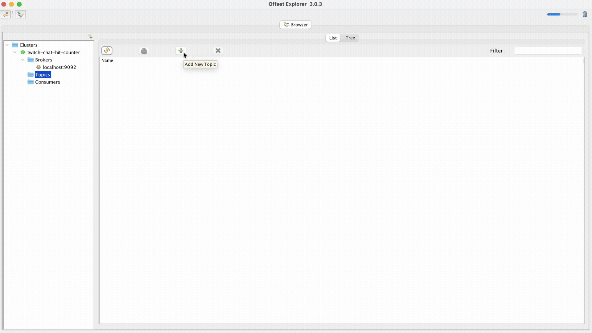
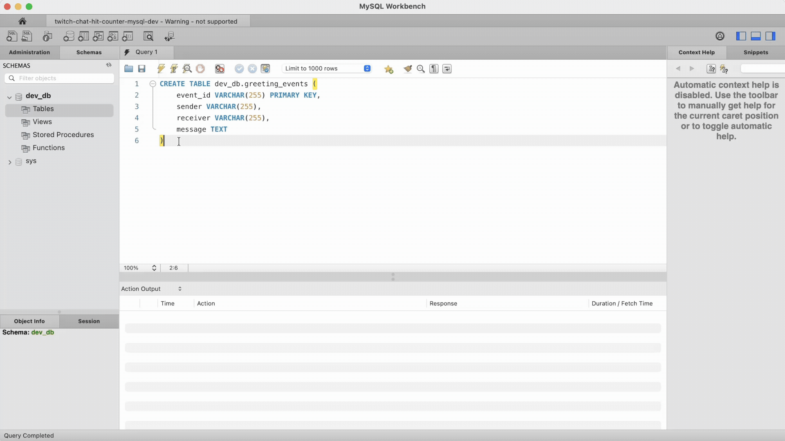
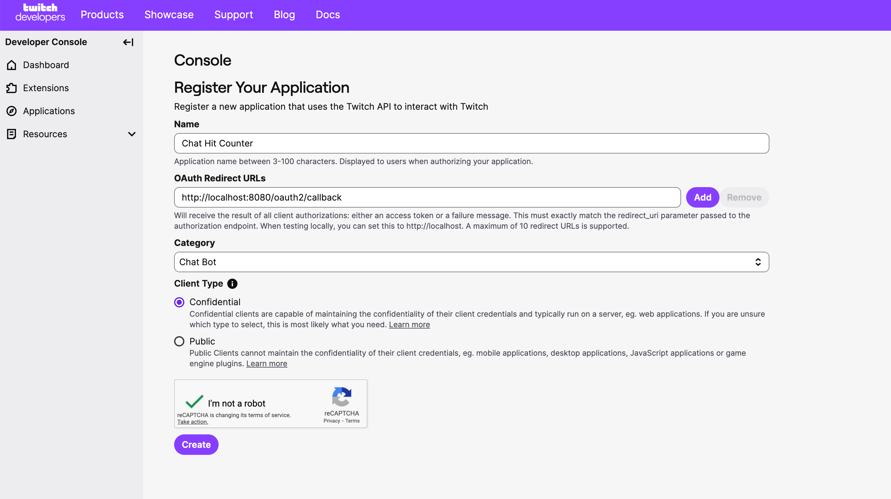
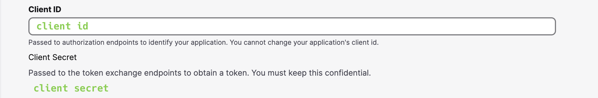
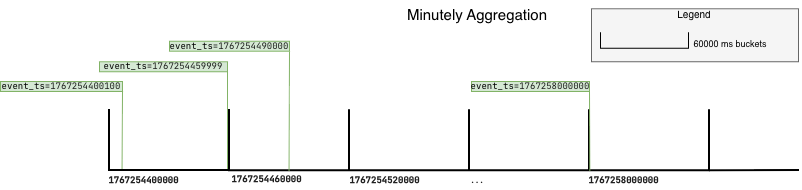

# Practical Backend Engineer
## Twitch Chat Hit Counter
## Module 5: Twitch API

### Lesson


### Additional Learning Materials


<br>

## File Structure
For `Module 5`, the below file structure are all the relevant files needed.

 twitch-chat-hit-counter/<br>
&nbsp;&nbsp;&nbsp;&nbsp;&nbsp;
 src/<br>
&nbsp;&nbsp;&nbsp;&nbsp;&nbsp;&nbsp;&nbsp;&nbsp;&nbsp;&nbsp;
 main/<br>
&nbsp;&nbsp;&nbsp;&nbsp;&nbsp;&nbsp;&nbsp;&nbsp;&nbsp;&nbsp;&nbsp;&nbsp;&nbsp;&nbsp;&nbsp;
 java/<br>
&nbsp;&nbsp;&nbsp;&nbsp;&nbsp;&nbsp;&nbsp;&nbsp;&nbsp;&nbsp;&nbsp;&nbsp;&nbsp;&nbsp;&nbsp;&nbsp;&nbsp;&nbsp;&nbsp;&nbsp;
 com.sonahlab.twitch_chat_hit_counter/<br>
&nbsp;&nbsp;&nbsp;&nbsp;&nbsp;&nbsp;&nbsp;&nbsp;&nbsp;&nbsp;&nbsp;&nbsp;&nbsp;&nbsp;&nbsp;&nbsp;&nbsp;&nbsp;&nbsp;&nbsp;&nbsp;&nbsp;&nbsp;&nbsp;&nbsp;
 config/<br>
&nbsp;&nbsp;&nbsp;&nbsp;&nbsp;&nbsp;&nbsp;&nbsp;&nbsp;&nbsp;&nbsp;&nbsp;&nbsp;&nbsp;&nbsp;&nbsp;&nbsp;&nbsp;&nbsp;&nbsp;&nbsp;&nbsp;&nbsp;&nbsp;&nbsp;&nbsp;&nbsp;&nbsp;&nbsp;&nbsp;
 TwitchConfig.java<br>
&nbsp;&nbsp;&nbsp;&nbsp;&nbsp;&nbsp;&nbsp;&nbsp;&nbsp;&nbsp;&nbsp;&nbsp;&nbsp;&nbsp;&nbsp;&nbsp;&nbsp;&nbsp;&nbsp;&nbsp;&nbsp;&nbsp;&nbsp;&nbsp;&nbsp;
 kafka/<br>
&nbsp;&nbsp;&nbsp;&nbsp;&nbsp;&nbsp;&nbsp;&nbsp;&nbsp;&nbsp;&nbsp;&nbsp;&nbsp;&nbsp;&nbsp;&nbsp;&nbsp;&nbsp;&nbsp;&nbsp;&nbsp;&nbsp;&nbsp;&nbsp;&nbsp;&nbsp;&nbsp;&nbsp;&nbsp;&nbsp;
 consumer/<br>
&nbsp;&nbsp;&nbsp;&nbsp;&nbsp;&nbsp;&nbsp;&nbsp;&nbsp;&nbsp;&nbsp;&nbsp;&nbsp;&nbsp;&nbsp;&nbsp;&nbsp;&nbsp;&nbsp;&nbsp;&nbsp;&nbsp;&nbsp;&nbsp;&nbsp;&nbsp;&nbsp;&nbsp;&nbsp;&nbsp;&nbsp;&nbsp;&nbsp;&nbsp;&nbsp;
 TwitchChatEventConsumer.java<br>
&nbsp;&nbsp;&nbsp;&nbsp;&nbsp;&nbsp;&nbsp;&nbsp;&nbsp;&nbsp;&nbsp;&nbsp;&nbsp;&nbsp;&nbsp;&nbsp;&nbsp;&nbsp;&nbsp;&nbsp;&nbsp;&nbsp;&nbsp;&nbsp;&nbsp;&nbsp;&nbsp;&nbsp;&nbsp;&nbsp;
 producer/<br>
&nbsp;&nbsp;&nbsp;&nbsp;&nbsp;&nbsp;&nbsp;&nbsp;&nbsp;&nbsp;&nbsp;&nbsp;&nbsp;&nbsp;&nbsp;&nbsp;&nbsp;&nbsp;&nbsp;&nbsp;&nbsp;&nbsp;&nbsp;&nbsp;&nbsp;&nbsp;&nbsp;&nbsp;&nbsp;&nbsp;&nbsp;&nbsp;&nbsp;&nbsp;&nbsp;
 TwitchChatEventProducer.java<br>
&nbsp;&nbsp;&nbsp;&nbsp;&nbsp;&nbsp;&nbsp;&nbsp;&nbsp;&nbsp;&nbsp;&nbsp;&nbsp;&nbsp;&nbsp;&nbsp;&nbsp;&nbsp;&nbsp;&nbsp;&nbsp;&nbsp;&nbsp;&nbsp;&nbsp;
 model/<br>
&nbsp;&nbsp;&nbsp;&nbsp;&nbsp;&nbsp;&nbsp;&nbsp;&nbsp;&nbsp;&nbsp;&nbsp;&nbsp;&nbsp;&nbsp;&nbsp;&nbsp;&nbsp;&nbsp;&nbsp;&nbsp;&nbsp;&nbsp;&nbsp;&nbsp;&nbsp;&nbsp;&nbsp;&nbsp;&nbsp;
 TwitchChatEvent.java<br>
&nbsp;&nbsp;&nbsp;&nbsp;&nbsp;&nbsp;&nbsp;&nbsp;&nbsp;&nbsp;&nbsp;&nbsp;&nbsp;&nbsp;&nbsp;&nbsp;&nbsp;&nbsp;&nbsp;&nbsp;&nbsp;&nbsp;&nbsp;&nbsp;&nbsp;
 redis/<br>
&nbsp;&nbsp;&nbsp;&nbsp;&nbsp;&nbsp;&nbsp;&nbsp;&nbsp;&nbsp;&nbsp;&nbsp;&nbsp;&nbsp;&nbsp;&nbsp;&nbsp;&nbsp;&nbsp;&nbsp;&nbsp;&nbsp;&nbsp;&nbsp;&nbsp;&nbsp;&nbsp;&nbsp;&nbsp;&nbsp;
 dao/<br>
&nbsp;&nbsp;&nbsp;&nbsp;&nbsp;&nbsp;&nbsp;&nbsp;&nbsp;&nbsp;&nbsp;&nbsp;&nbsp;&nbsp;&nbsp;&nbsp;&nbsp;&nbsp;&nbsp;&nbsp;&nbsp;&nbsp;&nbsp;&nbsp;&nbsp;&nbsp;&nbsp;&nbsp;&nbsp;&nbsp;&nbsp;&nbsp;&nbsp;&nbsp;&nbsp;
 RedisDao.java<br>
&nbsp;&nbsp;&nbsp;&nbsp;&nbsp;&nbsp;&nbsp;&nbsp;&nbsp;&nbsp;&nbsp;&nbsp;&nbsp;&nbsp;&nbsp;&nbsp;&nbsp;&nbsp;&nbsp;&nbsp;&nbsp;&nbsp;&nbsp;&nbsp;&nbsp;&nbsp;&nbsp;&nbsp;&nbsp;&nbsp;
 EventDeduperRedisService.java<br>
&nbsp;&nbsp;&nbsp;&nbsp;&nbsp;&nbsp;&nbsp;&nbsp;&nbsp;&nbsp;&nbsp;&nbsp;&nbsp;&nbsp;&nbsp;&nbsp;&nbsp;&nbsp;&nbsp;&nbsp;&nbsp;&nbsp;&nbsp;&nbsp;&nbsp;&nbsp;&nbsp;&nbsp;&nbsp;&nbsp;
 TwitchChatRedisService.java<br>
&nbsp;&nbsp;&nbsp;&nbsp;&nbsp;&nbsp;&nbsp;&nbsp;&nbsp;&nbsp;&nbsp;&nbsp;&nbsp;&nbsp;&nbsp;&nbsp;&nbsp;&nbsp;&nbsp;&nbsp;&nbsp;&nbsp;&nbsp;&nbsp;&nbsp;
 rest/<br>
&nbsp;&nbsp;&nbsp;&nbsp;&nbsp;&nbsp;&nbsp;&nbsp;&nbsp;&nbsp;&nbsp;&nbsp;&nbsp;&nbsp;&nbsp;&nbsp;&nbsp;&nbsp;&nbsp;&nbsp;&nbsp;&nbsp;&nbsp;&nbsp;&nbsp;&nbsp;&nbsp;&nbsp;&nbsp;&nbsp;
 OAuthRestController.java<br>
&nbsp;&nbsp;&nbsp;&nbsp;&nbsp;&nbsp;&nbsp;&nbsp;&nbsp;&nbsp;&nbsp;&nbsp;&nbsp;&nbsp;&nbsp;&nbsp;&nbsp;&nbsp;&nbsp;&nbsp;&nbsp;&nbsp;&nbsp;&nbsp;&nbsp;&nbsp;&nbsp;&nbsp;&nbsp;&nbsp;
 TwitchRestController.java<br>
&nbsp;&nbsp;&nbsp;&nbsp;&nbsp;&nbsp;&nbsp;&nbsp;&nbsp;&nbsp;&nbsp;&nbsp;&nbsp;&nbsp;&nbsp;&nbsp;&nbsp;&nbsp;&nbsp;&nbsp;&nbsp;&nbsp;&nbsp;&nbsp;&nbsp;
 sql/<br>
&nbsp;&nbsp;&nbsp;&nbsp;&nbsp;&nbsp;&nbsp;&nbsp;&nbsp;&nbsp;&nbsp;&nbsp;&nbsp;&nbsp;&nbsp;&nbsp;&nbsp;&nbsp;&nbsp;&nbsp;&nbsp;&nbsp;&nbsp;&nbsp;&nbsp;&nbsp;&nbsp;&nbsp;&nbsp;&nbsp;
 TwitchChatSqlService.java<br>
&nbsp;&nbsp;&nbsp;&nbsp;&nbsp;&nbsp;&nbsp;&nbsp;&nbsp;&nbsp;&nbsp;&nbsp;&nbsp;&nbsp;&nbsp;&nbsp;&nbsp;&nbsp;&nbsp;&nbsp;&nbsp;&nbsp;&nbsp;&nbsp;&nbsp;
 twitch/<br>
&nbsp;&nbsp;&nbsp;&nbsp;&nbsp;&nbsp;&nbsp;&nbsp;&nbsp;&nbsp;&nbsp;&nbsp;&nbsp;&nbsp;&nbsp;&nbsp;&nbsp;&nbsp;&nbsp;&nbsp;&nbsp;&nbsp;&nbsp;&nbsp;&nbsp;&nbsp;&nbsp;&nbsp;&nbsp;&nbsp;
 TwitchAuthService.java<br>
&nbsp;&nbsp;&nbsp;&nbsp;&nbsp;&nbsp;&nbsp;&nbsp;&nbsp;&nbsp;&nbsp;&nbsp;&nbsp;&nbsp;&nbsp;&nbsp;&nbsp;&nbsp;&nbsp;&nbsp;&nbsp;&nbsp;&nbsp;&nbsp;&nbsp;&nbsp;&nbsp;&nbsp;&nbsp;&nbsp;
 TwitchChatBotManager.java<br>
&nbsp;&nbsp;&nbsp;&nbsp;&nbsp;&nbsp;&nbsp;&nbsp;&nbsp;&nbsp;&nbsp;&nbsp;&nbsp;&nbsp;&nbsp;&nbsp;&nbsp;&nbsp;&nbsp;&nbsp;&nbsp;&nbsp;&nbsp;&nbsp;&nbsp;
 utils/<br>
&nbsp;&nbsp;&nbsp;&nbsp;&nbsp;&nbsp;&nbsp;&nbsp;&nbsp;&nbsp;&nbsp;&nbsp;&nbsp;&nbsp;&nbsp;&nbsp;&nbsp;&nbsp;&nbsp;&nbsp;&nbsp;&nbsp;&nbsp;&nbsp;&nbsp;&nbsp;&nbsp;&nbsp;&nbsp;&nbsp;
 EventType.java<br>
&nbsp;&nbsp;&nbsp;&nbsp;&nbsp;&nbsp;&nbsp;&nbsp;&nbsp;&nbsp;&nbsp;&nbsp;&nbsp;&nbsp;&nbsp;
 resources/<br>
&nbsp;&nbsp;&nbsp;&nbsp;&nbsp;&nbsp;&nbsp;&nbsp;&nbsp;&nbsp;&nbsp;&nbsp;&nbsp;&nbsp;&nbsp;&nbsp;&nbsp;&nbsp;&nbsp;&nbsp;
 application.yml<br>
&nbsp;&nbsp;&nbsp;&nbsp;&nbsp;&nbsp;&nbsp;&nbsp;&nbsp;&nbsp;&nbsp;&nbsp;&nbsp;&nbsp;&nbsp;&nbsp;&nbsp;&nbsp;&nbsp;&nbsp;
 twitch-key.properties<br>
&nbsp;&nbsp;&nbsp;&nbsp;&nbsp;&nbsp;&nbsp;&nbsp;&nbsp;&nbsp;
 test/<br>
&nbsp;&nbsp;&nbsp;&nbsp;&nbsp;&nbsp;&nbsp;&nbsp;&nbsp;&nbsp;&nbsp;&nbsp;&nbsp;&nbsp;&nbsp;
 java/<br>
&nbsp;&nbsp;&nbsp;&nbsp;&nbsp;&nbsp;&nbsp;&nbsp;&nbsp;&nbsp;&nbsp;&nbsp;&nbsp;&nbsp;&nbsp;&nbsp;&nbsp;&nbsp;&nbsp;&nbsp;
 com.sonahlab.twitch_chat_hit_counter/<br>
&nbsp;&nbsp;&nbsp;&nbsp;&nbsp;&nbsp;&nbsp;&nbsp;&nbsp;&nbsp;&nbsp;&nbsp;&nbsp;&nbsp;&nbsp;&nbsp;&nbsp;&nbsp;&nbsp;&nbsp;&nbsp;&nbsp;&nbsp;&nbsp;&nbsp;
 config/<br>
&nbsp;&nbsp;&nbsp;&nbsp;&nbsp;&nbsp;&nbsp;&nbsp;&nbsp;&nbsp;&nbsp;&nbsp;&nbsp;&nbsp;&nbsp;&nbsp;&nbsp;&nbsp;&nbsp;&nbsp;&nbsp;&nbsp;&nbsp;&nbsp;&nbsp;&nbsp;&nbsp;&nbsp;&nbsp;&nbsp;
 TwitchConfigTest.java<br>
&nbsp;&nbsp;&nbsp;&nbsp;&nbsp;&nbsp;&nbsp;&nbsp;&nbsp;&nbsp;&nbsp;&nbsp;&nbsp;&nbsp;&nbsp;&nbsp;&nbsp;&nbsp;&nbsp;&nbsp;&nbsp;&nbsp;&nbsp;&nbsp;&nbsp;
 redis/<br>
&nbsp;&nbsp;&nbsp;&nbsp;&nbsp;&nbsp;&nbsp;&nbsp;&nbsp;&nbsp;&nbsp;&nbsp;&nbsp;&nbsp;&nbsp;&nbsp;&nbsp;&nbsp;&nbsp;&nbsp;&nbsp;&nbsp;&nbsp;&nbsp;&nbsp;&nbsp;&nbsp;&nbsp;&nbsp;&nbsp;
 TwitchChatRedisServiceTest.java<br>
&nbsp;&nbsp;&nbsp;&nbsp;&nbsp;&nbsp;&nbsp;&nbsp;&nbsp;&nbsp;&nbsp;&nbsp;&nbsp;&nbsp;&nbsp;&nbsp;&nbsp;&nbsp;&nbsp;&nbsp;&nbsp;&nbsp;&nbsp;&nbsp;&nbsp;
 sql/<br>
&nbsp;&nbsp;&nbsp;&nbsp;&nbsp;&nbsp;&nbsp;&nbsp;&nbsp;&nbsp;&nbsp;&nbsp;&nbsp;&nbsp;&nbsp;&nbsp;&nbsp;&nbsp;&nbsp;&nbsp;&nbsp;&nbsp;&nbsp;&nbsp;&nbsp;&nbsp;&nbsp;&nbsp;&nbsp;&nbsp;
 TwitchChatSqlService.java<br>
&nbsp;&nbsp;&nbsp;&nbsp;&nbsp;&nbsp;&nbsp;&nbsp;&nbsp;&nbsp;&nbsp;&nbsp;&nbsp;&nbsp;&nbsp;&nbsp;&nbsp;&nbsp;&nbsp;&nbsp;&nbsp;&nbsp;&nbsp;&nbsp;&nbsp;
 twitch/<br>
&nbsp;&nbsp;&nbsp;&nbsp;&nbsp;&nbsp;&nbsp;&nbsp;&nbsp;&nbsp;&nbsp;&nbsp;&nbsp;&nbsp;&nbsp;&nbsp;&nbsp;&nbsp;&nbsp;&nbsp;&nbsp;&nbsp;&nbsp;&nbsp;&nbsp;&nbsp;&nbsp;&nbsp;&nbsp;&nbsp;
 TwitchChatBotManagerTest.java<br>

<br>

## Overview
<br>

In **Module 5**, we will now be integrating with the public Twitch API. Instead of triggering the pipeline through HTTP requests, we will setup a pipeline to stream realtime chat messages from Twitch Chat.
We will use everything we've learned up to this point to accomplish this.

<br>

## Create Kafka Topic: `twitch-chat-events`
1. Navigate to the _**Clusters/twitch-chat-hit-counter/Topics**_ folder
2. Click '+' to add a new kafka topic
3. Input kafka topic configs:
    1. **Topic name**: twitch-chat-events<br>
    2. **Partition Count**: 3<br>
    3. **Replica Count**: 1
4. Select our kafka topic in **_Clusters/twitch-chat-hit-counter/Topics/twitch-chat-events_**
5. Change the **Content Types** for the key and value from **'Byte Array'** → **'String'**, and save by clicking **Update**.

<br>

<br>

## Create SQL Table: `dev_db.twitch_chat_events`
1. Click on **Schemas** tab
2. Navigate to **dev_db** → **Tables**
3. In the **SQL Editor**, run:
```
CREATE TABLE dev_db.twitch_chat_events (
    event_id VARCHAR(255) PRIMARY KEY,
    event_ts BIGINT,
    channel_id VARCHAR(255),
    channel_name VARCHAR(255),
    user_id VARCHAR(255),
    username VARCHAR(255),
    subscription_months INT,
    subscription_tier INT,
    message TEXT
)
```
<br>

<br>

## [Getting Started with the Twitch API ](https://dev.twitch.tv/docs/api/get-started/)
1. Create a [Twitch.tv ](https://www.twitch.tv/) account
2. Login to [Twitch Developers Console ](https://dev.twitch.tv/console)
3. Under **Applications**, click on [Register Your Application ](https://dev.twitch.tv/console/apps/create).
   - **Name**: `Chat Hit Counter`
   - **OAuth Redirect URLs**: `http://localhost:8080/oauth2/callback`
   - **Category**: `Chat Bot`
   - **Client Type**: `Confidential`

<br>

4. You should now see your application created. Click **Manage**.

5. Create a **New Secret**. Copy both of the **Client ID** and the **Client Secret**. This will be needed to access the Twitch API in our application.

<br>

<br>

## Exercise 1: Configure Twitch API keys
1. In `twitchApiKey.yml`, set the following fields from setting up a new application from the **Twitch Developer Console**:
   1. **twitch-api.client-id**
   2. **twitch-api.client-secret**
2. In `TwitchConfig.java`, implement:
   1. `public String getTwitchApiClientId()`
   2. `public String getTwitchApiClientSecret()`

This yaml file is already added in **.gitignore**, so your keys _**will not and should not**_ be published to Github.

### Testing
- [ ] Open `TwitchConfigTest.java` ─ already implemented and tests that the loaded TwitchConfig matches the values in `twitch-key.properties`.
- [ ] Remove `@Disabled` in `TwitchConfigTest.java` for method(s): `testTwitchClientKeys()`
- [ ] Test with:
    ```shell
    ./gradlew test --tests "*" -Djunit.jupiter.tags=Module5
    ```

<br>

#


## Exercise 2: Configure `TwitchClient`
In `TwitchConfig.java`, implement `public TwitchClient twitchClient()`.
This should create our instance of Twitch4J's `TwitchClient`, which will be our client proxy to call into Twitch's API.

Twitch4J is an open source Java library that abstracts away a lot of the details when integrating with Twitch's API.

**Requirements:**
1. Initialize the `TwitchClient` object with our Twitch API ClientId, Client Secret.
2. Helix should be enabled
3. Chat should be enabled

```java
TwitchClient twitchClient = TwitchClientBuilder.builder()
            .withEnableHelix(true)
            .build();
```

> [!IMPORTANT]
>
> When integrating with 3P APIs there is _always_ a bit of discovery work involved. Whether it's a publicly exposed API or a private API (direct B2B integration),
> I always spend a large amount of time understanding how to integrate with the API and what data/endpoints are available.
> Best advice is to keep learning by doing and spending time struggling through blocks.


<br>

#

## Exercise 3: Twitch Chat Connection
<br>
Now that we have a working OAuth Token cache, we will be mostly focusing on the various Twitch API endpoints we want to integrate with.<br>
It's important to see what products data is even supported publicly and reverse engineer what products you can build out of free data.<br>
In small projects using public API data, you first look at the data available, see what product you can build from it.

Since we want to build a hit counter on different streamers, we will need to learn how to integrate with the Twitch Chat as a [ChatBot ](https://dev.twitch.tv/docs/chat/send-receive-messages/).<br>

We will focus mainly on receiving Twitch Chat message. The API docs details on different way of connecting to Chats using Webhooks and Websockets,
but that is outside the scope of this project and, tbh, outside of Networking/OS classes I've never once used these in my daily life as a SWE.
To simplify the ease of integration we will leverage a great Java client library that abstracts away much of the lower level details for us. The library is [Twitch4J ](https://twitch4j.github.io/).<br>

Spend time reading through the Twitch Chat section.


### Task 2: TwitchChatBotManager
Our `TwitchChatBotManager.java` will be a very simple ChatBot in charge of:
- joining/leaving twitch channels
- retrieving all the channels it's connected to
- ingesting in real-time the incoming twitch chat event message

> [!TIP]
> 
> R.T.F.M for [TwitchClient ](https://twitch4j.github.io/javadoc/com/github/twitch4j/TwitchClient.html)
> to see which methods you should be calling in the various methods you need to implement.

<br>

#


#### Part 1
In `TwitchChatBotManager.java`, implement the constructor: `public TwitchChatBotManager()`.

**Requirements**:
- Inject the `TwitchClient`

### Testing
- [ ] Open `TwitchChatBotManagerTest.java` ─ already implemented.
- [ ] Uncomment this line: `//twitchChatBotManager = new TwitchChatBotManager(mockTwitchClient);`
    We will be able to compile and test this class in the future parts

#


#### Part 2
In `TwitchChatBotManager.java`, implement `public void joinChannel(String channelName)`. This method will allow your ChatBot to join a Twitch stream by the `channelName`.

`TwitchClient` has an API for [TwitchChat ](https://twitch4j.github.io/javadoc/com/github/twitch4j/chat/TwitchChat.html)
you should use.

### Testing
- [ ] Open `TwitchChatBotManagerTest.java` ─ already implemented and tests that the correct `TwitchClient` method is called.
- [ ] Uncomment this line: `//twitchChatBotManager = new TwitchChatBotManager(mockTwitchClient);`
- [ ] Remove `@Disabled` in `TwitchChatBotManagerTest.java` for method(s): `joinChannelTest()`
- [ ] Test with:
    ```shell
    ./gradlew test --tests "*" -Djunit.jupiter.tags=Module5
    ```

#

#### Part 3
In `TwitchChatBotManager.java`, implement `public boolean leaveChannel(String channelName)`. This method will allow our User account to leave a Twitch stream by the `channelName`.

Returns boolean on whether you successfully left the twitch channel.

`TwitchClient` has an API for [TwitchChat ](https://twitch4j.github.io/javadoc/com/github/twitch4j/chat/TwitchChat.html)
you should use.

### Testing
- [ ] Open `TwitchChatBotManagerTest.java` ─ already implemented and tests that the correct `TwitchClient` method is called.
- [ ] Remove `@Disabled` in `TwitchChatBotManagerTest.java` for method(s): `leaveChannelTest()`
- [ ] Test with:
    ```shell
    ./gradlew test --tests "*" -Djunit.jupiter.tags=Module5
    ```

#


#### Part 4
In `TwitchChatEvent.java`, implement the data model record.

Twitch4J library has its own event [`ChannelMessageEvent` ](https://twitch4j.github.io/javadoc/com/github/twitch4j/chat/events/channel/ChannelMessageEvent.html), but this class has a lot of additional metadata fields that we won't need for our project.<br>
We will define our own POJO `TwitchChatEvent.java`, which is a simplified/flattened version of Twitch4J's `ChannelMessageEvent` object.

**Requirements:**
1. `eventId`: (String) eventId for the ChannelMessageEvent
2. `eventTs`: (long) timestamp millis of when the chat message was sent
3. `channelId`: (String) channel id on Twitch
4. `channelName`: (String) channel name on Twitch
5. `userId`: (String) user id on Twitch of the sender of the message
6. `username`: (String) channel name on Twitch
7. `subscriptionMonths`: (int) months the user who is chatting has been subscribed to the channel for
8. `subscriptionTier`: (int) tier level of the user who is chatting has subscribed to (tier1, 2, 3)
9. `message`: (String) message content that the user sent to the chat

#

#### Part 5
In `TwitchChatBotManager.java`, implement `private void handleChatMessage(ChannelMessageEvent event)`. This method will be the main handler for each incoming, real-time Twitch chat message for all the channels that our ChatBot is connected to.

**Requirements**:
1. Convert the incoming `ChannelMessageEvent` → `TwitchChatEvent`
2. Log `TwitchChatEvent` to _**stdout**_

### Example 1:
> **Input**:<br>
> ```java
> TwitchChatBotManager service = new TwitchChatBotManager(...);
> ChannelMessageEvent event = new ChannelMessageEvent(
>     new EventChannel("channelId123", "s0mcs"),
>     new IRCMessageEvent(...), // other metadata fields
>     new EventUser("userId123", "Alice"),
>     "Hi s0m, it's Alice"
> );
> service.handleMessage(channelMessageEvent);
> ```
> **stdout**:<br>
> ```
> TwitchChatEvent[
>     eventId="eventId1",
>     eventTs=1764184492277,
>     channelId="channelId123",
>     channelName="s0mcs",
>     userId="userId123",
>     username="Alice",
>     subscriptionMonths=27,
>     subscriptionTier=1
>     message="Hi s0m, it's Alice",
> ]
> ```


#### Part 6
In `TwitchChatBotManager.java`, implement `public Set<String> getJoinedChannels(String username)`.

Return a Set<String> for all your ChatBot's previously joined channels.

> [!IMPORTANT]
>
> For Module 5 we will keep it very simple and hardcode some channels.<br>
> Module 6 will build on this and you will implement the actual intended logic.

**Requirements**:
- Return a hardcoded Set<String> of real Twitch channel names you'd like your ChatBot to read from.
    i.e.: Set.of("s0mcs")

### Testing
- [ ] None for this part


#### Part 7
In `TwitchChatBotManager.java`, implement `private void initChannelsToJoin()`. This method is intended to be called on application start up during the class initialization process.

**Requirements**:
- Get the joined channels (Hint: you implemented this earlier)
- For each channel, join the channel (Hint: you implemented this earlier)

### Testing
- [ ] None for this part


#### Part 8
In `TwitchChatBotManager.java`, implement the PostConstructor: `public void init()`. This PostConstructor will run after the constructor.

**Requirements**:
- Connect our `TwitchClient` to handle the incoming messages (Hint: you implemented `handleChatMessage()`)
    - https://twitch4j.github.io/events/channel-message-event
- Connect our `TwitchClient` to join channels on startup (Hint: you implemented `initChannelsToJoin()`)
    - You will fill this helper function out soon so a simple call will suffice

### Integration Testing
- [ ] Run the application:
    ```shell
    ./gradlew bootRun
    ```
- [ ] Open up the Twitch Stream for any of the hardcoded Set<String> channel names defined in `getChannelsJoined()`
- [ ] Your ChatBot should connect/listen to the hardcoded Set<String> defined in `getChannelsJoined()`
- [ ] Verify that incoming Twitch stream chat messages matches the logged output in stdout from `handleChatMessage()`
- [ ] TODO: INPUT screenshots

<br>

## Exercise 4: Kafka
<br>

> **Relevant Files:**
> 
> `application.yml`<br>
> `KafkaConfigs.java`<br>
> 

Now that we have a simple working ChatBot, we need to build a Kafka producer/consumer to publish these `TwitchChatEvent` to a new separate kafka topic.

This will look very similar to the end state we had in **Module 2** with the Producer/Consumer on the `greeting-events` kafka topic.<br>
This exercise will be kept short, and it's up to you to make your application achieve the end state in the diagram above.

**Goals:**
1. Publish `TwitchChatEvent` to `twitch-chat-events` topic
2. Consume `TwitchChatEvent` from `twitch-chat-events` topic and log them to **stdout**

The main differences from **Module 2** is the producer trigger logic. In **Module 2**, we needed to manually trigger an HTTP request (`POST /api/kafka/publishGreetingEvent`) via Swagger to invoke our Producer to publish event(s).
In this exercise, our `TwitchChatBotManager.handleMessage()` event handler method should be the automated trigger for the `TwitchChatEventProducer.java`. Once we join a channel and attach the event listener,
the TwitchClient will stream, in real-time, the incoming chat messages that we need to publish to `twitch-chat-events` topics. No more manual trigger, fully automated.

### Task 1: add new kafka topic name to `application.yml`
```yaml
twitch-chat-hit-counter:
  kafka:
    twitch-chat-topic:
      twitch-chat-events
```

### Testing
- [ ] Open `PropertiesApplicationTest.java` ─ already implemented to test the properties above.
- [ ] Remove `@Disabled` in `PropertiesApplicationTest.java` for the test method(s): `kafkaTwitchChatTopicNameTest()`
- [ ] Test with:
    ```shell
    ./gradlew test --tests "*" -Djunit.jupiter.tags=Module5
    ```

### Task 2: Producer
#### Part 1
In `TwitchChatEventProducer.java`, fix the constructor and inject the topic name from `application.yml`.
You'll notice that our initial implementation of `AbstractEventProducer.publish()` from **Module 2** takes care of writing events to a generic topic.
This is where our abstract class (`AbstractEventProducer.java`) pays dividends. We don't need to repeat code and can leverage implementing the main logic in one parent class, and all it's children will benefit.

**Requirements:**
1. Inject the new `twitch-chat-topic` property into the constructor
2. Implement `protected String topicName()`

### Example 1:
> **Input**:<br>
> ```java
> TwitchChatEventProducer producer = new TwitchChatEventProducer(...);
> String eventId = "UUID1";
> TwitchChatEvent event = new TwitchChatEvent(eventId, 1767254400000L, "channelId123", "s0mcs", "userId123", "Alice", 12, 1, "Hi s0m, it's alice");
> boolean output1 = producer.publish(eventId, event);
> 
> String eventId2 = "UUID2";
> TwitchChatEvent event2 = new TwitchChatEvent(eventId2, 1767254400000L, "channelId123", "s0mcs", "userId456", "Bob", null, null, "chat gift me a sub");
> boolean output2 = producer.publish(eventId2, event2);
> ```
> **Output1**: <span style="color:#0000008c">true<br></span>
> **Output2**: <span style="color:#0000008c">true<br></span>

#

### Testing
- [ ] Open `TwitchChatEventProducerTest.java` ─ already implemented test cases with the example(s) above.
- [ ] Uncomment the entire file (Did this to avoid compile time errors)
- [ ] Test with:
    ```shell
    ./gradlew test --tests "*" -Djunit.jupiter.tags=Module5`
    ```

<br>

#

#### Part 2
In `TwitchChatBotManager.java`, connect our ChatBot to produce to the new `twitch-chat-events` kafka topic.

**Requirements:**
1. Inject the `TwitchChatEventProducer` into the `TwitchChatBotManager` constructor
2. Whenever we're handling an incoming message, publish it to the topic.

### Integration Testing
- [ ] Run the application:
    ```shell
    ./gradlew bootRun
    ```
- [ ] Your ChatBot should connect/listen to the hardcoded Set<String> defined in `getChannelsJoined()`
- [ ] Your ChatBot should be publishing kafka messages to the topic
- [ ] Check **Offset Explorer 3** to see that your `TwitchChatEvent` is actually published to your kafka topic


<br>

#

### Task 3: Consumer
In `TwitchChatEventConsumer.java`, implement the entire class.

This class will look very similar to `GreetingEventConsumer.java`, so look there if you get stuck. The only sparse method for now will be `coreLogic()`, we will build on this logic in future parts.

### Example 1:
> **Input**:<br>
> ```java
> TwitchChatEventConsumer consumer = new TwitchChatEventConsumer(...);
> // Assume kafka has these 3 events:
> // 1. new TwitchChatEvent("id1", 0L, "channelId1", "s0mcs", "userId1", "Alice", 12, 1, "Hi s0m!");
> // 2. new TwitchChatEvent("id2", 1L, "channelId2", "shroud", "userId2", "Bob", null, null, "Hey shroud");
> // 3. new TwitchChatEvent("id3", 2L, "channelId3", "k3soju", "userId3", "Charlie", null, null, "Hey KEJUICY");
> consumer.processMessage(...); // processes 1st TwitchChatEvent
> consumer.processMessage(...); // processes 2nd TwitchChatEvent
> consumer.processMessage(...); // processes 3rd TwitchChatEvent
> ```
> **stdout**:<br>
> <span style="color:#0000008c">INFO TwitchChatEventConsumer {event1}<br></span>
> <span style="color:#0000008c">INFO TwitchChatEventConsumer {event2}<br></span>
> <span style="color:#0000008c">INFO TwitchChatEventConsumer {event3}</span>


<br>

#### Part 1
In `TwitchChatEventConsumer.java`, implement `public TwitchChatEventConsumer()`.

Currently the parent, `AbstractEventConsumer.java`, requires that all children subclasses pass in the `EventDeduperRedisService`.

**Requirements:**
1. Inject the `EventDeduperRedisService` and instantiate the parent by calling `super(...)`

<br>

#

#### Part 2
In `TwitchChatEventConsumer.java`, implement `protected EventType eventType()`.

**Requirements:**
1. Define a new `EventType` enum named `TWITCH_CHAT_EVENT` [1]
2. Return that new enum for this method

> [!NOTE]
> 
> [1] Remember that in Module 4, we implemented the `EventDeduperRedisService` into the `AbstractEventConsumer`, so now all child subclasses (`... extends AbstractEventConsumer`) gets this deduper already baked in.<br>
>
> By separating out EventType enums, our Redis DB0 will be cleanly separated by event type:<br>
> 
> Example:
> 
> | Key                        | Value (Long) |
> |----------------------------|--------------|
> | GREETING_EVENT#eventId1    | 1            |
> | ...                        | ...          |
> | GREETING_EVENT#eventIdN    | 1            |
> | TWITCH_CHAT_EVENT#eventId1 | 1            |
> | ...                        | ...          |
> | TWITCH_CHAT_EVENT#eventIdN | 1            |

<br>

#

#### Part 3
In `TwitchChatEventConsumer.java`, implement `protected Class<TwitchChatEvent> eventClass()`.

**Requirements**:
1. Return the `TwitchChatEvent` class type itself


<br>

#

#### Part 4
In `TwitchChatEventConsumer.java`, implement `protected String eventKey(TwitchChatEvent event)`.

**Requirements**:
1. Use the `TwitchChatEvent.eventId()` as the primary key for this type of event


<br>

#

#### Part 5
In `TwitchChatEventConsumer.java`, implement `protected void coreLogic(List<TwitchChatEvent> events)`.

**Requirements**:
1. Log the `TwitchChatEvent` to **stdout**


<br>

#

#### Part 6
In `TwitchChatEventConsumer.java`, implement `public void processMessage(ConsumerRecord<String, byte[]> record, Acknowledgment ack)`.

**Requirements**:
1. Add the `@KafkaListener` annotation and set the `topics="..."` field to make sure this class method will consume the new topic (`twitch-chat-events`) you created
2. Call the parent class's method via `super`


<br>

#

### Testing
- [ ] Open `TwitchChatEventConsumerTest.java` ─ already implemented test cases with the example(s) above.
- [ ] Uncomment the entire file (Did this to avoid compile time errors)
- [ ] Test with:
    ```shell
    ./gradlew test --tests "*" -Djunit.jupiter.tags=Module5`
    ```


### Integration Testing
- [ ] Run the application:
    ```shell
    ./gradlew bootRun
    ```
- [ ] Your ChatBot should be streaming incoming events, producer should be writing them to kafka
- [ ] Verify application **stdout** logs and that your `TwitchChatEventConsumer` is actually receiving the newly written kafka records


<br>

## Exercise 5: SQL
<br>
Now that we are able to stream Twitch chat events and pub/sub events through our new kafka topic, we need to write the `TwitchChatEvent` to a new separate SQL table.

This will look very similar to the end state we had in **Module 3**. This exercise description will be kept short and it's up to you to make your application achieve the end state in the diagram above.

**Goals:**
1. Implement `TwitchChatSqlService.java` - should look very similar in terms of layout to `GreetingSqlService.java`
2. Have `TwitchChatEventConsumer.java` write the `TwitchChatEvent` to the new SQL table

### Example 1:
> ```java
> TwitchChatSqlService service = new TwitchChatSqlService(...);
> 
> TwitchChat event1 = new TwitchChatEvent("id1", 0L, "channelId1", "s0mcs", "userId1", "Alice", 12, 1, "Hi s0m!");
> TwitchChat event2 = new TwitchChatEvent("id2", 1L, "channelId2", "shroud", "userId2", "Bob", null, null, "Hey shroud");
> TwitchChat event2 = new TwitchChatEvent("id1", 2L, "channelId3", "k3soju", "userId3", "Charlie", null, null, "Hey KEJUICY");
>
> int output1 = service.insert(List.of(event1));
> int output2 = service.insert(List.of(event2));
> int output3 = service.insert(List.of(event3));
> ```
> **Output1**: 1<br>
>
> **Output2**: 1<br>
>
> **Output3**: 0<br>
> **Explanation**: event3.eventId() == "id1" already exists in the table<br>

#### Part 1
In `application.yml`, add the new sql table name property:

```yaml
twitch-chat-hit-counter:
  sql:
    twitch-chat-table:
      twitch_chat_events
```

### Testing
- [ ] Open `PropertiesApplicationTest.java` ─ already implemented to test the properties above.
- [ ] Remove `@Disabled` in `PropertiesApplicationTest.java` for the test method(s): `sqlTwitchChatTableNameTest()`
- [ ] Test with:
    ```shell
    ./gradlew test --tests "*" -Djunit.jupiter.tags=Module5
    ```

#### Part 2
In `TwitchChatSqlService.java`, implement the entire class.

This class will look very similar to `GreetingSqlService.java`, so look there if you get stuck.

#### 2.1
In `TwitchChatSqlService.java`, implement `public TwitchChatSqlService()`.

**Requirements:**
1. Inject the autoconfigured `JdbcTemplate`.
   1. If you remember Module 3, `AbstractSqlService.java` expects the autoconfigured `JdbcTemplate` needed to connect/communicate with our MySQL instance.
2. Inject the newly configured `twitch-chat-table` SQL table name from your `application.yml`

#### 2.2
In `TwitchChatSqlService.java`, implement `public String sqlTableName()`.

**Requirements:**
1. Simply return the same injected property passed into the constructor

#### 2.3
In `TwitchChatSqlService.java`, implement `public List<String> columns()`.

**Requirements:**
1. Return a list of the fields for the `twitch_chat_events` SQL table schema (ORDER MATTERS)

#### 2.4
In `TwitchChatSqlService.java`, implement `protected Object[] values(TwitchChatEvent event)`.

**Requirements:**
1. Return an Object[] of all the `TwitchChatEvent` in the same order of the schema

#### 2.5
In `TwitchChatSqlService.java`, implement `protected TwitchChatEvent parseEventFromResultSet(ResultSet rs)`.

**Requirements:**
1. From the raw `ResultSet rs` object, translate that back into a `TwitchChatEvent` object

<br>

#

### Testing
- [ ] Open `TwitchChatSqlServiceTest.java` ─ already implemented to the example(s) above.
- [ ] Uncomment the entire file (Did this to avoid compile time errors)
- [ ] Test with:
    ```shell
    ./gradlew test --tests "*" -Djunit.jupiter.tags=Module5
    ```

#### Part 3
In `TwitchChatEventConsumer.java`, connect our consumer to write to the new `twitch_chat_events` SQL table.

**Requirements:**
1. Inject the `TwitchChatSqlService` into the `TwitchChatEventConsumer` constructor
2. Update `coreLogic()` to write the consumed `TwitchChatEvent` to SQL

### Integration Testing
- [ ] Run the application:
    ```shell
    ./gradlew bootRun
    ```
- [ ] The application flow should now be:<br>
  → `TwitchChatBotManager` (ChatBot streamer)<br>
  → `TwitchChatEventProducer` (Kafka Producer)<br>
  → `TwitchChatEventConsumer`(Kafka Consumer)<br>
  → `TwitchChatSqlService`(SQL Writer)
- [ ] In **MySQLWorkbench**, verify that the `TwitchChatEvent` are written into SQL by querying:
    ```
    SELECT *
    FROM twitch_chat_events
    ```


<br>

#

## Exercise 6: Redis Hit Counter
<br>

**Goals:**

[//]: # (1. Deduplicate `TwitchChatEvent` so we don't process duplicates using the same `db0` we already have)
1. Minutely Aggregation: chat message should increment the channel's hit count at the minutely bucket in a new Redis `db2`

> [!TIP]
>
> In Module 4, we built Redis `db1` to be the Greetings New Feed Database, meaning the Redis value of `db1` was a List object.<br>
> We're building a Hit Counter so our `db2` will look a little different, meaning the Redis value of `db2` will be a Long object.
>
> In `db2`, this will be our schema:
> Key (String): `"{channelName}#{minuteBoundaryInMillis}"`
> Value (Long): # of chat messages that fall into the minute bucket (rounded down the nearest minute bucket)


[//]: # ()
[//]: # (### Task 1: Hook up `TwitchChatEventConsumer` to the `EventDeduperRedisService`)
[//]: # (![]&#40;assets/module5/images/RedisDeduperOverview.svg&#41;<br>)
[//]: # (In `TwitchChatEventConsumer.java`, update `TODO&#40;&#41;` to now increment the hit count for the channel.)
[//]: # ()
[//]: # (**Consumer Process Flow:**)
[//]: # (1. Check Redis to see if the kafka message key is a duplicate)
[//]: # (2. If **isDupeEvent == True**:)
[//]: # (    1. Do nothing &#40;skip processing the event&#41;)
[//]: # (3. If **isDupeEvent == False**:)
[//]: # (    1. Write the event to SQL)
[//]: # (    2. Update the Redis DB to add the event's key, so that we can skip this event from being processed if we ever see an event with the same key again.)
[//]: # ()
[//]: # (### Testing)
[//]: # (TODO?)
[//]: # ()
[//]: # (<br>)

### Task 1
In `application.yml`, create a new property for our hit counter db.

```yaml
twitch-chat-hit-counter:
  redis:
    twitch-chat-hit-counter-database: 2
```

### Testing
- [ ] Open `PropertiesApplicationTest.java` ─ already implemented
- [ ] Remove `@Disabled` in `PropertiesApplicationTest.java` for method(s): `redisTwitchChatHitCounterDatabaseTest()`
- [ ] Test with:
    ```shell
    ./gradlew test --tests "*" -Djunit.jupiter.tags=Module5
    ```

<br>

#

### Task 2
In `RedisConfig.java`, implement `public RedisDao twitchChatHitCounterRedisDao()`.

**Requirements:**
1. Update `public Map<Integer, RedisTemplate<String, String>> redisTemplateFactory()` to hold a new mapping from
    `{2: RedisTemplate}` dedicated for operations onto our new db2.
2. Update `twitchChatHitCounterRedisDao()` to return the correct `RedisTemplate` from the factory map

### Testing
- [ ] Open `RedisConfigTest.java` ─ already implemented
- [ ] Remove `@Disabled` in `RedisConfigTest.java` for method(s): `twitchChatHitCounterRedisDaoTest`
- [ ] Test with:
    ```shell
    ./gradlew test --tests "*" -Djunit.jupiter.tags=Module5
    ```

<br>

#

### Task 3: TwitchChatRedisService
<br>

<br>

#### Part 3.1:
In `TwitchChatRedisService.java`, implement `public Long incrementMinuteHitCounter(Granularity granularity, String channelName, long eventTimestampMs)`.

Return the updated count value after we increment the key.

**Requirements:**
1. Inject the correct `RedisDao` Bean loaded by `RedisConfig.java`.
2. Key Template: `"{Granularity}#{channelName}#{YYYYMMDD}"`<br>
3. Field: `{minuteBoundaryInMillis}`
    This is the only math involved in this project.<br>
    You will need to figure out how to take a raw timestamp in milliseconds, and round it to the nearest minute timestamp in millis (rounded down).
4. Value should be a `Long` object

### Example 1:
> **Input**:<br>
> ```java
> RedisDao redisDao = new RedisDao(...);
> TwitchChatRedisService service = new TwitchChatRedisService(redisDao);
> 
> long eventTs1 = 1767254439000; // Thu Jan 01 2026 08:00:39 GMT+0000
> long eventTs2 = 1767254445000; // Thu Jan 01 2026 08:00:45 GMT+0000
>
> long output1 = service.incrementMinuteHitCounter(Granularity.MINUTE, "s0mcs", eventTs1);
> long output2 = service.incrementMinuteHitCounter(Granularity.MINUTE, "s0mcs", eventTs2);
> ```
> **Output1**: 1<br>
> **Explanation**: After we increment the hit count for s0mcs's channel with the timestamp at 1767254439000, the minutely "bucket" it gets rounded down to is 1767254400000. Then it increments that key value.<br>
> ```json
> {
>   "MINUTE#s0mcs#20260101": {
>     "1767254400000": 1
>   }
> }
> ```
> 
> **Output2**: 2<br>
> **Explanation**: After we increment the hit count for s0mcs's channel with the timestamp at 1767254445000, the minutely "bucket" it gets rounded down to is 1767254400000. Then it increments that key value.<br>
> ```json
> {
>   "MINUTE#s0mcs#20260101": {
>     "1767254400000": 2
>   }
> }
> ```

### Testing
- [ ] Open `TwitchChatRedisServiceTest.java` ─ already implemented with the example(s) above
- [ ] Remove `@Disabled` in `TwitchChatRedisServiceTest.java` for method(s): `incrementMinuteHitCounterTest()`
- [ ] Test with:
    ```shell
    ./gradlew test --tests "*" -Djunit.jupiter.tags=Module5
    ```

#

#### Part 3.2:
In `TwitchChatRedisService.java`, implement `public Map<String, Long> getHitCounts(Granularity granularity, String channelName, long startTimestampMillis, long endTimestampMillis)`.

Return a Map<String, Long> of **ALL** minutely bucket hit counts for a specified channelName.

**Requirements:**
1. Key Template(s): `"{Granularity}#{channelName}#{YYYYMMDD}"`<br>
   1. If we wanted to fetch a range of hit counts between a start and end date, i.e.: `2026-01-01T00:00:000Z` to `2026-01-03T12:00:000Z`,
   we would want to make sure to search for 3 keys: `[MINUTE#s0mcs#20260101, MINUTE#s0mcs#20260102, MINUTE#s0mcs#20260103]`
2. Get the Hashed maps located at the keys, and flatten the hit counts to a single map spanning the entire time range.

### Example 1:
> **Input**:<br>
> ```java
> RedisDao redisDao = new RedisDao(...);
> TwitchChatRedisService service = new TwitchChatRedisService(redisDao);
> 
> long eventTs1 = 1767254439000; // Thu Jan 01 2026 08:00:39 GMT+0000
> long eventTs2 = 1767254445000; // Thu Jan 01 2026 08:00:45 GMT+0000
> long eventTs3 = 1767254545000; // Thu Jan 01 2026 08:02:25 GMT+0000
> long eventTs4 = 1767340800000; // Fri Jan 02 2026 00:00:00 GMT+0000
>
> service.incrementMinuteHitCounter(Granularity.MINUTE, "s0mcs", eventTs1);
> service.incrementMinuteHitCounter(Granularity.MINUTE, "s0mcs", eventTs2);
> service.incrementMinuteHitCounter(Granularity.MINUTE, "s0mcs", eventTs3);
> service.incrementMinuteHitCounter(Granularity.MINUTE, "s0mcs", eventTs4);
> Map<String, Long> output = service.getHitCounts(
>       Granularity.MINUTE,
>       "s0mcs",
>       1767254400000L,  // Thu Jan 01 2026 00:00:00 GMT+0000
>       1767427200000L); // Sat Jan 03 2026 00:00:00 GMT+0000
> ```
> **Output**: 1<br>
> ```json
> {
>   "s0mcs#1767254400000": 2,
>   "s0mcs#1767254520000": 1,
>   "s0mcs#1767340800000": 1
> }
> ```
> **Explanation**:<br>
> eventTs1 = `1767254439000` (2026-01-01 08:**00:39** UTC) → `1767254400000` (2026-01-01 08:**00:00** UTC)<br>
> eventTs2 = `1767254445000` (2026-01-01 08:**00:45** UTC) → `1767254400000` (2026-01-01 08:**00:00** UTC)<br>
> eventTs3 = `1767254545000` (2026-01-01 08:**02:25** UTC) → `1767254520000` (2026-01-01 08:**02:00** UTC)<br>
> eventTs4 = `1767340800000` (2026-01-02 00:**00:00** UTC) → `1767340800000` (2026-01-02 00:**00:00** UTC)<br>
> 
> The internal redis entries should look like this:
> {
>   "MINUTE#s0mcs#20260101": {
>     "1767254400000": 2,
>     "1767254520000": 1,
>     "1767340800000": 1,
>   }
> }
> We want to simplify the output to a flattened map of KV pairs `{"channelName#minuteTs", hitCounts}`

### Testing
- [ ] Open `TwitchChatRedisServiceTest.java` ─ already implemented with the example(s) above
- [ ] Remove `@Disabled` in `TwitchChatRedisServiceTest.java` for method(s): `getHitCountsTest()`
- [ ] Test with:
    ```shell
    ./gradlew test --tests "*" -Djunit.jupiter.tags=Module5
    ```

<br>

#

### Task 4: Hook up `TwitchChatEventConsumer` to the `TwitchChatRedisService`
In `TwitchChatEventConsumer.java`, update `coreLogic()` to now increment the hit count for the channel.

**Requirements:**
1. Inject the `TwitchChatRedisService` into the constructor of the `TwitchChatEventConsumer`
2. Increment the hit count in redis by calling the method we defined earlier

**Consumer process flow should now be:**
1. Check Redis to see if the kafka message key is a duplicate
2. If **isDupeEvent == True**:
    1. Do nothing (skip processing the event)
3. If **isDupeEvent == False**:
    1. Write the event to SQL
    2. **(NEW)** Increment the channel's hit count by 1
    3. Update the Redis DB to add the event's key, so that we can skip this event from being processed if we ever see an event with the same key again.

### Integration Testing
- [ ] Run the application:
    ```shell
    ./gradlew bootRun
    ```
- [ ] The application flow should now be:<br>
  → `TwitchChatBotManager` (ChatBot streamer)<br>
  → `TwitchChatEventProducer` (Kafka Producer)<br>
  → `TwitchChatEventConsumer`(Kafka Consumer)<br>
  → `TwitchChatSqlService`(SQL Writer)
  → `TwitchChatRedisService`(Redis Hit Counter Writer)
- [ ] In [**Redis UI**](TODO), go to `db2`
- [ ] Verify that the hit counters for the twitch channels you're connected to are updating
- [ ] Periodically refresh to see the real-time hit counts increase with the twitch chat messages
- [ ] Verify that the minute timestamp in the Redis Keys are correctly bounded by the nearest minute at [UnixTimestamp](https://www.unixtimestamp.com/)

<br>

#