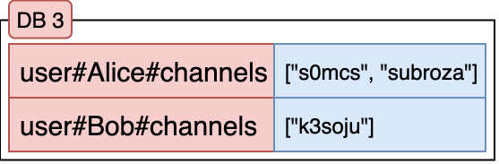
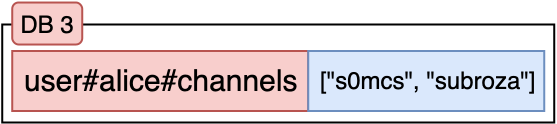

# The Practical Backend Engineer
## Twitch Chat Hit Counter
## Module 6: Frontend Application
### Additional Learning Materials

## Overview

<br>

## Objective


In **Module 5**, you set up the entire E2E aggregation pipeline using some manually hardcoded Twitch channels to connect to.<br>

In **Module 6**, you will add the remaining endpoints that the Frontend React application requires to fully integrate a Reporting dashboard
using our backend data.

**Goals:**
- Add Redis `db3` for Channel management to statefully keep track of what channels your application is connected to
- Implement the `TwitchRestController` which holds all the API endpoints required by the UI

<br>

## File Structure
For `Module 6`, the below file structure are all the relevant files needed.

 twitch-chat-hit-counter/<br>
&nbsp;&nbsp;&nbsp;&nbsp;&nbsp;
 src/<br>
&nbsp;&nbsp;&nbsp;&nbsp;&nbsp;&nbsp;&nbsp;&nbsp;&nbsp;&nbsp;
 main/<br>
&nbsp;&nbsp;&nbsp;&nbsp;&nbsp;&nbsp;&nbsp;&nbsp;&nbsp;&nbsp;&nbsp;&nbsp;&nbsp;&nbsp;&nbsp;
 java/<br>
&nbsp;&nbsp;&nbsp;&nbsp;&nbsp;&nbsp;&nbsp;&nbsp;&nbsp;&nbsp;&nbsp;&nbsp;&nbsp;&nbsp;&nbsp;&nbsp;&nbsp;&nbsp;&nbsp;&nbsp;
 com.sonahlab.twitch_chat_hit_counter/<br>
&nbsp;&nbsp;&nbsp;&nbsp;&nbsp;&nbsp;&nbsp;&nbsp;&nbsp;&nbsp;&nbsp;&nbsp;&nbsp;&nbsp;&nbsp;&nbsp;&nbsp;&nbsp;&nbsp;&nbsp;&nbsp;&nbsp;&nbsp;&nbsp;&nbsp;
 config/<br>
&nbsp;&nbsp;&nbsp;&nbsp;&nbsp;&nbsp;&nbsp;&nbsp;&nbsp;&nbsp;&nbsp;&nbsp;&nbsp;&nbsp;&nbsp;&nbsp;&nbsp;&nbsp;&nbsp;&nbsp;&nbsp;&nbsp;&nbsp;&nbsp;&nbsp;&nbsp;&nbsp;&nbsp;&nbsp;&nbsp;
 RedisConfig.java<br>
&nbsp;&nbsp;&nbsp;&nbsp;&nbsp;&nbsp;&nbsp;&nbsp;&nbsp;&nbsp;&nbsp;&nbsp;&nbsp;&nbsp;&nbsp;&nbsp;&nbsp;&nbsp;&nbsp;&nbsp;&nbsp;&nbsp;&nbsp;&nbsp;&nbsp;&nbsp;&nbsp;&nbsp;&nbsp;&nbsp;
 TwitchConfig.java<br>
&nbsp;&nbsp;&nbsp;&nbsp;&nbsp;&nbsp;&nbsp;&nbsp;&nbsp;&nbsp;&nbsp;&nbsp;&nbsp;&nbsp;&nbsp;&nbsp;&nbsp;&nbsp;&nbsp;&nbsp;&nbsp;&nbsp;&nbsp;&nbsp;&nbsp;
 redis/<br>
&nbsp;&nbsp;&nbsp;&nbsp;&nbsp;&nbsp;&nbsp;&nbsp;&nbsp;&nbsp;&nbsp;&nbsp;&nbsp;&nbsp;&nbsp;&nbsp;&nbsp;&nbsp;&nbsp;&nbsp;&nbsp;&nbsp;&nbsp;&nbsp;&nbsp;&nbsp;&nbsp;&nbsp;&nbsp;&nbsp;
 dao/<br>
&nbsp;&nbsp;&nbsp;&nbsp;&nbsp;&nbsp;&nbsp;&nbsp;&nbsp;&nbsp;&nbsp;&nbsp;&nbsp;&nbsp;&nbsp;&nbsp;&nbsp;&nbsp;&nbsp;&nbsp;&nbsp;&nbsp;&nbsp;&nbsp;&nbsp;&nbsp;&nbsp;&nbsp;&nbsp;&nbsp;&nbsp;&nbsp;&nbsp;&nbsp;&nbsp;
 RedisDao.java<br>
&nbsp;&nbsp;&nbsp;&nbsp;&nbsp;&nbsp;&nbsp;&nbsp;&nbsp;&nbsp;&nbsp;&nbsp;&nbsp;&nbsp;&nbsp;&nbsp;&nbsp;&nbsp;&nbsp;&nbsp;&nbsp;&nbsp;&nbsp;&nbsp;&nbsp;&nbsp;&nbsp;&nbsp;&nbsp;&nbsp;
 ChatBotChannelsRedisService.java<br>
&nbsp;&nbsp;&nbsp;&nbsp;&nbsp;&nbsp;&nbsp;&nbsp;&nbsp;&nbsp;&nbsp;&nbsp;&nbsp;&nbsp;&nbsp;&nbsp;&nbsp;&nbsp;&nbsp;&nbsp;&nbsp;&nbsp;&nbsp;&nbsp;&nbsp;&nbsp;&nbsp;&nbsp;&nbsp;&nbsp;
 TwitchChatAggregationRedisService.java<br>
&nbsp;&nbsp;&nbsp;&nbsp;&nbsp;&nbsp;&nbsp;&nbsp;&nbsp;&nbsp;&nbsp;&nbsp;&nbsp;&nbsp;&nbsp;&nbsp;&nbsp;&nbsp;&nbsp;&nbsp;&nbsp;&nbsp;&nbsp;&nbsp;&nbsp;
 rest/<br>
&nbsp;&nbsp;&nbsp;&nbsp;&nbsp;&nbsp;&nbsp;&nbsp;&nbsp;&nbsp;&nbsp;&nbsp;&nbsp;&nbsp;&nbsp;&nbsp;&nbsp;&nbsp;&nbsp;&nbsp;&nbsp;&nbsp;&nbsp;&nbsp;&nbsp;&nbsp;&nbsp;&nbsp;&nbsp;&nbsp;
 TwitchRestController.java<br>
&nbsp;&nbsp;&nbsp;&nbsp;&nbsp;&nbsp;&nbsp;&nbsp;&nbsp;&nbsp;&nbsp;&nbsp;&nbsp;&nbsp;&nbsp;&nbsp;&nbsp;&nbsp;&nbsp;&nbsp;&nbsp;&nbsp;&nbsp;&nbsp;&nbsp;
 twitch/<br>
&nbsp;&nbsp;&nbsp;&nbsp;&nbsp;&nbsp;&nbsp;&nbsp;&nbsp;&nbsp;&nbsp;&nbsp;&nbsp;&nbsp;&nbsp;&nbsp;&nbsp;&nbsp;&nbsp;&nbsp;&nbsp;&nbsp;&nbsp;&nbsp;&nbsp;&nbsp;&nbsp;&nbsp;&nbsp;&nbsp;
 TwitchChatBotManager.java<br>
&nbsp;&nbsp;&nbsp;&nbsp;&nbsp;&nbsp;&nbsp;&nbsp;&nbsp;&nbsp;&nbsp;&nbsp;&nbsp;&nbsp;&nbsp;&nbsp;&nbsp;&nbsp;&nbsp;&nbsp;&nbsp;&nbsp;&nbsp;&nbsp;&nbsp;&nbsp;&nbsp;&nbsp;&nbsp;&nbsp;
 TwitchHelixService.java<br>
&nbsp;&nbsp;&nbsp;&nbsp;&nbsp;&nbsp;&nbsp;&nbsp;&nbsp;&nbsp;&nbsp;&nbsp;&nbsp;&nbsp;&nbsp;
 resources/<br>
&nbsp;&nbsp;&nbsp;&nbsp;&nbsp;&nbsp;&nbsp;&nbsp;&nbsp;&nbsp;&nbsp;&nbsp;&nbsp;&nbsp;&nbsp;&nbsp;&nbsp;&nbsp;&nbsp;&nbsp;
 application.yml<br>
&nbsp;&nbsp;&nbsp;&nbsp;&nbsp;&nbsp;&nbsp;&nbsp;&nbsp;&nbsp;
 test/<br>
&nbsp;&nbsp;&nbsp;&nbsp;&nbsp;&nbsp;&nbsp;&nbsp;&nbsp;&nbsp;&nbsp;&nbsp;&nbsp;&nbsp;&nbsp;
 java/<br>
&nbsp;&nbsp;&nbsp;&nbsp;&nbsp;&nbsp;&nbsp;&nbsp;&nbsp;&nbsp;&nbsp;&nbsp;&nbsp;&nbsp;&nbsp;&nbsp;&nbsp;&nbsp;&nbsp;&nbsp;
 com.sonahlab.twitch_chat_hit_counter/<br>
&nbsp;&nbsp;&nbsp;&nbsp;&nbsp;&nbsp;&nbsp;&nbsp;&nbsp;&nbsp;&nbsp;&nbsp;&nbsp;&nbsp;&nbsp;&nbsp;&nbsp;&nbsp;&nbsp;&nbsp;&nbsp;&nbsp;&nbsp;&nbsp;&nbsp;
 config/<br>
&nbsp;&nbsp;&nbsp;&nbsp;&nbsp;&nbsp;&nbsp;&nbsp;&nbsp;&nbsp;&nbsp;&nbsp;&nbsp;&nbsp;&nbsp;&nbsp;&nbsp;&nbsp;&nbsp;&nbsp;&nbsp;&nbsp;&nbsp;&nbsp;&nbsp;&nbsp;&nbsp;&nbsp;&nbsp;&nbsp;
 RedisConfigTest.java<br>
&nbsp;&nbsp;&nbsp;&nbsp;&nbsp;&nbsp;&nbsp;&nbsp;&nbsp;&nbsp;&nbsp;&nbsp;&nbsp;&nbsp;&nbsp;&nbsp;&nbsp;&nbsp;&nbsp;&nbsp;&nbsp;&nbsp;&nbsp;&nbsp;&nbsp;
 redis/<br>
&nbsp;&nbsp;&nbsp;&nbsp;&nbsp;&nbsp;&nbsp;&nbsp;&nbsp;&nbsp;&nbsp;&nbsp;&nbsp;&nbsp;&nbsp;&nbsp;&nbsp;&nbsp;&nbsp;&nbsp;&nbsp;&nbsp;&nbsp;&nbsp;&nbsp;&nbsp;&nbsp;&nbsp;&nbsp;&nbsp;
 ChatBotChannelsRedisServiceTest.java<br>
&nbsp;&nbsp;&nbsp;&nbsp;&nbsp;&nbsp;&nbsp;&nbsp;&nbsp;&nbsp;&nbsp;&nbsp;&nbsp;&nbsp;&nbsp;&nbsp;&nbsp;&nbsp;&nbsp;&nbsp;&nbsp;&nbsp;&nbsp;&nbsp;&nbsp;&nbsp;&nbsp;&nbsp;&nbsp;&nbsp;
 TwitchChatAggregationRedisServiceTest.java<br>
&nbsp;&nbsp;&nbsp;&nbsp;&nbsp;&nbsp;&nbsp;&nbsp;&nbsp;&nbsp;&nbsp;&nbsp;&nbsp;&nbsp;&nbsp;&nbsp;&nbsp;&nbsp;&nbsp;&nbsp;&nbsp;&nbsp;&nbsp;&nbsp;&nbsp;
 twitch/<br>
&nbsp;&nbsp;&nbsp;&nbsp;&nbsp;&nbsp;&nbsp;&nbsp;&nbsp;&nbsp;&nbsp;&nbsp;&nbsp;&nbsp;&nbsp;&nbsp;&nbsp;&nbsp;&nbsp;&nbsp;&nbsp;&nbsp;&nbsp;&nbsp;&nbsp;&nbsp;&nbsp;&nbsp;&nbsp;&nbsp;
 TwitchChatBotManagerTest.java<br>
&nbsp;&nbsp;&nbsp;&nbsp;&nbsp;&nbsp;&nbsp;&nbsp;&nbsp;&nbsp;&nbsp;&nbsp;&nbsp;&nbsp;&nbsp;&nbsp;&nbsp;&nbsp;&nbsp;&nbsp;&nbsp;&nbsp;&nbsp;&nbsp;&nbsp;&nbsp;&nbsp;&nbsp;&nbsp;&nbsp;
 TwitchHelixServiceTest.java<br>
&nbsp;&nbsp;&nbsp;&nbsp;&nbsp;&nbsp;&nbsp;&nbsp;&nbsp;&nbsp;&nbsp;&nbsp;&nbsp;&nbsp;&nbsp;&nbsp;&nbsp;&nbsp;&nbsp;&nbsp;&nbsp;&nbsp;&nbsp;&nbsp;&nbsp;
 PropertiesApplicationTest.java<br>

<br>

## Exercise 1: Spring Redis
In `application.yml`, add a new property for the Redis channels DB.

```yaml
twitch-chat-hit-counter:
  redis:
    chatbot-channels-database: 3
```

### Unit Tests
- [ ] Open `PropertiesApplicationTest.java` ─ already implemented to test the property above.
- [ ] Remove `@Disabled` in `PropertiesApplicationTest::redisChatbotChannelsDatabaseTest`
- [ ] Test with:
    ```shell
    ./gradlew test --tests "*" -Djunit.jupiter.tags=Module6
    ```

<br>


## Task 2: `RedisConfig::redisTemplateFactory`
> [!TIP]
>
> Read through [Multiple Redis Connections in Spring Boot ](https://medium.com/@raphael3213/multiple-redis-connections-in-spring-boot-37f632e8e64f)

This is very similar to our initial setup for `DB0`, `DB1`, and `DB2` in `RedisConfig.java`.

<br>

### Task 2 Part I: `RedisConfig::redisTemplateFactory`
In `RedisConfig.java`, update `redisTemplateFactory()`.

**Example:**
```
    0: RedisTemplate (object that will operate on DB0),
    1: RedisTemplate (object that will operate on DB1),
    ...,
    N: RedisTemplate (object that will operate on DBN),
```

**Requirements:**
1. Inject the properties from `application.yml`: `chatbot-channels-database`
2. Update the list of indexes to include `3` (should be `List.of(0, 1, 2, 3)`)

<br>

#

### Task 2 Part II: `RedisConfig::chatBotChannelsRedisDao`
In `RedisConfig.java`, implement
```java
@Bean
@Qualifier("chatBotChannelsRedisDao")
public RedisDao chatBotChannelsRedisDao() {}
```

This RedisDao will be **dedicated** to handling operations on `DB3`.

**Requirements:**
1. DI the `redisTemplateFactory`
2. Inject the `chatbot-channels-database` index from `application.yml`
3. Create a new `RedisDao` with the correct `RedisTemplate` from the factory

### Unit Tests
- [ ] Open `RedisConfigTest.java` ─ already implemented
- [ ] Remove `@Disabled` in `RedisConfigTest::chatBotChannelsRedisDaoTest`
- [ ] Test with:
    ```shell
    ./gradlew test --tests "*" -Djunit.jupiter.tags=Module6
    ```

<br>

#

## Exercise 2: `ChatBotChannelsRedisService`
### Task 1: Constructor
In `ChatBotChannelsRedisService`, implement the constructor: `ChatBotChannelsRedisService()`.

**Requirements:**
1. DI the correct RedisDao for `db3`

<br>

#

### Task 2: `ChatBotChannelsRedisService::getJoinedChannels`
In `ChatBotChannelsRedisService`, implement `getJoinedChannels(String username)`.

Return the `Set` of channel names our ChatBot is connected to.

**Requirements:**
1. `db3` Key Template: `"user#{username}#channels"`<br>
    NOTE: Your Twitch account `username` will be the only row in this DB.
2. `db3` Value: `Set<String>` to maintain a unique set of channels that your ChatBot should connect to


<br>

### Example 1:
> **Input**:<br>
> ```
> redis> SADD user#Alice#channels "s0mcs" "subroza"
> redis> SADD user#Bob#channels "k3soju"
> ```
> 
> 
> 
> ```java
> ChatBotChannelsRedisService service; // Assume initialized
> 
> Set<String> output = service.getJoinedChannels("Alice");
> ```
> 
> **Output**:
> ```
> ["s0mcs", "subroza"]
> ```
> **Explanation**: Alice's ChatBot should be connected to "s0mcs" and "subroza" stream


<br>

#

### Example 2:
> **Input**:<br>
> ```java
> ChatBotChannelsRedisService service; // Assume initialized
>
> Set<String> output = service.getJoinedChannels("NonExistentUser");
> ```
> **Output**: `[]`<br>
> **Explanation**: `db3` has no key for `"user#NonExistentUser#channels"`, so Redis treats the returned value as an empty `Set`.

<br>

### Integration Tests
- [ ] Open `ChatBotChannelsRedisServiceTest.java` ─ already implemented test cases with the example(s) above.
- [ ] Remove `@Disabled` in `ChatBotChannelsRedisServiceTest::getJoinedChannelsTest`
- [ ] Test with:
    ```shell
    ./gradlew test --tests "*" -Djunit.jupiter.tags=Module6
    ```

<br>

#

### Task 3: `ChatBotChannelsRedisService::addChannels`
In `ChatBotChannelsRedisService`, implement `addChannels(String username, String... channelNames)`.

Return the `Long` length of the channels `Set` stored at `user#{username}#channels` after attempting to **add** all the `channelNames`.

**Requirements:**
1. `db3` Key Template: `"user#{username}#channels"`<br>
   NOTE: Your Twitch account `username` will be the only row in this DB.
2. `db3` Value: `Set<String>` to maintain a unique set of channels that your ChatBot should connect to


<br>

### Example 1:
> **Input**:<br>
> ```java
> ChatBotChannelsRedisService service; // Assume initialized
>
> Long output1 = service.addChannels("Alice", "s0mcs", "subroza");
> Long output2 = service.addChannels("Alice", "s0mcs");
> ```
> **Output1**: `2`<br>
> **Explanation**: `"user#Alice#channel"` key never existed so Redis creates an empty `Set` and add 2 channels: `"s0mcs"` and `"subroza"`.<br>
> 
> 
> **Output2**: `0`<br>
> **Explanation**: Before you attempt to add "s0mcs" to Alice's set of channels her ChatBot is listening to it already has "s0mcs". Since "s0mcs" already exists in the Set, nothing gets added to the Set.<br>
> 


<br>

### Integration Tests
- [ ] Open `ChatBotChannelsRedisServiceTest.java` ─ already implemented test cases with the example(s) above.
- [ ] Remove `@Disabled` in `ChatBotChannelsRedisServiceTest::addChannelsTest`
- [ ] Test with:
    ```shell
    ./gradlew test --tests "*" -Djunit.jupiter.tags=Module6
    ```

<br>

#

### Task 4: `ChatBotChannelsRedisService::removeChannels`
In `ChatBotChannelsRedisService`, implement `removeChannels(String username, String... channelNames)`.

Return the `Long` length of the channels `Set` stored at `user#{username}#channels` after attempting to **remove** all the `channelNames`.

**Requirements:**
1. `db3` Key Template: `"user#{username}#channels"`<br>
   NOTE: Your Twitch account `username` will be the only row in this DB.
2. `db3` Value: `Set<String>` to maintain a unique set of channels that your ChatBot should connect to

<br>

### Example 1:
> **Input**:<br>
> ```
> redis> SADD user#Alice#channels "s0mcs" "subroza"
> ```
> 
> 
> 
> ```java
> ChatBotChannelsRedisService service; // Assume initialized
>
> Long output = service.removeChannels("Alice", "subroza", "nonexistentChannelName");
> ```
> **Output**: `1`<br>
> **Explanation**:<br>
> 1. `"subroza"` should be successfully removed from the Set (count = 1).
> 2. `"nonexistentChannelName"` was never in the Set so nothing gets removed (count stays 1).
> 


<br>

### Example 2:
> **Input**:<br>
> ```java
> ChatBotChannelsRedisService service; // Assume initialized
>
> Long output = service.removeChannels("nonexistentUser", "subroza");
> ```
> **Output**: `0`<br>
> **Explanation**:<br>
> The key `"user#nonexistentUser#channels"` doesn't exist in Redis, so attempting to remove any values from a non-existing key just treats the value as an empty Set.

<br>

#

### Integration Tests
- [ ] Open `ChatBotChannelsRedisServiceTest.java` ─ already implemented test cases with the example(s) above.
- [ ] Remove `@Disabled` in `ChatBotChannelsRedisServiceTest::removeChannelsTest`
- [ ] Test with:
    ```shell
    ./gradlew test --tests "*" -Djunit.jupiter.tags=Module6
    ```

<br>

#

## Exercise 3: `TwitchChatBotManager`
### Task 1: Constructor
In `TwitchChatBotManager.java`, update the constructor: `TwitchChatBotManager()`.

**Requirements:**
1. DI the `ChatBotChannelsRedisService` into the constructor

<br>

#

### Task 2: `TwitchChatBotManager::joinChannel`


**Requirements**:
1. Make sure to update the Redis DB for your `USERNAME` to maintain the channelName you've joined

<br>

#

### Task 3: `TwitchChatBotManager::leaveChannel`


**Requirements**:
1. Make sure to update the Redis DB for your `USERNAME` to maintain the channelName you've left

<br>

#

### Task 4: `TwitchChatBotManager::getJoinedChannels`


**Requirements**:
1. Make sure to fetch the Set of joined channels maintained in Redis

<br>

#

### Task 5: `TwitchChatBotManager::initChannelsToJoin`

**Requirements**:
1. Remove the hardcoded channels set up in **Module 5**
2. You should be using the Redis state as the Source of Truth for all currently joined channels

> [!NOTE]
> 
> Your application connects to all Twitch Chats on every application run as the WebSocket connections don't persist.

<br>

## Exercise 4: `TwitchHelixService`
### Task 1: Constructor
In `TwitchHelixService.java`, implement the constructor: `TwitchHelixService()`.

**Requirements:**
1. DI the `TwitchClient` from `TwitchConfig.java` into the constructor

<br>

#

### Task 2: `TwitchHelixService`
In `TwitchHelixService.java`, implement `getChannelsMetadata(List<String> channelNames)`.

Return a `Map<String, User>` that maps, for all joined channels, the `channelName` to the Twitch Streamer's `User` metadata.

**Requirements:**
1. Use the `TwitchHelix` API to get the Streamers' channel metadata for all joined `channelNames`
2. TODO insert link to TwitchHelix API doc


<br>

## Exercise 5: `TwitchRestController`
### Task 1: Constructor

**Requirements:**
1. DI `TwitchChatAggregationRedisService`
2. DI `TwitchChatBotManager`
3. DI `TwitchHelixService`

<br>

#

### Task 2: Twitch Reporting API
### Task 2 Part I: `TwitchRestController::addChannel`
In `TwitchRestController`, implement `addChannel(String channelName)`.

This should call the helper method in `TwitchChatBotManager`.

<br>

#

### Task 2 Part II: `TwitchRestController::removeChannel`
In `TwitchRestController`, implement `removeChannel(String channelName)`.

This should call the helper method in `TwitchChatBotManager`.

<br>

#

### Task 2 Part III: `TwitchRestController::getChannels`
In `TwitchRestController`, implement `getChannels()`.

This should call the helper method in `TwitchChatBotManager`.

<br>

#

### Task 2 Part IV: `TwitchRestController::getChannelsMetadata`
In `TwitchRestController`, implement `getChannelsMetadata()`.

This should call the helper method in `TwitchHelixService`.

<br>

#

### Task 2 Part V: `TwitchRestController::hitCounter`
In `TwitchRestController`, implement
```java
public Map<String, Long> hitCounter(
        @RequestParam(name = "granularity") String granularity,
        @RequestParam(name = "channelName") String channelName,
        @RequestParam(name = "startTimestampMillis") long startTimestampMillis,
        @RequestParam(name = "endTimestampMillis") long endTimestampMillis) {}
```

This should call the helper method in `TwitchChatAggregationRedisService`.

### E2E Tests
- [ ] Run the application:
    ```shell
    ./gradlew bootRun
    ```
- [ ] Install jpm node
- [ ] Run the FE application:
    ```bash
    npm install
    npm start
    ```
- [ ] In `localhost:3000`, play around with the functionality by adding Twitch streamer's channels (case-sensitive)
- [ ] Validate your ChatBot is connecting to the streamer's, and check `db3` to see your channels joined set reflected properly
- [ ] Validate your Redis aggregation is correct

